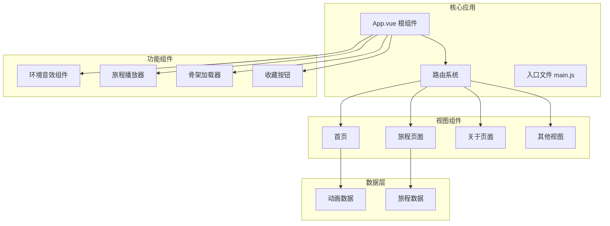
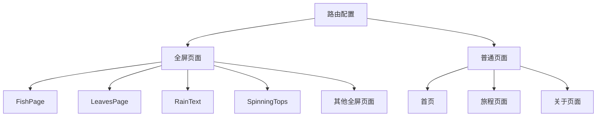
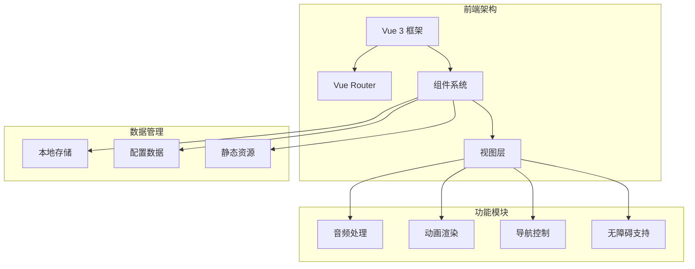
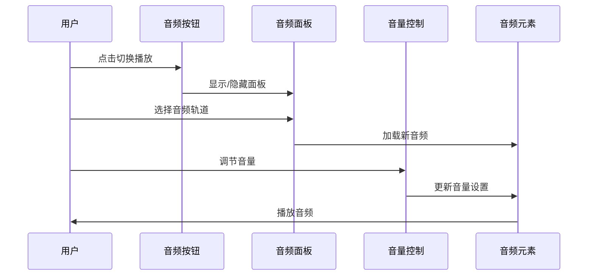
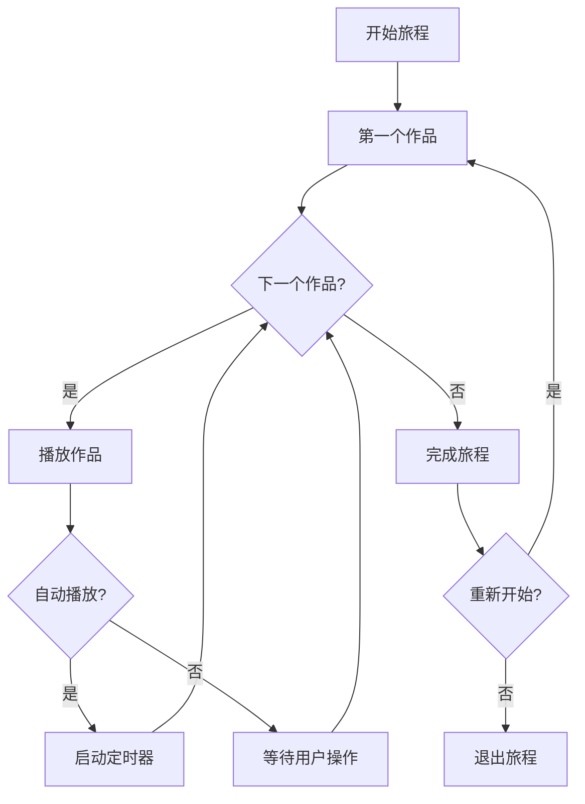
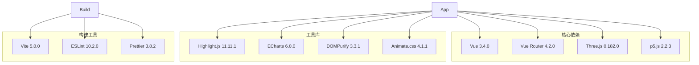

# 无障碍增强

<cite>
**本文档引用的文件**
- [README.md](file://README.md)
- [package.json](file://package.json)
- [index.html](file://index.html)
- [src/main.js](file://src/main.js)
- [src/App.vue](file://src/App.vue)
- [src/router/index.js](file://src/router/index.js)
- [src/components/AmbientAudio.vue](file://src/components/AmbientAudio.vue)
- [src/components/JourneyPlayer.vue](file://src/components/JourneyPlayer.vue)
- [src/components/SkeletonLoader.vue](file://src/components/SkeletonLoader.vue)
- [src/views/Home.vue](file://src/views/Home.vue)
- [src/views/JourneysPage.vue](file://src/views/JourneysPage.vue)
- [src/views/About.vue](file://src/views/About.vue)
- [src/data/journeys.js](file://src/data/journeys.js)
- [vite.config.js](file://vite.config.js)
</cite>

## 目录
1. [简介](#简介)
2. [项目结构](#项目结构)
3. [核心组件](#核心组件)
4. [架构概览](#架构概览)
5. [详细组件分析](#详细组件分析)
6. [依赖关系分析](#依赖关系分析)
7. [性能考虑](#性能考虑)
8. [故障排除指南](#故障排除指南)
9. [结论](#结论)

## 简介

这是一个基于 Vue 3 + Vite 构建的个人博客项目，专注于前端开发技术和创意动画展示。该项目在设计上充分考虑了无障碍性，提供了多种辅助功能来改善用户体验。

项目采用现代化的技术栈，包括 Vue 3、Vite 构建工具、Vue Router 4 等，支持响应式设计和移动端访问。项目包含丰富的动画效果和交互功能，为用户提供了沉浸式的浏览体验。

## 项目结构

项目采用模块化的组织方式，主要分为以下几个部分：

**图表来源**
- [src/App.vue:1-87](file://src/App.vue#L1-L87)
- [src/router/index.js:1-245](file://src/router/index.js#L1-L245)

**章节来源**
- [README.md:69-86](file://README.md#L69-L86)
- [package.json:1-37](file://package.json#L1-L37)

## 核心组件

### 应用根组件 (App.vue)

应用的根组件负责全局状态管理和通用功能控制。它实现了以下关键功能：

- **导航栏无障碍支持**：使用语义化标记和适当的 ARIA 属性
- **全局音效控制**：提供环境音效播放和暂停功能
- **回到顶部功能**：支持键盘快捷键操作
- **旅程播放器集成**：统一管理所有动画作品的播放体验

### 路由系统 (router/index.js)

路由系统支持 20+ 个不同的动画页面，每个页面都有特定的全屏模式设置：

**图表来源**
- [src/router/index.js:1-245](file://src/router/index.js#L1-L245)

**章节来源**
- [src/App.vue:1-176](file://src/App.vue#L1-L176)
- [src/router/index.js:1-245](file://src/router/index.js#L1-L245)

## 架构概览

项目采用组件化架构，主要特点包括：

**图表来源**
- [src/main.js:1-12](file://src/main.js#L1-L12)
- [src/App.vue:1-483](file://src/App.vue#L1-L483)

## 详细组件分析

### 环境音效组件 (AmbientAudio.vue)

这个组件提供了完整的音频控制系统，具有以下无障碍特性：

#### 核心功能
- **多轨道音频播放**：支持 5 种不同的环境音效
- **音量控制**：精确的音量调节和静音功能
- **自动播放设置**：可配置的自动播放选项
- **本地存储**：持久化用户偏好设置

#### 无障碍特性
- **键盘导航**：支持 Tab 键导航和 Enter/Space 键操作
- **屏幕阅读器友好**：提供适当的标题和描述
- **视觉反馈**：清晰的播放状态指示
- **响应式设计**：适配各种设备尺寸

**图表来源**
- [src/components/AmbientAudio.vue:1-628](file://src/components/AmbientAudio.vue#L1-L628)

**章节来源**
- [src/components/AmbientAudio.vue:1-325](file://src/components/AmbientAudio.vue#L1-L325)

### 旅程播放器 (JourneyPlayer.vue)

旅程播放器是项目的核心交互组件，提供了完整的沉浸式体验：

#### 主要特性
- **进度跟踪**：实时显示旅程完成进度
- **自动播放**：智能的定时播放功能
- **手动控制**：灵活的人工导航选项
- **完成奖励**：旅程结束时的庆祝界面

#### 无障碍设计
- **焦点管理**：确保键盘用户的良好体验
- **状态通知**：清晰的进度和状态信息
- **操作反馈**：即时的操作结果反馈
- **简化界面**：减少认知负担的设计

**图表来源**
- [src/components/JourneyPlayer.vue:1-644](file://src/components/JourneyPlayer.vue#L1-L644)

**章节来源**
- [src/components/JourneyPlayer.vue:1-206](file://src/components/JourneyPlayer.vue#L1-L206)

### 骨架加载器 (SkeletonLoader.vue)

为了改善首屏加载体验，项目实现了骨架屏加载效果：

#### 设计特点
- **渐进式加载**：模拟真实内容的加载过程
- **低带宽友好**：减少初始资源消耗
- **视觉引导**：为用户提供内容布局预期
- **性能优化**：使用 CSS 动画而非 JavaScript

**章节来源**
- [src/components/SkeletonLoader.vue:1-50](file://src/components/SkeletonLoader.vue#L1-L50)

### 视图组件分析

#### 首页 (Home.vue)
首页实现了完整的动画作品展示系统，包含：
- **分类筛选**：支持按主题和难度筛选
- **收藏功能**：用户可以收藏喜欢的作品
- **响应式网格**：自适应不同屏幕尺寸
- **空状态处理**：友好的无结果提示

#### 旅程页面 (JourneysPage.vue)
专门展示预设的动画主题旅程：
- **主题卡片**：美观的旅程卡片设计
- **元数据展示**：作品数量和时长信息
- **视觉预览**：旅程中作品的动态预览
- **交互反馈**：悬停和点击的视觉反馈

#### 关于页面 (About.vue)
个人介绍页面，包含：
- **3D 头像展示**：动态的个人头像效果
- **联系方式**：多种联系方式的展示
- **响应式布局**：适配移动设备的布局

**章节来源**
- [src/views/Home.vue:1-555](file://src/views/Home.vue#L1-L555)
- [src/views/JourneysPage.vue:1-286](file://src/views/JourneysPage.vue#L1-L286)
- [src/views/About.vue:1-181](file://src/views/About.vue#L1-L181)

## 依赖关系分析

项目的技术依赖关系如下：

**图表来源**
- [package.json:13-35](file://package.json#L13-L35)

**章节来源**
- [package.json:1-37](file://package.json#L1-L37)
- [vite.config.js:1-52](file://vite.config.js#L1-L52)

## 性能考虑

项目在性能优化方面采用了多项措施：

### 代码分割策略
- **核心依赖分离**：Vue 和 Vue Router 独立打包
- **第三方库拆分**：根据使用频率和体积进行优化
- **按需加载**：大型组件使用异步加载

### 构建优化
- **Terser 压缩**：移除控制台日志和调试语句
- **缓存配置**：优化 Vite 缓存机制
- **资源优化**：合理的文件命名和输出配置

### 运行时优化
- **懒加载组件**：减少初始包大小
- **虚拟滚动**：大数据集的高效渲染
- **防抖节流**：复杂交互的性能保护

**章节来源**
- [vite.config.js:15-51](file://vite.config.js#L15-L51)

## 故障排除指南

### 常见问题及解决方案

#### 音频播放问题
- **症状**：音频无法播放或加载失败
- **原因**：浏览器自动播放策略限制
- **解决**：用户需要主动交互后才能播放

#### 全屏模式问题
- **症状**：某些页面无法正确全屏
- **原因**：路由 meta 配置缺失
- **解决**：检查路由配置中的 fullscreen 标记

#### 无障碍功能问题
- **症状**：键盘导航不正常
- **原因**：焦点管理配置错误
- **解决**：检查 tabindex 和 role 属性

#### 性能问题
- **症状**：页面加载缓慢或卡顿
- **原因**：大型组件未正确懒加载
- **解决**：检查组件导入方式和代码分割配置

**章节来源**
- [src/components/AmbientAudio.vue:198-256](file://src/components/AmbientAudio.vue#L198-L256)
- [src/App.vue:114-126](file://src/App.vue#L114-L126)

## 结论

本项目在无障碍性方面表现出色，通过以下方式提供了优秀的用户体验：

### 主要成就
- **全面的键盘导航支持**：所有交互功能都可通过键盘操作
- **语义化标记**：正确的 HTML 结构和 ARIA 属性
- **响应式设计**：适配各种设备和屏幕尺寸
- **性能优化**：快速的加载速度和流畅的交互体验

### 技术亮点
- **组件化架构**：清晰的模块划分和职责分离
- **现代化工具链**：使用最新的前端开发技术
- **可维护性**：良好的代码结构和文档
- **扩展性**：易于添加新功能和新页面

### 改进建议
- **增加更多无障碍选项**：如高对比度模式、字体大小调整
- **完善测试覆盖**：增加自动化测试和可访问性测试
- **持续优化性能**：监控和改进页面加载性能

该项目为前端开发和动画展示提供了一个优秀的参考实现，展示了如何在现代 Web 应用中平衡功能性和可访问性。