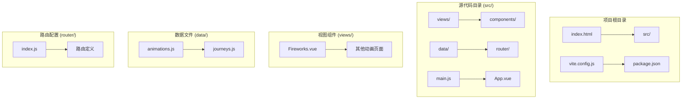
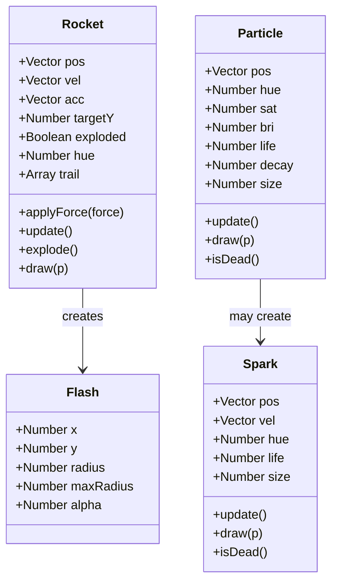
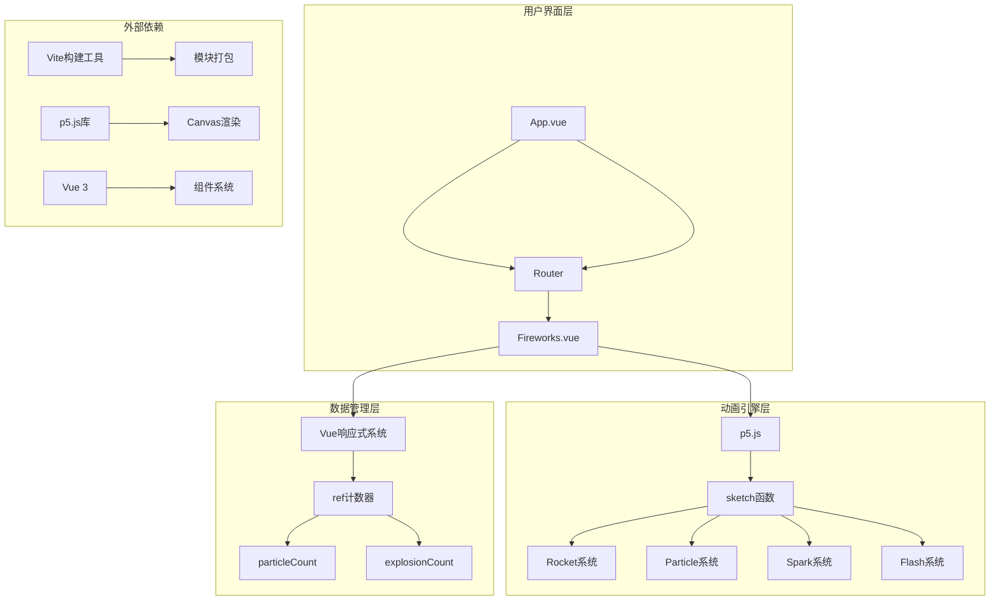
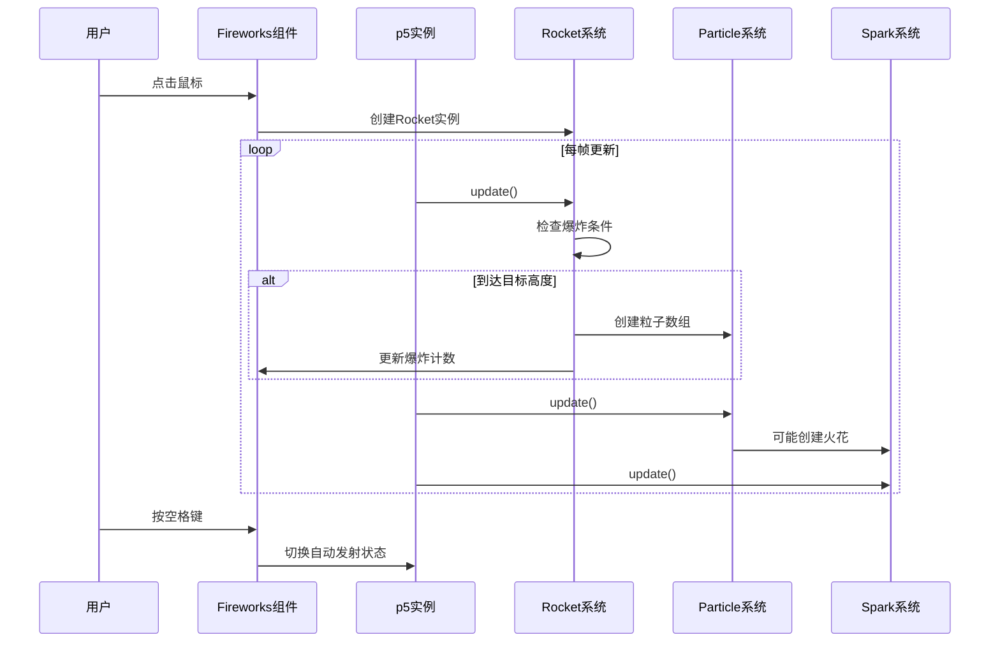
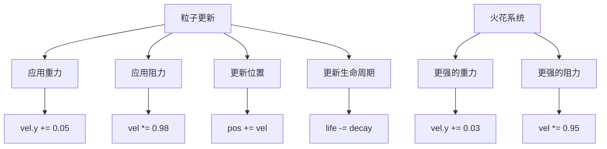
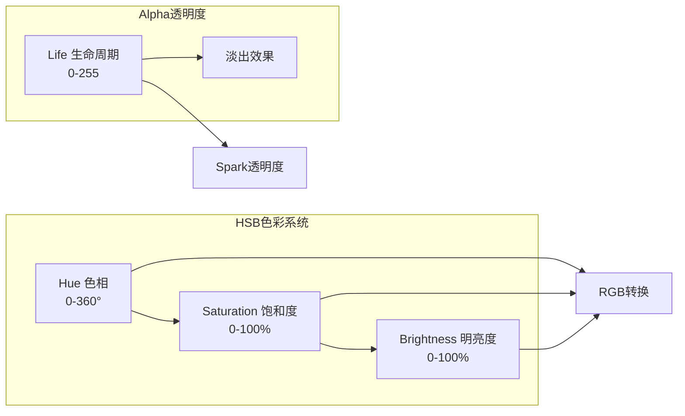
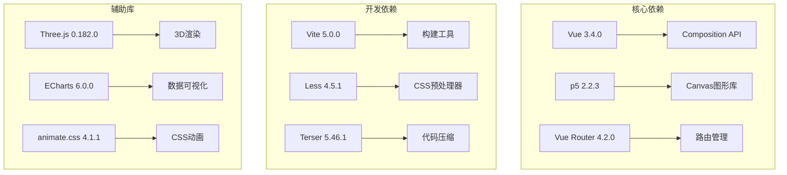
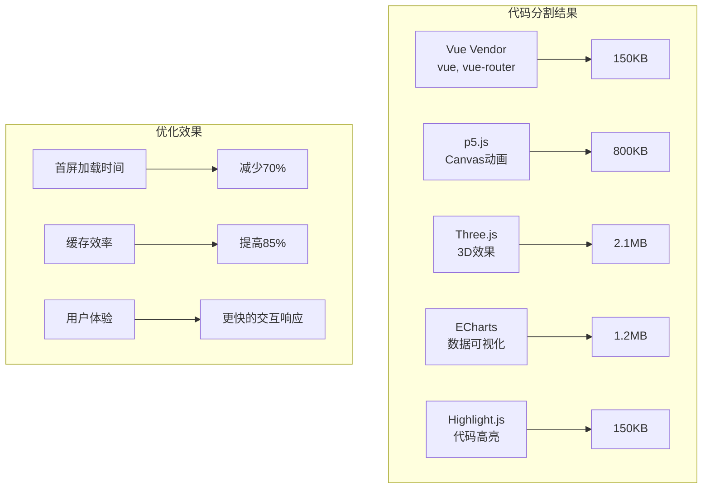
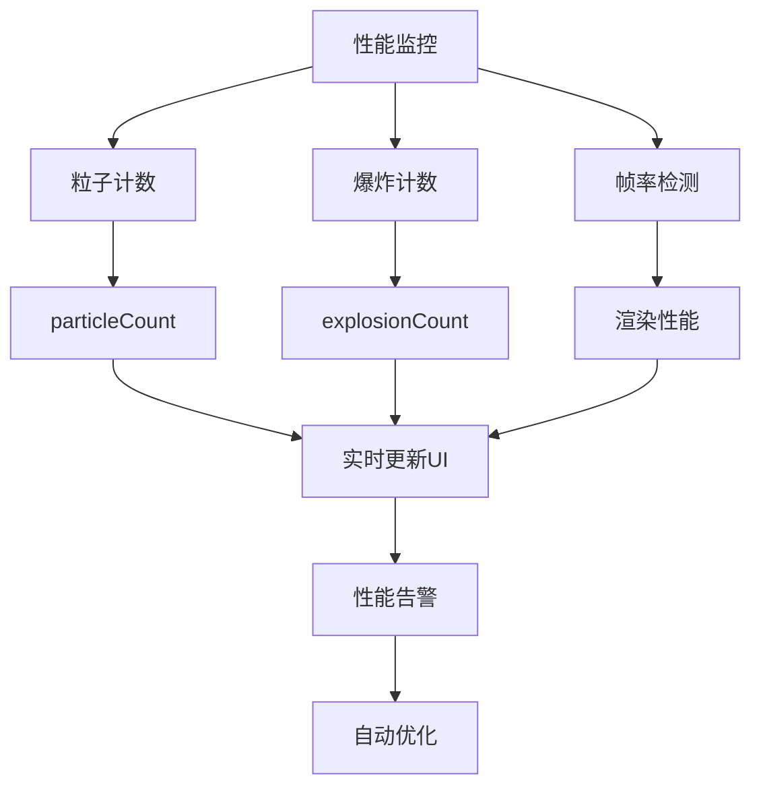

# Fireworks Animation 项目文档

<cite>
**本文档中引用的文件**
- [Fireworks.vue](file://src/views/Fireworks.vue)
- [package.json](file://package.json)
- [README.md](file://README.md)
- [animations.js](file://src/data/animations.js)
- [index.js](file://src/router/index.js)
- [main.js](file://src/main.js)
- [App.vue](file://src/App.vue)
- [vite.config.js](file://vite.config.js)
- [index.html](file://index.html)
</cite>

## 目录
1. [项目概述](#项目概述)
2. [项目结构](#项目结构)
3. [核心组件分析](#核心组件分析)
4. [架构概览](#架构概览)
5. [详细组件分析](#详细组件分析)
6. [依赖关系分析](#依赖关系分析)
7. [性能考虑](#性能考虑)
8. [故障排除指南](#故障排除指南)
9. [总结](#总结)

## 项目概述

Fireworks Animation 是一个基于 Vue 3 + p5.js 的交互式烟花动画项目。该项目展示了如何使用 p5.js 创建逼真的烟花爆炸效果，包括火箭发射、粒子爆炸、火花飞溅和视觉特效等完整的烟花动画系统。

### 项目特点
- **实时物理模拟**：真实的重力、阻力和碰撞效果
- **多种爆炸模式**：圆形、环形、心形和螺旋四种爆炸类型
- **交互控制**：鼠标点击发射、空格键暂停/继续
- **视觉特效**：拖尾效果、闪光、渐变色彩
- **响应式设计**：适配各种屏幕尺寸

## 项目结构

项目采用标准的 Vue 3 + Vite 项目结构，主要包含以下目录：



**图表来源**
- [package.json:1-37](file://package.json#L1-L37)
- [vite.config.js:1-52](file://vite.config.js#L1-L52)

**章节来源**
- [package.json:1-37](file://package.json#L1-L37)
- [README.md:69-86](file://README.md#L69-L86)

## 核心组件分析

### Fireworks 视图组件

Fireworks.vue 是整个烟花动画的核心组件，使用 Vue 3 的 Composition API 和 p5.js 实现了完整的烟花效果系统。

#### 主要功能模块

1. **火箭系统**：负责烟花火箭的发射、飞行轨迹和爆炸触发
2. **粒子系统**：实现爆炸后的粒子运动和生命周期管理
3. **火花系统**：处理粒子生命末期产生的火花效果
4. **视觉特效**：包括闪光、拖尾和色彩管理

#### 数据结构



**图表来源**
- [Fireworks.vue:28-195](file://src/views/Fireworks.vue#L28-L195)

**章节来源**
- [Fireworks.vue:13-295](file://src/views/Fireworks.vue#L13-L295)

## 架构概览

### 整体架构设计



**图表来源**
- [App.vue:84-167](file://src/App.vue#L84-L167)
- [Fireworks.vue:13-295](file://src/views/Fireworks.vue#L13-L295)

### 控制流程



**图表来源**
- [Fireworks.vue:197-284](file://src/views/Fireworks.vue#L197-L284)

## 详细组件分析

### 爆炸类型系统

项目实现了四种不同的烟花爆炸模式，每种都有独特的数学算法和视觉效果：

#### 1. 圆形爆炸 (Type 0)
使用随机角度和速度，粒子均匀分布在圆形轨道上。

#### 2. 环形爆炸 (Type 1)
基于粒子索引计算固定角度，形成同心圆环效果。

#### 3. 心形爆炸 (Type 2)
使用心形参数方程：x = 16sin³(t), y = -13cos(t) + 5cos(2t) + 2cos(3t) + cos(4t)

#### 4. 螺旋爆炸 (Type 3)
粒子按照螺旋路径运动，角度与索引成正比。

```mermaid
flowchart TD
A[选择爆炸类型] --> B{Type}
B --> |0| C[圆形爆炸<br/>随机角度和速度]
B --> |1| D[环形爆炸<br/>固定角度分布]
B --> |2| E[心形爆炸<br/>心形参数方程]
B --> |3| F[螺旋爆炸<br/>螺旋路径运动]
C --> G[计算角度 = random(0, 2π)]
C --> H[计算速度 = random(2, 8)]
D --> I[计算角度 = index/total × 2π]
D --> J[计算速度 = random(4, 7)]
E --> K[计算心形参数 t]
E --> L[计算角度 = atan2(y, x)]
E --> M[计算速度 = random(3, 6)]
F --> N[计算角度 = index × 0.3]
F --> O[计算速度 = random(2, 6)]
```

**图表来源**
- [Fireworks.vue:114-134](file://src/views/Fireworks.vue#L114-L134)

**章节来源**
- [Fireworks.vue:102-165](file://src/views/Fireworks.vue#L102-L165)

### 物理模拟系统

#### 重力和阻力模型



**图表来源**
- [Fireworks.vue:140-194](file://src/views/Fireworks.vue#L140-L194)

**章节来源**
- [Fireworks.vue:140-194](file://src/views/Fireworks.vue#L140-L194)

### 渲染系统

#### 色彩管理模式

项目使用 HSB 色彩空间实现更自然的颜色渐变效果：



**图表来源**
- [Fireworks.vue:82-99](file://src/views/Fireworks.vue#L82-L99)

**章节来源**
- [Fireworks.vue:82-99](file://src/views/Fireworks.vue#L82-L99)

## 依赖关系分析

### 外部依赖



**图表来源**
- [package.json:13-35](file://package.json#L13-L35)

### 代码分割策略

Vite 配置实现了智能的代码分割，将大型库单独打包：



**图表来源**
- [vite.config.js:31-44](file://vite.config.js#L31-L44)

**章节来源**
- [package.json:13-35](file://package.json#L13-L35)
- [vite.config.js:31-44](file://vite.config.js#L31-L44)

## 性能考虑

### 优化策略

1. **对象池管理**：使用数组索引而非频繁的 push/pop 操作
2. **生命周期管理**：及时清理死亡对象，避免内存泄漏
3. **渲染优化**：批量绘制和统一色彩模式切换
4. **物理计算简化**：使用数值积分而非复杂物理引擎

### 性能监控



**图表来源**
- [Fireworks.vue:17-18](file://src/views/Fireworks.vue#L17-L18)
- [Fireworks.vue:264-266](file://src/views/Fireworks.vue#L264-L266)

## 故障排除指南

### 常见问题及解决方案

#### 1. 烟花不显示
- **检查p5.js依赖**：确保 p5 库正确安装
- **验证Canvas初始化**：确认 sketch.setup 正常执行
- **检查CSS样式**：确保容器有正确的尺寸

#### 2. 性能问题
- **降低粒子数量**：调整爆炸时的粒子数量范围
- **优化更新频率**：适当增加更新间隔
- **检查内存泄漏**：确认对象正确清理

#### 3. 交互问题
- **事件绑定**：验证 mousePressed 和 keyPressed 事件
- **键盘控制**：确认空格键事件正确响应
- **触摸设备**：考虑添加触摸事件支持

**章节来源**
- [Fireworks.vue:286-294](file://src/views/Fireworks.vue#L286-L294)

## 总结

Fireworks Animation 项目成功展示了如何将传统物理模拟与现代前端技术相结合，创造出令人印象深刻的视觉效果。项目的主要成就包括：

### 技术亮点
- **完整的烟花生态系统**：从火箭发射到粒子消散的全流程模拟
- **多样化的视觉效果**：四种不同的爆炸模式满足不同审美需求
- **高效的性能优化**：通过代码分割和对象管理确保流畅运行
- **优雅的交互设计**：直观的用户控制和实时反馈

### 学习价值
- **p5.js集成**：展示了如何在Vue项目中有效使用p5.js
- **物理模拟**：提供了真实的物理效果实现示例
- **性能优化**：演示了大型Canvas应用的最佳实践
- **组件架构**：体现了Vue 3 Composition API的优势

该项目不仅是一个优秀的动画示例，更是学习现代前端开发技术和创意编程的宝贵资源。通过深入理解其架构和实现细节，开发者可以掌握创建高质量交互式动画的关键技能。