# 分形树动画项目文档

<cite>
**本文档引用的文件**
- [FractalTree.vue](file://src/views/FractalTree.vue)
- [package.json](file://package.json)
- [README.md](file://README.md)
- [animations.js](file://src/data/animations.js)
- [index.js](file://src/router/index.js)
- [vite.config.js](file://vite.config.js)
- [Home.vue](file://src/views/Home.vue)
- [App.vue](file://src/App.vue)
- [main.js](file://src/main.js)
</cite>

## 更新摘要
**变更内容**
- 更新了分形树动画系统的技术实现，从周期性生成改为智能初始化系统
- 新增了10只独特蝴蝶、8只独特蜜蜂、10只独特鸟类的详细描述
- 增强了动物行为特征和飞行模式的技术说明
- 更新了四季动画系统的实现细节

## 目录
1. [项目概述](#项目概述)
2. [项目结构](#项目结构)
3. [核心技术实现](#核心技术实现)
4. [分形树算法详解](#分形树算法详解)
5. [智能动物系统](#智能动物系统)
6. [性能优化策略](#性能优化策略)
7. [用户交互设计](#用户交互设计)
8. [路由与导航](#路由与导航)
9. [部署与构建](#部署与构建)
10. [故障排除指南](#故障排除指南)
11. [总结](#总结)

## 项目概述

分形树动画是一个基于 Vue 3 + p5.js 的创意编程项目，专注于展示递归分形树的动态生成效果。该项目不仅实现了经典的分形树算法，还融入了智能动物系统、四季变换、天气效果等丰富的视觉元素，为用户提供沉浸式的自然模拟体验。

### 核心特性
- **递归分形树生成**：基于数学原理的自相似树形结构
- **智能动物系统**：独特的蝴蝶、蜜蜂、鸟类群，每只都有个性化特征
- **四季动态切换**：春、夏、秋、冬四种不同的视觉风格
- **环境特效**：雪花飘落、落叶飞舞、蝴蝶蜜蜂、鸟类飞行
- **响应式设计**：适配各种屏幕尺寸的全屏动画体验
- **高性能渲染**：优化的 p5.js 实现确保流畅的动画效果

**章节来源**
- [FractalTree.vue:1-769](file://src/views/FractalTree.vue#L1-L769)
- [README.md:1-115](file://README.md#L1-L115)

## 项目结构

该项目采用模块化的 Vue 3 应用架构，主要包含以下核心目录结构：

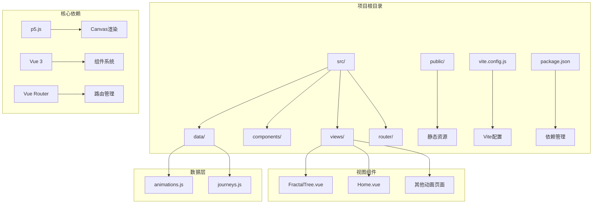

**图表来源**
- [package.json:1-37](file://package.json#L1-L37)
- [vite.config.js:1-52](file://vite.config.js#L1-L52)

### 文件组织特点
- **按功能分层**：views、components、data 等目录清晰分离职责
- **模块化设计**：每个动画都是独立的 Vue 组件
- **数据驱动**：通过外部数据文件管理动画元数据
- **路由驱动**：使用 Vue Router 实现页面导航

**章节来源**
- [package.json:13-25](file://package.json#L13-L25)
- [src/router/index.js:1-239](file://src/router/index.js#L1-L239)

## 核心技术实现

### p5.js 集成架构

项目采用 p5.js 作为 Canvas 渲染引擎，通过 Vue 3 的 Composition API 实现组件化管理：

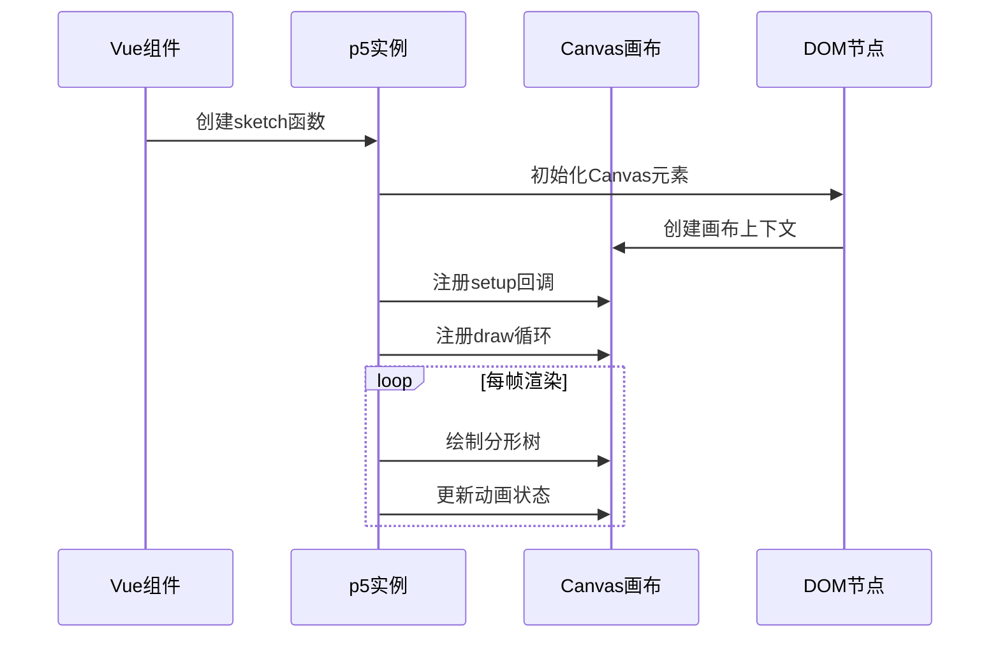

**图表来源**
- [FractalTree.vue:33-94](file://src/views/FractalTree.vue#L33-L94)

### 核心依赖关系

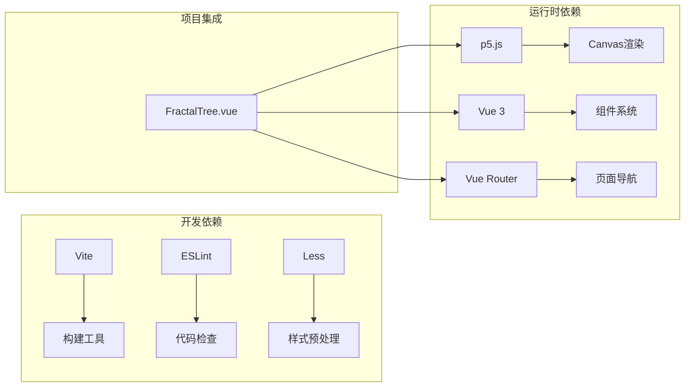

**图表来源**
- [package.json:13-35](file://package.json#L13-L35)

**章节来源**
- [FractalTree.vue:13-15](file://src/views/FractalTree.vue#L13-L15)
- [package.json:21](file://package.json#L21)

## 分形树算法详解

### 递归算法实现

分形树的核心是递归算法，通过数学公式生成自相似的树形结构：

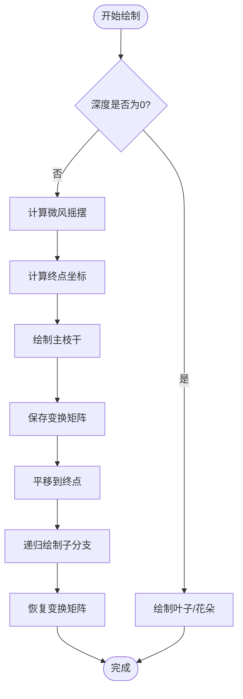

**图表来源**
- [FractalTree.vue:113-157](file://src/views/FractalTree.vue#L113-L157)

### 参数化设计

分形树的生成遵循严格的数学规则：

| 参数 | 范围 | 作用 | 影响效果 |
|------|------|------|----------|
| `maxDepth` | 1-15 | 树的最大深度 | 控制树的复杂度 |
| `lengthRatio` | 0.69-0.75 | 分支长度比例 | 影响树的紧凑程度 |
| `angleOffset` | 0.1-1.5π | 分支角度范围 | 控制树的展开程度 |
| `windOffset` | 0.01-0.05 | 微风强度 | 影响叶子摆动幅度 |

### 视觉层次设计

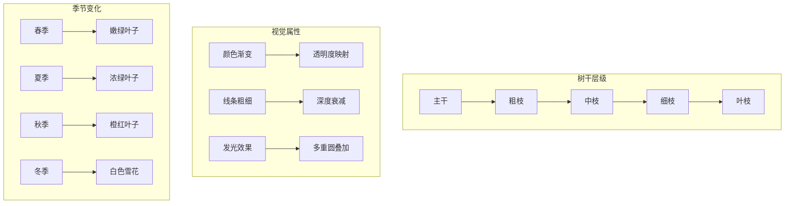

**图表来源**
- [FractalTree.vue:130-138](file://src/views/FractalTree.vue#L130-L138)

**章节来源**
- [FractalTree.vue:113-157](file://src/views/FractalTree.vue#L113-L157)

## 智能动物系统

### 动物智能初始化系统

项目实现了智能初始化系统，从简单的周期性生成转变为每只动物的独特特征配置：

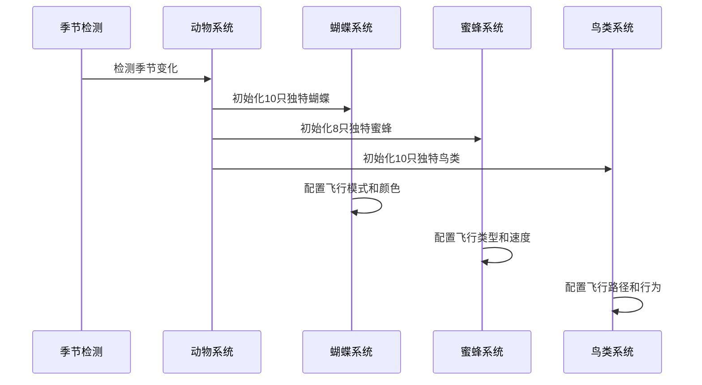

**图表来源**
- [FractalTree.vue:224-484](file://src/views/FractalTree.vue#L224-L484)

### 春季动物系统

#### 独特蝴蝶群
- **数量**：10只独特蝴蝶
- **初始化时机**：首次进入春季时一次性生成
- **独特特征**：
  - **飞行模式**：圆形、波浪、随机、悬停四种模式
  - **速度范围**：0.3-2.0单位/帧
  - **颜色组合**：粉红、橙黄、紫色、黄色等多种配色
  - **大小差异**：8-18像素不等

#### 独特蜜蜂群
- **数量**：8只独特蜜蜂
- **初始化时机**：首次进入春季时一次性生成
- **独特特征**：
  - **飞行类型**：忙碌型、懒散型、之字形、稳定型
  - **速度范围**：0.5-4.0单位/帧
  - **抖动程度**：0.02-0.3的随机扰动
  - **大小差异**：6-12像素不等

**章节来源**
- [FractalTree.vue:224-484](file://src/views/FractalTree.vue#L224-L484)

### 夏季鸟类系统

#### 独特鸟群
- **数量**：10只独特鸟类
- **初始化时机**：首次进入夏季时一次性生成
- **独特特征**：
  - **飞行类型**：快速型、慢速型、漫游型、稳定型
  - **速度范围**：0.3-2.0单位/帧
  - **颜色组合**：深蓝、浅棕、灰蓝、浅灰等多种配色
  - **大小差异**：10-18像素不等
  - **行为模式**：随机飞行与树上栖息交替

### 动物行为算法

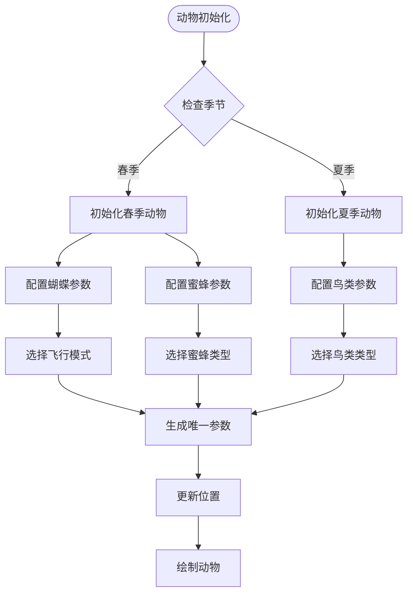

**图表来源**
- [FractalTree.vue:224-484](file://src/views/FractalTree.vue#L224-L484)

**章节来源**
- [FractalTree.vue:224-484](file://src/views/FractalTree.vue#L224-L484)

## 性能优化策略

### 代码分割与懒加载

项目采用 Vite 的现代构建工具链，实现了高效的代码分割：

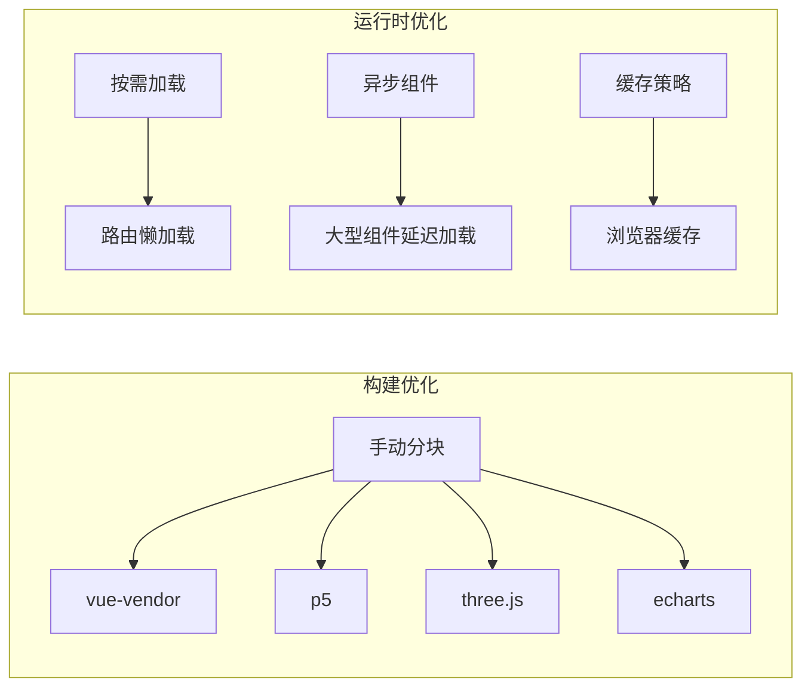

**图表来源**
- [vite.config.js:29-44](file://vite.config.js#L29-L44)

### Canvas 性能优化

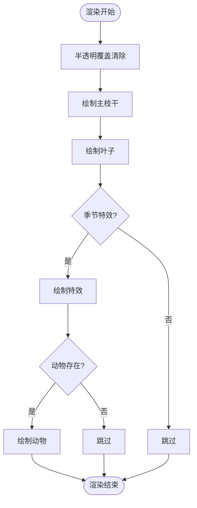

**图表来源**
- [FractalTree.vue:57-62](file://src/views/FractalTree.vue#L57-L62)

### 内存管理策略

- **对象池模式**：复用雪花、落叶等临时对象
- **生命周期管理**：组件卸载时清理 p5 实例
- **帧率控制**：通过条件渲染减少不必要的计算
- **动物持久化**：季节切换时保留动物对象

**章节来源**
- [vite.config.js:13-29](file://vite.config.js#L13-L29)
- [FractalTree.vue:565-573](file://src/views/FractalTree.vue#L565-L573)

## 用户交互设计

### 键盘控制机制

用户可以通过键盘快捷键控制动画：

| 键位 | 功能 | 描述 |
|------|------|------|
| 空格键 | 重新生成 | 生成新的随机分形树 |
| 1 | 春季模式 | 展示春季视觉效果 |
| 2 | 夏季模式 | 展示夏季视觉效果 |
| 3 | 秋季模式 | 展示秋季视觉效果 |
| 4 | 冬季模式 | 展示冬季视觉效果 |

### 响应式布局设计

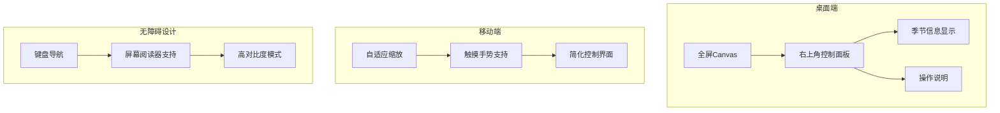

**图表来源**
- [FractalTree.vue:576-618](file://src/views/FractalTree.vue#L576-L618)

### 实时状态反馈

- **深度显示**：实时显示当前树的深度级别
- **季节指示**：清晰显示当前季节状态
- **动物统计**：显示当前存在的动物数量
- **性能监控**：提供帧率和内存使用信息

**章节来源**
- [FractalTree.vue:4-10](file://src/views/FractalTree.vue#L4-L10)
- [FractalTree.vue:542-558](file://src/views/FractalTree.vue#L542-L558)

## 路由与导航

### 路由配置架构

项目使用 Vue Router 实现多页面导航，每个动画都是独立的路由：

```mermaid
graph LR
subgraph "路由结构"
A[/] --> B[首页]
C[/fractal-tree] --> D[分形树页面]
E[/journeys] --> F[旅程页面]
G[/about] --> H[关于页面]
end
subgraph "全屏页面"
D --> I[meta: {fullscreen: true}]
J[/leaves] --> I
K[/fish] --> I
L[/other-animations] --> I
end
```

**图表来源**
- [src/router/index.js:165-169](file://src/router/index.js#L165-L169)

### 动画目录集成

所有动画都通过统一的数据源进行管理：

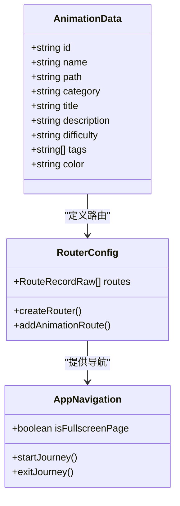

**图表来源**
- [src/data/animations.js:280-289](file://src/data/animations.js#L280-L289)

**章节来源**
- [src/router/index.js:1-239](file://src/router/index.js#L1-L239)
- [src/data/animations.js:1-389](file://src/data/animations.js#L1-L389)

## 部署与构建

### Vite 构建配置

项目采用现代化的 Vite 构建工具，提供了高效的开发和生产环境：

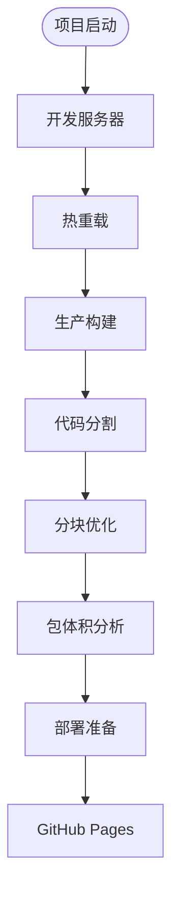

**图表来源**
- [vite.config.js:5-52](file://vite.config.js#L5-L52)

### CI/CD 集成

项目配置了 GitHub Actions 自动部署流程：

- **触发条件**：推送至 main 分支
- **构建步骤**：安装依赖 → 构建项目 → 部署到 GitHub Pages
- **自动化测试**：代码质量检查和构建验证

### 性能监控

- **构建报告**：启用压缩后体积报告
- **缓存优化**：配置 .vite/cache 目录
- **依赖优化**：手动分块策略提升加载性能

**章节来源**
- [vite.config.js:13-29](file://vite.config.js#L13-L29)
- [README.md:50-62](file://README.md#L50-L62)

## 故障排除指南

### 常见问题诊断

#### p5.js 相关问题
- **Canvas 初始化失败**：检查 DOM 元素是否存在
- **渲染性能问题**：减少同时存在的动画对象数量
- **内存泄漏**：确保组件卸载时正确清理 p5 实例

#### Vue 组件问题
- **生命周期错误**：确认在 onMounted 后创建 p5 实例
- **响应式数据更新**：使用 ref 包装可变状态
- **事件绑定问题**：检查键盘事件的正确绑定

#### 性能优化建议
- **帧率监控**：使用浏览器开发者工具监控 FPS
- **内存使用**：定期检查对象池的使用情况
- **渲染优化**：避免不必要的重绘操作

### 调试技巧

1. **控制台日志**：使用 Vue DevTools 检查组件状态
2. **性能分析**：利用 Chrome Performance 面板分析渲染瓶颈
3. **网络监控**：检查资源加载时间和缓存策略

**章节来源**
- [FractalTree.vue:565-573](file://src/views/FractalTree.vue#L565-L573)

## 总结

分形树动画项目展示了现代前端技术在创意编程领域的强大能力。通过精心设计的分形算法、智能动物系统和丰富的视觉效果，该项目成功地将复杂的数学概念转化为直观的视觉体验。

### 技术亮点

- **算法创新**：基于数学原理的递归分形树实现
- **智能动物系统**：独特的动物群，每只都有个性化特征
- **视觉丰富**：四季变换和环境特效的完美融合
- **性能优化**：现代构建工具和渲染优化策略
- **用户体验**：直观的交互设计和响应式布局

### 学习价值

该项目为前端开发者提供了：
- p5.js 与 Vue 3 结合的最佳实践
- 复杂动画系统的架构设计思路
- 智能初始化系统的设计理念
- 性能优化和用户体验的平衡策略
- 现代前端工程化的完整解决方案

通过深入理解和学习这个项目，开发者可以掌握创意编程的核心技术和设计理念，为构建更加精彩的 Web 动画应用奠定坚实基础。