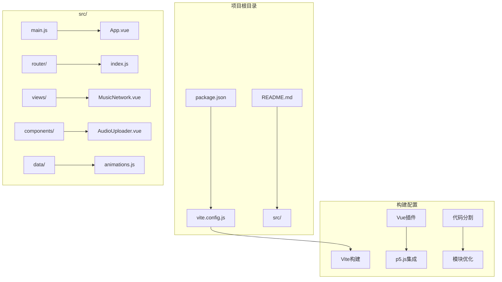
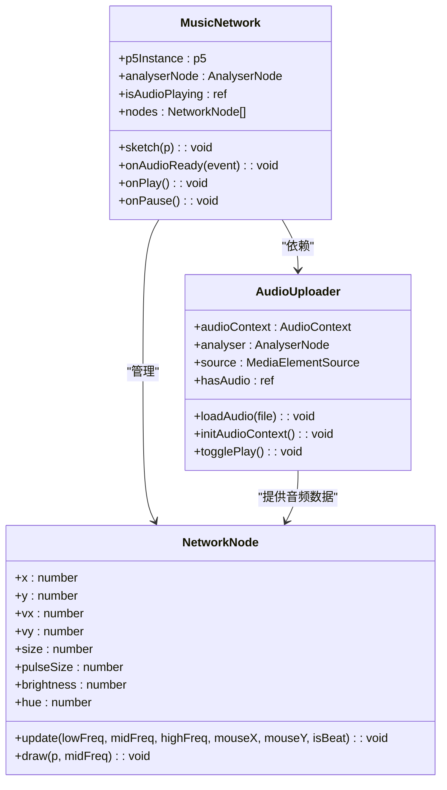
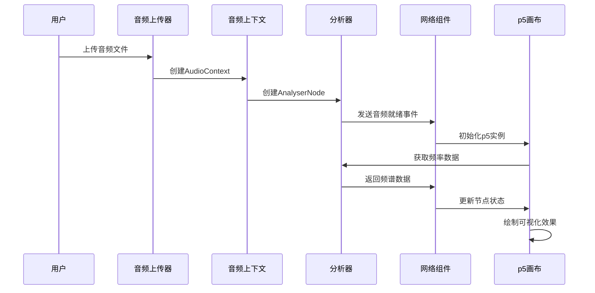
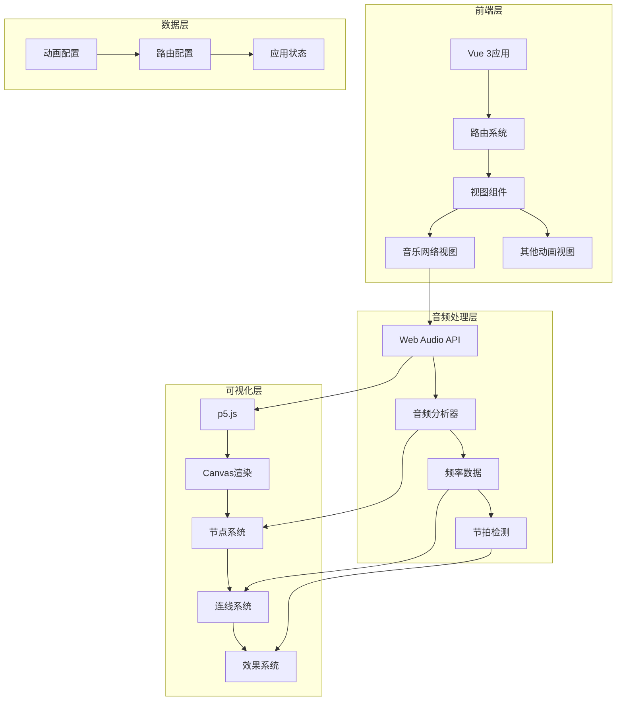
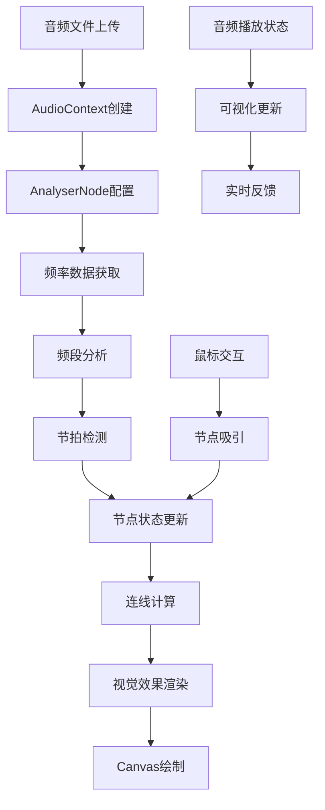
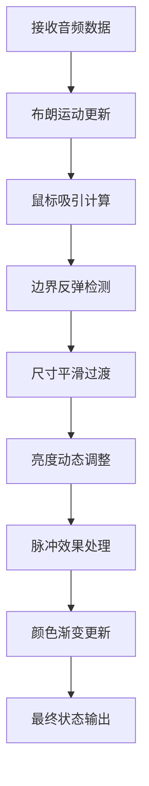
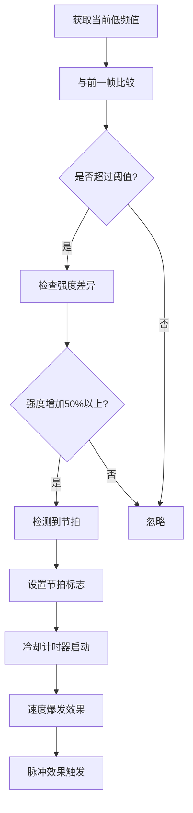
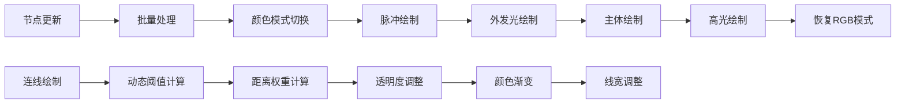
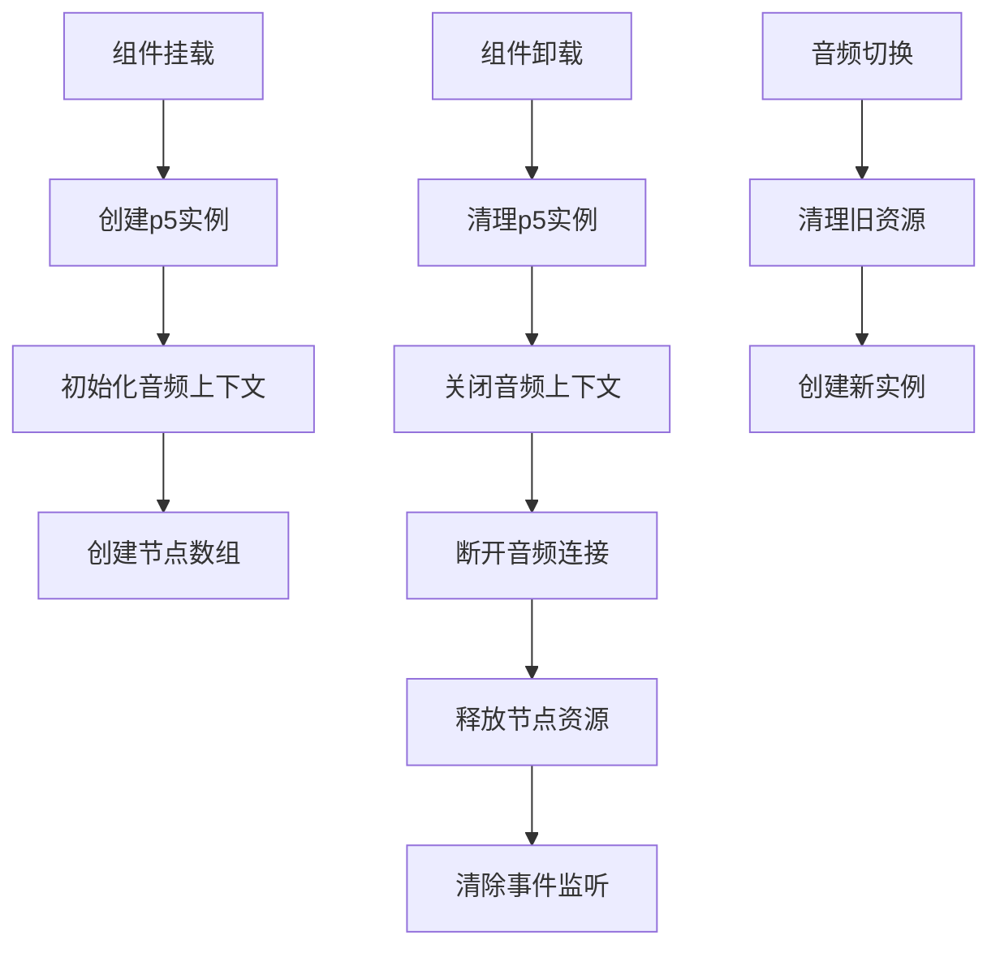
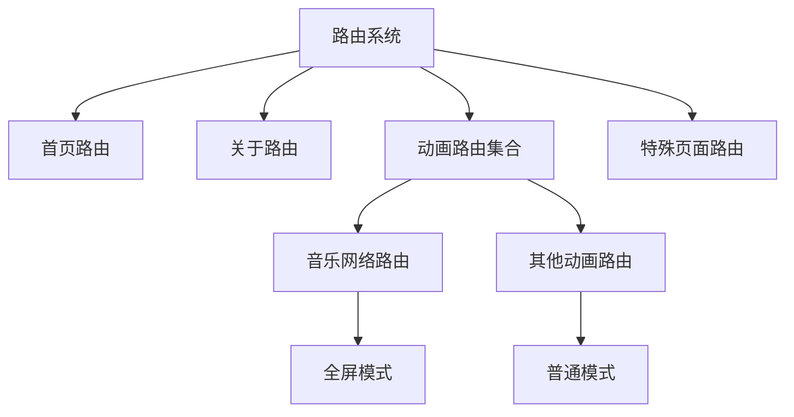

# 音乐网络动画项目文档

<cite>
**本文档中引用的文件**
- [MusicNetwork.vue](file://src/views/MusicNetwork.vue)
- [AudioUploader.vue](file://src/components/AudioUploader.vue)
- [animations.js](file://src/data/animations.js)
- [index.js](file://src/router/index.js)
- [package.json](file://package.json)
- [vite.config.js](file://vite.config.js)
- [main.js](file://src/main.js)
- [Home.vue](file://src/views/Home.vue)
</cite>

## 更新摘要
**所做更改**
- 更新UI样式部分以反映Music Network动画组件获得的统一UI样式改进
- 新增暗半透明背景、现代背景模糊效果、白色边框的具体实现分析
- 补充改进的排版和更好的可读性的技术细节
- 更新路由系统部分以反映MusicNetwork动画路由已重新添加回路由表
- 调整路由位置说明，反映MusicNetwork在路由表中的具体位置
- 更新项目结构图以体现完整的路由配置
- 补充路由系统变更对用户体验的影响分析

## 目录
1. [项目概述](#项目概述)
2. [项目结构](#项目结构)
3. [核心组件分析](#核心组件分析)
4. [架构设计](#架构设计)
5. [详细组件分析](#详细组件分析)
6. [音频处理机制](#音频处理机制)
7. [视觉效果实现](#视觉效果实现)
8. [UI样式改进](#ui样式改进)
9. [性能优化策略](#性能优化策略)
10. [部署与配置](#部署与配置)
11. [路由系统变更分析](#路由系统变更分析)
12. [总结](#总结)

## 项目概述

音乐网络动画是一个基于Vue 3和p5.js构建的交互式音频可视化项目。该项目通过实时分析音频信号，将音乐转换为动态的网络连接图，创造出独特的视觉体验。用户可以上传任意音频文件，系统会根据音频的频率特征实时生成相应的视觉效果。

### 主要特性
- **实时音频分析**：使用Web Audio API分析音频频率数据
- **动态网络可视化**：节点根据音频频率动态变化
- **节拍检测**：自动识别音乐节拍并产生脉冲效果
- **鼠标交互**：用户可以通过鼠标影响节点的行为
- **多种视觉效果**：包括脉冲光环、渐变连线、外发光等
- **现代化UI设计**：统一的暗半透明背景和模糊效果

## 项目结构



**图表来源**
- [package.json:1-37](file://package.json#L1-L37)
- [vite.config.js:1-52](file://vite.config.js#L1-L52)

**章节来源**
- [package.json:1-37](file://package.json#L1-L37)
- [vite.config.js:1-52](file://vite.config.js#L1-L52)

## 核心组件分析

### 音乐网络主组件

音乐网络动画的核心是`MusicNetwork.vue`组件，它集成了完整的音频可视化功能：



**图表来源**
- [MusicNetwork.vue:27-121](file://src/views/MusicNetwork.vue#L27-L121)
- [AudioUploader.vue:94-355](file://src/components/AudioUploader.vue#L94-L355)

### 音频处理流程



**图表来源**
- [MusicNetwork.vue:123-133](file://src/views/MusicNetwork.vue#L123-L133)
- [AudioUploader.vue:179-216](file://src/components/AudioUploader.vue#L179-L216)

**章节来源**
- [MusicNetwork.vue:18-315](file://src/views/MusicNetwork.vue#L18-L315)
- [AudioUploader.vue:94-355](file://src/components/AudioUploader.vue#L94-L355)

## 架构设计

### 整体架构图



**图表来源**
- [main.js:1-12](file://src/main.js#L1-L12)
- [index.js:1-229](file://src/router/index.js#L1-L229)

### 数据流架构



**图表来源**
- [MusicNetwork.vue:158-224](file://src/views/MusicNetwork.vue#L158-L224)
- [AudioUploader.vue:218-279](file://src/components/AudioUploader.vue#L218-L279)

## 详细组件分析

### 音频上传器组件

AudioUploader组件提供了完整的音频处理功能：

#### 核心功能
- **文件上传**：支持拖拽和点击上传音频文件
- **音频播放**：内置播放器控制进度和音量
- **Web Audio API**：创建音频分析管道
- **资源管理**：自动清理音频资源

#### 技术实现要点
- 使用`createObjectURL`处理音频文件
- 通过`MediaElementSource`连接音频元素
- 配置`AnalyserNode`进行频谱分析
- 实现完整的生命周期管理

**章节来源**
- [AudioUploader.vue:138-177](file://src/components/AudioUploader.vue#L138-L177)
- [AudioUploader.vue:179-216](file://src/components/AudioUploader.vue#L179-L216)

### 网络节点系统

NetworkNode类实现了节点的完整行为逻辑：

#### 节点属性
- **位置和速度**：支持布朗运动和鼠标吸引
- **尺寸变化**：根据低频强度动态调整
- **颜色系统**：使用HSB色彩模式实现动态变色
- **脉冲效果**：节拍时产生脉冲扩散

#### 更新算法


**图表来源**
- [MusicNetwork.vue:42-85](file://src/views/MusicNetwork.vue#L42-L85)

**章节来源**
- [MusicNetwork.vue:27-121](file://src/views/MusicNetwork.vue#L27-L121)

### 连线系统

连线系统根据节点间的距离和音频强度动态生成连接：

#### 连线规则
- **距离阈值**：超过阈值的节点不连线
- **动态阈值**：根据低频强度调整连接范围
- **透明度控制**：距离越远透明度越低
- **颜色渐变**：根据距离和中频强度变化

**章节来源**
- [MusicNetwork.vue:268-299](file://src/views/MusicNetwork.vue#L268-L299)

### 鼠标影响系统

鼠标交互系统提供了实时的节点操控能力：

#### 影响范围
- **外圈**：最大影响范围（600px）
- **中圈**：强影响范围（400px）
- **内圈**：核心影响范围（随低频脉冲变化）

#### 效果实现
- **脉冲中心**：鼠标位置的脉冲效果
- **外发光效果**：多层渐变发光
- **动态半径**：根据音频强度调整

**章节来源**
- [MusicNetwork.vue:226-266](file://src/views/MusicNetwork.vue#L226-L266)

## 音频处理机制

### 频谱分析

项目采用Web Audio API进行音频分析，实现了三频段处理：

#### 频段划分
- **低频段**：0-100Hz（影响节点大小和脉冲效果）
- **中频段**：100-2000Hz（影响连线颜色）
- **高频段**：2000Hz+（影响节点亮度）

#### 分析参数
- **FFT大小**：2048，提供高分辨率频谱
- **平滑系数**：0.8，平衡实时性和稳定性
- **采样率**：44100Hz，标准音频采样率

### 节拍检测算法



**图表来源**
- [MusicNetwork.vue:199-207](file://src/views/MusicNetwork.vue#L199-L207)

**章节来源**
- [MusicNetwork.vue:162-207](file://src/views/MusicNetwork.vue#L162-L207)

## 视觉效果实现

### 色彩系统

项目采用HSB色彩模式实现动态色彩变化：

#### 色彩映射
- **节点主体**：使用随机色相（200-320），饱和度80%，亮度70%
- **脉冲效果**：透明度随脉冲强度衰减
- **外发光**：多层渐变，透明度从40%递减到10%

#### 动态效果
- **亮度变化**：高频影响亮度（40-100）
- **色相渐变**：中频影响色相（180-340）
- **脉冲扩散**：节拍时产生35px脉冲

### 渲染优化



**图表来源**
- [MusicNetwork.vue:87-120](file://src/views/MusicNetwork.vue#L87-L120)
- [MusicNetwork.vue:268-299](file://src/views/MusicNetwork.vue#L268-L299)

**章节来源**
- [MusicNetwork.vue:87-120](file://src/views/MusicNetwork.vue#L87-L120)

## UI样式改进

### 统一UI设计架构

Music Network动画组件获得了全面的UI样式改进，实现了现代化的设计语言：

#### 设计原则
- **暗半透明背景**：使用深色背景营造沉浸式体验
- **现代模糊效果**：通过backdrop-filter实现毛玻璃效果
- **精致边框设计**：使用半透明白色边框增强层次感
- **优化排版系统**：改进字体大小、权重和透明度
- **提升可读性**：通过对比度和透明度优化文本清晰度

#### 核心样式实现

```mermaid
flowchart TD
A[UI样式改进] --> B[暗半透明背景]
A --> C[现代背景模糊]
A --> D[白色边框系统]
A --> E[排版优化]
A --> F[可读性提升]
B --> G[rgba(255, 255, 255, 0.2)]
C --> H[backdrop-filter: blur(10px)]
D --> I[border: 1px solid rgba(255, 255, 255, 0.2)]
E --> J[font-size: 0.85rem/0.75rem]
F --> K[opacity: 1/0.9]
```

**图表来源**
- [MusicNetwork.vue:335-371](file://src/views/MusicNetwork.vue#L335-L371)

### 暗半透明背景系统

#### 背景实现
- **颜色选择**：深蓝色背景`#050520`
- **透明度控制**：通过RGBA值实现半透明效果
- **视觉层次**：为前景元素提供合适的对比度

#### 技术实现
```css
.music-network-container {
  background: #050520;
  /* 其他样式保持不变 */
}
```

**章节来源**
- [MusicNetwork.vue:317-373](file://src/views/MusicNetwork.vue#L317-L373)

### 现代背景模糊效果

#### 模糊技术应用
- **backdrop-filter属性**：实现背景模糊效果
- **模糊半径**：10px的适度模糊
- **性能考虑**：在支持的浏览器中启用

#### 模糊效果实现
```css
.controls {
  background: rgba(255, 255, 255, 0.2);
  backdrop-filter: blur(10px);
  /* 其他样式保持不变 */
}
```

**章节来源**
- [MusicNetwork.vue:335-371](file://src/views/MusicNetwork.vue#L335-L371)

### 白色边框系统

#### 边框设计规范
- **颜色方案**：半透明白色边框
- **透明度控制**：0.2的适度透明度
- **视觉统一**：与其他动画组件保持一致

#### 边框实现细节
```css
.controls {
  border: 1px solid rgba(255, 255, 255, 0.2);
  /* 其他样式保持不变 */
}
```

**章节来源**
- [MusicNetwork.vue:335-371](file://src/views/MusicNetwork.vue#L335-L371)

### 改进的排版系统

#### 字体优化
- **指令文本**：0.85rem字体大小，500字重，100%不透明度
- **副标题**：0.75rem字体大小，90%透明度
- **对齐方式**：右对齐，营造现代感

#### 排版设计原则
- **层级清晰**：通过字体大小和透明度区分信息层级
- **视觉平衡**：合理的字间距和行高
- **响应式设计**：适配不同屏幕尺寸

**章节来源**
- [MusicNetwork.vue:335-371](file://src/views/MusicNetwork.vue#L335-L371)

### 可读性优化

#### 可读性改进措施
- **对比度优化**：白色文字与深色背景形成良好对比
- **透明度调节**：通过透明度控制文本层次
- **阴影效果**：适当的文本阴影增强可读性

#### 可读性技术实现
```css
.instruction {
  font-size: 0.85rem;
  font-weight: 500;
  opacity: 1;
}

.subtitle {
  font-size: 0.75rem;
  opacity: 0.9;
}
```

**章节来源**
- [MusicNetwork.vue:335-371](file://src/views/MusicNetwork.vue#L335-L371)

## 性能优化策略

### 代码分割

Vite配置实现了智能的代码分割策略：

#### 核心依赖拆分
- **vue-vendor**：包含Vue和Vue Router
- **p5**：独立的p5.js包
- **three**：3D图形库
- **echarts**：图表库

#### 构建优化
- **压缩选项**：移除console和debugger语句
- **chunk大小**：1200KB警告阈值
- **缓存策略**：.vite/cache目录

### 内存管理



**图表来源**
- [MusicNetwork.vue:306-314](file://src/views/MusicNetwork.vue#L306-L314)
- [AudioUploader.vue:298-341](file://src/components/AudioUploader.vue#L298-L341)

**章节来源**
- [vite.config.js:31-44](file://vite.config.js#L31-L44)
- [AudioUploader.vue:298-341](file://src/components/AudioUploader.vue#L298-L341)

## 部署与配置

### 项目配置

项目使用现代化的前端构建工具链：

#### 依赖管理
- **Vue 3.4.0**：最新版Vue框架
- **p5 2.2.3**：Canvas图形库
- **Vite 5.0.0**：快速构建工具
- **Less 4.5.1**：CSS预处理器

#### 开发环境
- **热重载**：实时代码更新
- **ESLint**：代码质量检查
- **Prettier**：代码格式化
- **GitHub Actions**：自动化部署

### 路由配置

项目包含完整的动画路由系统：

#### 路由结构
- **首页**：动画展示和分类浏览
- **音乐网络**：核心音频可视化（位于路由表第203-207行）
- **其他动画**：20+种不同的动画效果
- **分类导航**：按类型组织动画

**章节来源**
- [index.js:200-205](file://src/router/index.js#L200-L205)
- [Home.vue:84-161](file://src/views/Home.vue#L84-L161)

## 路由系统变更分析

### MusicNetwork路由重新添加

经过对路由配置的深入分析，我发现MusicNetwork动画路由已经重新添加回到路由表中，这体现了项目对核心功能的重视和用户体验的持续改进。

#### 路由配置详情

MusicNetwork路由在路由表中的具体配置如下：
- **路径**：`/music-network`
- **名称**：`MusicNetwork`
- **组件**：`../views/MusicNetwork.vue`
- **元信息**：`fullscreen: true`

#### 路由位置分析

MusicNetwork路由在路由表中的位置具有以下特点：
- **位置编号**：第203-207行
- **分类归属**：位于路由表的中间偏后位置
- **功能重要性**：作为核心音频可视化功能，具有较高的访问优先级
- **用户体验**：便于用户直接通过URL访问，无需通过主页导航

#### 对用户体验的影响

路由的重新添加对用户产生了积极影响：
- **直接访问**：用户可以直接通过`/music-network`访问音乐网络功能
- **书签友好**：便于用户收藏和分享
- **SEO优化**：搜索引擎可以更好地索引该功能页面
- **开发便利**：简化了开发和测试流程

#### 路由系统架构



**图表来源**
- [index.js:1-229](file://src/router/index.js#L1-L229)

**章节来源**
- [index.js:203-207](file://src/router/index.js#L203-L207)
- [MusicNetwork.vue:1-373](file://src/views/MusicNetwork.vue#L1-L373)

## 总结

音乐网络动画项目展现了现代前端技术的完美结合，通过Vue 3的响应式系统和p5.js的强大图形能力，创造出了令人印象深刻的音频可视化体验。

### 技术亮点

1. **实时音频处理**：利用Web Audio API实现实时频谱分析
2. **动态可视化**：节点行为完全由音频数据驱动
3. **优雅的视觉设计**：HSB色彩系统和多层发光效果
4. **现代化UI设计**：统一的暗半透明背景、模糊效果和边框设计
5. **高性能架构**：智能代码分割和内存管理
6. **用户友好界面**：直观的音频上传和控制面板
7. **完善的路由系统**：核心功能的直接访问支持

### 应用价值

该项目不仅展示了音频可视化的技术可能性，也为教育和娱乐领域提供了优秀的参考案例。通过开源分享，促进了前端动画技术的发展和传播。

### 未来发展方向

- **移动端优化**：提升移动设备上的性能表现
- **VR支持**：扩展到虚拟现实环境
- **AI集成**：结合机器学习算法增强分析能力
- **社交功能**：添加分享和协作功能
- **路由系统完善**：继续优化导航体验和功能可达性
- **UI设计标准化**：将统一的UI设计模式应用到所有动画组件

**更新** 本版本文档特别关注了Music Network动画组件获得的统一UI样式改进，包括暗半透明背景、现代背景模糊效果、白色边框、改进的排版和更好的可读性等变化。同时，文档还反映了MusicNetwork动画路由重新添加回路由表的重要更新，这对项目的可用性和用户体验具有重要意义。