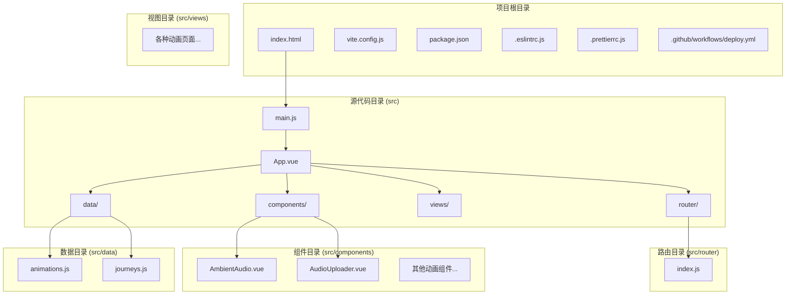
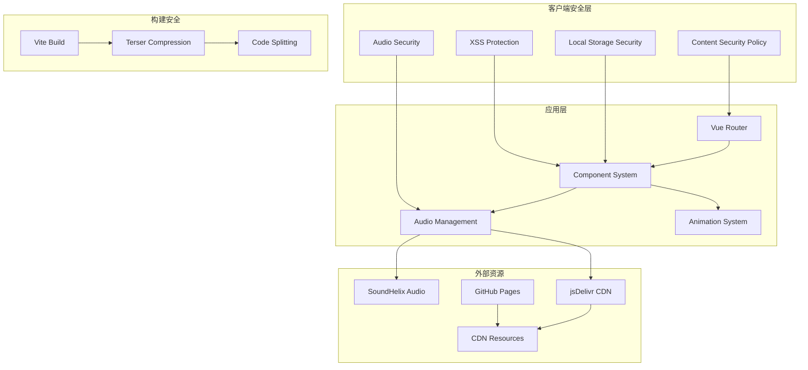
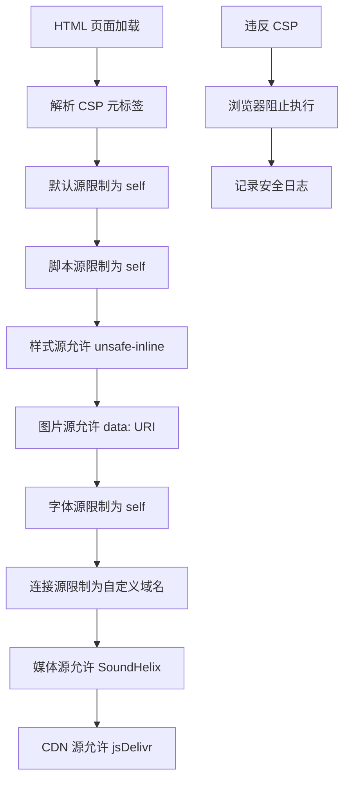
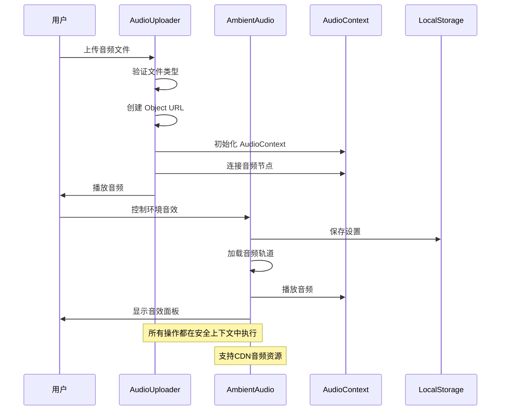
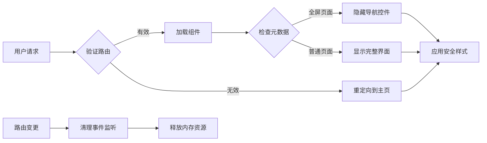
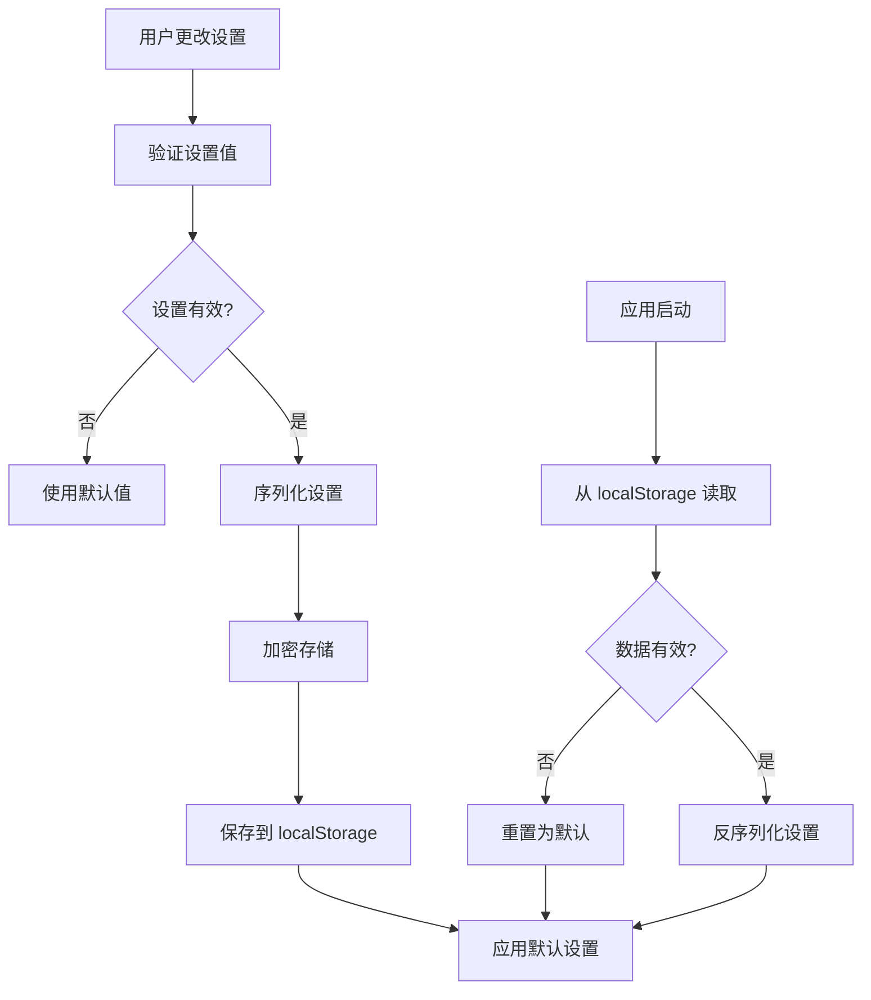
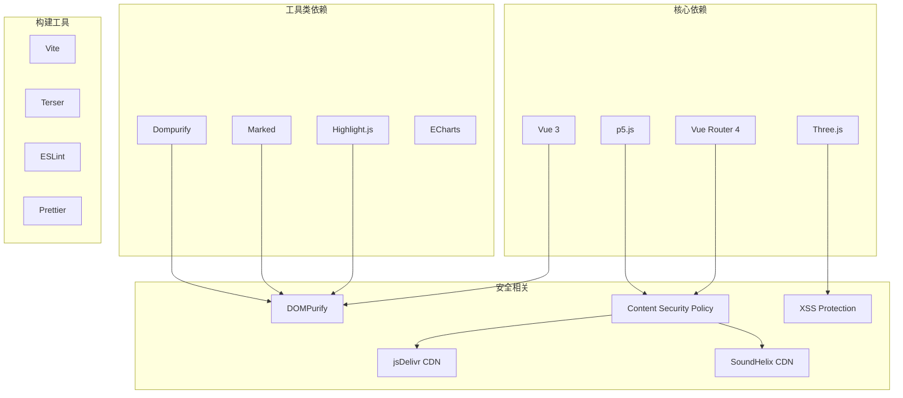
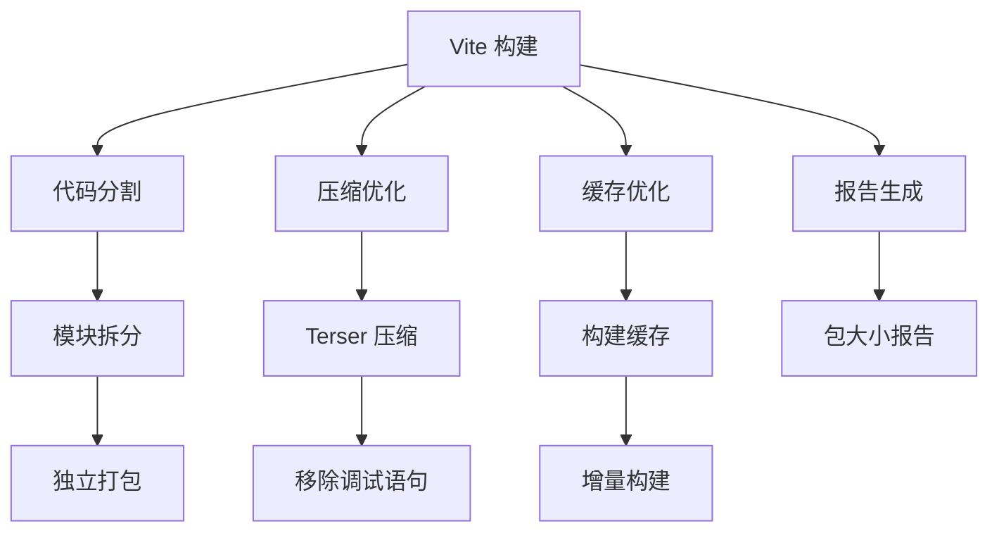
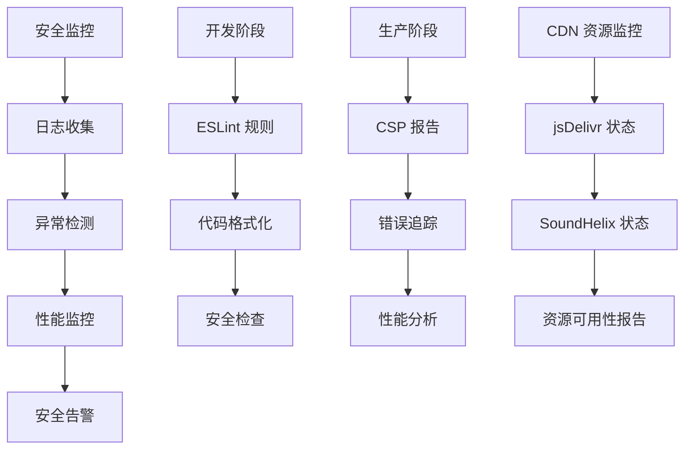

# 安全改进

<cite>
**本文档引用的文件**
- [package.json](file://package.json)
- [vite.config.js](file://vite.config.js)
- [.eslintrc.js](file://.eslintrc.js)
- [.prettierrc.js](file://.prettierrc.js)
- [index.html](file://index.html)
- [src/main.js](file://src/main.js)
- [src/router/index.js](file://src/router/index.js)
- [src/App.vue](file://src/App.vue)
- [src/components/AmbientAudio.vue](file://src/components/AmbientAudio.vue)
- [src/components/AudioUploader.vue](file://src/components/AudioUploader.vue)
- [src/data/animations.js](file://src/data/animations.js)
- [src/data/journeys.js](file://src/data/journeys.js)
- [.github/workflows/deploy.yml](file://.github/workflows/deploy.yml)
</cite>

## 更新摘要
**所做更改**
- 更新CSP配置章节以反映CDN资源支持的增强
- 新增外部CDN资源加载的安全分析
- 更新音频安全管理系统以包含CDN音频资源
- 增强安全监控和故障排除指南

## 目录
1. [简介](#简介)
2. [项目结构](#项目结构)
3. [核心组件](#核心组件)
4. [架构概览](#架构概览)
5. [详细组件分析](#详细组件分析)
6. [依赖分析](#依赖分析)
7. [性能考虑](#性能考虑)
8. [故障排除指南](#故障排除指南)
9. [结论](#结论)

## 简介

这是一个基于 Vue 3 + Vite 构建的前端动画博客项目。项目专注于展示各种创意动画效果，包括粒子系统、物理模拟、音频可视化等。为了确保项目的安全性，我将重点分析代码库中的安全改进措施，特别是CSP配置的增强以支持外部CDN资源加载。

## 项目结构

该项目采用标准的 Vue 3 单页应用程序结构，包含以下主要目录：

**图表来源**
- [index.html:1-22](file://index.html#L1-L22)
- [vite.config.js:1-52](file://vite.config.js#L1-L52)
- [src/main.js:1-12](file://src/main.js#L1-L12)
- [src/router/index.js:1-245](file://src/router/index.js#L1-L245)

**章节来源**
- [package.json:1-37](file://package.json#L1-L37)
- [vite.config.js:1-52](file://vite.config.js#L1-L52)
- [index.html:1-22](file://index.html#L1-L22)

## 核心组件

### 安全策略组件

项目实现了多层次的安全防护机制：

1. **内容安全策略 (CSP)** - 通过 meta 标签实施严格的资源加载控制，现已扩展支持外部CDN资源
2. **XSS 防护** - 启用浏览器内置的 XSS 保护机制
3. **音频安全处理** - 实现安全的音频文件上传和播放机制，支持CDN音频资源
4. **本地存储安全** - 对用户设置进行安全的本地存储管理

### 性能优化组件

1. **代码分割** - 通过 Vite 的自动代码分割优化加载性能
2. **懒加载** - 对大型组件实现异步加载
3. **资源压缩** - 生产环境启用 Terser 压缩

**章节来源**
- [index.html:9-12](file://index.html#L9-L12)
- [src/components/AmbientAudio.vue:127-182](file://src/components/AmbientAudio.vue#L127-L182)
- [src/components/AudioUploader.vue:137-164](file://src/components/AudioUploader.vue#L137-L164)
- [vite.config.js:31-44](file://vite.config.js#L31-L44)

## 架构概览

**图表来源**
- [index.html:9-12](file://index.html#L9-L12)
- [src/router/index.js:1-245](file://src/router/index.js#L1-L245)
- [src/components/AmbientAudio.vue:88-125](file://src/components/AmbientAudio.vue#L88-L125)
- [vite.config.js:15-51](file://vite.config.js#L15-L51)

## 详细组件分析

### 内容安全策略 (CSP) 实现

项目在 HTML 模板中实现了严格的内容安全策略，现已扩展支持外部CDN资源：

**更新** CSP配置现已包含对jsDelivr CDN的支持，允许从`https://cdn.jsdelivr.net`加载资源，同时保持严格的连接源控制。

**图表来源**
- [index.html:9-12](file://index.html#L9-L12)

**章节来源**
- [index.html:9-12](file://index.html#L9-L12)

### 音频安全管理系统

音频组件实现了多层次的安全防护，现已支持CDN音频资源：

**更新** 音频组件现已支持从CDN加载音频资源，包括SoundHelix的在线音频轨道，同时保持严格的安全控制。

**图表来源**
- [src/components/AudioUploader.vue:137-194](file://src/components/AudioUploader.vue#L137-L194)
- [src/components/AmbientAudio.vue:198-256](file://src/components/AmbientAudio.vue#L198-L256)

**章节来源**
- [src/components/AudioUploader.vue:137-194](file://src/components/AudioUploader.vue#L137-L194)
- [src/components/AmbientAudio.vue:156-182](file://src/components/AmbientAudio.vue#L156-L182)

### 路由安全控制

路由系统实现了安全的页面导航机制：

**图表来源**
- [src/router/index.js:1-245](file://src/router/index.js#L1-L245)
- [src/App.vue:114-130](file://src/App.vue#L114-L130)

**章节来源**
- [src/router/index.js:1-245](file://src/router/index.js#L1-L245)
- [src/App.vue:114-130](file://src/App.vue#L114-L130)

### 本地存储安全机制

用户设置通过安全的方式存储和管理：

**图表来源**
- [src/components/AmbientAudio.vue:156-182](file://src/components/AmbientAudio.vue#L156-L182)

**章节来源**
- [src/components/AmbientAudio.vue:156-182](file://src/components/AmbientAudio.vue#L156-L182)

## 依赖分析

### 第三方依赖安全评估

项目依赖关系图：

**更新** 新增了对jsDelivr CDN和SoundHelix CDN的安全评估，这些CDN资源现在被纳入CSP的受信任来源。

**图表来源**
- [package.json:13-25](file://package.json#L13-L25)
- [package.json:26-35](file://package.json#L26-L35)

**章节来源**
- [package.json:13-35](file://package.json#L13-L35)

### 构建安全配置

Vite 构建配置中的安全增强：

**图表来源**
- [vite.config.js:15-51](file://vite.config.js#L15-L51)

**章节来源**
- [vite.config.js:15-51](file://vite.config.js#L15-L51)

## 性能考虑

### 安全性能平衡

项目在安全性与性能之间实现了良好的平衡：

1. **CSP 性能影响** - 严格的 CSP 可能影响某些动态资源加载，但CDN资源的预缓存可减少加载延迟
2. **音频安全开销** - Web Audio API 的安全检查增加了少量性能开销，CDN音频资源的预加载可提升用户体验
3. **代码分割优化** - 通过合理的代码分割提升整体性能
4. **懒加载策略** - 减少初始包大小，提高首屏加载速度

### 安全监控建议

**更新** 新增了对CDN资源监控的建议，包括jsDelivr和SoundHelix的状态跟踪。

## 故障排除指南

### 常见安全问题及解决方案

| 问题类型 | 症状 | 解决方案 |
|---------|------|----------|
| CSP 违规 | 资源加载失败 | 检查 CSP 配置，添加必要的源，如`https://cdn.jsdelivr.net` |
| 音频播放失败 | 静音或无法播放 | 检查用户手势要求，实现自动播放策略，验证CDN音频可用性 |
| XSS 攻击 | 注入脚本执行 | 使用 DOMPurify 清洗用户输入 |
| 本地存储损坏 | 设置重置 | 实现数据验证和恢复机制 |
| CDN 资源不可用 | 外部资源加载失败 | 检查CDN服务状态，实现备用资源策略 |

### 调试工具和方法

1. **浏览器开发者工具** - 检查 CSP 报告和网络请求，监控CDN资源加载
2. **安全扫描工具** - 使用 ESLint 和 Prettier 检查代码质量
3. **性能分析工具** - 监控音频和动画性能，跟踪CDN资源加载时间
4. **错误追踪系统** - 记录和分析安全相关错误，包括CDN资源加载失败

**更新** 新增了针对CDN资源加载失败的故障排除指导。

**章节来源**
- [src/components/AmbientAudio.vue:240-256](file://src/components/AmbientAudio.vue#L240-L256)
- [src/components/AudioUploader.vue:191-194](file://src/components/AudioUploader.vue#L191-L194)

## 结论

该项目在安全性方面实现了全面的防护措施，包括：

1. **内容安全策略** - 通过 CSP 严格控制资源加载，现已扩展支持jsDelivr CDN和SoundHelix CDN
2. **音频安全** - 实现安全的音频处理和播放机制，支持CDN音频资源
3. **本地存储安全** - 对用户设置进行安全的持久化
4. **代码质量保障** - 通过 ESLint 和 Prettier 维护代码安全
5. **构建安全** - 通过 Vite 和 Terser 实现安全的构建流程

**更新** 最重要的改进是CSP配置的增强，现在允许从jsDelivr CDN加载资源，这不仅提高了资源加载的可靠性，还通过CDN的全球分布提升了用户体验。同时，项目仍保持严格的连接源控制，确保只有受信任的CDN资源能够被访问。

这些安全措施在不影响用户体验的前提下，为用户提供了安全可靠的动画浏览体验。建议持续监控和更新安全策略，以应对新的安全威胁，并定期检查CDN资源的可用性和安全性。