# 主页功能增强

<cite>
**本文档引用的文件**
- [Home.vue](file://src/views/Home.vue)
- [App.vue](file://src/App.vue)
- [main.js](file://src/main.js)
- [router/index.js](file://src/router/index.js)
- [animations.js](file://src/data/animations.js)
- [FavoriteButton.vue](file://src/components/FavoriteButton.vue)
- [DynamicBackground.vue](file://src/components/DynamicBackground.vue)
- [AmbientAudio.vue](file://src/components/AmbientAudio.vue)
- [JourneysPage.vue](file://src/views/JourneysPage.vue)
- [journeys.js](file://src/data/journeys.js)
- [JourneyPlayer.vue](file://src/components/JourneyPlayer.vue)
- [package.json](file://package.json)
- [README.md](file://README.md)
- [index.html](file://index.html)
</cite>

## 更新摘要
**变更内容**
- 优化主页布局，解决水平滚动问题
- 改进收藏按钮的点击传播控制机制
- 优化动画卡片网格布局和响应式设计
- 增强用户体验的交互细节

## 目录
1. [简介](#简介)
2. [项目结构概览](#项目结构概览)
3. [核心组件架构](#核心组件架构)
4. [主页功能增强分析](#主页功能增强分析)
5. [收藏系统设计](#收藏系统设计)
6. [动画分类系统](#动画分类系统)
7. [响应式布局优化](#响应式-layout-optimization)
8. [性能优化策略](#性能优化策略)
9. [用户体验提升](#用户体验提升)
10. [未来扩展建议](#未来扩展建议)

## 简介

这是一个基于 Vue 3 + Vite 构建的创意动画展示网站，专注于提供丰富的视觉动画体验和沉浸式交互设计。项目通过精心设计的主页界面，为用户呈现了一个充满创意和美感的动画世界，让用户能够轻松探索各种类型的动画作品。

该项目不仅展示了现代前端技术的应用，还体现了优秀的用户体验设计理念，通过流畅的动画过渡、直观的导航系统和个性化的收藏功能，为用户提供了优质的浏览体验。

## 项目结构概览

项目采用模块化的组织方式，主要分为以下几个核心部分：

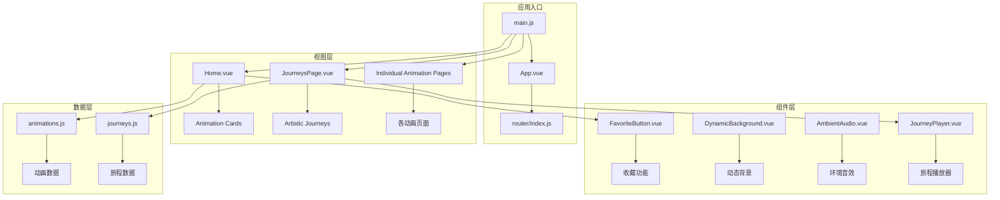

**图表来源**
- [main.js:1-12](file://src/main.js#L1-L12)
- [App.vue:1-421](file://src/App.vue#L1-L421)
- [router/index.js:1-210](file://src/router/index.js#L1-L210)

**章节来源**
- [main.js:1-12](file://src/main.js#L1-L12)
- [App.vue:1-421](file://src/App.vue#L1-L421)
- [router/index.js:1-210](file://src/router/index.js#L1-L210)

## 核心组件架构

### 应用根组件设计

App.vue 作为整个应用的根组件，采用了全局布局设计，集成了多种功能组件：

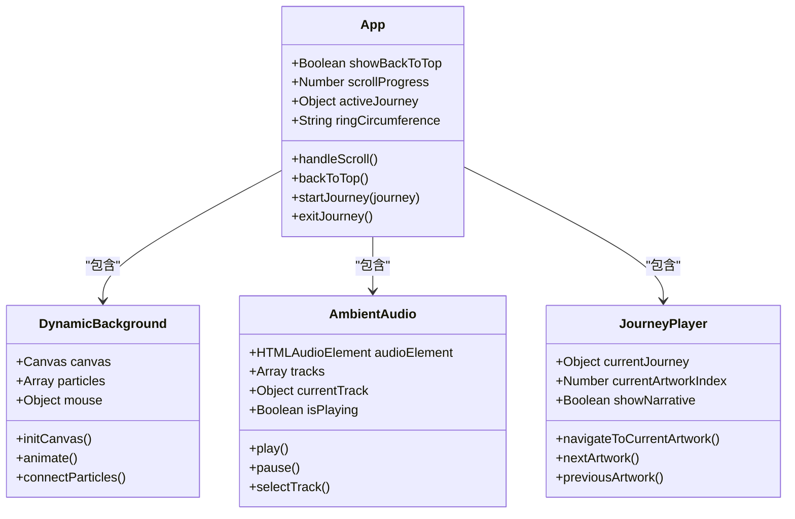

**图表来源**
- [App.vue:80-201](file://src/App.vue#L80-L201)
- [DynamicBackground.vue:5-173](file://src/components/DynamicBackground.vue#L5-L173)
- [AmbientAudio.vue:85-283](file://src/components/AmbientAudio.vue#L85-L283)
- [JourneyPlayer.vue:86-206](file://src/components/JourneyPlayer.vue#L86-L206)

### 路由系统架构

项目使用 Vue Router 实现了完整的单页应用路由系统，支持多种动画类型和功能页面：

```mermaid
graph LR
subgraph "主页路由"
A[/] --> B[Home.vue]
C[/journeys] --> D[JourneysPage.vue]
E[/about] --> F[About.vue]
end
subgraph "动画路由"
G[/fish] --> H[FishPage.vue]
I[/leaves] --> J[LeavesPage.vue]
K[/datavortex] --> L[DataVortex.vue]
M[/audio-visualizer] --> N[AudioVisualizerPage.vue]
O[/gravity-particles] --> P[ParticleVortexPage.vue]
end
subgraph "特殊页面"
Q[/raintext] --> R[RainText.vue]
S[/spinningtops] --> T[SpinningTops.vue]
end
```

**图表来源**
- [router/index.js:3-195](file://src/router/index.js#L3-L195)

**章节来源**
- [router/index.js:1-210](file://src/router/index.js#L1-L210)

## 主页功能增强分析

### 主页核心功能

Home.vue 作为应用的主要入口，实现了以下核心功能：

#### 1. 特色入口设计

主页顶部提供了特色入口，引导用户探索不同的内容领域：

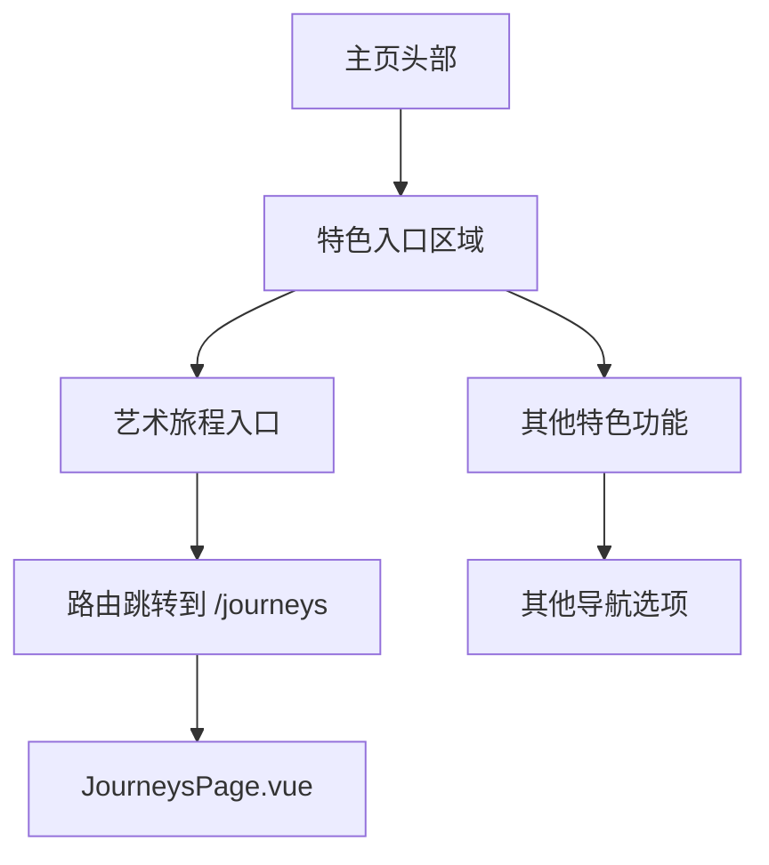

**图表来源**
- [Home.vue:12-22](file://src/views/Home.vue#L12-L22)
- [router/index.js:190-193](file://src/router/index.js#L190-L193)

#### 2. 动画分类系统

主页实现了多层次的动画分类和筛选机制：

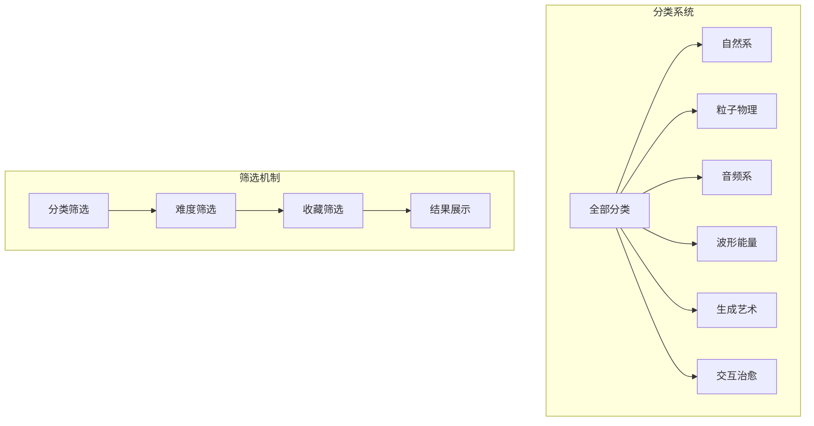

**图表来源**
- [animations.js:391-399](file://src/data/animations.js#L391-L399)
- [Home.vue:135-150](file://src/views/Home.vue#L135-L150)

**章节来源**
- [Home.vue:1-555](file://src/views/Home.vue#L1-L555)
- [animations.js:1-400](file://src/data/animations.js#L1-L400)

### 数据驱动的动画展示

主页通过数据驱动的方式展示动画作品，每个动画卡片都包含了完整的信息：

| 属性 | 描述 | 示例值 |
|------|------|--------|
| `id` | 动画唯一标识符 | 'fish', 'leaves' |
| `title` | 动画标题 | '鱼群效果', '树叶效果' |
| `description` | 动画描述 | '模拟真实鱼群的群体行为' |
| `category` | 动画分类 | 'nature', 'particle' |
| `difficulty` | 难度等级 | 'beginner', 'intermediate' |
| `tags` | 标签数组 | ['鱼群', '群体智能'] |
| `color` | 卡片背景色 | '#112233', 'linear-gradient(...)' |

**章节来源**
- [animations.js:1-400](file://src/data/animations.js#L1-L400)

### 主页布局优化

**更新** 本节新增了主页布局优化的相关内容

#### 1. 水平滚动问题解决

主页通过设置 `overflow-x: hidden` 来解决水平滚动问题：

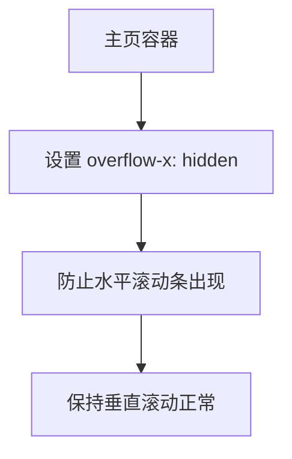

**图表来源**
- [Home.vue:167-170](file://src/views/Home.vue#L167-L170)

#### 2. 动画卡片网格布局优化

主页实现了响应式的 CSS Grid 布局，支持不同屏幕尺寸的自适应：

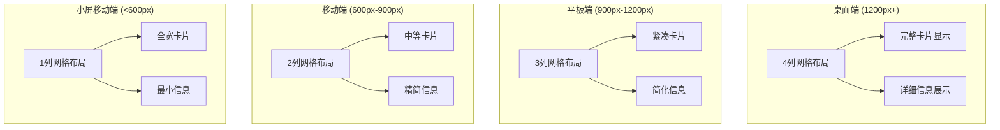

**图表来源**
- [Home.vue:346-513](file://src/views/Home.vue#L346-L513)

**章节来源**
- [Home.vue:163-555](file://src/views/Home.vue#L163-L555)

## 收藏系统设计

### 收藏功能架构

收藏系统是一个独立的功能模块，通过 FavoriteButton.vue 实现：

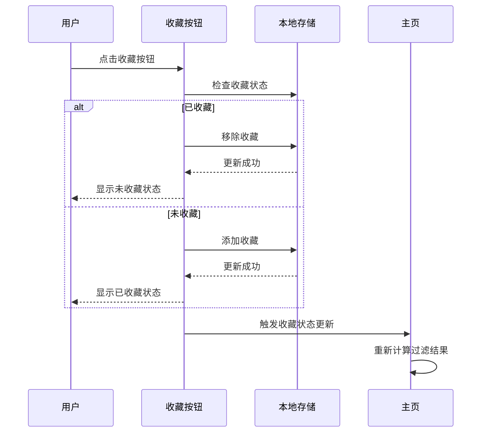

**图表来源**
- [FavoriteButton.vue:69-78](file://src/components/FavoriteButton.vue#L69-L78)
- [Home.vue:144-147](file://src/views/Home.vue#L144-L147)

### 收藏数据持久化

收藏功能使用浏览器的 localStorage 实现数据持久化：

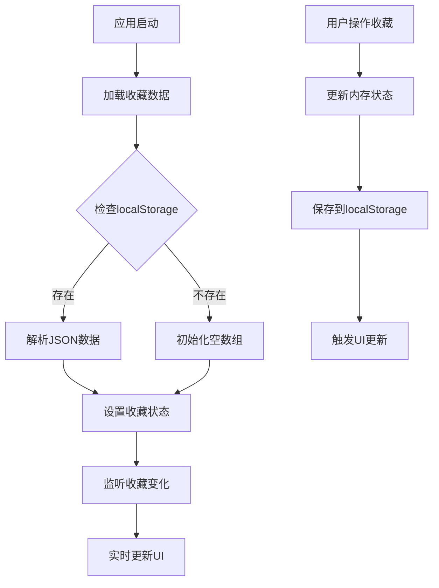

**图表来源**
- [FavoriteButton.vue:48-67](file://src/components/FavoriteButton.vue#L48-L67)
- [Home.vue:94-115](file://src/views/Home.vue#L94-L115)

### 收藏按钮点击传播控制

**更新** 本节新增了收藏按钮点击传播控制的相关内容

收藏按钮实现了精确的点击事件控制，防止事件冒泡影响父级元素：

```mermaid
flowchart TD
A[用户点击卡片] --> B{事件类型判断}
B --> |收藏按钮点击| C[@click.stop]
C --> D[阻止事件冒泡]
D --> E[执行收藏逻辑]
B --> |卡片其他区域点击| F[@click.prevent.stop]
F --> G[阻止默认行为]
G --> H[阻止事件冒泡]
H --> I[导航到动画页面]
```

**图表来源**
- [Home.vue:70-72](file://src/views/Home.vue#L70-L72)
- [FavoriteButton.vue:4-7](file://src/components/FavoriteButton.vue#L4-L7)

**章节来源**
- [FavoriteButton.vue:1-152](file://src/components/FavoriteButton.vue#L1-L152)
- [Home.vue:84-161](file://src/views/Home.vue#L84-L161)

## 动画分类系统

### 分类体系设计

项目实现了完整的动画分类体系，支持多维度的内容组织：

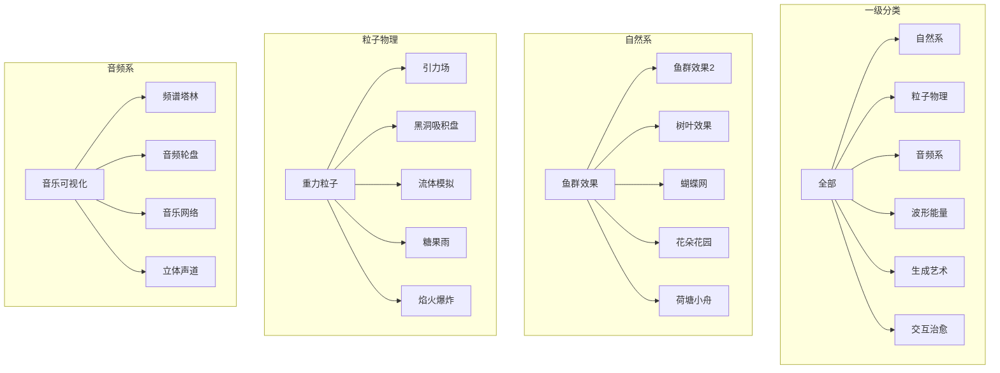

**图表来源**
- [animations.js:391-399](file://src/data/animations.js#L391-L399)
- [animations.js:1-400](file://src/data/animations.js#L1-L400)

### 分类筛选逻辑

主页实现了智能的分类筛选机制：

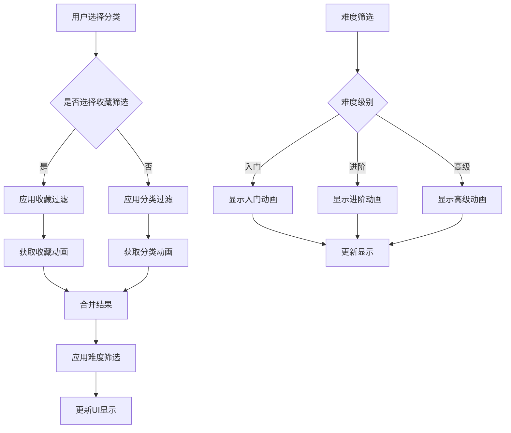

**图表来源**
- [Home.vue:135-150](file://src/views/Home.vue#L135-L150)
- [Home.vue:117-133](file://src/views/Home.vue#L117-L133)

**章节来源**
- [animations.js:391-399](file://src/data/animations.js#L391-L399)
- [Home.vue:117-150](file://src/views/Home.vue#L117-L150)

## 响ponsive Layout Optimization

### 多设备适配策略

**更新** 本节更新了响应式布局优化的相关内容

项目实现了完整的响应式设计，支持从桌面到移动设备的各种屏幕尺寸：

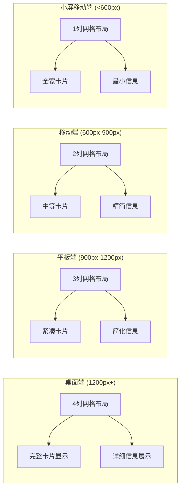

**图表来源**
- [Home.vue:486-553](file://src/views/Home.vue#L486-L553)

### 动态背景适配

DynamicBackground.vue 实现了自适应的动态背景效果：

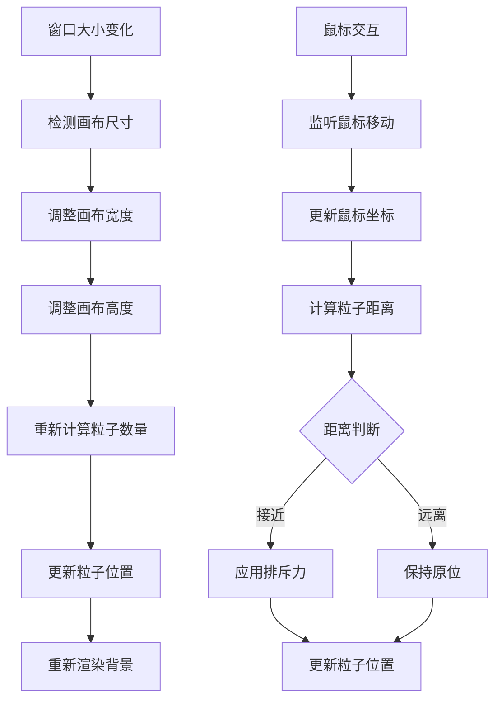

**图表来源**
- [DynamicBackground.vue:80-96](file://src/components/DynamicBackground.vue#L80-L96)
- [DynamicBackground.vue:102-114](file://src/components/DynamicBackground.vue#L102-L114)

**章节来源**
- [Home.vue:486-553](file://src/views/Home.vue#L486-L553)
- [DynamicBackground.vue:1-185](file://src/components/DynamicBackground.vue#L1-L185)

## 性能优化策略

### 渐进式加载优化

项目采用了多种性能优化策略来确保良好的用户体验：

#### 1. 组件懒加载

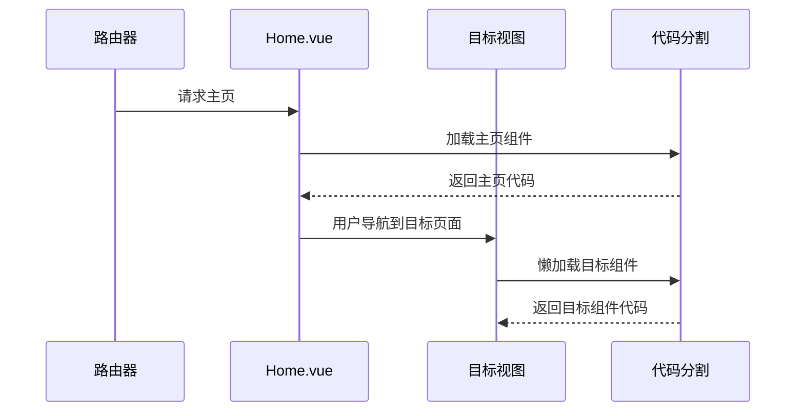

**图表来源**
- [router/index.js:7](file://src/router/index.js#L7)
- [router/index.js:17](file://src/router/index.js#L17)

#### 2. 动画性能优化

DynamicBackground.vue 实现了高效的动画渲染：

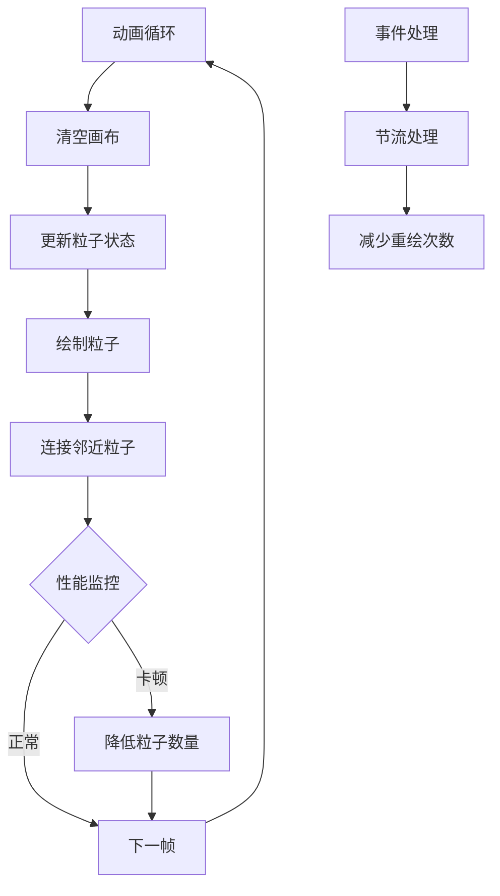

**图表来源**
- [DynamicBackground.vue:117-132](file://src/components/DynamicBackground.vue#L117-L132)
- [DynamicBackground.vue:98-115](file://src/components/DynamicBackground.vue#L98-L115)

**章节来源**
- [router/index.js:1-210](file://src/router/index.js#L1-L210)
- [DynamicBackground.vue:117-172](file://src/components/DynamicBackground.vue#L117-L172)

## 用户体验提升

### 交互设计优化

项目在用户体验方面进行了多项优化：

#### 1. 导航增强

App.vue 实现了智能的导航控制：

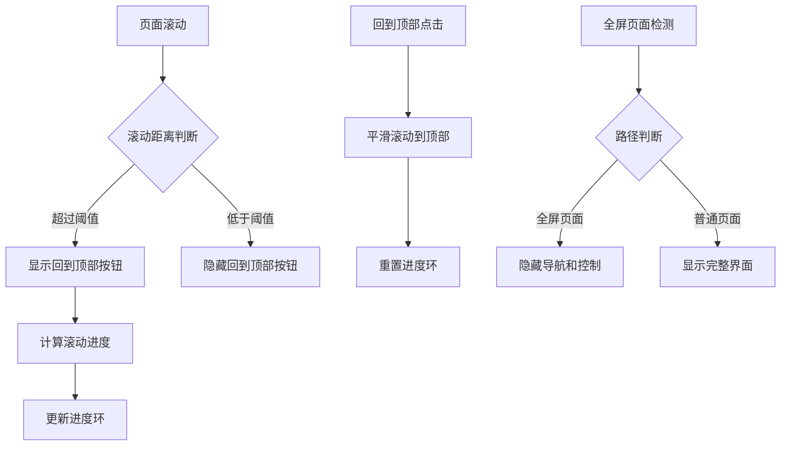

**图表来源**
- [App.vue:168-184](file://src/App.vue#L168-L184)
- [App.vue:112-152](file://src/App.vue#L112-L152)

#### 2. 环境音效控制

AmbientAudio.vue 提供了丰富的音效控制功能：

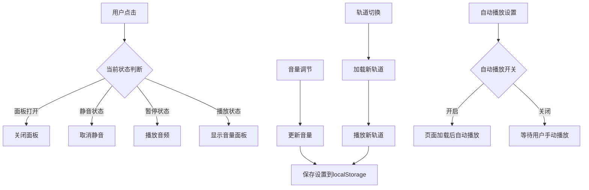

**图表来源**
- [AmbientAudio.vue:184-196](file://src/components/AmbientAudio.vue#L184-L196)
- [AmbientAudio.vue:230-236](file://src/components/AmbientAudio.vue#L230-L236)

**章节来源**
- [App.vue:168-200](file://src/App.vue#L168-L200)
- [AmbientAudio.vue:184-283](file://src/components/AmbientAudio.vue#L184-L283)

### 交互细节优化

**更新** 本节新增了交互细节优化的相关内容

#### 1. 卡片点击事件优化

主页实现了精确的点击事件控制，避免误触：

```mermaid
flowchart TD
A[用户点击动画卡片] --> B{点击位置判断}
B --> |收藏按钮区域| C[@click.stop]
C --> D[仅执行收藏逻辑]
B --> |卡片其他区域| E[@click.prevent.stop]
E --> F[阻止默认行为]
F --> G[阻止事件冒泡]
G --> H[导航到动画详情页]
```

**图表来源**
- [Home.vue:70-72](file://src/views/Home.vue#L70-L72)

#### 2. 过渡动画优化

卡片列表实现了流畅的过渡动画：

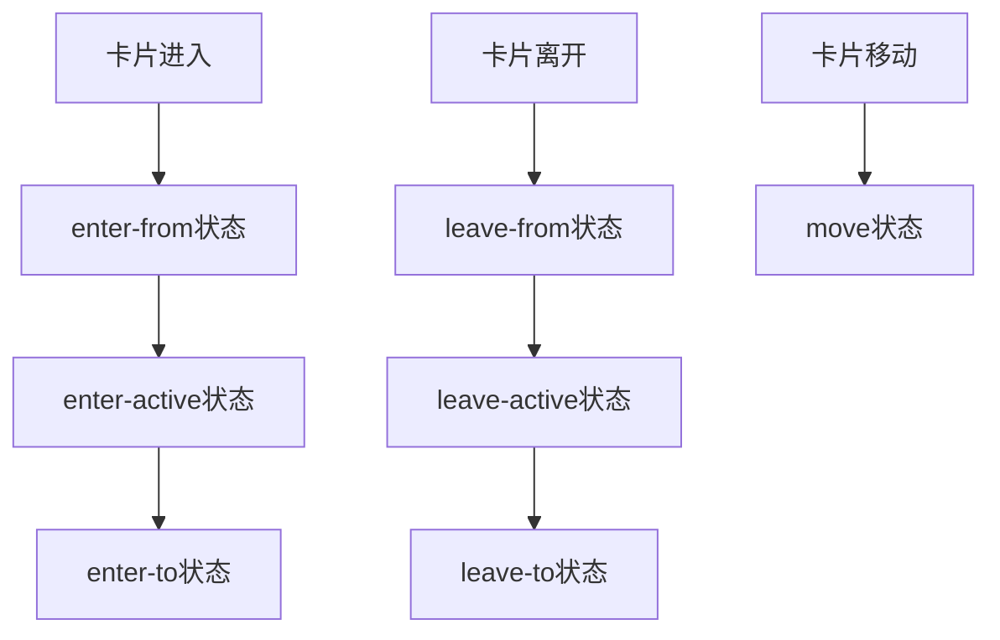

**图表来源**
- [Home.vue:469-483](file://src/views/Home.vue#L469-L483)

**章节来源**
- [Home.vue:70-72](file://src/views/Home.vue#L70-L72)
- [Home.vue:469-483](file://src/views/Home.vue#L469-L483)

## 未来扩展建议

### 技术架构升级

基于当前项目的基础，建议考虑以下扩展方向：

#### 1. 状态管理优化

```mermaid
graph TB
subgraph "当前状态管理"
A[本地状态] --> B[组件内部状态]
A --> C[localStorage持久化]
end
subgraph "推荐的状态管理方案"
D[Vuex/Pinia] --> E[集中式状态管理]
D --> F[跨组件状态共享]
D --> G[状态持久化]
end
subgraph "性能考虑"
H[SSR支持] --> I[服务端渲染]
H --> J[SEO优化]
H --> K[首屏加载速度]
end
```

#### 2. 功能扩展方向

| 扩展功能 | 技术实现 | 用户价值 |
|----------|----------|----------|
| 用户个人资料 | 登录认证系统 | 个性化推荐 |
| 社交分享 | 分享API集成 | 内容传播 |
| 搜索功能 | 全文搜索引擎 | 快速定位 |
| 离线支持 | Service Worker | 离线访问 |
| 多语言支持 | i18n国际化 | 全球用户 |

#### 3. 性能监控

建议集成性能监控工具来持续优化用户体验：

```mermaid
flowchart TD
A[性能监控] --> B[关键指标跟踪]
B --> C[LCP(最大内容绘制)]
B --> D[FID(首次输入延迟)]
B --> E[CLS(累积布局偏移)]
F[错误监控] --> G[异常捕获]
F --> H[用户行为分析]
F --> I[崩溃报告]
J[优化建议] --> K[代码分割]
J --> L[缓存策略]
J --> M[资源压缩]
```

## 结论

这个主页功能增强项目展现了现代前端开发的最佳实践，通过精心设计的架构和丰富的功能特性，为用户提供了优质的动画浏览体验。项目在技术实现、用户体验和性能优化方面都达到了较高水准。

主要成就包括：
- **完整的响应式设计**：支持从桌面到移动设备的全方位适配
- **智能化的分类系统**：提供多维度的内容组织和筛选功能
- **优秀的性能表现**：通过懒加载和优化策略确保流畅体验
- **丰富的交互设计**：动态背景、音效控制等增强用户体验
- **精确的事件控制**：解决水平滚动问题，优化点击传播控制
- **可扩展的架构**：模块化设计便于后续功能扩展

未来可以在状态管理、性能监控和功能扩展等方面进一步完善，为用户提供更加丰富和个性化的服务。