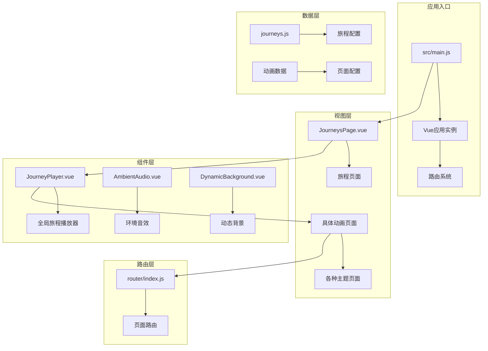
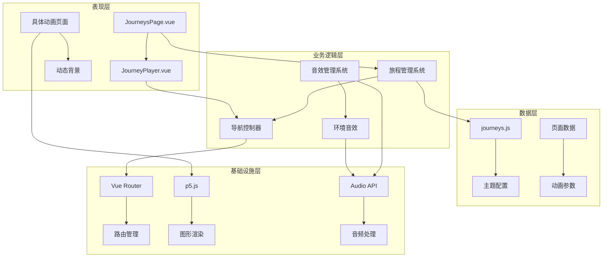
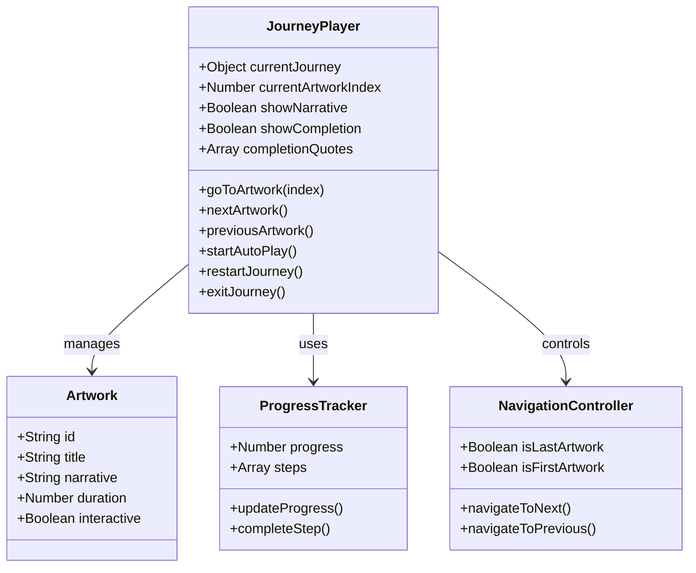
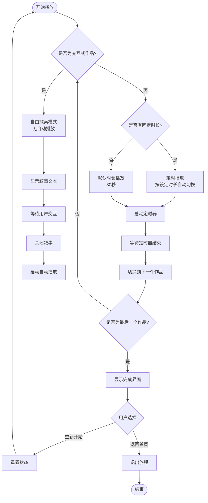
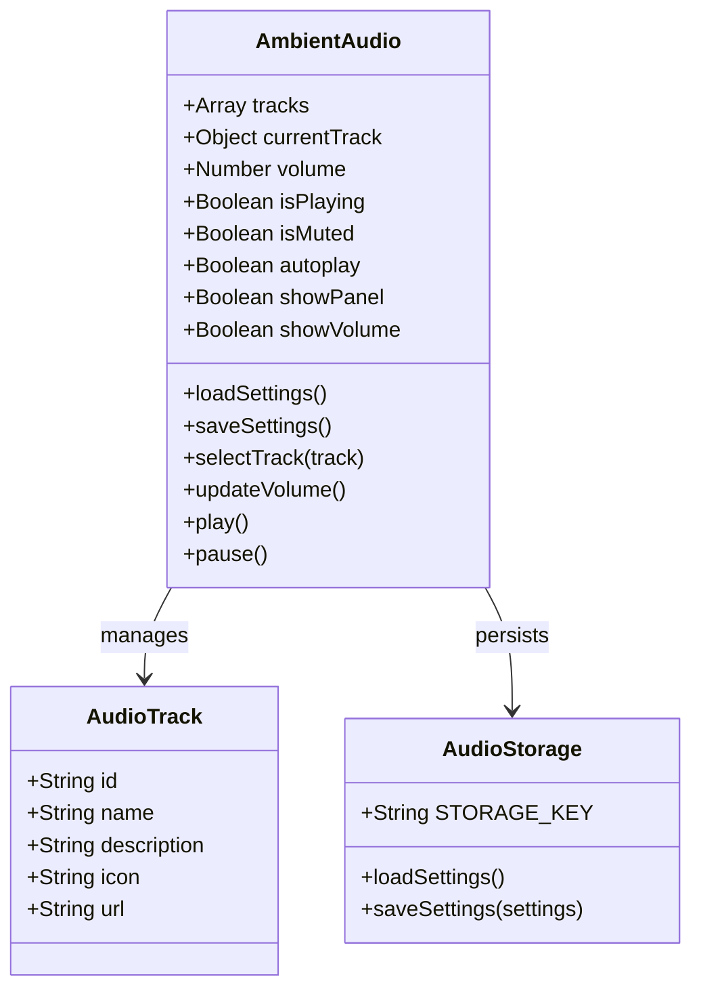
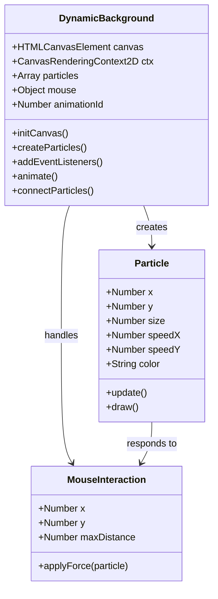
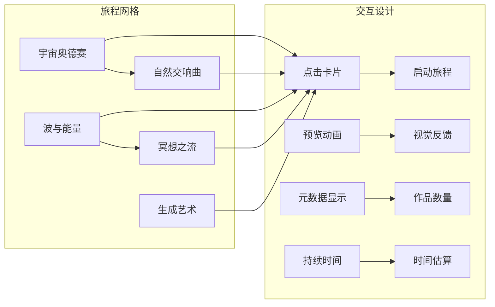
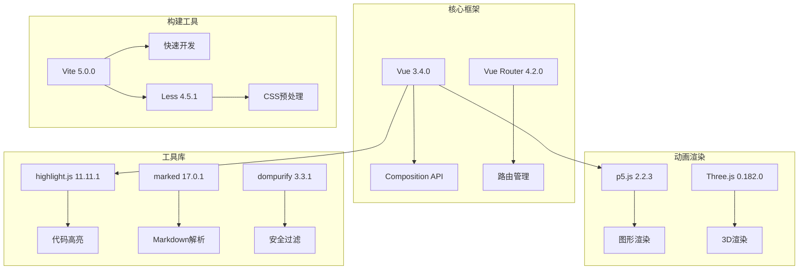

# 主题旅程系统

<cite>
**本文档引用的文件**
- [README.md](file://README.md)
- [package.json](file://package.json)
- [src/App.vue](file://src/App.vue)
- [src/main.js](file://src/main.js)
- [src/router/index.js](file://src/router/index.js)
- [src/views/JourneysPage.vue](file://src/views/JourneysPage.vue)
- [src/views/About.vue](file://src/views/About.vue)
- [src/views/AudioWheel.vue](file://src/views/AudioWheel.vue)
- [src/views/BubblePop.vue](file://src/views/BubblePop.vue)
- [src/views/ButterflyNet.vue](file://src/views/ButterflyNet.vue)
- [src/views/CandyRain.vue](file://src/views/CandyRain.vue)
- [src/views/CellDivision.vue](file://src/views/CellDivision.vue)
- [src/views/CellularAutomataPage.vue](file://src/views/CellularAutomataPage.vue)
- [src/views/DancerPage.vue](file://src/views/DancerPage.vue)
- [src/views/DataVortex.vue](file://src/views/DataVortex.vue)
- [src/views/DigitalRainPage.vue](file://src/views/DigitalRainPage.vue)
- [src/views/Fireworks.vue](file://src/views/Fireworks.vue)
- [src/views/FishPage.vue](file://src/views/FishPage.vue)
- [src/views/FlowerGarden.vue](file://src/views/FlowerGarden.vue)
- [src/views/FluidSimulationPage.vue](file://src/views/FluidSimulationPage.vue)
- [src/views/FractalTree.vue](file://src/views/FractalTree.vue)
- [src/views/FrequencyTower.vue](file://src/views/FrequencyTower.vue)
- [src/views/GravityField.vue](file://src/views/GravityField.vue)
- [src/views/GravityParticles.vue](file://src/views/GravityParticles.vue)
- [src/views/InteractiveNet.vue](file://src/views/InteractiveNet.vue)
- [src/views/LotusPond.vue](file://src/views/LotusPond.vue)
- [src/views/MagneticField.vue](file://src/views/MagneticField.vue)
- [src/views/Mandala.vue](file://src/views/Mandala.vue)
- [src/views/MorphingSphere.vue](file://src/views/MorphingSphere.vue)
- [src/views/MusicNetwork.vue](file://src/views/MusicNetwork.vue)
- [src/views/NoiseTerrain.vue](file://src/views/NoiseTerrain.vue)
- [src/views/ParticleVortexPage.vue](file://src/views/ParticleVortexPage.vue)
- [src/views/Quicksand.vue](file://src/views/Quicksand.vue)
- [src/views/RainText.vue](file://src/views/RainText.vue)
- [src/views/RainbowWave.vue](file://src/views/RainbowWave.vue)
- [src/views/SpinningTops.vue](file://src/views/SpinningTops.vue)
- [src/views/StereoChannel.vue](file://src/views/StereoChannel.vue)
- [src/views/fishGroup.vue](file://src/views/fishGroup.vue)
- [src/components/JourneyPlayer.vue](file://src/components/JourneyPlayer.vue)
- [src/components/AmbientAudio.vue](file://src/components/AmbientAudio.vue)
- [src/components/DynamicBackground.vue](file://src/components/DynamicBackground.vue)
- [src/components/FavoriteButton.vue](file://src/components/FavoriteButton.vue)
- [src/data/journeys.js](file://src/data/journeys.js)
</cite>

## 更新摘要
**变更内容**
- 移除了 WaveInterference 相关的主题旅程内容
- 更新了旅程配置以反映内容变更
- 修正了路由配置中的波形主题分类
- 更新了相关组件的文档说明

## 目录
1. [简介](#简介)
2. [项目结构](#项目结构)
3. [核心组件](#核心组件)
4. [架构概览](#架构概览)
5. [详细组件分析](#详细组件分析)
6. [依赖关系分析](#依赖关系分析)
7. [性能考虑](#性能考虑)
8. [故障排除指南](#故障排除指南)
9. [结论](#结论)

## 简介

主题旅程系统是一个基于Vue 3 + Vite构建的沉浸式艺术体验平台。该系统通过精心设计的主题旅程，将多个独立的动画页面串联成完整的叙事体验，为用户提供从微观粒子到宏观宇宙的全方位视觉盛宴。

系统的核心特色包括：
- **主题化旅程设计**：将相关的动画页面组织成主题性的艺术旅程
- **沉浸式用户体验**：通过动态背景、环境音效和流畅的过渡动画提升沉浸感
- **交互式导航**：支持手动导航和自动播放两种模式
- **响应式设计**：适配各种设备尺寸的屏幕
- **全局旅程管理**：统一的旅程播放器实现跨路由访问

## 项目结构

该项目采用模块化的Vue 3架构，主要分为以下几个核心部分：

**图表来源**
- [src/main.js:1-12](file://src/main.js#L1-L12)
- [src/router/index.js:1-223](file://src/router/index.js#L1-L223)
- [src/views/JourneysPage.vue:1-286](file://src/views/JourneysPage.vue#L1-L286)

**章节来源**
- [README.md:69-86](file://README.md#L69-L86)
- [package.json:1-30](file://package.json#L1-L30)

## 核心组件

### 主应用组件 (App.vue)

主应用组件作为整个系统的根组件，负责全局状态管理和布局控制。其核心功能包括：

- **动态背景管理**：根据当前页面类型决定是否显示动态背景
- **环境音效控制**：在非全屏页面显示环境音效控制面板
- **回到顶部功能**：提供平滑的页面滚动导航
- **全屏页面识别**：自动识别需要全屏展示的动画页面
- **全局旅程播放器**：统一管理所有旅程播放状态

**更新** 旅程播放器现在作为全局组件在App.vue中管理，实现了跨路由的统一旅程体验。

### 路由系统 (router/index.js)

系统包含40个精心设计的动画页面，涵盖多个主题领域：

- **宇宙探索主题**：黑洞、引力场、磁场可视化
- **自然生命主题**：细胞分裂、分形树、鱼群效果
- **波与能量主题**：彩虹波浪、音频可视化、频谱塔林
- **冥想治愈主题**：气泡、流沙、星光舞蹈、曼陀罗
- **生成艺术主题**：噪声地形、细胞自动机、流动球体、光之舞者

**更新** 移除了 WaveInterference 相关的波形主题内容，波形主题现在专注于彩虹波浪、音频可视化和频谱塔林等作品。

**章节来源**
- [src/router/index.js:1-223](file://src/router/index.js#L1-L223)
- [src/App.vue:94-143](file://src/App.vue#L94-L143)

## 架构概览

系统采用分层架构设计，各层职责明确，耦合度低：

**图表来源**
- [src/App.vue:74-85](file://src/App.vue#L74-L85)
- [src/components/JourneyPlayer.vue:86-98](file://src/components/JourneyPlayer.vue#L86-L98)
- [src/data/journeys.js:1-157](file://src/data/journeys.js#L1-L157)

## 详细组件分析

### 旅程播放器 (JourneyPlayer.vue)

旅程播放器是系统的核心组件，负责管理主题旅程的播放流程：

#### 核心功能架构

**图表来源**
- [src/components/JourneyPlayer.vue:86-206](file://src/components/JourneyPlayer.vue#L86-L206)

#### 自动播放机制

系统实现了智能的自动播放功能，能够根据作品类型调整播放策略：

**图表来源**
- [src/components/JourneyPlayer.vue:126-194](file://src/components/JourneyPlayer.vue#L126-L194)

#### 叙事系统设计

每个旅程都配有精心编写的叙事文本，为用户提供沉浸式的观看体验：

- **主题一致性**：每个作品的叙事都与其主题保持一致
- **渐进式引导**：从简单概念逐步深入到复杂现象
- **情感连接**：通过诗意的语言建立用户与作品的情感联系

**更新** 旅程播放器现在作为全局组件，实现了跨路由的统一管理和状态同步。

**章节来源**
- [src/components/JourneyPlayer.vue:114-124](file://src/components/JourneyPlayer.vue#L114-L124)
- [src/components/JourneyPlayer.vue:28-37](file://src/components/JourneyPlayer.vue#L28-L37)

### 环境音效系统 (AmbientAudio.vue)

环境音效系统为用户提供可定制的音频体验：

#### 音轨管理架构

**图表来源**
- [src/components/AmbientAudio.vue:85-283](file://src/components/AmbientAudio.vue#L85-L283)

#### 音效控制面板

系统提供了丰富的音效控制选项：

- **多轨道选择**：支持5种不同风格的环境音效
- **实时音量调节**：垂直滑块提供精确的音量控制
- **自动播放设置**：可配置进入页面时自动播放
- **持久化存储**：使用localStorage保存用户偏好设置

**章节来源**
- [src/components/AmbientAudio.vue:88-125](file://src/components/AmbientAudio.vue#L88-L125)
- [src/components/AmbientAudio.vue:156-182](file://src/components/AmbientAudio.vue#L156-L182)

### 动态背景系统 (DynamicBackground.vue)

动态背景系统为应用提供流畅的视觉基础：

#### 粒子系统架构

**图表来源**
- [src/components/DynamicBackground.vue:5-173](file://src/components/DynamicBackground.vue#L5-L173)

#### 物理模拟实现

系统实现了基于物理的粒子交互：

- **边界检测**：粒子在画布边界处反弹
- **鼠标交互**：粒子会避开鼠标指针
- **连接效果**：邻近粒子之间形成连接线
- **自适应密度**：根据画布面积动态调整粒子数量

**章节来源**
- [src/components/DynamicBackground.vue:14-56](file://src/components/DynamicBackground.vue#L14-L56)
- [src/components/DynamicBackground.vue:135-154](file://src/components/DynamicBackground.vue#L135-L154)

### 旅程页面 (JourneysPage.vue)

旅程页面是用户进入主题旅程的入口：

#### 卡片网格布局

**图表来源**
- [src/views/JourneysPage.vue:12-51](file://src/views/JourneysPage.vue#L12-L51)

#### 响应式设计

系统采用灵活的网格布局，能够适配不同屏幕尺寸：

- **移动端优化**：单列布局，适合触摸操作
- **桌面端优化**：多列布局，充分利用屏幕空间
- **动画优化**：在移动设备上减少动画复杂度

**更新** 旅程页面现在通过全局事件触发旅程播放器，实现了统一的旅程管理。

**章节来源**
- [src/views/JourneysPage.vue:118-124](file://src/views/JourneysPage.vue#L118-L124)
- [src/views/JourneysPage.vue:267-286](file://src/views/JourneysPage.vue#L267-L286)

## 依赖关系分析

### 技术栈依赖

系统采用了现代化的前端技术栈：

**图表来源**
- [package.json:11-29](file://package.json#L11-L29)

### 第三方库集成

系统集成了多个专业级库来实现特定功能：

- **p5.js**：用于所有基于p5的动画效果
- **Three.js**：用于3D场景渲染（如3D粒子系统）
- **highlight.js**：代码语法高亮显示
- **marked**：Markdown内容渲染
- **dompurify**：HTML内容安全过滤

**章节来源**
- [package.json:11-23](file://package.json#L11-L23)

## 性能考虑

### 内存管理

系统在处理大量动画时采用了多项内存优化策略：

- **帧动画优化**：使用requestAnimationFrame确保流畅的动画性能
- **粒子生命周期管理**：及时清理不再使用的粒子对象
- **事件监听器管理**：在组件卸载时正确移除所有事件监听器
- **画布尺寸自适应**：根据设备像素比调整画布分辨率

### 渲染性能

为了确保在低端设备上也能流畅运行，系统实现了以下优化：

- **条件渲染**：仅在需要时渲染全屏动画
- **懒加载**：路由组件采用动态导入
- **动画节流**：限制高频动画的更新频率
- **GPU加速**：利用CSS3硬件加速提升渲染性能

**更新** 全局旅程播放器减少了重复渲染，提高了跨路由访问的性能。

## 故障排除指南

### 常见问题及解决方案

#### 音频播放问题

**问题描述**：环境音效无法播放或播放异常

**可能原因**：
- 浏览器自动播放策略限制
- 音频文件加载失败
- 用户手势要求未满足

**解决步骤**：
1. 确认浏览器允许自动播放
2. 检查网络连接和音频文件可用性
3. 尝试手动点击播放按钮
4. 清除浏览器缓存后重试

#### 动画性能问题

**问题描述**：动画运行卡顿或掉帧

**可能原因**：
- 设备性能不足
- 同时运行的动画过多
- 画布尺寸过大

**解决步骤**：
1. 关闭其他占用CPU的应用程序
2. 减少同时运行的动画数量
3. 调整画布分辨率设置
4. 降低动画复杂度

#### 路由跳转问题

**问题描述**：从旅程播放器跳转到具体页面失败

**可能原因**：
- 路由配置错误
- 页面组件未正确导入
- 路径参数不匹配

**解决步骤**：
1. 检查路由配置中的路径映射
2. 确认目标页面组件存在且可访问
3. 验证路由参数格式正确
4. 查看浏览器控制台错误信息

**更新** 全局旅程播放器现在通过Vue Router直接管理路由跳转，简化了导航流程。

**章节来源**
- [src/components/AmbientAudio.vue:242-245](file://src/components/AmbientAudio.vue#L242-L245)
- [src/components/DynamicBackground.vue:162-172](file://src/components/DynamicBackground.vue#L162-L172)

## 结论

主题旅程系统是一个设计精良的沉浸式艺术体验平台，成功地将多个独立的动画页面整合成统一的主题旅程。系统的主要优势包括：

### 技术优势

- **模块化架构**：清晰的组件分离和职责划分
- **响应式设计**：优秀的跨设备兼容性
- **性能优化**：针对不同设备的性能调优
- **用户体验**：流畅的交互和视觉反馈
- **全局统一管理**：旅程播放器的集中化管理提升了用户体验

### 创新特色

- **主题化组织**：将相关动画按主题串联
- **智能导航**：自动播放与手动控制相结合
- **沉浸式体验**：动态背景、环境音效等多重感官刺激
- **教育价值**：通过视觉化方式展示复杂的科学概念
- **跨路由访问**：统一的旅程管理支持任意页面的旅程体验

### 改进建议

1. **性能监控**：添加性能指标监控，帮助识别性能瓶颈
2. **离线支持**：实现Service Worker，支持离线访问
3. **无障碍支持**：增强屏幕阅读器支持
4. **国际化**：添加多语言支持
5. **数据分析**：集成用户行为分析，优化用户体验

**更新** 架构重构后的系统在统一管理和跨路由访问方面有了显著提升，为用户提供了更加流畅和一致的旅程体验。

**更新** 移除了 WaveInterference 相关的波形主题内容，使主题旅程更加聚焦和精简，提升了整体用户体验。

该系统为现代Web应用开发提供了优秀的参考案例，展示了如何将复杂的技术实现与优雅的用户体验设计完美结合。