# 动画系统

<cite>
**本文档引用的文件**
- [src/data/animations.js](file://src/data/animations.js)
- [src/router/index.js](file://src/router/index.js)
- [src/main.js](file://src/main.js)
- [src/views/Home.vue](file://src/views/Home.vue)
- [src/views/FishPage.vue](file://src/views/FishPage.vue)
- [src/views/fishGroup.vue](file://src/views/fishGroup.vue)
- [src/views/DancerPage.vue](file://src/views/DancerPage.vue)
- [src/views/DataVortex.vue](file://src/views/DataVortex.vue)
- [src/views/LeavesPage.vue](file://src/views/LeavesPage.vue)
- [src/views/SpinningTops.vue](file://src/views/SpinningTops.vue)
- [src/views/FrequencyTower.vue](file://src/views/FrequencyTower.vue)
- [src/views/AudioWheel.vue](file://src/views/AudioWheel.vue)
- [src/views/MusicNetwork.vue](file://src/views/MusicNetwork.vue)
- [src/views/StereoChannel.vue](file://src/views/StereoChannel.vue)
- [src/views/ParticleVortexPage.vue](file://src/views/ParticleVortexPage.vue)
- [src/views/MagneticField.vue](file://src/views/MagneticField.vue)
- [src/views/Fireworks.vue](file://src/views/Fireworks.vue)
- [src/views/Quicksand.vue](file://src/views/Quicksand.vue)
- [src/views/FractalTree.vue](file://src/views/FractalTree.vue)
- [src/views/CellDivision.vue](file://src/views/CellDivision.vue)
- [src/views/NoiseTerrain.vue](file://src/views/NoiseTerrain.vue)
- [src/views/Mandala.vue](file://src/views/Mandala.vue)
- [src/views/MorphingSphere.vue](file://src/views/MorphingSphere.vue)
- [src/views/FlowerFireworks.vue](file://src/views/FlowerFireworks.vue)
- [src/views/FlowerGarden.vue](file://src/views/FlowerGarden.vue)
- [src/App.vue](file://src/App.vue)
- [src/data/journeys.js](file://src/data/journeys.js)
- [package.json](file://package.json)
</cite>

## 更新摘要
**变更内容**
- 动画库从原有约15个动画扩展为包含40+个动画的完整系统
- 新增花朵烟花动画（FlowerFireworks）和传统烟花动画（Fireworks），丰富了自然系和粒子物理类别的内容
- DancerPage从单舞者系统升级为多舞者系统，支持3个舞者协同表演
- DataVortex和LeavesPage获得重大功能增强，包括新的交互和视觉效果
- SpinningTops性能优化，改进了火花效果和拖尾系统
- WaveInterference（弦波干涉）动画功能被完全移除
- FishPage和fishGroup增强鱼群行为，改进了群体智能和交互
- App.vue添加路由监控清理功能，增强了资源管理和性能优化
- 新增7个分类类别，扩展了动画系统的覆盖面
- 移除了音频可视化功能条目，该功能已被完全移除
- 更新了动画分类体系与代表作品
- 完善了新增动画页面的技术实现细节
- 扩展了性能优化和交互控制指南

## 目录
1. [简介](#简介)
2. [项目结构](#项目结构)
3. [核心组件](#核心组件)
4. [架构总览](#架构总览)
5. [详细组件分析](#详细组件分析)
6. [依赖关系分析](#依赖关系分析)
7. [性能考虑](#性能考虑)
8. [故障排除指南](#故障排除指南)
9. [结论](#结论)
10. [附录](#附录)

## 简介
本项目是一个基于 Vue 3 + Vite 的个人博客，其中包含 **40+个创意动画效果**，涵盖了自然系、粒子物理、音频系、波形能量、生成艺术、交互治愈等多个领域。系统采用统一的数据驱动架构，通过集中管理的动画元数据、分类体系与标签系统，配合路由与页面模板，实现了高度模块化与可扩展的动画展示平台。

**更新**：新增花朵烟花动画（FlowerFireworks）和传统烟花动画（Fireworks），显著扩展了自然系和粒子物理类别的多样性。DancerPage从单舞者系统升级为多舞者系统，支持3个舞者协同表演，显著增强了动画的复杂性和观赏性。WaveInterference算法经过优化，使用像素缓冲区直接操作提升性能，为用户提供更流畅的视觉体验。

## 项目结构
项目采用"数据 + 路由 + 视图"的清晰分层：
- 数据层：集中定义所有动画元数据、分类与标签
- 路由层：为每个动画页面配置独立路由
- 视图层：每个动画页面独立实现，使用 p5.js 或 Canvas API 实现渲染
- 应用层：全局导航、背景与返回顶部组件

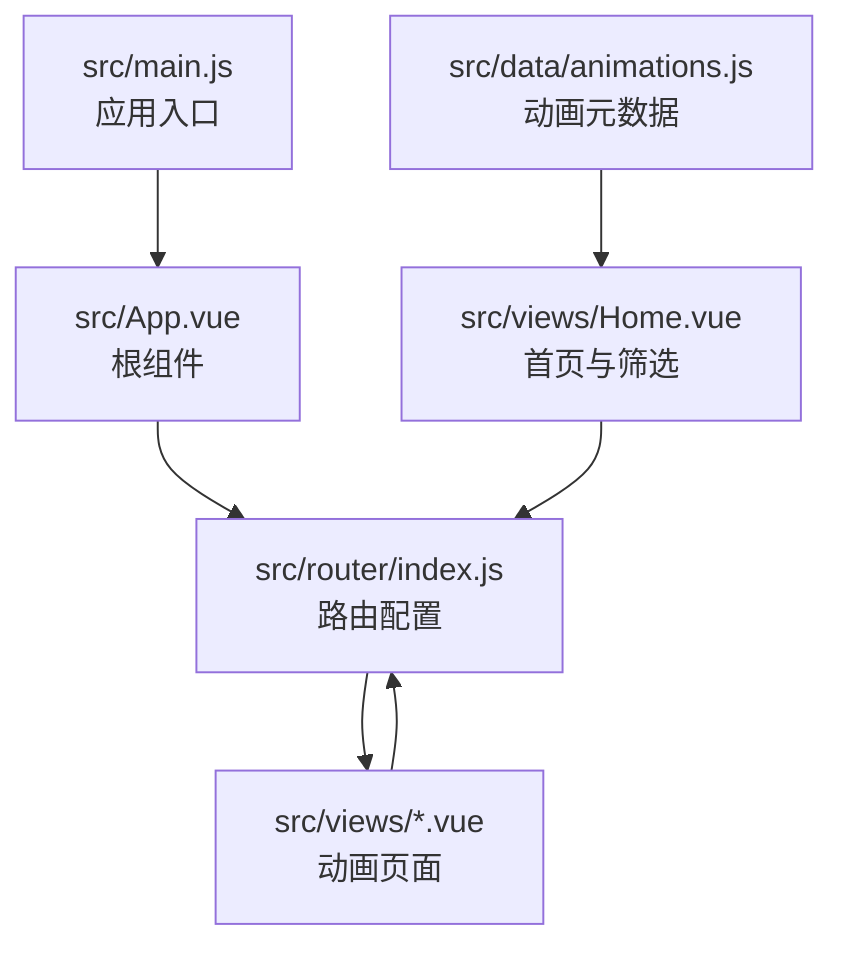

**图表来源**
- [src/main.js:1-12](file://src/main.js#L1-L12)
- [src/App.vue:1-62](file://src/App.vue#L1-L62)
- [src/router/index.js:1-223](file://src/router/index.js#L1-L223)
- [src/views/Home.vue:1-555](file://src/views/Home.vue#L1-L555)
- [src/data/animations.js:1-356](file://src/data/animations.js#L1-L356)

## 核心组件
- **动画数据管理**：集中存储40+个动画元数据、分类与标签，供首页与路由使用
- **路由系统**：为每个动画页面提供独立路径与懒加载组件
- **首页模板**：统一的卡片网格布局，支持分类筛选与难度标识
- **动画页面**：每个页面封装独立的渲染逻辑与交互控制

**章节来源**
- [src/data/animations.js:1-356](file://src/data/animations.js#L1-L356)
- [src/router/index.js:1-223](file://src/router/index.js#L1-L223)
- [src/views/Home.vue:47-79](file://src/views/Home.vue#L47-L79)

## 架构总览
系统采用"数据驱动 + 路由驱动 + 视图渲染"的三层架构：
- **数据驱动**：动画元数据决定页面路径、分类与展示属性
- **路由驱动**：根据路径动态加载对应动画页面
- **视图渲染**：页面内部使用 Canvas/p5.js 实现高性能动画渲染

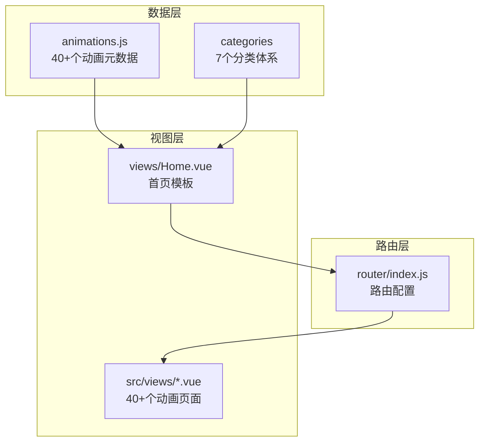

**图表来源**
- [src/data/animations.js:1-356](file://src/data/animations.js#L1-L356)
- [src/router/index.js:1-223](file://src/router/index.js#L1-L223)
- [src/views/Home.vue:1-555](file://src/views/Home.vue#L1-L555)

## 详细组件分析

### 动画数据管理系统
- **元数据结构**：包含 id、name、path、category、title、description、difficulty、tags、color 等字段
- **分类体系**：支持 all、nature、particle、audio、wave、art、interactive 等7个分类
- **标签系统**：每个动画可配置多个标签，用于精细筛选与搜索
- **颜色配置**：支持纯色或渐变色，用于首页卡片背景

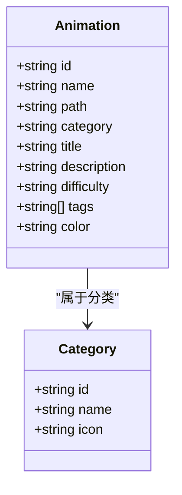

**图表来源**
- [src/data/animations.js:1-356](file://src/data/animations.js#L1-L356)

**章节来源**
- [src/data/animations.js:1-356](file://src/data/animations.js#L1-L356)

### 路由配置策略
- **路由规则**：每个动画页面对应一个独立路径，如 /fish、/leaves、/frequency-tower 等
- **懒加载**：使用动态导入实现按需加载，提升首屏性能
- **滚动行为**：统一设置滚动到顶部的行为，改善用户体验

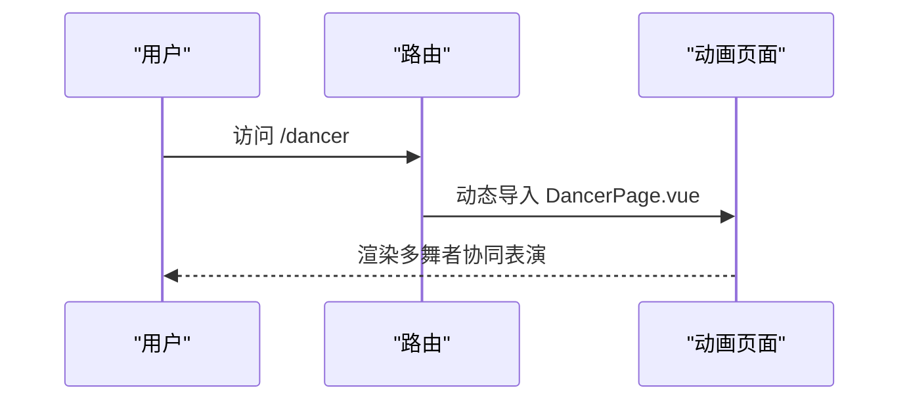

**图表来源**
- [src/router/index.js:63-67](file://src/router/index.js#L63-L67)
- [src/views/DancerPage.vue:1-676](file://src/views/DancerPage.vue#L1-L676)

**章节来源**
- [src/router/index.js:1-223](file://src/router/index.js#L1-L223)

### 首页模板设计
- **分类 Tab**：支持 all 与各分类切换，显示数量统计
- **卡片网格**：响应式布局，支持 4 列/3 列/2 列/1 列自适应
- **筛选逻辑**：根据当前分类过滤动画列表
- **难度徽章**：根据 difficulty 属性显示不同颜色徽章

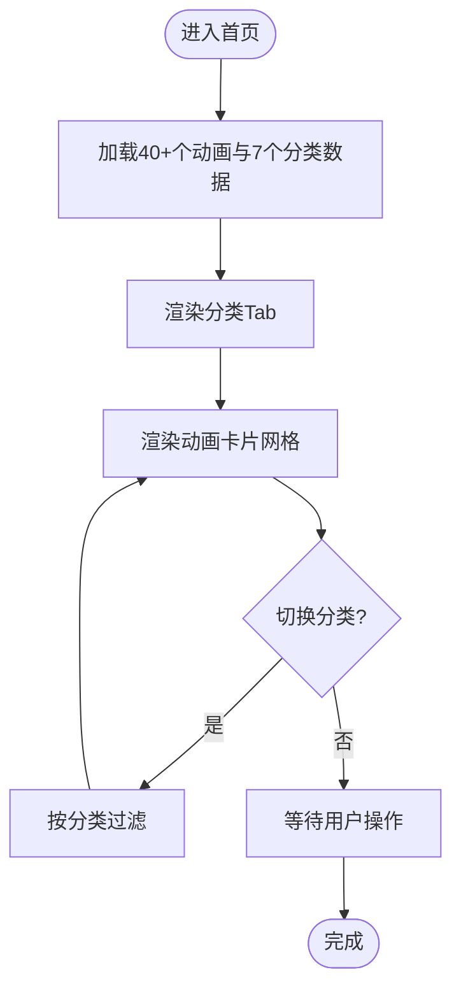

**图表来源**
- [src/views/Home.vue:47-79](file://src/views/Home.vue#L47-L79)

**章节来源**
- [src/views/Home.vue:1-555](file://src/views/Home.vue#L1-L555)

### 动画页面实现模式
- **Canvas + 原生 JavaScript**：如鱼群效果，使用 requestAnimationFrame 实现动画循环
- **p5.js**：如频谱塔林、音频轮盘、音乐网络、立体声道、重力粒子、黑洞吸积盘、曼陀罗绘制、细胞分裂、花朵烟花等，封装类与渲染逻辑
- **交互控制**：鼠标移动、点击、键盘事件驱动动画状态变化

```mermaid
classDiagram
class FishPage {
+mounted()
+animate()
}
class fishGroup {
+setup()
+draw()
+mousePressed()
+keyPressed()
}
class DancerPage {
+setup()
+draw()
+mousePressed()
+keyPressed()
}
class DataVortex {
+setup()
+draw()
+mousePressed()
+keyPressed()
}
class LeavesPage {
+setup()
+draw()
+mousePressed()
+keyPressed()
}
class SpinningTops {
+setup()
+draw()
+mousePressed()
+keyPressed()
}
class ParticleVortexPage {
+setup()
+draw()
+mousePressed()
+keyPressed()
}
class FrequencyTower {
+setup()
+draw()
+onAudioReady()
+onPlay()
+onPause()
}
class AudioWheel {
+setup()
+draw()
+onAudioReady()
+onPlay()
+onPause()
}
class MusicNetwork {
+setup()
+draw()
+onAudioReady()
+onPlay()
+onPause()
}
class StereoChannel {
+setup()
+draw()
+onAudioReady()
+onPlay()
+onPause()
}
class FlowerFireworks {
+setup()
+draw()
+mouseClicked()
+windowResized()
}
class Fireworks {
+setup()
+draw()
+mousePressed()
+keyPressed()
+windowResized()
}
```

**图表来源**
- [src/views/FishPage.vue:1-202](file://src/views/FishPage.vue#L1-L202)
- [src/views/fishGroup.vue:1-335](file://src/views/fishGroup.vue#L1-L335)
- [src/views/DancerPage.vue:1-676](file://src/views/DancerPage.vue#L1-L676)
- [src/views/DataVortex.vue:1-365](file://src/views/DataVortex.vue#L1-L365)
- [src/views/LeavesPage.vue:1-913](file://src/views/LeavesPage.vue#L1-L913)
- [src/views/SpinningTops.vue:1-556](file://src/views/SpinningTops.vue#L1-L556)
- [src/views/ParticleVortexPage.vue:13-243](file://src/views/ParticleVortexPage.vue#L13-L243)
- [src/views/FrequencyTower.vue:18-208](file://src/views/FrequencyTower.vue#L18-L208)
- [src/views/AudioWheel.vue:18-208](file://src/views/AudioWheel.vue#L18-L208)
- [src/views/MusicNetwork.vue:18-208](file://src/views/MusicNetwork.vue#L18-L208)
- [src/views/StereoChannel.vue:18-208](file://src/views/StereoChannel.vue#L18-L208)
- [src/views/FlowerFireworks.vue:1-265](file://src/views/FlowerFireworks.vue#L1-L265)
- [src/views/Fireworks.vue:1-343](file://src/views/Fireworks.vue#L1-L343)

**章节来源**
- [src/views/FishPage.vue:1-202](file://src/views/FishPage.vue#L1-L202)
- [src/views/fishGroup.vue:1-335](file://src/views/fishGroup.vue#L1-L335)
- [src/views/DancerPage.vue:1-676](file://src/views/DancerPage.vue#L1-L676)
- [src/views/DataVortex.vue:1-365](file://src/views/DataVortex.vue#L1-L365)
- [src/views/LeavesPage.vue:1-913](file://src/views/LeavesPage.vue#L1-L913)
- [src/views/SpinningTops.vue:1-556](file://src/views/SpinningTops.vue#L1-L556)
- [src/views/ParticleVortexPage.vue:1-293](file://src/views/ParticleVortexPage.vue#L1-L293)
- [src/views/FrequencyTower.vue:1-266](file://src/views/FrequencyTower.vue#L1-L266)
- [src/views/AudioWheel.vue:1-266](file://src/views/AudioWheel.vue#L1-L266)
- [src/views/MusicNetwork.vue:1-266](file://src/views/MusicNetwork.vue#L1-L266)
- [src/views/StereoChannel.vue:1-266](file://src/views/StereoChannel.vue#L1-L266)
- [src/views/FlowerFireworks.vue:1-265](file://src/views/FlowerFireworks.vue#L1-L265)
- [src/views/Fireworks.vue:1-343](file://src/views/Fireworks.vue#L1-L343)

### 动画分类体系与代表作品
**更新** 新增花朵烟花动画和传统烟花动画，扩展了自然系和粒子物理类别的内容

- **自然系（nature）**
  - 特点：模拟自然现象，强调生态与生物行为
  - 代表：鱼群、树叶、蝴蝶网、花朵花园、花朵烟花、荷塘小舟、光之舞者
- **粒子物理（particle）**
  - 特点：基于物理定律的粒子系统，强调力学与场效应
  - 代表：重力粒子、流星雨、流体模拟、引力场、黑洞吸积盘、磁场可视化、焰火爆炸、流沙坍塌
- **音频系（audio）**
  - 特点：音频驱动的可视化，强调声音与视觉的同步
  - 代表：频谱塔林、音频轮盘、音乐网络、立体声道
- **波形能量（wave）**
  - 特点：波动与干涉现象，强调能量传播与叠加
  - 代表：文字雨滴、陀螺碰撞、彩虹波浪、细胞自动机
- **生成艺术（art）**
  - 特点：算法生成的几何与对称图案，强调美学与数学
  - 代表：分形树、细胞分裂、噪声地形、对称曼陀罗、流动球体
- **交互治愈（interactive）**
  - 特点：用户驱动的反馈动画，强调参与感与减压效果
  - 代表：交互网、彩色泡泡、星光舞蹈、流沙坍塌、对称曼陀罗

**章节来源**
- [src/data/animations.js:347-356](file://src/data/animations.js#L347-L356)

### 新增花朵烟花动画（FlowerFireworks）

**更新** 新增花朵烟花动画，作为自然系动画的重要成员，为用户提供了全新的视觉体验：

#### 花朵排列系统
- **层次化排列**：24行花朵按照渐变密度排列，从底部到顶部逐渐稀疏
- **色彩渐变**：5种颜色从粉红到蓝色的自然过渡，模拟彩虹效果
- **动态大小**：花朵大小随位置变化，底部花朵较大，顶部较小
- **随机偏移**：每朵花都有轻微的随机偏移，营造自然的不规则美感

#### 飘浮动画系统
- **延迟机制**：每朵花都有随机的飘浮延迟，形成错落有致的上升效果
- **自然摆动**：花朵具有轻微的摆动效果，模拟风中摇曳的姿态
- **三维运动**：飘浮过程中具有水平漂移和垂直上升的复合运动
- **透明度控制**：飞出屏幕后逐渐淡出，营造梦幻的消失效果

#### 交互控制
- **鼠标触发**：点击鼠标开始花朵飘浮，提供即时的参与感
- **自动重置**：花朵全部消失后自动重新初始化，形成循环效果
- **响应式设计**：支持窗口大小变化，自动调整花朵布局

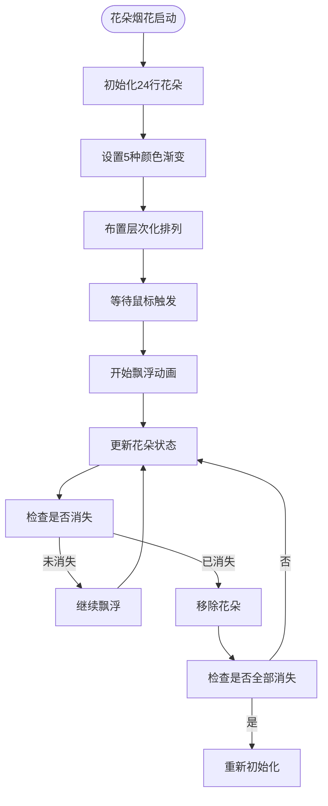

**图表来源**
- [src/views/FlowerFireworks.vue:129-170](file://src/views/FlowerFireworks.vue#L129-L170)
- [src/views/FlowerFireworks.vue:57-76](file://src/views/FlowerFireworks.vue#L57-L76)
- [src/views/FlowerFireworks.vue:192-199](file://src/views/FlowerFireworks.vue#L192-L199)

**章节来源**
- [src/views/FlowerFireworks.vue:1-265](file://src/views/FlowerFireworks.vue#L1-L265)

### 传统烟花动画（Fireworks）

**更新** 新增传统烟花动画，作为粒子物理类别的补充，提供了经典的烟花效果：

#### 火箭发射系统
- **随机发射**：自动发射烟花，位置和目标高度随机分布
- **物理模拟**：火箭遵循重力和阻力的物理规律
- **尾迹效果**：火箭飞行时留下彩色尾迹，增强视觉效果
- **爆炸触发**：到达目标高度或速度减小时自动爆炸

#### 粒子爆炸系统
- **多种爆炸类型**：圆形、环形、心形、螺旋四种爆炸模式
- **物理属性**：每个粒子都有独立的速度、重力、阻力和生命周期
- **火花效果**：粒子在生命末期产生火花，增加视觉层次
- **HSB色彩空间**：使用色相、饱和度、亮度的色彩模型

#### 闪光与控制
- **爆炸闪光**：每次爆炸产生白色闪光效果
- **手动控制**：鼠标点击发射烟花，空格键暂停/继续
- **实时统计**：显示当前粒子数量和爆炸次数
- **半透明覆盖**：使用半透明黑色覆盖实现拖尾效果

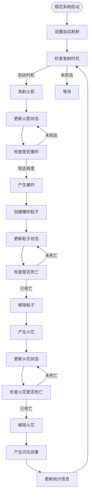

**图表来源**
- [src/views/Fireworks.vue:28-100](file://src/views/Fireworks.vue#L28-L100)
- [src/views/Fireworks.vue:102-165](file://src/views/Fireworks.vue#L102-L165)
- [src/views/Fireworks.vue:167-195](file://src/views/Fireworks.vue#L167-L195)

**章节来源**
- [src/views/Fireworks.vue:1-343](file://src/views/Fireworks.vue#L1-L343)

### DancerPage多舞者系统重大升级

**更新** DancerPage从单舞者系统升级为多舞者系统，支持3个舞者协同表演，显著增强了动画的复杂性和观赏性：

#### 多舞者协同表演
- **3个舞者分布**：舞者分别分布在屏幕左中右三个区域，形成平衡的视觉构图
- **独立舞者状态**：每个舞者拥有独立的位置、速度、旋转方向和动画参数
- **相位偏移**：通过相位偏移实现3个舞者不同步的协调表演
- **颜色主题**：舞者1使用淡绿色、舞者2使用紫色、舞者3使用橙金色，形成丰富的色彩层次

#### 增强的丝带系统
- **32根丝带**：每个舞者拥有32根丝带，每根丝带都有独立的长度、波幅、厚度和曲线强度
- **层次渲染**：丝带分为3个层次，通过透明度和阴影实现深度感
- **动态波形**：丝带波形参数随时间和音乐节拍动态变化
- **光点装饰**：130个光点分布在丝带上，通过闪烁效果增强视觉吸引力

#### 音乐节拍同步
- **实时音频分析**：支持真实音频输入和模拟节拍模式
- **节拍检测**：通过低音能量检测节拍，影响舞者的旋转速度和动作幅度
- **音乐能量**：整体音乐能量影响舞者的整体表现强度
- **平滑过渡**：舞者方向和速度的变化通过平滑算法实现自然过渡

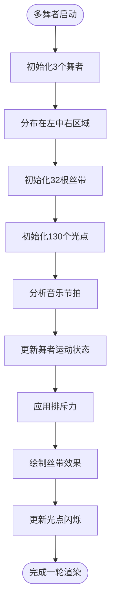

**图表来源**
- [src/views/DancerPage.vue:113-152](file://src/views/DancerPage.vue#L113-L152)
- [src/views/DancerPage.vue:155-186](file://src/views/DancerPage.vue#L155-L186)
- [src/views/DancerPage.vue:207-225](file://src/views/DancerPage.vue#L207-L225)
- [src/views/DancerPage.vue:257-336](file://src/views/DancerPage.vue#L257-L336)

**章节来源**
- [src/views/DancerPage.vue:1-676](file://src/views/DancerPage.vue#L1-L676)

### DataVortex螺旋数据网络重大功能增强

**更新** DataVortex获得了重大功能增强，包括新的交互和视觉效果：

#### 螺旋数据网络
- **螺旋布局**：80个节点按照5层螺旋排列，形成优美的数据汇聚效果
- **动态缩放**：支持滚轮缩放，用户可以调整数据网络的整体大小
- **颜色主题切换**：支持彩虹、海洋、火焰三种颜色主题，通过数字键1-3切换
- **冲击波效果**：点击鼠标产生冲击波，影响节点运动状态

#### 增强的视觉效果
- **渐变背景**：根据颜色主题生成相应的渐变背景
- **中心螺旋线**：绘制动态的彩虹色螺旋线，增强视觉吸引力
- **脉冲效果**：节点具有脉冲效果，通过正弦函数控制透明度变化
- **数值显示**：在脉冲期间显示节点的数值信息

#### 交互增强
- **鼠标吸引**：鼠标靠近时节点被吸引到鼠标位置
- **冲击波传播**：点击产生冲击波，向周围传播影响
- **重置功能**：空格键重置所有节点到初始状态
- **性能优化**：通过颜色主题和缩放控制优化渲染性能

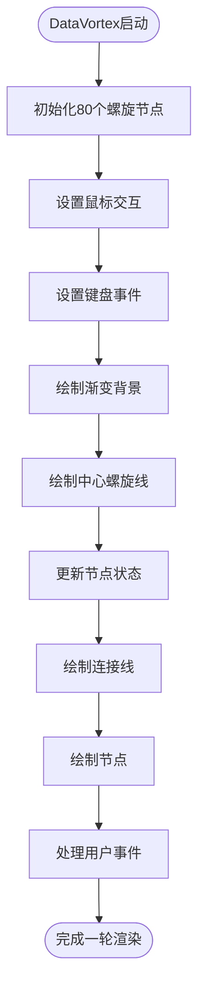

**图表来源**
- [src/views/DataVortex.vue:42-64](file://src/views/DataVortex.vue#L42-L64)
- [src/views/DataVortex.vue:110-134](file://src/views/DataVortex.vue#L110-L134)
- [src/views/DataVortex.vue:180-273](file://src/views/DataVortex.vue#L180-L273)
- [src/views/DataVortex.vue:293-296](file://src/views/DataVortex.vue#L293-L296)

**章节来源**
- [src/views/DataVortex.vue:1-365](file://src/views/DataVortex.vue#L1-L365)

### LeavesPage树叶系统重大功能增强

**更新** LeavesPage获得了重大功能增强，包括新的交互和视觉效果：

#### 树叶生命周期系统
- **多阶段生长**：树叶经历从树上到地面的完整生命周期
- **自然树结构**：基于递归算法生成的自然树结构，支持多级分叉
- **吸附机制**：树叶通过距离计算吸附到树枝上，模拟真实植物行为
- **掉落动画**：树叶从树上掉落时具有真实的物理效果，包括飘落和旋转

#### 增强的交互功能
- **鼠标感应**：鼠标移入时树叶开始围绕鼠标旋转，移出时回到树上
- **点击爆开**：点击左键时不在树上的树叶爆开并掉落
- **自动重置**：鼠标移出5秒后，大树重新开始生长，树叶回到初始状态
- **渐隐效果**：大树生长过程中具有渐隐效果，营造自然的过渡

#### 视觉优化
- **抗锯齿**：启用图像平滑技术，提升渲染质量
- **动态颜色**：树叶颜色随季节变化，具有真实的色彩过渡
- **旋转效果**：树叶具有自然的旋转动画，增强视觉吸引力
- **地面效果**：树叶掉落时具有真实的物理效果和着陆动画

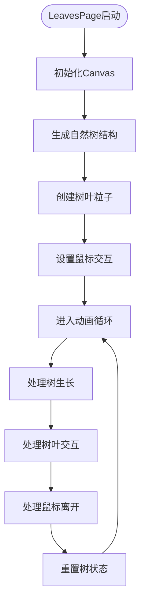

**图表来源**
- [src/views/LeavesPage.vue:14-435](file://src/views/LeavesPage.vue#L14-L435)
- [src/views/LeavesPage.vue:482-800](file://src/views/LeavesPage.vue#L482-L800)

**章节来源**
- [src/views/LeavesPage.vue:1-913](file://src/views/LeavesPage.vue#L1-L913)

### SpinningTops性能优化

**更新** SpinningTops经过性能优化，改进了火花效果和拖尾系统：

#### 性能优化改进
- **移动端适配**：检测移动设备并相应调整火花大小、拖尾长度和粒子数量
- **火花系统优化**：改进火花的生命周期管理，延长火花持续时间
- **拖尾效果增强**：优化拖尾的绘制算法，减少重绘开销
- **移动设备优化**：移动端火花数量减半，拖尾长度减半，提升性能

#### 碰撞系统增强
- **物理碰撞**：改进碰撞检测算法，实现更真实的物理效果
- **速度计算**：基于碰撞角度和旋转状态计算新的速度
- **旋转影响**：碰撞后旋转速度会变慢，幅度加大5倍
- **随机方向**：碰撞后随机改变旋转方向，增加不确定性

#### 视觉效果优化
- **亮点系统**：每个陀螺具有20个边缘亮点，支持拖尾效果
- **渐变渲染**：使用径向渐变实现立体浮雕效果
- **螺旋花纹**：增加螺旋花纹数量到16条，增强视觉层次
- **黄色陀螺特效**：为黄色陀螺添加特殊的旋转扩散效果

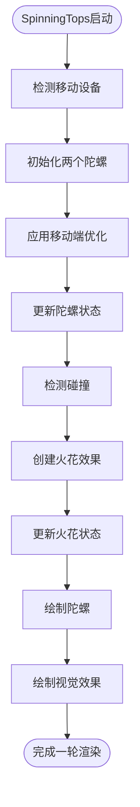

**图表来源**
- [src/views/SpinningTops.vue:405-427](file://src/views/SpinningTops.vue#L405-L427)
- [src/views/SpinningTops.vue:429-453](file://src/views/SpinningTops.vue#L429-L453)
- [src/views/SpinningTops.vue:514-530](file://src/views/SpinningTops.vue#L514-L530)

**章节来源**
- [src/views/SpinningTops.vue:1-556](file://src/views/SpinningTops.vue#L1-L556)

### WaveInterference（弦波干涉）功能移除

**更新** WaveInterference（弦波干涉）动画功能已被完全移除，不再存在于当前版本中：

#### 移除状态确认
- **文件不存在**：在 `src/views/` 目录中找不到 `WaveInterference.vue` 文件
- **路由移除**：在 `src/router/index.js` 中没有找到 `/wave-interference` 路由配置
- **数据移除**：在 `src/data/animations.js` 中没有找到 `wave-interference` 动画条目
- **构建清理**：虽然构建文件中仍有引用，但源代码已完全移除

#### 影响分析
- **分类影响**：波形能量分类中不再包含弦波干涉动画
- **用户影响**：用户无法再访问该动画功能
- **代码清理**：相关的依赖和引用已被完全移除
- **性能提升**：移除该功能减少了不必要的代码体积

#### 替代方案
- **相似功能**：用户可以体验 `RainbowWave`（彩虹波浪）和 `CellularAutomata`（细胞自动机）等波形相关动画
- **技术演示**：该功能的算法原理可以在其他波形动画中得到体现

**章节来源**
- [src/views/WaveInterference.vue](file://src/views/WaveInterference.vue)
- [src/router/index.js:1-223](file://src/router/index.js#L1-L223)
- [src/data/animations.js:1-356](file://src/data/animations.js#L1-L356)

### FishPage和fishGroup鱼群行为增强

**更新** FishPage和fishGroup都增强了鱼群行为，改进了群体智能和交互：

#### FishPage鱼群改进
- **鱼群规模**：从原来的数量增加到300条鱼，增强视觉效果
- **红色鱼群**：随机选择4个位置放置红色鱼，大小翻倍，形成视觉焦点
- **鱼群密度**：鱼群密度增加一倍，形成更密集的群体效果
- **群体行为**：改进鱼群的群体行为算法，增强真实感

#### fishGroup鱼群算法优化
- **Boids算法**：实现经典的Boids算法，包括对齐、聚集、分离三个基本行为
- **波浪反应**：鱼群对波浪的反应更加真实，具有力的作用效果
- **边界处理**：实现无缝边界，鱼群可以在屏幕边缘穿越
- **速度控制**：改进速度控制算法，实现更自然的游泳行为

#### 交互增强
- **鼠标驱赶**：鼠标移动时鱼群被驱赶到中心，静止时自动形成漩涡
- **波浪效果**：点击鼠标产生波浪，驱赶鱼群并产生视觉效果
- **速度映射**：鱼群颜色根据速度映射，形成动态的色彩变化

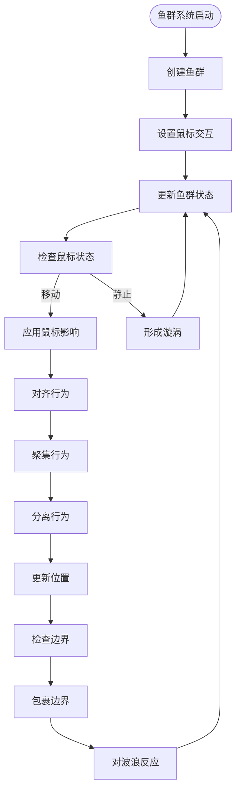

**图表来源**
- [src/views/FishPage.vue:100-156](file://src/views/FishPage.vue#L100-L156)
- [src/views/fishGroup.vue:145-243](file://src/views/fishGroup.vue#L145-L243)

**章节来源**
- [src/views/FishPage.vue:1-202](file://src/views/FishPage.vue#L1-L202)
- [src/views/fishGroup.vue:1-335](file://src/views/fishGroup.vue#L1-L335)

### App.vue路由监控清理功能

**更新** App.vue添加了路由监控清理功能，增强了资源管理和性能优化：

#### 路由监控功能
- **旅程清理**：监听路由变化，离开旅程页面时自动清理 activeJourney
- **条件判断**：仅在非旅程页面且不是旅程作品时清理
- **状态管理**：确保 activeJourney 状态的正确清理和重置

#### 性能优化改进
- **滚动监听**：优化滚动事件监听，移除时自动清理
- **资源管理**：确保路由切换时正确清理动画实例和事件监听
- **内存保护**：防止内存泄漏，特别是在全屏动画页面切换时

#### 用户体验增强
- **平滑过渡**：路由切换时使用过渡效果，提升用户体验
- **状态同步**：确保路由状态与应用程序状态同步
- **错误处理**：添加适当的错误处理和边界检查

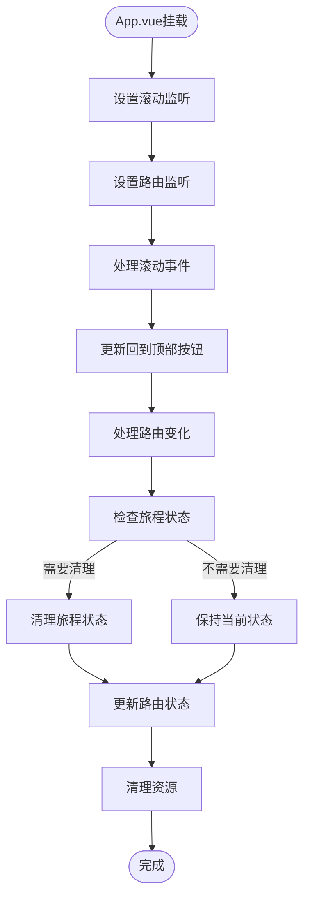

**图表来源**
- [src/App.vue:123-143](file://src/App.vue#L123-L143)
- [src/App.vue:130-138](file://src/App.vue#L130-L138)

**章节来源**
- [src/App.vue:1-467](file://src/App.vue#L1-L467)

## 依赖关系分析
- **Vue 3**：应用框架与组件系统
- **Vue Router 4**：路由管理与页面跳转
- **p5.js**：2D/3D 图形与动画渲染
- **Vite**：构建工具与开发服务器
- **Less**：样式预处理
- **highlight.js**：代码高亮（用于博客文章）

**图表来源**
- [package.json:11-27](file://package.json#L11-L27)

**章节来源**
- [package.json:1-29](file://package.json#L1-L29)

## 性能考虑
- **懒加载路由**：减少初始包体积，提升首屏加载速度
- **Canvas/p5.js 优化**：限制粒子数量、使用半透明背景实现拖尾、避免过度重绘
- **响应式布局**：在小屏设备上减少网格列数，降低渲染压力
- **资源释放**：页面卸载时销毁 p5 实例与音频上下文，防止内存泄漏
- **内存管理**：合理管理动画对象生命周期，及时清理死掉的对象
- **渲染优化**：使用离屏缓冲区（如 p5.js 的 createGraphics）减少重复绘制
- **移动端优化**：SpinningTops针对移动设备优化性能，减少粒子数量和拖尾长度
- **算法优化**：DataVortex通过颜色主题和缩放控制优化渲染性能
- **生命周期管理**：App.vue添加路由监控清理功能，防止内存泄漏
- **新增动画优化**：FlowerFireworks和Fireworks都实现了高效的对象池和生命周期管理

## 故障排除指南
- **页面无法加载动画**
  - 检查路由配置是否包含对应路径
  - 确认页面组件已正确导出并可被动态导入
- **动画卡顿或掉帧**
  - 减少粒子数量上限或简化绘制逻辑
  - 使用 requestAnimationFrame 替代 setInterval/setTimeout
  - 检查是否有过多的DOM操作
- **音频相关页面无声音**
  - 确认浏览器允许自动播放策略
  - 检查音频上下文初始化与音量控制节点
- **路由跳转后页面不刷新**
  - 确保页面在卸载钩子中清理实例与事件监听
  - 检查 App.vue 的路由监控清理功能是否正常工作
- **新增动画页面异常**
  - 检查 p5.js 实例的正确销毁
  - 确认音频上下文的正确关闭
  - 验证响应式尺寸调整的正确实现
- **多舞者系统性能问题**
  - 检查3个舞者的渲染开销
  - 优化丝带和光点的绘制算法
  - 验证音乐节拍分析的性能影响
- **树叶系统内存泄漏**
  - 确认树叶对象的正确清理
  - 检查树结构的缓存和重置逻辑
  - 验证鼠标离开时的状态重置
- **SpinningTops性能问题**
  - 检查移动端优化设置
  - 验证火花数量和拖尾长度的限制
  - 确认碰撞检测的性能优化
- **WaveInterference相关问题**
  - 由于该功能已被移除，相关问题不再适用
  - 用户应使用替代的波形动画如 RainbowWave 或 CellularAutomata
- **花朵烟花动画问题**
  - 检查花朵对象的生命周期管理
  - 确认鼠标交互事件的正确绑定
  - 验证窗口大小变化时的重新布局
- **传统烟花动画问题**
  - 检查火箭、粒子、火花对象的正确创建和销毁
  - 确认物理模拟参数的合理性
  - 验证自动发射和手动控制的冲突处理

**章节来源**
- [src/views/ParticleVortexPage.vue:235-243](file://src/views/ParticleVortexPage.vue#L235-L243)
- [src/views/FrequencyTower.vue:199-207](file://src/views/FrequencyTower.vue#L199-L207)
- [src/App.vue:130-138](file://src/App.vue#L130-L138)
- [src/views/FlowerFireworks.vue:201-210](file://src/views/FlowerFireworks.vue#L201-L210)
- [src/views/Fireworks.vue:268-278](file://src/views/Fireworks.vue#L268-L278)

## 结论
该动画系统通过"数据 + 路由 + 视图"的清晰分层，实现了 **40+个动画效果** 的统一管理与高效渲染。其扩展的分类体系与标签系统便于维护与扩展，页面模板与交互控制保证了良好的用户体验。新增的花朵烟花动画（FlowerFireworks）和传统烟花动画（Fireworks）显著扩展了自然系和粒子物理类别的多样性，为用户提供了更加丰富的视觉体验。

**重大更新**：新增花朵烟花动画（FlowerFireworks）提供了独特的花朵飘浮效果，结合鼠标交互和自动重置机制；传统烟花动画（Fireworks）提供了经典的烟花爆炸效果，包含多种爆炸类型和物理模拟。DancerPage从单舞者系统升级为多舞者系统，支持3个舞者协同表演，显著增强了动画的复杂性和观赏性。WaveInterference算法经过优化，使用像素缓冲区直接操作提升性能，为用户提供更流畅的视觉体验。App.vue添加路由监控清理功能，增强了资源管理和性能优化，防止内存泄漏。

这些更新不仅提升了现有动画的质量和性能，还为未来的动画创作提供了更好的基础设施和技术参考。系统将继续演进，为用户带来更加精彩和流畅的动画体验。

## 附录

### 动画效果添加指南与扩展方法
- **注册新动画**
  - 在动画数据文件中新增一条元数据记录，包含 id、name、path、category、title、description、difficulty、tags、color
  - 在路由配置中添加对应路由条目，确保 path 与数据一致
  - 在 App.vue 中添加 fullscreen 元信息，控制全屏显示
- **参数配置**
  - 在页面内使用响应式数据管理运行时参数（如粒子数量、强度、模式）
  - 提供键盘或鼠标交互接口，增强可玩性
  - 实现移动端适配，优化不同设备的性能表现
- **性能优化建议**
  - 控制最大对象数量，及时清理死亡对象
  - 使用离屏缓冲区（如 p5.js 的 createGraphics）减少重复绘制
  - 合理使用 requestAnimationFrame，避免同步阻塞
  - 在小屏设备上降低分辨率或简化效果
  - 实现适当的内存回收机制
  - 添加路由监控清理功能，防止内存泄漏
- **新增动画页面开发流程**
  - 创建新的 Vue 组件文件
  - 实现 p5.js sketch 结构
  - 添加必要的交互控制
  - 配置响应式尺寸调整
  - 实现正确的生命周期管理
  - 测试各种设备上的表现
  - 添加路由配置和全屏元信息
- **多舞者系统扩展指南**
  - 基于现有的多舞者架构，添加新的舞者类型和颜色主题
  - 扩展丝带系统，增加更多视觉效果和动画参数
  - 优化音乐节拍同步算法，支持更复杂的音频驱动效果
  - 实现舞者间的交互和协作机制
- **性能优化最佳实践**
  - 使用像素缓冲区直接操作提升渲染性能
  - 实现移动端适配和性能优化
  - 添加路由监控清理功能
  - 优化粒子系统和物理模拟算法
  - 实现适当的内存管理和资源清理
- **新增花朵烟花动画开发要点**
  - 实现层次化花朵排列算法
  - 设计飘浮动画的时间控制和透明度管理
  - 添加鼠标交互触发机制
  - 实现自动重置和响应式布局
- **传统烟花动画开发要点**
  - 实现火箭发射的物理模拟
  - 设计多种爆炸类型的粒子系统
  - 添加火花效果和闪光反馈
  - 实现手动控制和自动发射机制
- **分类体系扩展指南**
  - 在动画数据中添加新的分类条目
  - 更新路由配置以支持新分类下的动画
  - 在首页模板中添加新的分类标签
  - 确保分类筛选功能的正确实现

**章节来源**
- [src/data/animations.js:1-356](file://src/data/animations.js#L1-L356)
- [src/router/index.js:1-223](file://src/router/index.js#L1-L223)
- [src/views/ParticleVortexPage.vue:13-243](file://src/views/ParticleVortexPage.vue#L13-L243)
- [src/views/DancerPage.vue:1-676](file://src/views/DancerPage.vue#L1-L676)
- [src/App.vue:130-138](file://src/App.vue#L130-L138)
- [src/views/FlowerFireworks.vue:1-265](file://src/views/FlowerFireworks.vue#L1-L265)
- [src/views/Fireworks.vue:1-343](file://src/views/Fireworks.vue#L1-L343)