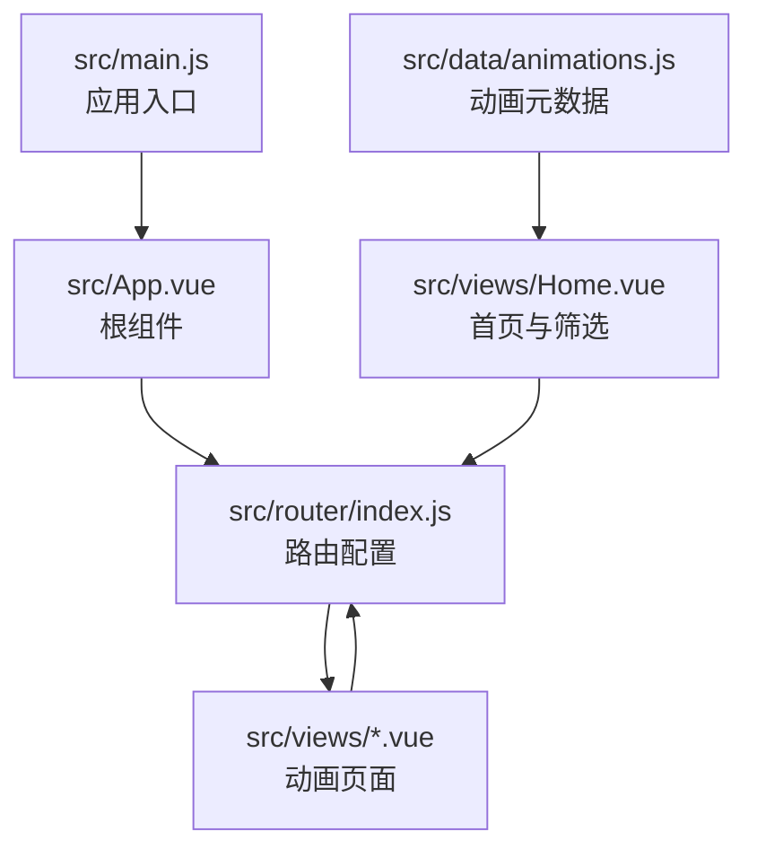
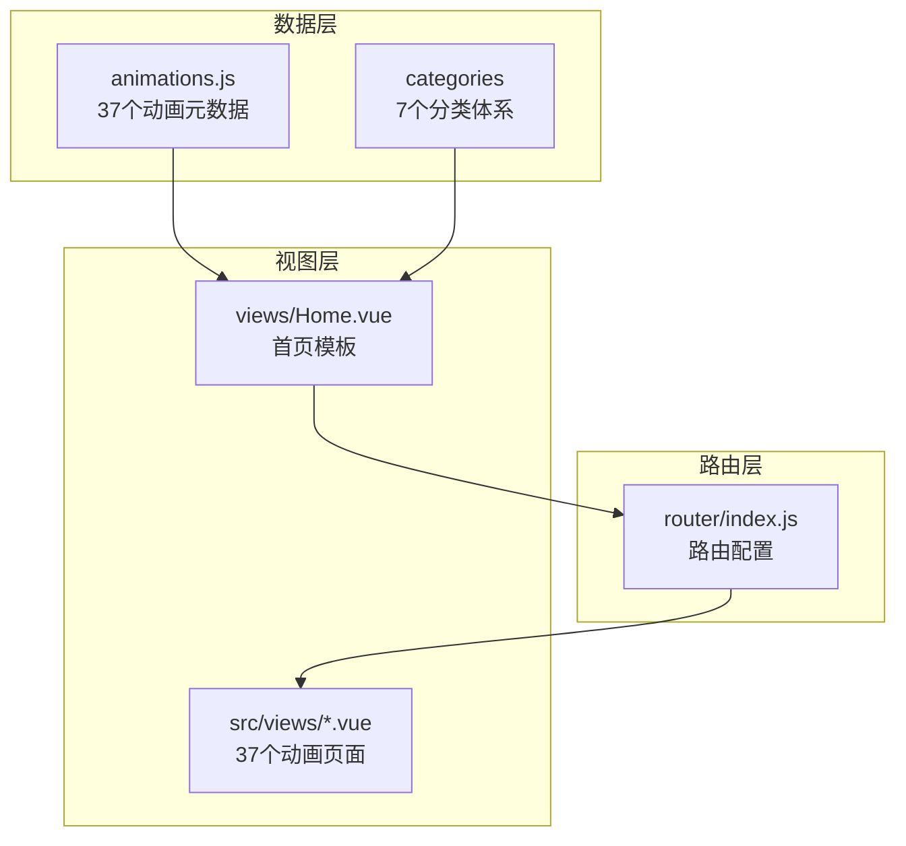
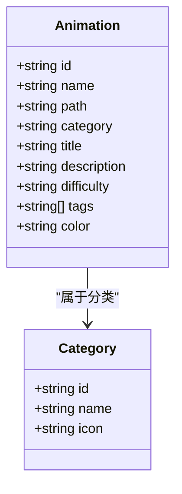
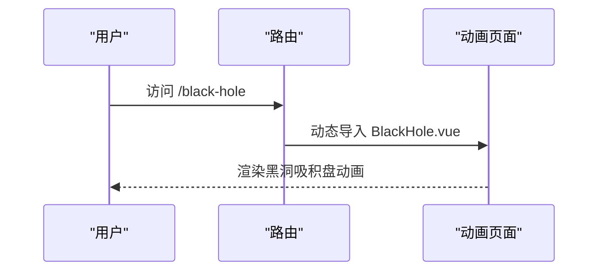
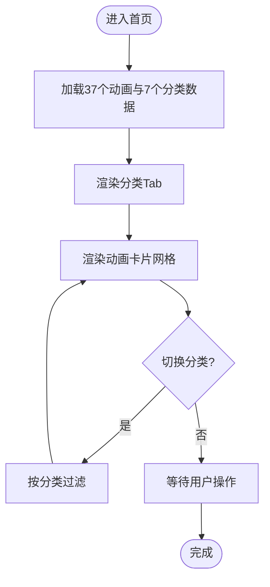
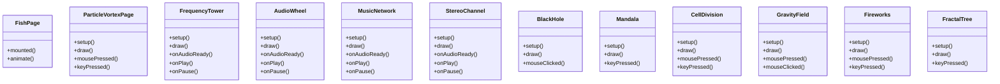
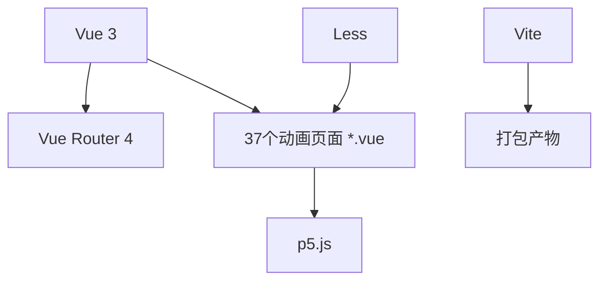

# 动画系统

<cite>
**本文档引用的文件**
- [src/data/animations.js](file://src/data/animations.js)
- [src/router/index.js](file://src/router/index.js)
- [src/main.js](file://src/main.js)
- [src/views/Home.vue](file://src/views/Home.vue)
- [src/views/FishPage.vue](file://src/views/FishPage.vue)
- [src/views/FrequencyTower.vue](file://src/views/FrequencyTower.vue)
- [src/views/AudioWheel.vue](file://src/views/AudioWheel.vue)
- [src/views/MusicNetwork.vue](file://src/views/MusicNetwork.vue)
- [src/views/StereoChannel.vue](file://src/views/StereoChannel.vue)
- [src/views/ParticleVortexPage.vue](file://src/views/ParticleVortexPage.vue)
- [src/views/BlackHole.vue](file://src/views/BlackHole.vue)
- [src/views/Mandala.vue](file://src/views/Mandala.vue)
- [src/views/CellDivision.vue](file://src/views/CellDivision.vue)
- [src/views/GravityField.vue](file://src/views/GravityField.vue)
- [src/views/Fireworks.vue](file://src/views/Fireworks.vue)
- [src/views/FractalTree.vue](file://src/views/FractalTree.vue)
- [src/App.vue](file://src/App.vue)
- [package.json](file://package.json)
</cite>

## 更新摘要
**变更内容**
- 动画库从原有约15个动画扩展为包含37个动画的完整系统
- 移除了音频可视化功能条目，该功能已被完全移除
- 新增7个分类类别，扩展了动画系统的覆盖面
- 更新了动画分类体系与代表作品
- 完善了新增动画页面的技术实现细节
- 扩展了性能优化和交互控制指南

## 目录
1. [简介](#简介)
2. [项目结构](#项目结构)
3. [核心组件](#核心组件)
4. [架构总览](#架构总览)
5. [详细组件分析](#详细组件分析)
6. [依赖关系分析](#依赖关系分析)
7. [性能考虑](#性能考虑)
8. [故障排除指南](#故障排除指南)
9. [结论](#结论)
10. [附录](#附录)

## 简介
本项目是一个基于 Vue 3 + Vite 的个人博客，其中包含 **37个创意动画效果**，涵盖了自然系、粒子物理、音频系、波形能量、生成艺术、交互治愈等多个领域。系统采用统一的数据驱动架构，通过集中管理的动画元数据、分类体系与标签系统，配合路由与页面模板，实现了高度模块化与可扩展的动画展示平台。

## 项目结构
项目采用"数据 + 路由 + 视图"的清晰分层：
- 数据层：集中定义所有动画元数据、分类与标签
- 路由层：为每个动画页面配置独立路由
- 视图层：每个动画页面独立实现，使用 p5.js 或 Canvas API 实现渲染
- 应用层：全局导航、背景与返回顶部组件

**图表来源**
- [src/main.js:1-12](file://src/main.js#L1-L12)
- [src/App.vue:1-62](file://src/App.vue#L1-L62)
- [src/router/index.js:1-239](file://src/router/index.js#L1-L239)
- [src/views/Home.vue:1-45](file://src/views/Home.vue#L1-L45)
- [src/data/animations.js:1-389](file://src/data/animations.js#L1-L389)

## 核心组件
- **动画数据管理**：集中存储37个动画元数据、分类与标签，供首页与路由使用
- **路由系统**：为每个动画页面提供独立路径与懒加载组件
- **首页模板**：统一的卡片网格布局，支持分类筛选与难度标识
- **动画页面**：每个页面封装独立的渲染逻辑与交互控制

**章节来源**
- [src/data/animations.js:1-389](file://src/data/animations.js#L1-L389)
- [src/router/index.js:1-239](file://src/router/index.js#L1-L239)
- [src/views/Home.vue:47-79](file://src/views/Home.vue#L47-L79)

## 架构总览
系统采用"数据驱动 + 路由驱动 + 视图渲染"的三层架构：
- **数据驱动**：动画元数据决定页面路径、分类与展示属性
- **路由驱动**：根据路径动态加载对应动画页面
- **视图渲染**：页面内部使用 Canvas/p5.js 实现高性能动画渲染

**图表来源**
- [src/data/animations.js:1-389](file://src/data/animations.js#L1-L389)
- [src/router/index.js:1-239](file://src/router/index.js#L1-L239)
- [src/views/Home.vue:1-45](file://src/views/Home.vue#L1-L45)

## 详细组件分析

### 动画数据管理系统
- **元数据结构**：包含 id、name、path、category、title、description、difficulty、tags、color 等字段
- **分类体系**：支持 all、nature、particle、audio、wave、art、interactive 等7个分类
- **标签系统**：每个动画可配置多个标签，用于精细筛选与搜索
- **颜色配置**：支持纯色或渐变色，用于首页卡片背景

**图表来源**
- [src/data/animations.js:1-389](file://src/data/animations.js#L1-L389)

**章节来源**
- [src/data/animations.js:1-389](file://src/data/animations.js#L1-L389)

### 路由配置策略
- **路由规则**：每个动画页面对应一个独立路径，如 /fish、/leaves、/frequency-tower 等
- **懒加载**：使用动态导入实现按需加载，提升首屏性能
- **滚动行为**：统一设置滚动到顶部的行为，改善用户体验

**图表来源**
- [src/router/index.js:135-139](file://src/router/index.js#L135-L139)
- [src/views/BlackHole.vue:1-310](file://src/views/BlackHole.vue#L1-L310)

**章节来源**
- [src/router/index.js:1-239](file://src/router/index.js#L1-L239)

### 首页模板设计
- **分类 Tab**：支持 all 与各分类切换，显示数量统计
- **卡片网格**：响应式布局，支持 4 列/3 列/2 列/1 列自适应
- **筛选逻辑**：根据当前分类过滤动画列表
- **难度徽章**：根据 difficulty 属性显示不同颜色徽章

**图表来源**
- [src/views/Home.vue:47-79](file://src/views/Home.vue#L47-L79)

**章节来源**
- [src/views/Home.vue:1-349](file://src/views/Home.vue#L1-L349)

### 动画页面实现模式
- **Canvas + 原生 JavaScript**：如鱼群效果，使用 requestAnimationFrame 实现动画循环
- **p5.js**：如频谱塔林、音频轮盘、音乐网络、立体声道、重力粒子、黑洞吸积盘、曼陀罗绘制、细胞分裂等，封装类与渲染逻辑
- **交互控制**：鼠标移动、点击、键盘事件驱动动画状态变化

**图表来源**
- [src/views/FishPage.vue:7-144](file://src/views/FishPage.vue#L7-L144)
- [src/views/ParticleVortexPage.vue:13-243](file://src/views/ParticleVortexPage.vue#L13-L243)
- [src/views/FrequencyTower.vue:18-208](file://src/views/FrequencyTower.vue#L18-L208)
- [src/views/AudioWheel.vue:18-208](file://src/views/AudioWheel.vue#L18-L208)
- [src/views/MusicNetwork.vue:18-208](file://src/views/MusicNetwork.vue#L18-L208)
- [src/views/StereoChannel.vue:18-208](file://src/views/StereoChannel.vue#L18-L208)
- [src/views/BlackHole.vue:14-260](file://src/views/BlackHole.vue#L14-L260)
- [src/views/Mandala.vue:13-213](file://src/views/Mandala.vue#L13-L213)
- [src/views/CellDivision.vue:13-213](file://src/views/CellDivision.vue#L13-L213)
- [src/views/GravityField.vue:14-264](file://src/views/GravityField.vue#L14-L264)
- [src/views/Fireworks.vue:14-339](file://src/views/Fireworks.vue#L14-L339)
- [src/views/FractalTree.vue:14-295](file://src/views/FractalTree.vue#L14-L295)

**章节来源**
- [src/views/FishPage.vue:1-168](file://src/views/FishPage.vue#L1-L168)
- [src/views/ParticleVortexPage.vue:1-293](file://src/views/ParticleVortexPage.vue#L1-L293)
- [src/views/FrequencyTower.vue:1-266](file://src/views/FrequencyTower.vue#L1-L266)
- [src/views/AudioWheel.vue:1-266](file://src/views/AudioWheel.vue#L1-L266)
- [src/views/MusicNetwork.vue:1-266](file://src/views/MusicNetwork.vue#L1-L266)
- [src/views/StereoChannel.vue:1-266](file://src/views/StereoChannel.vue#L1-L266)
- [src/views/BlackHole.vue:1-310](file://src/views/BlackHole.vue#L1-L310)
- [src/views/Mandala.vue:1-261](file://src/views/Mandala.vue#L1-L261)
- [src/views/CellDivision.vue:1-261](file://src/views/CellDivision.vue#L1-L261)
- [src/views/GravityField.vue:1-264](file://src/views/GravityField.vue#L1-L264)
- [src/views/Fireworks.vue:1-339](file://src/views/Fireworks.vue#L1-L339)
- [src/views/FractalTree.vue:1-295](file://src/views/FractalTree.vue#L1-L295)

### 动画分类体系与代表作品
**更新** 新增7个分类类别，扩展了动画系统的覆盖面，并移除了音频可视化功能条目

- **自然系（nature）**
  - 特点：模拟自然现象，强调生态与生物行为
  - 代表：鱼群、树叶、蝴蝶网、花朵花园、荷塘小舟、光之舞者
- **粒子物理（particle）**
  - 特点：基于物理定律的粒子系统，强调力学与场效应
  - 代表：重力粒子、流星雨、流体模拟、引力场、黑洞吸积盘、磁场可视化、焰火爆炸、流沙坍塌
- **音频系（audio）**
  - 特点：音频驱动的可视化，强调声音与视觉的同步
  - 代表：频谱塔林、音频轮盘、音乐网络、立体声道
- **波形能量（wave）**
  - 特点：波动与干涉现象，强调能量传播与叠加
  - 代表：文字雨滴、陀螺碰撞、弦波干涉、彩虹波浪、细胞自动机
- **生成艺术（art）**
  - 特点：算法生成的几何与对称图案，强调美学与数学
  - 代表：分形树、细胞分裂、噪声地形、对称曼陀罗、流动球体
- **交互治愈（interactive）**
  - 特点：用户驱动的反馈动画，强调参与感与减压效果
  - 代表：交互网、彩色泡泡、星光舞蹈、点击爆破、流沙坍塌
- **新增：物理场（physics field）**
  - 特点：模拟物理场效应，强调力与场的概念
  - 代表：引力场、磁场可视化
- **新增：黑洞（black hole）**
  - 特点：宇宙物理现象的可视化，强调极端条件下的物质行为
  - 代表：黑洞吸积盘
- **新增：波干涉（wave interference）**
  - 特点：波动相互作用产生的复杂图案
  - 代表：弦波干涉
- **新增：烟花（fireworks）**
  - 特点：爆炸效果的粒子系统
  - 代表：焰火爆炸
- **新增：流沙（quicksand）**
  - 特点：非牛顿流体的交互模拟
  - 代表：流沙坍塌
- **新增：噪声地形（noise terrain）**
  - 特点：基于算法噪声的地形生成
  - 代表：噪声地形
- **新增：变形球体（morphing sphere）**
  - 特点：3D几何体的连续变形
  - 代表：流动球体

**章节来源**
- [src/data/animations.js:380-389](file://src/data/animations.js#L380-L389)

## 依赖关系分析
- **Vue 3**：应用框架与组件系统
- **Vue Router 4**：路由管理与页面跳转
- **p5.js**：2D/3D 图形与动画渲染
- **Vite**：构建工具与开发服务器
- **Less**：样式预处理
- **highlight.js**：代码高亮（用于博客文章）

**图表来源**
- [package.json:11-27](file://package.json#L11-L27)

**章节来源**
- [package.json:1-29](file://package.json#L1-L29)

## 性能考虑
- **懒加载路由**：减少初始包体积，提升首屏加载速度
- **Canvas/p5.js 优化**：限制粒子数量、使用半透明背景实现拖尾、避免过度重绘
- **响应式布局**：在小屏设备上减少网格列数，降低渲染压力
- **资源释放**：页面卸载时销毁 p5 实例与音频上下文，防止内存泄漏
- **内存管理**：合理管理动画对象生命周期，及时清理死掉的对象
- **渲染优化**：使用离屏缓冲区（如 p5.js 的 createGraphics）减少重复绘制

## 故障排除指南
- **页面无法加载动画**
  - 检查路由配置是否包含对应路径
  - 确认页面组件已正确导出并可被动态导入
- **动画卡顿或掉帧**
  - 减少粒子数量上限或简化绘制逻辑
  - 使用 requestAnimationFrame 替代 setInterval/setTimeout
- **音频相关页面无声音**
  - 确认浏览器允许自动播放策略
  - 检查音频上下文初始化与音量控制节点
- **路由跳转后页面不刷新**
  - 确保页面在卸载钩子中清理实例与事件监听
- **新增动画页面异常**
  - 检查 p5.js 实例的正确销毁
  - 确认音频上下文的正确关闭
  - 验证响应式尺寸调整的正确实现

**章节来源**
- [src/views/ParticleVortexPage.vue:235-243](file://src/views/ParticleVortexPage.vue#L235-L243)
- [src/views/FrequencyTower.vue:199-207](file://src/views/FrequencyTower.vue#L199-L207)

## 结论
该动画系统通过"数据 + 路由 + 视图"的清晰分层，实现了 **37个动画效果** 的统一管理与高效渲染。其扩展的分类体系与标签系统便于维护与扩展，页面模板与交互控制保证了良好的用户体验。新增的7个分类类别进一步丰富了系统的表达能力，从物理场到生成艺术，从黑洞到流沙，展现了动画技术的多样性和创新性。移除音频可视化功能后，系统更加专注于核心的视觉动画效果，提升了整体性能和用户体验。未来可在性能监控、参数化配置与自动化测试方面进一步完善。

## 附录

### 动画效果添加指南与扩展方法
- **注册新动画**
  - 在动画数据文件中新增一条元数据记录，包含 id、name、path、category、title、description、difficulty、tags、color
  - 在路由配置中添加对应路由条目，确保 path 与数据一致
- **参数配置**
  - 在页面内使用响应式数据管理运行时参数（如粒子数量、强度、模式）
  - 提供键盘或鼠标交互接口，增强可玩性
- **性能优化建议**
  - 控制最大对象数量，及时清理死亡对象
  - 使用离屏缓冲区（如 p5.js 的 createGraphics）减少重复绘制
  - 合理使用 requestAnimationFrame，避免同步阻塞
  - 在小屏设备上降低分辨率或简化效果
  - 实现适当的内存回收机制
- **新增动画页面开发流程**
  - 创建新的 Vue 组件文件
  - 实现 p5.js sketch 结构
  - 添加必要的交互控制
  - 配置响应式尺寸调整
  - 实现正确的生命周期管理
  - 测试各种设备上的表现

**章节来源**
- [src/data/animations.js:1-389](file://src/data/animations.js#L1-L389)
- [src/router/index.js:1-239](file://src/router/index.js#L1-L239)
- [src/views/ParticleVortexPage.vue:13-243](file://src/views/ParticleVortexPage.vue#L13-L243)