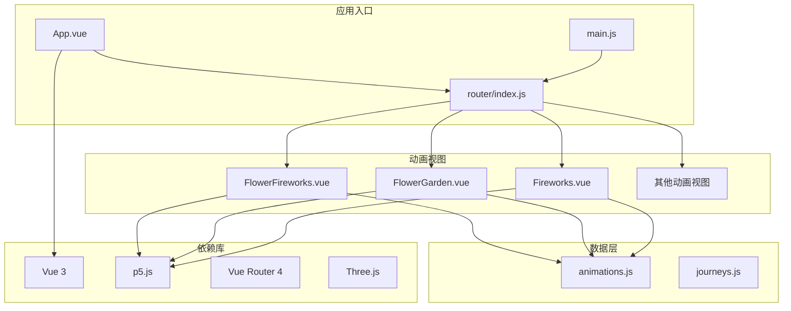
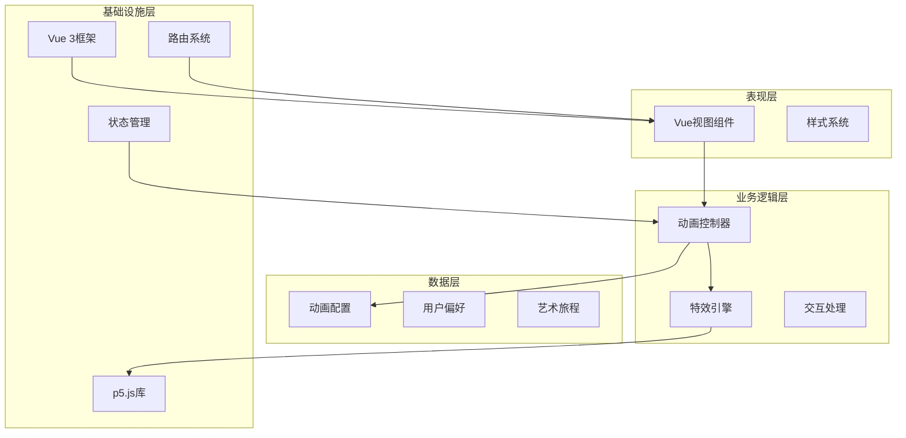
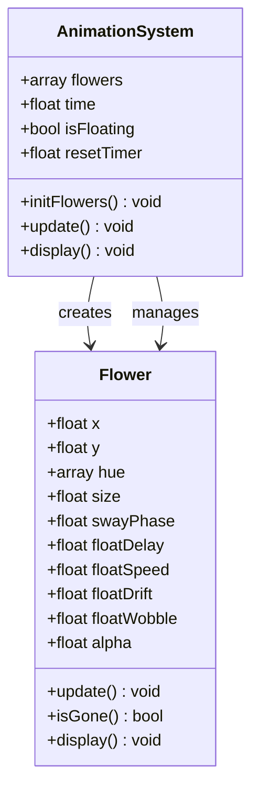
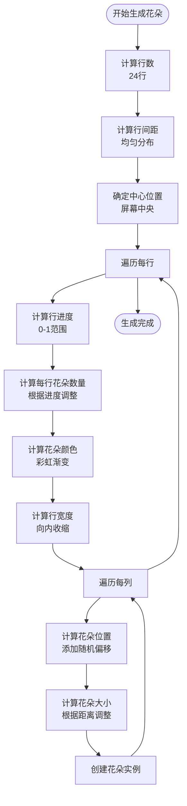
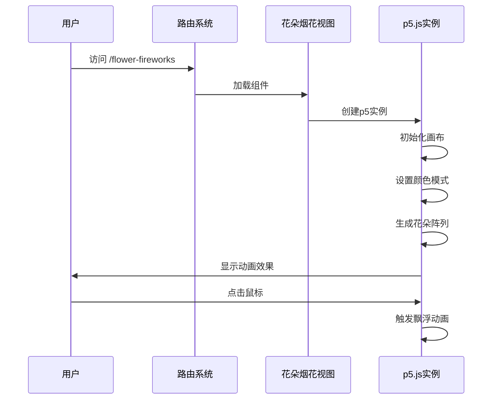
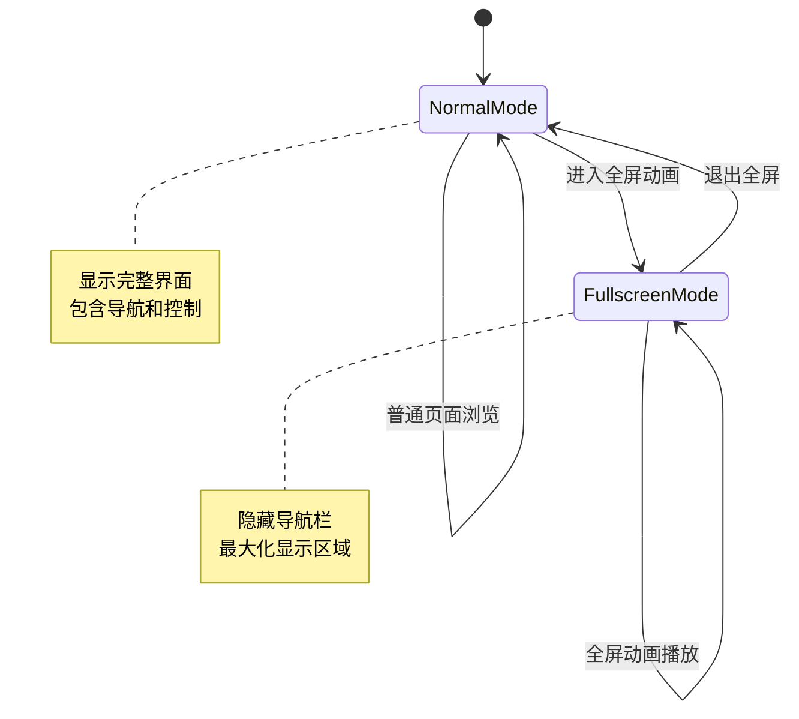
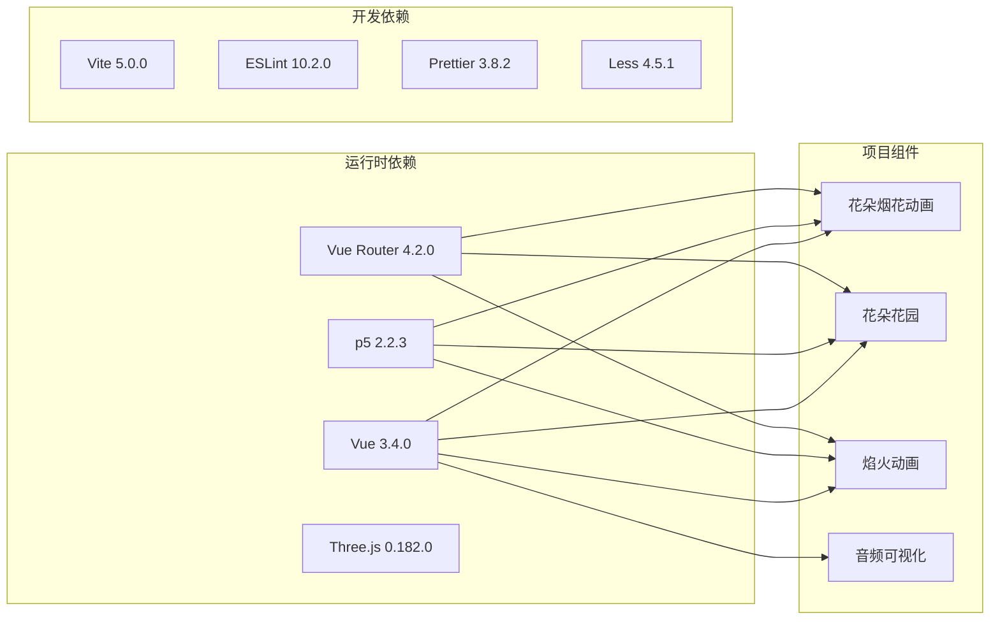

# 花朵烟花动画

<cite>
**本文档引用的文件**
- [FlowerFireworks.vue](file://src/views/FlowerFireworks.vue)
- [animations.js](file://src/data/animations.js)
- [index.js](file://src/router/index.js)
- [main.js](file://src/main.js)
- [package.json](file://package.json)
- [README.md](file://README.md)
- [FlowerGarden.vue](file://src/views/FlowerGarden.vue)
- [Fireworks.vue](file://src/views/Fireworks.vue)
- [App.vue](file://src/App.vue)
</cite>

## 目录
1. [项目概述](#项目概述)
2. [项目结构](#项目结构)
3. [核心组件](#核心组件)
4. [架构概览](#架构概览)
5. [详细组件分析](#详细组件分析)
6. [依赖关系分析](#依赖关系分析)
7. [性能考虑](#性能考虑)
8. [故障排除指南](#故障排除指南)
9. [总结](#总结)

## 项目概述

这是一个基于Vue 3 + p5.js的创意动画项目，专注于展示各种视觉效果丰富的动画程序。项目采用现代前端技术栈，通过p5.js提供强大的图形渲染能力，结合Vue 3的响应式系统，创造出流畅的用户体验。

该项目的核心特色包括：
- **花朵烟花动画**：模拟花朵飘向天空的浪漫场景
- **多种动画类型**：涵盖自然、粒子物理、音频可视化等多个领域
- **响应式设计**：适配各种设备和屏幕尺寸
- **交互式体验**：用户可以通过鼠标操作参与动画效果

## 项目结构

项目采用模块化架构，主要分为以下几个核心部分：

**图表来源**
- [App.vue:1-467](file://src/App.vue#L1-L467)
- [main.js:1-12](file://src/main.js#L1-L12)
- [router/index.js:1-223](file://src/router/index.js#L1-L223)

**章节来源**
- [README.md:1-115](file://README.md#L1-L115)
- [package.json:1-37](file://package.json#L1-L37)

## 核心组件

### 花朵烟花动画组件

花朵烟花动画是本项目的核心特色之一，它通过精心设计的算法模拟了花朵从地面飘向天空的美丽过程。该组件使用了p5.js的强大绘图功能，实现了复杂的视觉效果。

#### 主要特性
- **花朵生成系统**：创建多层次的花朵排列，营造逼真的花园效果
- **飘浮动画**：花朵具有自然的飘浮运动，包含摆动和漂移效果
- **渐变消失**：花朵飞出屏幕边界时会逐渐透明消失
- **自动重置**：所有花朵消失后自动重新初始化

#### 技术实现要点
- 使用预计算的角度常量优化性能
- 实现了完整的生命周期管理
- 支持响应式窗口调整
- 提供了丰富的视觉层次

**章节来源**
- [FlowerFireworks.vue:1-265](file://src/views/FlowerFireworks.vue#L1-L265)

### 动画管理系统

项目通过统一的动画管理系统来组织和管理各种动画效果。每个动画都有其独特的配置和参数设置。

#### 动画分类体系
- **自然系**：模拟自然现象的动画效果
- **粒子物理**：基于物理原理的粒子系统
- **音频系**：与声音同步的可视化效果
- **波形能量**：基于波形的动态效果
- **生成艺术**：算法生成的艺术作品
- **交互治愈**：用户可交互的放松效果

**章节来源**
- [animations.js:1-356](file://src/data/animations.js#L1-L356)

## 架构概览

项目采用了清晰的分层架构，确保了代码的可维护性和扩展性：

**图表来源**
- [App.vue:28-34](file://src/App.vue#L28-L34)
- [main.js:1-12](file://src/main.js#L1-L12)
- [router/index.js:1-223](file://src/router/index.js#L1-L223)

## 详细组件分析

### 花朵烟花动画实现

花朵烟花动画的实现体现了复杂动画系统的精妙设计：

#### 花朵类设计

**图表来源**
- [FlowerFireworks.vue:36-118](file://src/views/FlowerFireworks.vue#L36-L118)

#### 花朵生成算法

花朵的生成采用了精心设计的数学算法：

**图表来源**
- [FlowerFireworks.vue:129-170](file://src/views/FlowerFireworks.vue#L129-L170)

#### 飘浮动画机制

花朵的飘浮动画包含了多个物理参数：

| 参数 | 范围 | 作用 |
|------|------|------|
| floatDelay | 0-20帧 | 控制飘浮开始延迟 |
| floatSpeed | 1.8-6.0 | 控制上升速度 |
| floatDrift | -1.8-1.8 | 控制水平漂移 |
| floatWobble | 0.06-0.18 | 控制摆动幅度 |

**章节来源**
- [FlowerFireworks.vue:44-76](file://src/views/FlowerFireworks.vue#L44-L76)

### 路由系统集成

项目使用Vue Router 4实现页面导航，花朵烟花动画通过专门的路由路径进行访问：

**图表来源**
- [router/index.js:110-115](file://src/router/index.js#L110-L115)
- [FlowerFireworks.vue:212-213](file://src/views/FlowerFireworks.vue#L212-L213)

**章节来源**
- [router/index.js:110-115](file://src/router/index.js#L110-L115)

### 应用主组件

App.vue作为应用的根组件，负责全局布局和状态管理：

#### 全屏模式支持

项目特别为全屏动画页面提供了优化支持：

**图表来源**
- [App.vue:115-118](file://src/App.vue#L115-L118)

**章节来源**
- [App.vue:1-467](file://src/App.vue#L1-L467)

## 依赖关系分析

项目的技术栈选择体现了现代前端开发的最佳实践：

**图表来源**
- [package.json:13-35](file://package.json#L13-L35)

### 核心依赖说明

| 依赖项 | 版本 | 用途 |
|--------|------|------|
| vue | ^3.4.0 | 前端框架，提供响应式系统 |
| p5 | ^2.2.3 | 图形库，用于2D/3D绘图 |
| vue-router | ^4.2.0 | 路由管理，页面导航 |
| three | ^0.182.0 | 3D图形库，扩展渲染能力 |
| vite | ^5.0.0 | 构建工具，提供开发服务器 |
| less | ^4.5.1 | CSS预处理器，增强样式功能 |

**章节来源**
- [package.json:13-35](file://package.json#L13-L35)

## 性能考虑

项目在性能优化方面采取了多项措施：

### 渲染优化策略

1. **对象池模式**：复用花朵对象，减少内存分配
2. **批量更新**：使用单个循环处理所有花朵
3. **条件渲染**：只渲染可见的花朵
4. **渐进式加载**：动画按需加载，提高启动速度

### 内存管理

- 及时清理消失的花朵实例
- 合理的垃圾回收策略
- 避免内存泄漏的事件监听器管理

### 响应式优化

- 使用Vue 3的Composition API优化更新粒度
- 避免不必要的响应式转换
- 合理的数据结构设计

## 故障排除指南

### 常见问题及解决方案

#### 动画不显示

**症状**：页面加载后没有动画效果

**可能原因**：
1. p5.js库加载失败
2. Canvas元素未正确创建
3. 浏览器兼容性问题

**解决步骤**：
1. 检查浏览器控制台错误信息
2. 验证p5.js依赖是否正确安装
3. 确认Canvas元素的CSS样式设置

#### 性能问题

**症状**：动画运行卡顿或掉帧

**优化建议**：
1. 减少同时运行的花朵数量
2. 降低动画复杂度
3. 检查是否有过多的DOM操作

#### 移动端适配问题

**症状**：在移动设备上显示异常

**解决方案**：
1. 检查触摸事件处理
2. 调整Canvas尺寸计算
3. 优化移动端性能

**章节来源**
- [FlowerFireworks.vue:215-219](file://src/views/FlowerFireworks.vue#L215-L219)

## 总结

花朵烟花动画项目展现了现代前端技术的强大能力。通过Vue 3的响应式系统和p5.js的图形渲染能力，成功创造出了令人印象深刻的视觉效果。

### 项目亮点

1. **技术创新**：将传统动画技术与现代前端框架完美结合
2. **用户体验**：提供流畅、自然的交互体验
3. **代码质量**：采用模块化设计，便于维护和扩展
4. **性能优化**：通过多种技术手段确保动画流畅运行

### 技术价值

该项目不仅展示了动画制作的技术可能性，更为开发者提供了学习现代前端开发的优秀案例。其模块化的设计思路、性能优化策略以及用户体验考量，都值得其他项目借鉴。

### 发展前景

随着Web技术的不断发展，此类创意动画项目具有广阔的发展空间。未来可以在以下方面进一步完善：
- 增加更多的动画类型和效果
- 优化移动端性能和体验
- 扩展交互功能和用户参与度
- 集成更多多媒体元素