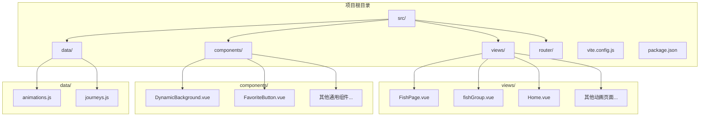
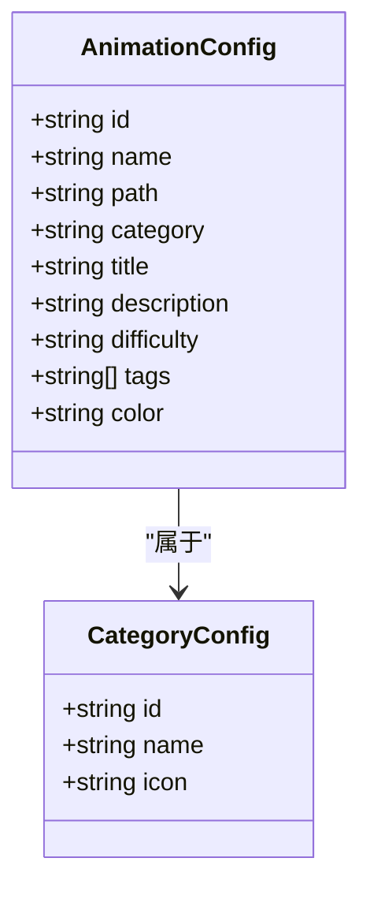
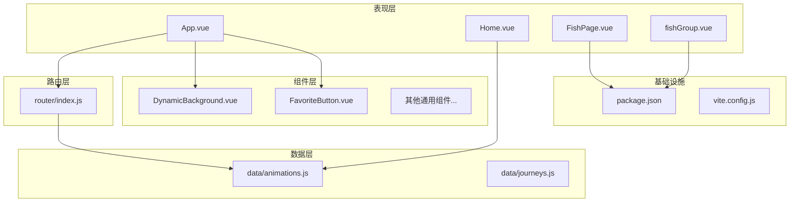
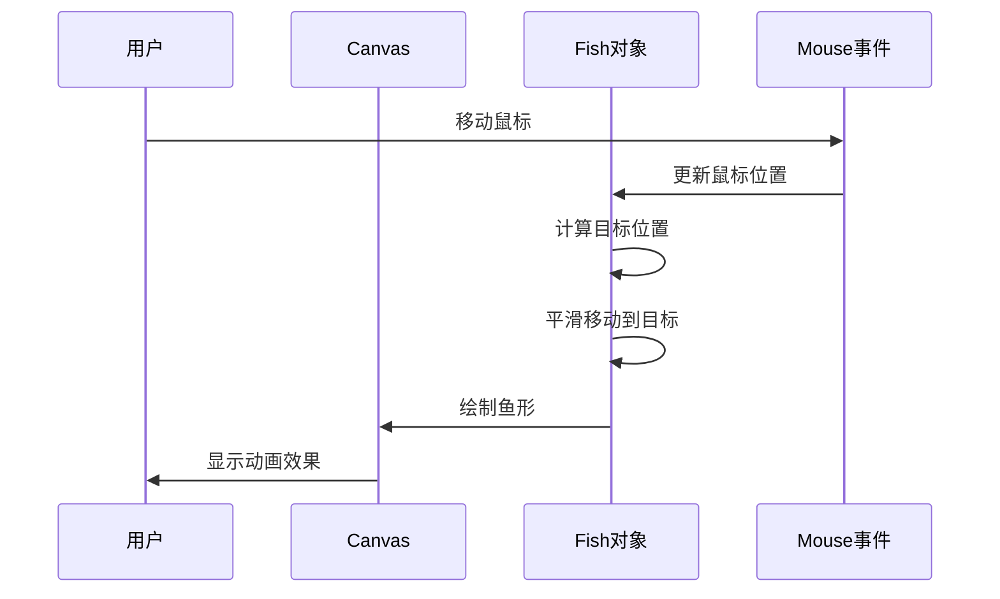
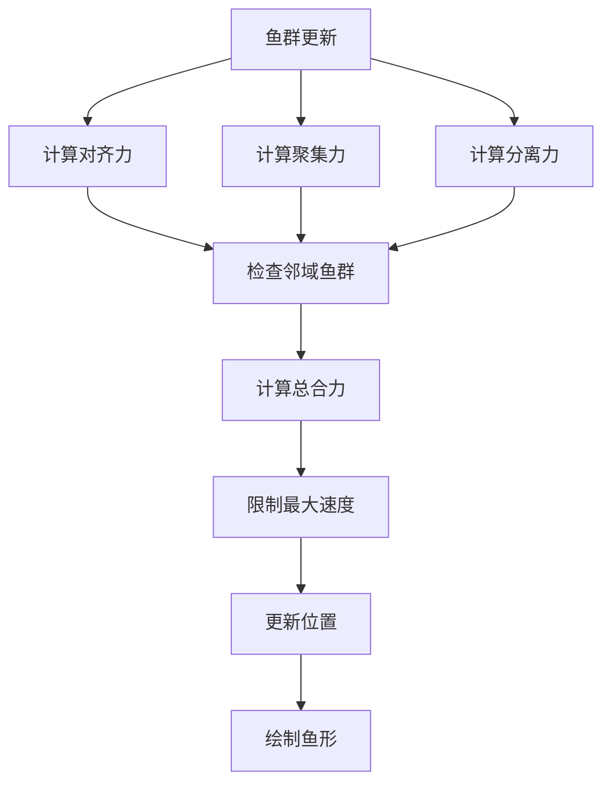
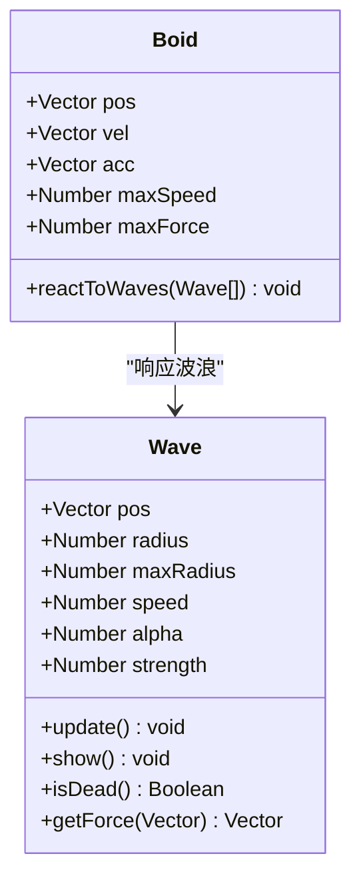
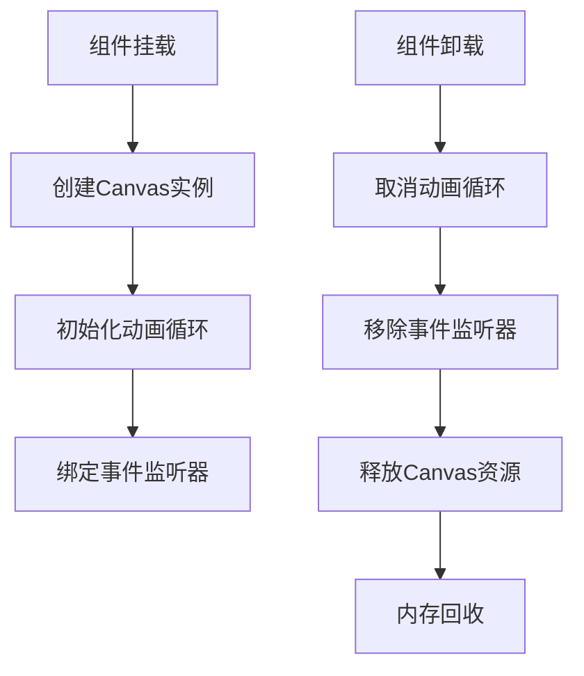

# 鱼群动画

<cite>
**本文档引用的文件**
- [FishPage.vue](file://src/views/FishPage.vue)
- [fishGroup.vue](file://src/views/fishGroup.vue)
- [animations.js](file://src/data/animations.js)
- [index.js](file://src/router/index.js)
- [App.vue](file://src/App.vue)
- [DynamicBackground.vue](file://src/components/DynamicBackground.vue)
- [Home.vue](file://src/views/Home.vue)
- [package.json](file://package.json)
- [vite.config.js](file://vite.config.js)
</cite>

## 目录
1. [项目概述](#项目概述)
2. [项目结构](#项目结构)
3. [核心组件](#核心组件)
4. [架构概览](#架构概览)
5. [详细组件分析](#详细组件分析)
6. [性能考虑](#性能考虑)
7. [故障排除指南](#故障排除指南)
8. [结论](#结论)

## 项目概述

这是一个基于Vue 3 + Vite构建的创意编程博客项目，专注于展示各种视觉动画效果。项目包含多个精心设计的动画组件，其中鱼群动画是核心特色之一。该项目采用现代化的前端技术栈，提供了丰富的交互式视觉体验。

### 主要特性
- **响应式设计**：支持桌面和移动设备访问
- **多种动画类型**：涵盖自然、粒子物理、音频可视化等多个领域
- **交互式体验**：用户可以通过鼠标和键盘与动画进行互动
- **性能优化**：使用requestAnimationFrame和Canvas优化渲染性能
- **模块化架构**：清晰的组件分离和路由管理

## 项目结构

项目采用标准的Vue 3单页应用结构，主要目录组织如下：

**图表来源**
- [FishPage.vue:1-168](file://src/views/FishPage.vue#L1-L168)
- [fishGroup.vue:1-301](file://src/views/fishGroup.vue#L1-L301)
- [Home.vue:1-555](file://src/views/Home.vue#L1-L555)

**章节来源**
- [package.json:1-37](file://package.json#L1-L37)
- [vite.config.js:1-52](file://vite.config.js#L1-L52)

## 核心组件

### 鱼群动画系统

项目提供了两种不同的鱼群动画实现，每种都有其独特的特点和应用场景：

#### 1. 基础鱼群动画 (FishPage.vue)
这是最简单的鱼群实现，使用原生Canvas API创建了一个基础的鱼群效果。

#### 2. 高级鱼群动画 (fishGroup.vue)
基于p5.js框架实现了完整的Boids算法，提供更真实的鱼群行为模拟。

### 动画配置系统

所有动画都通过统一的数据配置系统进行管理：

**图表来源**
- [animations.js:1-367](file://src/data/animations.js#L1-L367)

**章节来源**
- [animations.js:1-367](file://src/data/animations.js#L1-L367)

## 架构概览

项目采用模块化的架构设计，主要分为以下几个层次：

**图表来源**
- [App.vue:1-457](file://src/App.vue#L1-L457)
- [router/index.js:1-229](file://src/router/index.js#L1-L229)
- [animations.js:1-367](file://src/data/animations.js#L1-L367)

**章节来源**
- [App.vue:1-457](file://src/App.vue#L1-L457)
- [router/index.js:1-229](file://src/router/index.js#L1-L229)

## 详细组件分析

### 基础鱼群动画组件 (FishPage.vue)

#### 核心实现原理

该组件使用原生Canvas API实现了基础的鱼群效果，主要特点包括：

**图表来源**
- [FishPage.vue:131-142](file://src/views/FishPage.vue#L131-L142)

#### 鱼类行为模型

每个鱼都具有以下属性和行为：

| 属性 | 类型 | 描述 | 默认值 |
|------|------|------|--------|
| x, y | Number | 鱼的当前位置 | 随机生成 |
| targetX, targetY | Number | 鱼的目标位置 | 随机生成 |
| size | Number | 鱼的大小 | 4-10像素 |
| speed | Number | 鱼的移动速度 | 0.5-1.5 |
| color | String | 鱼的颜色 | HSL格式随机 |
| radiusOffset | Number | 旋转半径偏移 | 100-300像素 |

#### 鼠标交互机制

鱼群对鼠标有三种不同的反应模式：

1. **默认模式**：鱼群围绕画布中心形成旋转轨道
2. **接近模式**：当鼠标靠近时，鱼群会避开鼠标
3. **散开模式**：鼠标离开后，鱼群恢复到初始状态

**章节来源**
- [FishPage.vue:23-95](file://src/views/FishPage.vue#L23-L95)
- [FishPage.vue:117-128](file://src/views/FishPage.vue#L117-L128)

### 高级鱼群动画组件 (fishGroup.vue)

#### Boids算法实现

这个组件基于经典的Boids算法实现了更复杂的鱼群行为：

**图表来源**
- [fishGroup.vue:147-159](file://src/views/fishGroup.vue#L147-L159)

#### Boids算法三大规则

1. **对齐规则 (Alignment)**：鱼群朝向邻近鱼群的平均方向移动
2. **聚集规则 (Cohesion)**：鱼群向邻近鱼群的质心位置移动
3. **分离规则 (Separation)**：鱼群避免与其他鱼群过于接近

#### 波浪交互系统

除了Boids算法外，该组件还实现了独特的波浪交互系统：

**图表来源**
- [fishGroup.vue:83-129](file://src/views/fishGroup.vue#L83-L129)
- [fishGroup.vue:131-266](file://src/views/fishGroup.vue#L131-L266)

**章节来源**
- [fishGroup.vue:15-266](file://src/views/fishGroup.vue#L15-L266)

### 动画配置系统

#### 动画分类体系

项目中的动画按照功能和复杂度进行了分类：

| 分类 | 图标 | 描述 | 包含动画示例 |
|------|------|------|-------------|
| nature | 🌿 | 自然系动画 | 鱼群、树叶、蝴蝶网等 |
| particle | ✨ | 粒子物理动画 | 流体模拟、重力粒子等 |
| audio | 🎵 | 音频可视化 | 频谱塔林、音频轮盘等 |
| wave | 🌊 | 波形能量 | 彩虹波浪、弦波干涉等 |
| art | 🎭 | 生成艺术 | 分形树、曼陀罗等 |
| interactive | 💫 | 交互治愈 | 星光舞蹈、流沙坍塌等 |

#### 动画难度等级

为了帮助用户选择合适的动画，项目提供了三个难度等级：

- **入门 (Beginner)**：适合初学者，代码相对简单
- **进阶 (Intermediate)**：具有一定复杂度，需要理解基本概念
- **高级 (Advanced)**：复杂的算法实现，需要深入理解相关理论

**章节来源**
- [animations.js:358-367](file://src/data/animations.js#L358-L367)
- [animations.js:1-367](file://src/data/animations.js#L1-L367)

## 性能考虑

### Canvas性能优化

两个鱼群动画组件都采用了Canvas API进行高性能渲染：

1. **双缓冲技术**：使用半透明背景实现拖尾效果
2. **批量绘制**：一次性绘制所有鱼群，减少上下文切换
3. **事件节流**：合理处理鼠标事件，避免过度频繁的重绘

### 内存管理

项目实现了完善的内存管理机制：

**图表来源**
- [FishPage.vue:131-142](file://src/views/FishPage.vue#L131-L142)
- [fishGroup.vue:269-279](file://src/views/fishGroup.vue#L269-L279)

### 代码分割策略

通过Vite的代码分割功能，项目实现了按需加载：

- **p5.js库**：独立打包，仅在需要时加载
- **echarts库**：独立打包，仅在特定页面使用
- **Vue核心**：独立打包，包含vue和vue-router

**章节来源**
- [vite.config.js:31-44](file://vite.config.js#L31-L44)

## 故障排除指南

### 常见问题及解决方案

#### 1. 动画不显示或显示异常

**可能原因**：
- Canvas尺寸未正确设置
- 动画循环未启动
- CSS样式冲突

**解决方法**：
1. 检查Canvas容器的CSS样式
2. 确认resize事件监听器正常工作
3. 验证requestAnimationFrame调用

#### 2. 性能问题

**可能原因**：
- 鱼群数量过多
- 颜色计算过于复杂
- 事件监听器过多

**解决方法**：
1. 调整鱼群数量参数
2. 简化颜色计算逻辑
3. 合理管理事件监听器

#### 3. 移动设备兼容性问题

**可能原因**：
- 触摸事件处理不当
- 性能优化不足
- 屏幕尺寸适配问题

**解决方法**：
1. 添加触摸事件支持
2. 实现性能监控和自适应调整
3. 优化响应式布局

**章节来源**
- [FishPage.vue:15-20](file://src/views/FishPage.vue#L15-L20)
- [fishGroup.vue:78-80](file://src/views/fishGroup.vue#L78-L80)

## 结论

这个鱼群动画项目展示了现代前端技术在创意编程领域的强大能力。通过精心设计的架构和优化的实现，项目成功地将复杂的算法概念转化为直观的视觉体验。

### 主要成就

1. **技术创新**：实现了从基础Canvas动画到完整Boids算法的演进
2. **用户体验**：提供了流畅的交互式动画体验
3. **性能优化**：通过合理的架构设计保证了良好的运行性能
4. **可扩展性**：模块化的架构便于添加新的动画效果

### 技术亮点

- **双算法实现**：满足不同性能需求和复杂度要求
- **交互设计**：鼠标和键盘的多维度交互
- **响应式布局**：适配各种设备和屏幕尺寸
- **性能监控**：内置的性能优化和自适应调整

这个项目不仅是一个技术展示，更是创意编程教育的优秀案例，为开发者提供了学习和参考的宝贵资源。