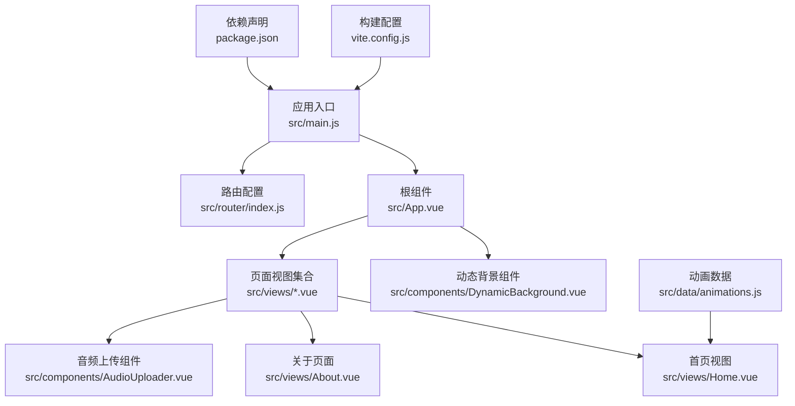
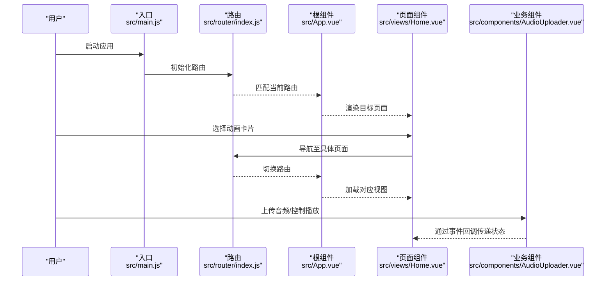
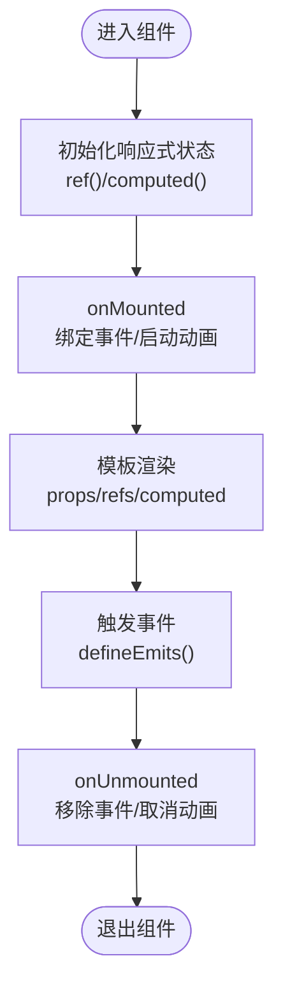
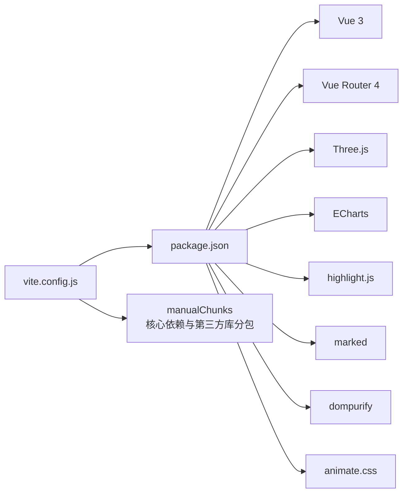

# 代码规范

<cite>
**本文引用的文件**
- [package.json](file://package.json)
- [vite.config.js](file://vite.config.js)
- [src/main.js](file://src/main.js)
- [src/App.vue](file://src/App.vue)
- [src/components/AudioUploader.vue](file://src/components/AudioUploader.vue)
- [src/components/DynamicBackground.vue](file://src/components/DynamicBackground.vue)
- [src/router/index.js](file://src/router/index.js)
- [src/data/animations.js](file://src/data/animations.js)
- [src/views/Home.vue](file://src/views/Home.vue)
- [src/views/About.vue](file://src/views/About.vue)
</cite>

## 目录
1. [引言](#引言)
2. [项目结构](#项目结构)
3. [核心组件](#核心组件)
4. [架构总览](#架构总览)
5. [详细组件分析](#详细组件分析)
6. [依赖分析](#依赖分析)
7. [性能考虑](#性能考虑)
8. [故障排查指南](#故障排查指南)
9. [结论](#结论)
10. [附录](#附录)

## 引言
本规范旨在为本项目提供统一、可维护且高性能的开发标准，覆盖以下方面：
- Vue 3 Composition API 的使用规范与最佳实践
- 组件命名约定与文件组织原则
- JavaScript/ES6+ 编码规范（变量命名、函数定义、异步处理）
- CSS/LESS 样式编写规范（BEM 风格、响应式设计、动画性能）
- TypeScript 使用建议（如适用）
- 注释规范、错误处理模式与日志记录标准
- 代码审查检查清单与自动化代码质量工具配置建议

## 项目结构
项目采用按功能域划分的目录组织方式，核心模块包括：
- 应用入口与根组件：src/main.js、src/App.vue
- 路由：src/router/index.js
- 数据：src/data/animations.js
- 组件：src/components/
- 页面：src/views/

**图表来源**
- [src/main.js:1-12](file://src/main.js#L1-L12)
- [src/App.vue:1-334](file://src/App.vue#L1-L334)
- [src/router/index.js:1-205](file://src/router/index.js#L1-L205)
- [src/data/animations.js:1-400](file://src/data/animations.js#L1-L400)
- [src/views/Home.vue:1-349](file://src/views/Home.vue#L1-L349)
- [src/views/About.vue:1-181](file://src/views/About.vue#L1-L181)
- [src/components/DynamicBackground.vue:1-185](file://src/components/DynamicBackground.vue#L1-L185)
- [src/components/AudioUploader.vue:1-514](file://src/components/AudioUploader.vue#L1-L514)
- [vite.config.js:1-32](file://vite.config.js#L1-L32)
- [package.json:1-29](file://package.json#L1-L29)

**章节来源**
- [src/main.js:1-12](file://src/main.js#L1-L12)
- [src/App.vue:1-334](file://src/App.vue#L1-L334)
- [src/router/index.js:1-205](file://src/router/index.js#L1-L205)
- [src/data/animations.js:1-400](file://src/data/animations.js#L1-L400)
- [src/views/Home.vue:1-349](file://src/views/Home.vue#L1-L349)
- [src/views/About.vue:1-181](file://src/views/About.vue#L1-L181)
- [src/components/DynamicBackground.vue:1-185](file://src/components/DynamicBackground.vue#L1-L185)
- [src/components/AudioUploader.vue:1-514](file://src/components/AudioUploader.vue#L1-L514)
- [vite.config.js:1-32](file://vite.config.js#L1-L32)
- [package.json:1-29](file://package.json#L1-L29)

## 核心组件
- 根组件 App.vue：负责全局导航、回到顶部按钮、动态背景与页面布局；使用 Options API 与计算属性、生命周期钩子实现滚动进度与按钮显隐逻辑。
- 动态背景组件 DynamicBackground.vue：使用 Canvas 实现粒子系统与鼠标交互，采用 Composition API 生命周期钩子进行初始化与清理。
- 音频上传组件 AudioUploader.vue：使用 Composition API 管理状态与事件，封装 Web Audio API，提供拖拽上传、播放控制与资源清理。
- 路由模块 router/index.js：集中定义所有页面路由，采用懒加载与滚动行为配置。
- 首页视图 Home.vue：使用 Composition API 管理分类筛选与动画卡片展示，配合 TransitionGroup 实现卡片过渡。
- 关于页面 About.vue：使用 Options API 展示个人信息与联系方式，包含渐变动画与响应式布局。

**章节来源**
- [src/App.vue:64-122](file://src/App.vue#L64-L122)
- [src/components/DynamicBackground.vue:5-172](file://src/components/DynamicBackground.vue#L5-L172)
- [src/components/AudioUploader.vue:92-297](file://src/components/AudioUploader.vue#L92-L297)
- [src/router/index.js:1-205](file://src/router/index.js#L1-L205)
- [src/views/Home.vue:47-79](file://src/views/Home.vue#L47-L79)
- [src/views/About.vue:45-57](file://src/views/About.vue#L45-L57)

## 架构总览
应用采用“入口 → 根组件 → 页面/组件 → 数据/路由”的单向数据流与事件流：
- 入口文件创建应用实例并挂载路由
- 根组件负责全局 UI 与交互（导航、回到顶部、动态背景）
- 页面组件通过路由懒加载按需加载
- 组件间通过 props、emit 与事件进行通信
- 数据层通过独立的数据模块提供静态配置

**图表来源**
- [src/main.js:1-12](file://src/main.js#L1-L12)
- [src/router/index.js:192-202](file://src/router/index.js#L192-L202)
- [src/App.vue:1-62](file://src/App.vue#L1-L62)
- [src/views/Home.vue:24-43](file://src/views/Home.vue#L24-L43)
- [src/components/AudioUploader.vue:92-297](file://src/components/AudioUploader.vue#L92-L297)

## 详细组件分析

### 组件命名约定与文件组织
- 文件命名：采用帕斯卡命名法（如 Home.vue、AudioUploader.vue），组件内部 name 字段保持一致
- 目录组织：按功能域划分（components、views、data、router），避免跨域耦合
- 组件导出：优先使用默认导出，必要时提供具名导出

**章节来源**
- [src/views/Home.vue:1-349](file://src/views/Home.vue#L1-L349)
- [src/components/AudioUploader.vue:1-514](file://src/components/AudioUploader.vue#L1-L514)
- [src/components/DynamicBackground.vue:1-185](file://src/components/DynamicBackground.vue#L1-L185)

### Vue 3 Composition API 使用规范
- 状态管理：优先使用 ref/computed/watchEffect 管理响应式状态，避免在模板中直接操作 DOM
- 生命周期：在 onMounted/onUnmounted 中进行资源初始化与清理，确保内存释放
- 事件处理：通过 defineEmits 定义事件，遵循“父组件监听、子组件触发”的单向数据流
- 性能：避免在渲染函数中执行重计算，将计算逻辑放入 computed 或缓存结果

**图表来源**
- [src/components/AudioUploader.vue:92-297](file://src/components/AudioUploader.vue#L92-L297)
- [src/components/DynamicBackground.vue:5-172](file://src/components/DynamicBackground.vue#L5-L172)

**章节来源**
- [src/components/AudioUploader.vue:92-297](file://src/components/AudioUploader.vue#L92-L297)
- [src/components/DynamicBackground.vue:5-172](file://src/components/DynamicBackground.vue#L5-L172)
- [src/views/Home.vue:47-79](file://src/views/Home.vue#L47-L79)

### JavaScript/ES6+ 编码规范
- 变量命名：使用语义化英文命名，常量使用大写下划线风格，私有变量以下划线前缀标识
- 函数定义：优先使用箭头函数表达简洁逻辑；复杂逻辑拆分为多个小函数
- 异步处理：使用 Promise/async-await，避免深层回调；对可能失败的操作进行 try/catch 包裹
- 事件与资源：在组件卸载时统一清理事件监听与定时器，防止内存泄漏

**章节来源**
- [src/components/AudioUploader.vue:136-297](file://src/components/AudioUploader.vue#L136-L297)
- [src/components/DynamicBackground.vue:156-172](file://src/components/DynamicBackground.vue#L156-L172)
- [src/App.vue:93-121](file://src/App.vue#L93-L121)

### CSS/LESS 样式编写规范
- 命名法：采用 BEM 风格（块__元素--修饰符），保证类名可读性与可维护性
- 变量与混入：使用 LESS 变量统一管理颜色、尺寸与过渡，减少重复
- 响应式设计：在关键断点处使用媒体查询，优先使用相对单位与弹性布局
- 动画性能：优先使用 transform/opacity 等 GPU 友好属性；避免频繁触发回流

**章节来源**
- [src/App.vue:125-334](file://src/App.vue#L125-L334)
- [src/views/Home.vue:81-348](file://src/views/Home.vue#L81-L348)
- [src/views/About.vue:60-181](file://src/views/About.vue#L60-L181)

### TypeScript 使用建议（如适用）
- 接口定义：为 props、emit 事件参数与数据模型定义明确接口，提升类型安全
- 类型导入：优先使用类型导入（import type）避免运行时开销
- 工具类型：利用 Partial/Readonly 等工具类型增强可维护性
- 严格模式：开启 tsconfig 的严格模式选项，减少隐式类型问题

[本节为通用建议，不直接分析具体文件]

### 注释规范、错误处理与日志记录
- 注释：为复杂逻辑与边界条件添加注释；组件与函数使用 JSDoc 风格注释
- 错误处理：对异步操作与外部 API 调用进行 try/catch；提供降级方案与用户提示
- 日志记录：仅在开发环境输出调试日志；生产环境避免敏感信息泄露

**章节来源**
- [src/components/AudioUploader.vue:151-178](file://src/components/AudioUploader.vue#L151-L178)
- [src/App.vue:93-121](file://src/App.vue#L93-L121)

### 代码审查检查清单
- 结构与命名：文件/组件命名是否符合约定；目录结构是否清晰
- Composition API：是否正确使用 ref/computed/watchEffect；生命周期钩子是否完整
- 样式：是否遵循 BEM；是否存在冗余样式；响应式断点是否合理
- 性能：是否存在不必要的重渲染；动画是否使用 GPU 友好属性
- 安全：是否对用户输入进行校验；是否避免在模板中直接操作 DOM
- 可测试性：复杂逻辑是否可拆分；是否便于单元测试

[本节为通用检查项，不直接分析具体文件]

## 依赖分析
- 构建与打包：Vite 提供快速开发与生产构建，手动分包策略拆分核心依赖与第三方库
- 运行时依赖：Vue 3、Vue Router 4、Three.js、ECharts、highlight.js、marked、dompurify、animate.css
- 开发依赖：@vitejs/plugin-vue、less、vite

**图表来源**
- [package.json:11-26](file://package.json#L11-L26)
- [vite.config.js:13-31](file://vite.config.js#L13-L31)

**章节来源**
- [package.json:11-26](file://package.json#L11-L26)
- [vite.config.js:13-31](file://vite.config.js#L13-L31)

## 性能考虑
- 懒加载与分包：路由与页面组件采用动态导入；Vite 配置 manualChunks 拆分核心与第三方库
- Canvas 与动画：在 onUnmounted 中清理 requestAnimationFrame 与事件监听，避免后台持续消耗
- 样式优化：使用 transform/opacity 控制动画；减少重排与重绘
- 资源体积：根据页面使用情况拆分依赖，避免不必要的库引入

**章节来源**
- [vite.config.js:13-31](file://vite.config.js#L13-L31)
- [src/components/DynamicBackground.vue:156-172](file://src/components/DynamicBackground.vue#L156-L172)
- [src/App.vue:125-334](file://src/App.vue#L125-L334)

## 故障排查指南
- 滚动进度异常：检查滚动事件绑定与计算逻辑，确认在组件卸载时移除监听
- 音频播放失败：确认 AudioContext 状态与用户手势激活；在异常时输出错误日志
- Canvas 性能问题：检查粒子数量与连接算法复杂度；在 resize 时重设画布尺寸
- 路由跳转失效：核对路由配置与懒加载路径；确认 scrollBehavior 返回值

**章节来源**
- [src/App.vue:93-121](file://src/App.vue#L93-L121)
- [src/components/AudioUploader.vue:151-178](file://src/components/AudioUploader.vue#L151-L178)
- [src/components/DynamicBackground.vue:80-172](file://src/components/DynamicBackground.vue#L80-L172)
- [src/router/index.js:192-202](file://src/router/index.js#L192-L202)

## 结论
本规范结合项目现有代码实践，总结了 Vue 3 Composition API 的使用要点、组件命名与文件组织原则、JavaScript/ES6+ 编码规范、CSS/LESS 样式规范以及性能与安全注意事项。建议在后续迭代中逐步引入 TypeScript 与自动化质量工具，持续提升代码质量与可维护性。

## 附录
- 自动化代码质量工具配置建议（无具体文件分析）
  - ESLint：启用 Vue 专属规则与 import/no-unresolved
  - Prettier：统一缩进、引号与行尾
  - Stylelint：约束 LESS/SCSS 规范
  - Lint-staged + Husky：在提交前自动格式化与检查