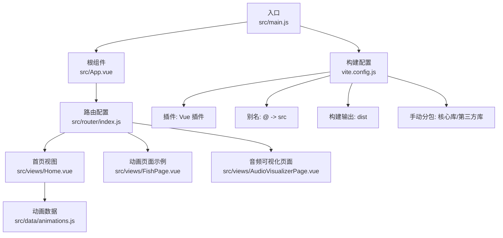
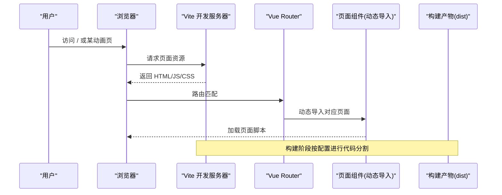
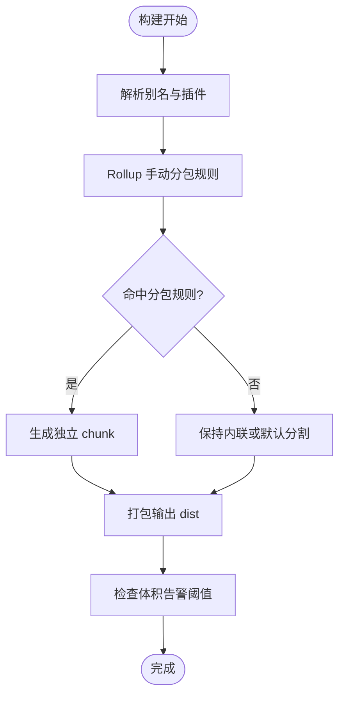
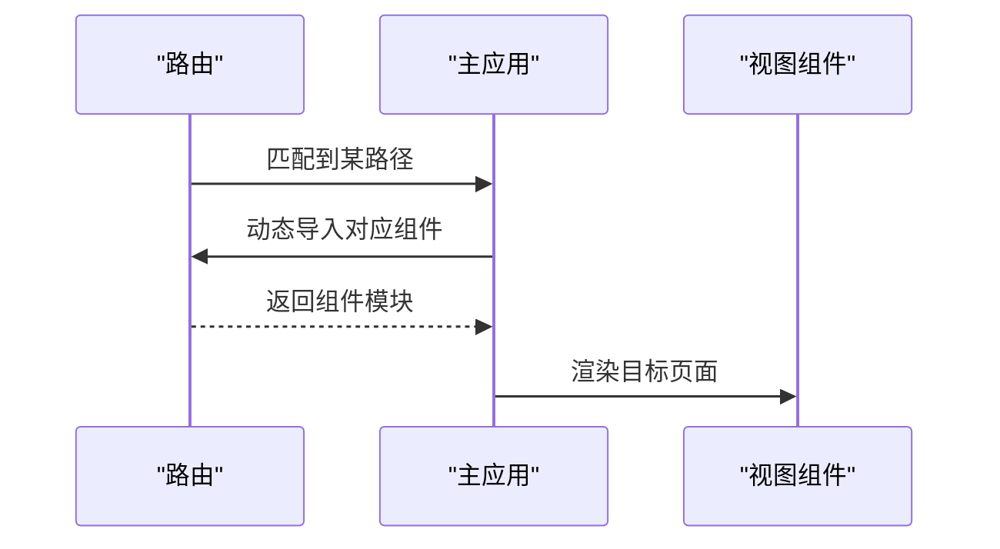
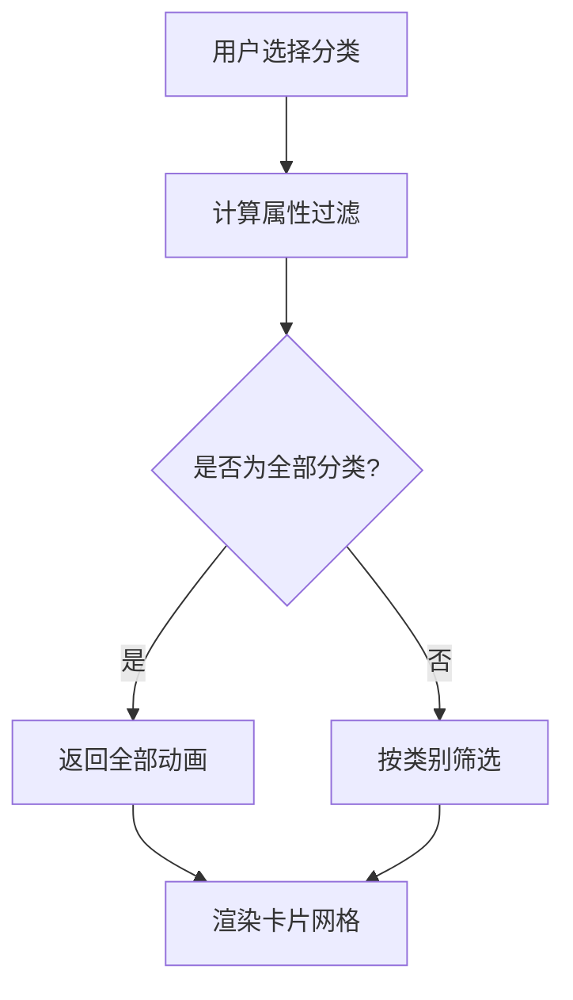
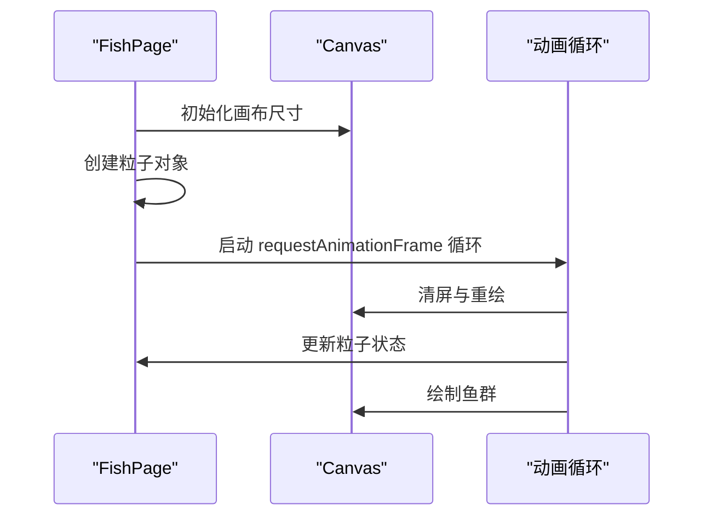
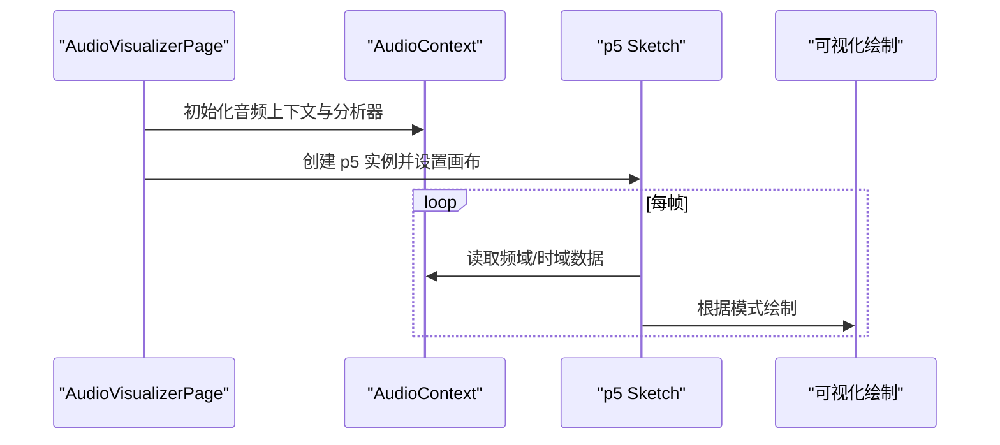
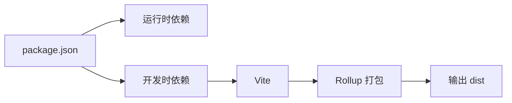

# 开发指南

<cite>
**本文引用的文件**
- [package.json](file://package.json)
- [vite.config.js](file://vite.config.js)
- [src/main.js](file://src/main.js)
- [src/router/index.js](file://src/router/index.js)
- [src/App.vue](file://src/App.vue)
- [src/views/Home.vue](file://src/views/Home.vue)
- [src/views/FishPage.vue](file://src/views/FishPage.vue)
- [src/views/AudioVisualizerPage.vue](file://src/views/AudioVisualizerPage.vue)
- [src/data/animations.js](file://src/data/animations.js)
- [.eslintrc.js](file://.eslintrc.js)
- [.prettierrc.js](file://.prettierrc.js)
- [.gitignore](file://.gitignore)
- [README.md](file://README.md)
</cite>

## 目录
1. [简介](#简介)
2. [项目结构](#项目结构)
3. [核心组件](#核心组件)
4. [架构总览](#架构总览)
5. [详细组件分析](#详细组件分析)
6. [依赖关系分析](#依赖关系分析)
7. [性能考量](#性能考量)
8. [代码质量与格式化](#代码质量与格式化)
9. [故障排查指南](#故障排查指南)
10. [结论](#结论)
11. [附录](#附录)

## 简介
本指南面向希望参与或扩展该动画博客项目的开发者，围绕以下目标展开：
- 深入解析 Vite 构建配置与优化策略（代码分割、懒加载、资源处理）
- 解释开发工作流程（热重载、调试、性能分析）
- 提供新功能开发最佳实践（组件设计、代码组织、测试策略）
- 规范 Git 工作流程与版本控制实践
- 引入统一的代码质量与格式化标准（ESLint + Prettier）
- 总结常见问题与调试工具使用
- 介绍代码质量保障与持续集成配置思路

## 项目结构
该项目采用 Vue 3 + Vite 的单页应用结构，路由基于 Vue Router 4 的历史模式，页面组件位于 views 目录，公共资源位于 public 目录，入口文件为 src/main.js，根组件为 src/App.vue。



图表来源
- [src/main.js:1-12](file://src/main.js#L1-L12)
- [src/App.vue:1-334](file://src/App.vue#L1-L334)
- [src/router/index.js:1-205](file://src/router/index.js#L1-L205)
- [src/views/Home.vue:1-349](file://src/views/Home.vue#L1-L349)
- [src/views/FishPage.vue:1-168](file://src/views/FishPage.vue#L1-L168)
- [src/views/AudioVisualizerPage.vue:1-200](file://src/views/AudioVisualizerPage.vue#L1-L200)
- [src/data/animations.js:1-400](file://src/data/animations.js#L1-L400)
- [vite.config.js:1-32](file://vite.config.js#L1-L32)

章节来源
- [README.md:69-86](file://README.md#L69-L86)
- [src/main.js:1-12](file://src/main.js#L1-L12)
- [src/router/index.js:1-205](file://src/router/index.js#L1-L205)

## 核心组件
- 应用入口与全局初始化
  - 在入口文件中创建 Vue 应用实例，挂载路由，并进行必要的全局初始化（如代码高亮）。
  - 参考路径：[src/main.js:1-12](file://src/main.js#L1-L12)

- 根组件与导航
  - 根组件负责导航栏、动态背景、回到顶部按钮等全局 UI，并通过路由视图承载页面内容。
  - 参考路径：[src/App.vue:1-334](file://src/App.vue#L1-L334)

- 路由与懒加载
  - 使用 Vue Router 4 的 history 模式，所有页面均采用动态导入实现懒加载，减少首屏体积。
  - 参考路径：[src/router/index.js:1-205](file://src/router/index.js#L1-L205)

- 首页与动画数据
  - 首页展示动画卡片网格，数据来源于统一的数据模块，支持分类筛选与难度标签。
  - 参考路径：[src/views/Home.vue:1-349](file://src/views/Home.vue#L1-L349)，[src/data/animations.js:1-400](file://src/data/animations.js#L1-L400)

章节来源
- [src/main.js:1-12](file://src/main.js#L1-L12)
- [src/App.vue:1-334](file://src/App.vue#L1-L334)
- [src/router/index.js:1-205](file://src/router/index.js#L1-L205)
- [src/views/Home.vue:1-349](file://src/views/Home.vue#L1-L349)
- [src/data/animations.js:1-400](file://src/data/animations.js#L1-L400)

## 架构总览
下图展示了从浏览器请求到页面渲染的关键路径，以及构建期的代码分割策略如何影响运行时加载。



图表来源
- [src/router/index.js:1-205](file://src/router/index.js#L1-L205)
- [vite.config.js:13-31](file://vite.config.js#L13-L31)

## 详细组件分析

### Vite 构建配置与优化
- 插件与别名
  - 使用官方 Vue 插件，启用 TypeScript 支持；通过路径别名简化导入。
  - 参考路径：[vite.config.js:1-12](file://vite.config.js#L1-L12)

- 代码分割与手动分包
  - 将核心库（Vue 生态）与第三方库（highlight.js、marked、dompurify、echarts）拆分为独立 chunk，提升缓存命中率与并行加载效率。
  - 参考路径：[vite.config.js:17-30](file://vite.config.js#L17-L30)

- 构建输出与体积告警阈值
  - 输出目录为 dist；针对大型库（如 echarts）调整体积警告阈值，避免误报。
  - 参考路径：[vite.config.js:14-16](file://vite.config.js#L14-L16)

- 与路由懒加载的协同
  - 路由动态导入与 Rollup 手动分包共同作用，确保按需加载与独立缓存。
  - 参考路径：[src/router/index.js:1-205](file://src/router/index.js#L1-L205)



图表来源
- [vite.config.js:13-31](file://vite.config.js#L13-L31)

章节来源
- [vite.config.js:1-32](file://vite.config.js#L1-L32)
- [src/router/index.js:1-205](file://src/router/index.js#L1-L205)

### 路由与懒加载
- 路由定义采用数组形式，每个页面使用动态导入，实现按需加载。
- 参考路径：[src/router/index.js:1-205](file://src/router/index.js#L1-L205)



图表来源
- [src/router/index.js:1-205](file://src/router/index.js#L1-L205)

章节来源
- [src/router/index.js:1-205](file://src/router/index.js#L1-L205)

### 首页与动画数据
- 首页通过计算属性根据当前分类过滤动画列表，支持难度标签与分类计数。
- 动画数据集中维护，便于统一管理与扩展。
- 参考路径：[src/views/Home.vue:1-349](file://src/views/Home.vue#L1-L349)，[src/data/animations.js:1-400](file://src/data/animations.js#L1-L400)



图表来源
- [src/views/Home.vue:47-79](file://src/views/Home.vue#L47-L79)
- [src/data/animations.js:1-400](file://src/data/animations.js#L1-L400)

章节来源
- [src/views/Home.vue:1-349](file://src/views/Home.vue#L1-L349)
- [src/data/animations.js:1-400](file://src/data/animations.js#L1-L400)

### Canvas 动画页面（示例：鱼群）
- 页面在挂载后创建画布并初始化尺寸，随后创建粒子系统与动画循环。
- 示例展示了在页面级组件中直接操作 DOM 与 Canvas 的典型模式。
- 参考路径：[src/views/FishPage.vue:1-168](file://src/views/FishPage.vue#L1-L168)



图表来源
- [src/views/FishPage.vue:10-143](file://src/views/FishPage.vue#L10-L143)

章节来源
- [src/views/FishPage.vue:1-168](file://src/views/FishPage.vue#L1-L168)

### 音频可视化页面（示例：p5 音效）
- 页面使用 p5 实时获取音频分析数据并绘制多种可视化模式。
- 展示了在页面中集成外部音频与图形库的实践方式。
- 参考路径：[src/views/AudioVisualizerPage.vue:1-200](file://src/views/AudioVisualizerPage.vue#L1-L200)



图表来源
- [src/views/AudioVisualizerPage.vue:62-124](file://src/views/AudioVisualizerPage.vue#L62-L124)

章节来源
- [src/views/AudioVisualizerPage.vue:1-200](file://src/views/AudioVisualizerPage.vue#L1-L200)

## 依赖关系分析
- 运行时依赖
  - Vue 3、Vue Router 4、Three.js、p5、ECharts、Highlight.js、Marked、DOMPurify、Animate.css 等。
  - 参考路径：[package.json:13-24](file://package.json#L13-L24)

- 开发时依赖
  - Vite、@vitejs/plugin-vue、Less、ESLint、ESLint 插件、Prettier 等。
  - 参考路径：[package.json:26-35](file://package.json#L26-L35)

- 构建期依赖
  - 通过 Vite 与 Rollup 执行打包与代码分割。
  - 参考路径：[vite.config.js:1-32](file://vite.config.js#L1-L32)



图表来源
- [package.json:1-37](file://package.json#L1-L37)
- [vite.config.js:1-32](file://vite.config.js#L1-L32)

章节来源
- [package.json:1-37](file://package.json#L1-L37)
- [vite.config.js:1-32](file://vite.config.js#L1-L32)

## 性能考量
- 代码分割与缓存优化
  - 通过手动分包将核心库与第三方库拆分，配合浏览器缓存策略，显著降低重复下载与提升二次加载速度。
  - 参考路径：[vite.config.js:17-30](file://vite.config.js#L17-L30)

- 懒加载与首屏优化
  - 路由动态导入确保仅加载当前页面所需资源，减少首屏 JS 体积。
  - 参考路径：[src/router/index.js:1-205](file://src/router/index.js#L1-L205)

- 体积监控与阈值调整
  - 针对大型库（如 ECharts）适当提高体积告警阈值，避免因库体量导致误报。
  - 参考路径：[vite.config.js:15-16](file://vite.config.js#L15-L16)

- 开发与生产差异
  - 开发环境使用 Vite 的快速热重载；生产环境通过 Rollup 优化与压缩。
  - 参考路径：[README.md:21-48](file://README.md#L21-L48)，[vite.config.js:1-32](file://vite.config.js#L1-L32)

## 代码质量与格式化

### ESLint 配置系统
项目已集成统一的代码质量检查系统，通过 ESLint 提供静态代码分析与错误检测：

- **基础配置**
  - 根目录配置，启用 Node.js 环境
  - 继承 Vue 3 Essential 规则集、ESLint 推荐规则集
  - 集成 Prettier 规则，确保格式化一致性

- **解析器配置**
  - 使用 @babel/eslint-parser 作为 JavaScript 解析器
  - 支持现代 JavaScript 语法特性

- **规则定制**
  - 生产环境：console 和 debugger 语句警告级别
  - 开发环境：禁用 console 和 debugger 语句
  - 可根据团队规范进一步调整规则严格程度

- **规则来源**
  - [ESLint 配置文件:1-18](file://.eslintrc.js#L1-L18)

### Prettier 格式化标准
统一的代码格式化工具，确保团队代码风格一致：

- **格式化规则**
  - 单引号：true
  - 分号：true
  - 尾随逗号：es5
  - Tab 宽度：2
  - 使用空格缩进：false

- **适用范围**
  - Vue 单文件组件 (.vue)
  - JavaScript 文件 (.js/.jsx)
  - CommonJS (.cjs)
  - ES 模块 (.mjs)

- **规则来源**
  - [Prettier 配置文件:1-7](file://.prettierrc.js#L1-L7)

### NPM 脚本集成
项目通过 NPM 脚本提供便捷的代码质量工具：

- **lint 命令**
  ```bash
  npm run lint
  ```
  - 检查 .vue、.js、.jsx、.cjs、.mjs 文件
  - 自动修复可修复的问题
  - 忽略 .gitignore 中的文件

- **format 命令**
  ```bash
  npm run format
  ```
  - 格式化所有受支持的文件
  - 忽略 .gitignore 中的文件

- **脚本来源**
  - [NPM 脚本配置:6-12](file://package.json#L6-L12)

### 开发工作流程集成
建议在开发流程中集成代码质量检查：

1. **提交前检查**
   - 运行 `npm run lint` 检查代码质量
   - 运行 `npm run format` 格式化代码

2. **自动化集成**
   - 可在 Git Hooks 中集成 lint-staged 进行增量检查
   - 在 CI/CD 流程中加入代码质量检查步骤

3. **编辑器集成**
   - VS Code 中安装 ESLint 和 Prettier 扩展
   - 配置保存时自动格式化

**章节来源**
- [.eslintrc.js:1-18](file://.eslintrc.js#L1-L18)
- [.prettierrc.js:1-7](file://.prettierrc.js#L1-L7)
- [package.json:6-12](file://package.json#L6-L12)

## 故障排查指南
- 构建失败或体积异常
  - 检查手动分包规则与体积告警阈值设置，确认大型库是否被正确拆分。
  - 参考路径：[vite.config.js:15-30](file://vite.config.js#L15-L30)

- 页面空白或路由不生效
  - 确认路由动态导入语法正确，且页面组件路径无误。
  - 参考路径：[src/router/index.js:1-205](file://src/router/index.js#L1-L205)

- 音频可视化无响应
  - 确保音频上下文初始化成功，且页面交互触发了播放/暂停逻辑。
  - 参考路径：[src/views/AudioVisualizerPage.vue:62-124](file://src/views/AudioVisualizerPage.vue#L62-L124)

- Canvas 动画卡顿
  - 检查动画循环中是否有过多重绘或未清理的定时器；必要时降低粒子数量或优化绘制逻辑。
  - 参考路径：[src/views/FishPage.vue:10-143](file://src/views/FishPage.vue#L10-L143)

- 开发服务器无法热重载
  - 确认 Vite 服务正常启动，端口未被占用；检查插件与别名配置。
  - 参考路径：[README.md:34-40](file://README.md#L34-L40)，[vite.config.js:1-12](file://vite.config.js#L1-L12)

- 代码质量问题
  - 使用 `npm run lint` 检查 ESLint 规则违反情况
  - 使用 `npm run format` 应用统一格式化标准
  - 参考路径：[package.json:10-11](file://package.json#L10-L11)

- Git 忽略文件问题
  - 确认 .gitignore 正确配置，避免不必要的文件进入版本控制
  - 参考路径：[.gitignore:1-42](file://.gitignore#L1-L42)

## 结论
本项目以 Vue 3 + Vite 为基础，结合路由懒加载与 Rollup 手动分包策略，在保证开发体验的同时兼顾了运行时性能。通过统一的数据与组件结构，开发者可以高效地扩展新的动画页面与功能模块。

**新增的代码质量系统**进一步提升了项目的工程化水平：
- ESLint 提供静态代码分析与错误检测
- Prettier 确保代码格式一致性
- NPM 脚本简化了开发流程
- 为团队协作提供了统一的质量标准

建议在新增页面时遵循现有模式（动态导入、数据集中管理、样式隔离），并在构建配置层面持续关注体积与缓存策略。同时，充分利用新增的代码质量工具来维护代码的一致性和可维护性。

## 附录

### 开发工作流程与最佳实践
- 热重载与调试
  - 使用 Vite 开发服务器进行本地调试，利用浏览器开发者工具定位样式与脚本问题。
  - 参考路径：[README.md:34-40](file://README.md#L34-L40)

- 性能分析
  - 使用浏览器性能面板观察帧率与内存变化；结合构建产物分析工具评估分包效果。
  - 参考路径：[vite.config.js:17-30](file://vite.config.js#L17-L30)

- 新功能开发规范
  - 页面组件：采用动态导入；数据与配置集中管理；样式使用 scoped 与预处理器。
  - 参考路径：[src/router/index.js:1-205](file://src/router/index.js#L1-L205)，[src/data/animations.js:1-400](file://src/data/animations.js#L1-L400)

- 测试策略
  - 建议为关键计算逻辑（如动画参数、数据筛选）编写单元测试；对页面交互使用端到端测试覆盖。
  - 参考路径：[src/views/Home.vue:47-79](file://src/views/Home.vue#L47-L79)

- Git 工作流程与版本控制
  - 建议采用功能分支开发，合并前进行代码审查与构建验证；使用语义化提交信息。
  - 参考路径：[README.md:50-67](file://README.md#L50-L67)

- 代码质量与 CI/CD
  - 可在 CI 中加入安装依赖、构建与预览命令，确保部署前一致性。
  - 新增的 ESLint 和 Prettier 配置可在 CI 中自动执行代码质量检查。
  - 参考路径：[package.json:6-12](file://package.json#L6-L12)，[README.md:50-67](file://README.md#L50-L67)

- 代码质量工具使用
  - **ESLint 检查**：`npm run lint`
  - **格式化代码**：`npm run format`
  - **增量检查**：可结合 lint-staged 在 Git 提交时进行自动化检查
  - 参考路径：[package.json:10-11](file://package.json#L10-L11)