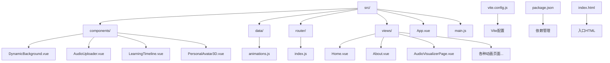
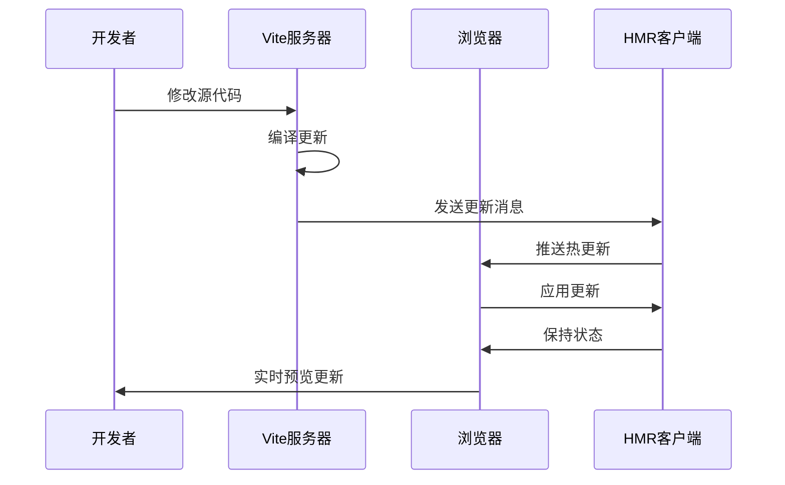

# 开发环境搭建

<cite>
**本文档引用的文件**
- [package.json](file://package.json)
- [vite.config.js](file://vite.config.js)
- [README.md](file://README.md)
- [index.html](file://index.html)
- [src/main.js](file://src/main.js)
- [src/App.vue](file://src/App.vue)
- [src/router/index.js](file://src/router/index.js)
- [src/views/Home.vue](file://src/views/Home.vue)
- [src/components/DynamicBackground.vue](file://src/components/DynamicBackground.vue)
- [src/data/animations.js](file://src/data/animations.js)
- [.gitignore](file://.gitignore)
</cite>

## 目录
1. [简介](#简介)
2. [项目结构](#项目结构)
3. [环境要求](#环境要求)
4. [依赖安装](#依赖安装)
5. [Vite开发服务器配置](#vite开发服务器配置)
6. [项目目录结构详解](#项目目录结构详解)
7. [IDE配置建议](#ide配置建议)
8. [Git工作流程](#git工作流程)
9. [常见问题排查](#常见问题排查)
10. [性能优化建议](#性能优化建议)
11. [总结](#总结)

## 简介

这是一个基于Vue 3 + Vite构建的创意动画展示网站，专注于前端开发技术和交互式动画演示。项目采用现代化的前端技术栈，包含丰富的可视化效果和交互体验。

## 项目结构

该项目采用标准的Vue 3单页应用架构，具有清晰的模块化组织：



**图表来源**
- [src/main.js:1-12](file://src/main.js#L1-L12)
- [src/App.vue:1-334](file://src/App.vue#L1-L334)
- [src/router/index.js:1-205](file://src/router/index.js#L1-L205)

**章节来源**
- [README.md:69-86](file://README.md#L69-L86)
- [package.json:1-29](file://package.json#L1-L29)

## 环境要求

### Node.js版本要求

根据项目配置，需要满足以下环境要求：

- **Node.js 18+**: 项目明确要求Node.js版本必须为18或更高版本
- **包管理器**: 支持npm或yarn，推荐使用npm
- **操作系统**: Windows、macOS、Linux均可

### 浏览器兼容性

- 支持现代浏览器（Chrome 60+、Firefox 55+、Safari 12+）
- 需要ES6+语法支持
- 支持WebGL（用于3D动画效果）

**章节来源**
- [README.md:23-26](file://README.md#L23-L26)
- [package.json:25](file://package.json#L25)

## 依赖安装

### 安装步骤

1. **克隆项目**
```bash
git clone https://github.com/yuyezhizhi/yuyezhizhi.github.io.git
cd yuyezhizhi.github.io
```

2. **安装依赖**
```bash
npm install
```

3. **验证安装**
```bash
npm run dev
```

### 依赖说明

项目使用了以下关键技术栈：

#### 核心依赖
- **Vue 3.4.0**: 前端框架，提供响应式数据绑定和组件系统
- **Vue Router 4.2.0**: 路由管理，支持SPA页面切换
- **Three.js 0.182.0**: 3D图形渲染库，用于复杂3D动画效果

#### 开发工具
- **Vite 5.0.0**: 现代化构建工具，提供快速开发体验
- **@vitejs/plugin-vue**: Vue 3单文件组件支持
- **Less 4.5.1**: CSS预处理器，支持变量和嵌套

#### 功能库
- **ECharts 6.0.0**: 数据可视化图表库
- **p5.js 2.2.3**: 创意编程库，用于算法可视化
- **Highlight.js 11.11.1**: 代码高亮显示
- **Marked 17.0.1**: Markdown解析器
- **Animate.css 4.1.1**: CSS动画库

**章节来源**
- [package.json:11-27](file://package.json#L11-L27)

## Vite开发服务器配置

### 启动开发服务器

```bash
npm run dev
```

开发服务器将在 `http://localhost:5173` 启动，提供实时热重载功能。

### Vite配置详解

项目的核心配置位于 `vite.config.js`：

#### 基础配置
- **插件**: 启用Vue单文件组件支持
- **路径别名**: `@` 指向 `src` 目录，便于导入组件
- **构建输出**: 产物输出到 `dist` 目录

#### 性能优化配置
- **代码分割**: 将大型依赖库拆分为独立chunk
- **chunk大小警告**: 调整为1200KB，适应ECharts库的体积
- **手动代码分割**: 
  - `vue-vendor`: Vue和Vue Router核心库
  - `highlightjs`: 代码高亮库
  - `marked`: Markdown解析库
  - `dompurify`: XSS防护库
  - `echarts`: ECharts图表库

#### 热重载机制

Vite的热重载通过以下机制实现：



**图表来源**
- [vite.config.js:5-32](file://vite.config.js#L5-L32)

**章节来源**
- [vite.config.js:1-32](file://vite.config.js#L1-L32)
- [README.md:34-40](file://README.md#L34-L40)

## 项目目录结构详解

### 核心目录说明

#### src/components/
存放可复用的Vue组件：
- **DynamicBackground.vue**: 动态背景粒子系统
- **AudioUploader.vue**: 音频上传组件
- **LearningTimeline.vue**: 学习时间轴组件
- **PersonalAvatar3D.vue**: 3D头像组件

#### src/views/
页面级组件，每个文件对应一个路由页面：
- **Home.vue**: 首页，展示所有动画效果
- **About.vue**: 关于页面
- **各种动画页面**: 包含40多个不同的动画演示页面

#### src/data/
数据文件：
- **animations.js**: 动画效果的数据配置，包含389个动画项目

#### src/router/
路由配置：
- **index.js**: 定义所有页面路由和懒加载配置

#### 根目录配置文件
- **index.html**: 应用入口HTML模板
- **vite.config.js**: Vite构建配置
- **package.json**: 项目配置和依赖管理

**章节来源**
- [src/data/animations.js:1-400](file://src/data/animations.js#L1-L400)
- [src/router/index.js:1-205](file://src/router/index.js#L1-L205)

### 文件组织原则

1. **按功能分层**: 组件、页面、数据分离
2. **按类型分组**: 相同类型的文件放在同一目录
3. **命名规范**: 使用语义化命名，便于理解和维护
4. **可扩展性**: 采用模块化设计，便于新增功能

## IDE配置建议

### VS Code推荐插件

#### Vue开发必备
- **Vue Language Features (Volar)**: Vue 3官方语言支持
- **ESLint**: JavaScript代码质量检查
- **Prettier**: 代码格式化工具
- **Auto Rename Tag**: HTML标签自动重命名

#### CSS/LESS支持
- **Less IntelliSense**: Less语法智能提示
- **CSS Peek**: CSS定义跳转
- **Bracket Pair Colorizer**: 括号配色

#### Git集成
- **GitLens**: Git增强功能
- **Git Graph**: Git历史可视化

#### 其他实用插件
- **Path Intellisense**: 路径自动补全
- **DotENV**: .env文件语法高亮
- **Live Server**: 本地服务器预览

### VS Code设置配置

推荐的settings.json配置：

```json
{
    "editor.formatOnSave": true,
    "editor.codeActionsOnSave": {
        "source.fixAll.eslint": true
    },
    "eslint.validate": ["javascript", "vue"],
    "emmet.includeLanguages": {
        "vue-html": "html"
    },
    "typescript.preferences.importModuleSpecifier": "relative",
    "javascript.preferences.importModuleSpecifier": "relative"
}
```

### 代码格式化规则

#### ESLint配置
- 使用Airbnb风格指南
- 禁止console.log使用
- 强制使用单引号
- 4空格缩进

#### Prettier配置
- 最大行宽80字符
- 2空格缩进
- 分号可选
- 单引号优先

**章节来源**
- [.gitignore:15-25](file://.gitignore#L15-L25)

## Git工作流程

### 分支管理策略

#### 主要分支
- **main**: 生产环境分支，代码稳定
- **develop**: 开发环境分支，功能集成

#### 功能分支
- **feature/**: 功能开发分支
- **hotfix/**: 紧急修复分支
- **release/**: 发布准备分支

### 提交规范

遵循Conventional Commits规范：

```bash
<type>(<scope>): <subject>

<body>

<footer>
```

#### 提交类型
- **feat**: 新功能
- **fix**: 修复bug
- **docs**: 文档更新
- **style**: 代码格式调整
- **refactor**: 代码重构
- **test**: 测试相关
- **chore**: 构建过程或辅助工具变动

#### 示例
```
feat(router): 添加新的动画页面路由
fix(component): 修复粒子系统的内存泄漏
docs(readme): 更新开发环境搭建指南
```

### Pull Request流程

1. **创建分支**: 基于develop创建功能分支
2. **开发完成**: 提交代码并通过本地测试
3. **创建PR**: 在GitHub上创建Pull Request
4. **代码审查**: 团队成员进行代码审查
5. **合并**: 通过审查后合并到develop分支
6. **发布**: 定期从develop合并到main分支

### Git配置建议

```bash
# 用户信息
git config --global user.name "Your Name"
git config --global user.email "your.email@example.com"

# 别名设置
git config --global alias.st status
git config --global alias.co checkout
git config --global alias.br branch
git config --global alias.ci commit

# 推送默认行为
git config --global push.default simple
```

**章节来源**
- [.gitignore:1-28](file://.gitignore#L1-L28)

## 常见问题排查

### Node.js版本问题

**问题**: 安装依赖时报错，提示Node.js版本过低

**解决方案**:
1. 检查当前Node.js版本
```bash
node --version
```
2. 升级到Node.js 18+
3. 清理缓存重新安装
```bash
npm cache clean --force
rm -rf node_modules package-lock.json
npm install
```

### Vite启动失败

**问题**: `npm run dev` 启动失败

**排查步骤**:
1. 检查端口占用
```bash
lsof -i :5173
```
2. 更换端口启动
```bash
npm run dev -- --port 5174
```
3. 清理Vite缓存
```bash
rm -rf node_modules/.vite
```

### 依赖安装问题

**问题**: 安装某些依赖时出现错误

**解决方案**:
1. 使用yarn替代npm
```bash
yarn install
```
2. 设置npm镜像源
```bash
npm config set registry https://registry.npm.taobao.org/
```
3. 清理npm缓存
```bash
npm cache verify
```

### 热重载不生效

**问题**: 修改代码后浏览器不自动刷新

**排查方法**:
1. 检查Vite配置文件
2. 确认文件保存成功
3. 刷新浏览器强制缓存
4. 检查浏览器控制台错误

### 性能问题

**问题**: 页面加载缓慢或动画卡顿

**优化建议**:
1. 检查网络连接速度
2. 关闭不必要的浏览器标签
3. 清理浏览器缓存
4. 检查防病毒软件拦截

### 路由问题

**问题**: 页面刷新后404错误

**解决方案**:
1. 检查路由模式配置
2. 确认服务器支持HTML5 History模式
3. 配置服务器重定向规则

**章节来源**
- [README.md:23-48](file://README.md#L23-L48)

## 性能优化建议

### 构建优化

1. **代码分割**: 利用Vite的自动代码分割功能
2. **懒加载**: 路由级别的组件懒加载
3. **资源压缩**: 生产环境自动压缩JS/CSS
4. **缓存策略**: 合理的浏览器缓存配置

### 运行时优化

1. **组件优化**: 使用Vue 3的Composition API
2. **虚拟滚动**: 大数据量列表使用虚拟滚动
3. **事件节流**: 高频事件使用节流/防抖
4. **内存管理**: 及时清理定时器和事件监听器

### 开发体验优化

1. **TypeScript支持**: 可选的TypeScript配置
2. **Source Map**: 开启调试支持
3. **错误边界**: Vue组件的错误处理
4. **性能监控**: 开发时的性能指标收集

## 总结

本开发环境搭建指南涵盖了从环境准备到日常开发的完整流程。项目采用现代化的Vue 3 + Vite技术栈，提供了丰富的创意动画展示功能。

### 关键要点

1. **环境要求**: Node.js 18+，现代浏览器支持
2. **开发工具**: Vite提供快速热重载开发体验
3. **项目结构**: 清晰的模块化组织，便于维护和扩展
4. **团队协作**: 标准化的Git工作流程和代码规范
5. **性能考虑**: 合理的代码分割和优化策略

### 下一步建议

1. 阅读完整的README文档
2. 查看具体的组件实现
3. 参考现有的动画示例
4. 建立本地开发环境
5. 开始贡献代码

通过遵循本指南，开发者可以快速搭建并开始参与这个创意动画项目的开发工作。