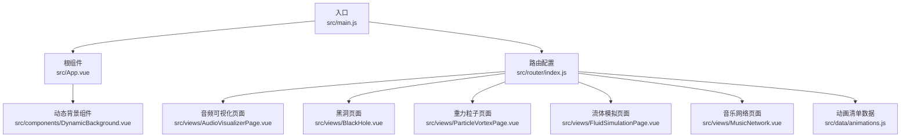
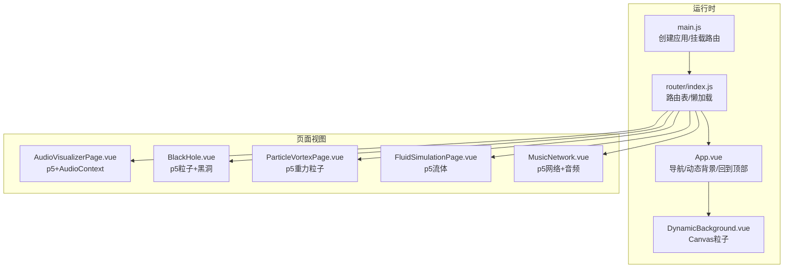
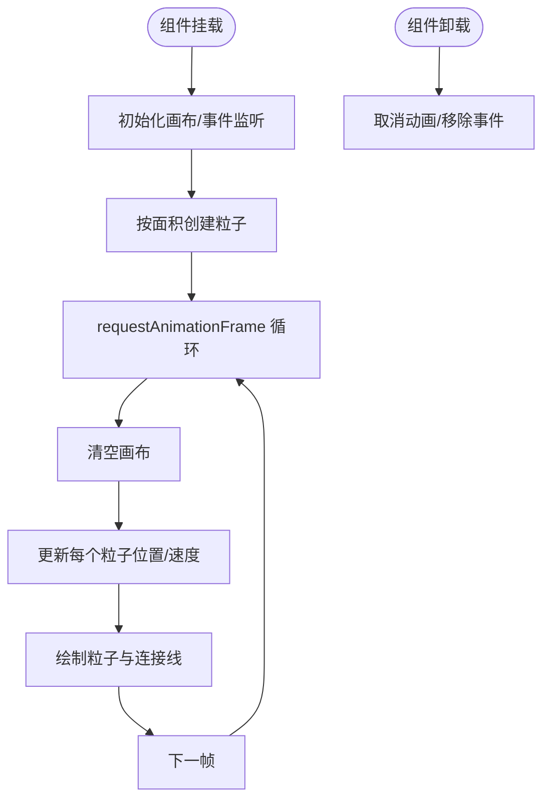
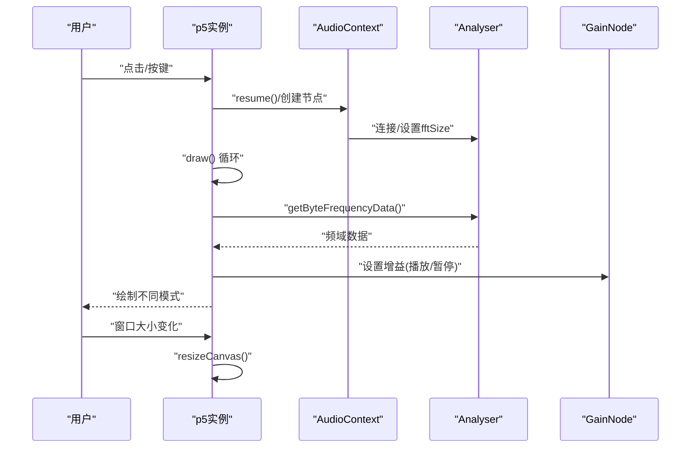
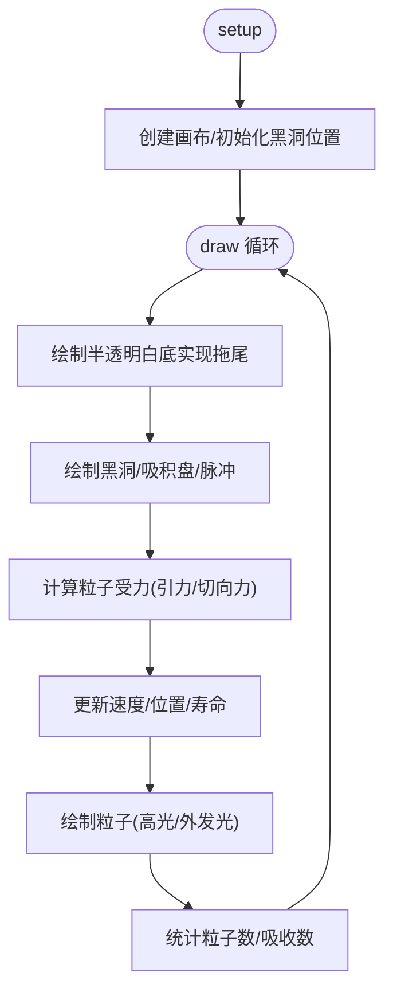
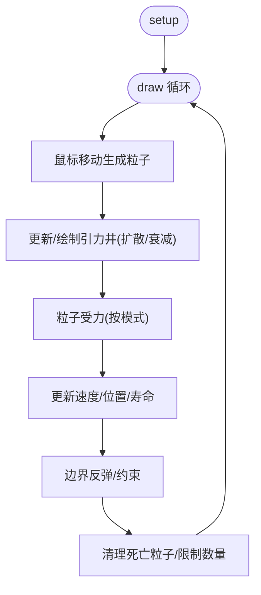
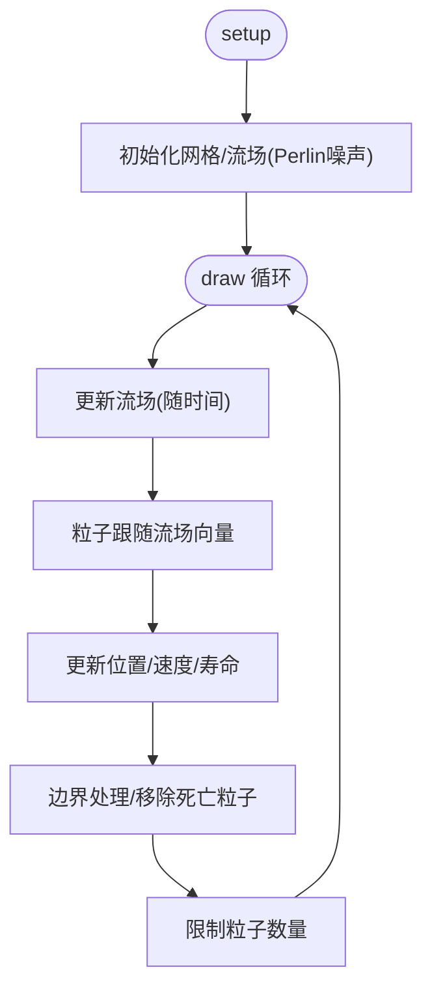
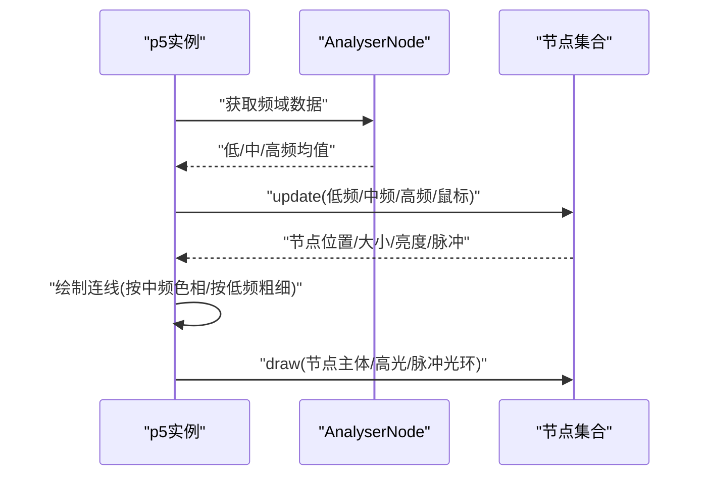
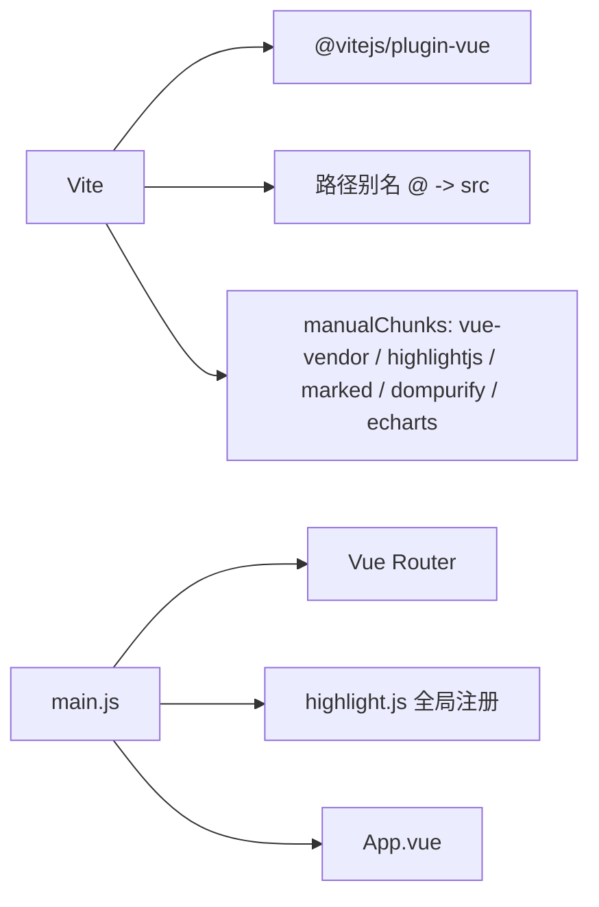

# 调试与测试

<cite>
**本文引用的文件**
- [package.json](file://package.json)
- [vite.config.js](file://vite.config.js)
- [src/main.js](file://src/main.js)
- [src/App.vue](file://src/App.vue)
- [src/router/index.js](file://src/router/index.js)
- [src/components/DynamicBackground.vue](file://src/components/DynamicBackground.vue)
- [src/views/AudioVisualizerPage.vue](file://src/views/AudioVisualizerPage.vue)
- [src/views/BlackHole.vue](file://src/views/BlackHole.vue)
- [src/views/ParticleVortexPage.vue](file://src/views/ParticleVortexPage.vue)
- [src/views/FluidSimulationPage.vue](file://src/views/FluidSimulationPage.vue)
- [src/views/MusicNetwork.vue](file://src/views/MusicNetwork.vue)
- [src/data/animations.js](file://src/data/animations.js)
- [README.md](file://README.md)
</cite>

## 目录
1. [简介](#简介)
2. [项目结构](#项目结构)
3. [核心组件](#核心组件)
4. [架构总览](#架构总览)
5. [详细组件分析](#详细组件分析)
6. [依赖关系分析](#依赖关系分析)
7. [性能考量](#性能考量)
8. [故障排查指南](#故障排查指南)
9. [结论](#结论)
10. [附录](#附录)

## 简介
本指南面向前端开发者，围绕该 Vue 3 + Vite 项目提供系统性的调试与测试实践，重点覆盖：
- 浏览器开发者工具与性能分析
- Vue DevTools 的安装与使用（组件状态监控、时间旅行调试、性能分析）
- 动画与可视化性能调试（帧率监控、内存泄漏检测、GPU 性能分析）
- 单元测试与集成测试（Jest/Cypress 配置与实践建议）
- 移动端调试（设备模拟与触摸事件调试）
- 常见问题诊断（Canvas 性能、Three.js 渲染异常、音频 API 兼容性）

## 项目结构
该项目采用 Vue 3 单页应用结构，结合 Vite 构建，路由按需加载各动画/可视化页面，核心入口负责全局插件与路由挂载。

**图表来源**
- [src/main.js:1-12](file://src/main.js#L1-L12)
- [src/App.vue:1-62](file://src/App.vue#L1-L62)
- [src/router/index.js:1-205](file://src/router/index.js#L1-L205)
- [src/components/DynamicBackground.vue:1-185](file://src/components/DynamicBackground.vue#L1-L185)
- [src/views/AudioVisualizerPage.vue:1-346](file://src/views/AudioVisualizerPage.vue#L1-L346)
- [src/views/BlackHole.vue:1-310](file://src/views/BlackHole.vue#L1-L310)
- [src/views/ParticleVortexPage.vue:1-293](file://src/views/ParticleVortexPage.vue#L1-L293)
- [src/views/FluidSimulationPage.vue:1-281](file://src/views/FluidSimulationPage.vue#L1-L281)
- [src/views/MusicNetwork.vue:1-316](file://src/views/MusicNetwork.vue#L1-L316)
- [src/data/animations.js:1-400](file://src/data/animations.js#L1-L400)

**章节来源**
- [README.md:1-115](file://README.md#L1-L115)
- [src/main.js:1-12](file://src/main.js#L1-L12)
- [src/router/index.js:1-205](file://src/router/index.js#L1-L205)

## 核心组件
- 入口与全局配置：创建应用实例、挂载路由、注册全局高亮工具。
- 根组件：导航、动态背景、回到顶部按钮与滚动进度指示。
- 路由：按需加载各动画/可视化页面，支持滚动行为与懒加载。
- 动态背景：Canvas 粒子系统，含鼠标交互与连接线绘制。
- 视图页面：多处使用 p5.js 实现音频可视化、黑洞模拟、重力粒子、流体模拟、音乐网络等高性能渲染场景。

**章节来源**
- [src/main.js:1-12](file://src/main.js#L1-L12)
- [src/App.vue:64-122](file://src/App.vue#L64-L122)
- [src/router/index.js:1-205](file://src/router/index.js#L1-L205)
- [src/components/DynamicBackground.vue:5-172](file://src/components/DynamicBackground.vue#L5-L172)
- [src/views/AudioVisualizerPage.vue:13-297](file://src/views/AudioVisualizerPage.vue#L13-L297)
- [src/views/BlackHole.vue:14-260](file://src/views/BlackHole.vue#L14-L260)
- [src/views/ParticleVortexPage.vue:13-243](file://src/views/ParticleVortexPage.vue#L13-L243)
- [src/views/FluidSimulationPage.vue:13-231](file://src/views/FluidSimulationPage.vue#L13-L231)
- [src/views/MusicNetwork.vue:18-257](file://src/views/MusicNetwork.vue#L18-L257)

## 架构总览
整体采用“单页应用 + 懒加载路由 + Canvas/WebGL(p5) 渲染”的架构，页面级组件各自维护独立的 p5 实例与音频上下文，避免全局耦合；根组件统一注入动态背景与导航。

**图表来源**
- [src/main.js:1-12](file://src/main.js#L1-L12)
- [src/router/index.js:1-205](file://src/router/index.js#L1-L205)
- [src/App.vue:1-62](file://src/App.vue#L1-L62)
- [src/components/DynamicBackground.vue:1-185](file://src/components/DynamicBackground.vue#L1-L185)
- [src/views/AudioVisualizerPage.vue:1-346](file://src/views/AudioVisualizerPage.vue#L1-L346)
- [src/views/BlackHole.vue:1-310](file://src/views/BlackHole.vue#L1-L310)
- [src/views/ParticleVortexPage.vue:1-293](file://src/views/ParticleVortexPage.vue#L1-L293)
- [src/views/FluidSimulationPage.vue:1-281](file://src/views/FluidSimulationPage.vue#L1-L281)
- [src/views/MusicNetwork.vue:1-316](file://src/views/MusicNetwork.vue#L1-L316)

## 详细组件分析

### 动态背景组件（Canvas 粒子系统）
- 数据结构：Canvas + 粒子数组 + 鼠标交互 + 连接线计算。
- 处理逻辑：初始化画布、按分辨率动态创建粒子、每帧更新与绘制、连接邻近粒子。
- 性能要点：使用 requestAnimationFrame 控制动画；在卸载时取消动画与移除事件监听；根据容器尺寸自适应。

**图表来源**
- [src/components/DynamicBackground.vue:58-172](file://src/components/DynamicBackground.vue#L58-L172)

**章节来源**
- [src/components/DynamicBackground.vue:5-172](file://src/components/DynamicBackground.vue#L5-L172)

### 音频可视化页面（p5 + Web Audio）
- 数据结构：p5 实例、AudioContext、Analyser、Gain、Oscillator、频域数据数组、粒子集合。
- 处理逻辑：设置虚拟音频源与分析器，按模式绘制波形、柱状谱、圆形谱、波形粒子、彩虹谱；支持播放/暂停与键盘切换模式；窗口大小变化时重绘。
- 性能要点：在卸载时移除 p5 实例与关闭 AudioContext；限制粒子数量防止内存膨胀。

**图表来源**
- [src/views/AudioVisualizerPage.vue:62-297](file://src/views/AudioVisualizerPage.vue#L62-L297)

**章节来源**
- [src/views/AudioVisualizerPage.vue:13-297](file://src/views/AudioVisualizerPage.vue#L13-L297)

### 黑洞页面（p5 粒子与引力波）
- 数据结构：粒子类（普通/喷流）、黑洞位置、引力波脉冲、粒子计数。
- 处理逻辑：鼠标控制黑洞位置、粒子受引力与切向力运动、周期性产生引力波、绘制黑洞与吸积盘。
- 性能要点：半透明背景实现拖尾；限制粒子数量；合理使用颜色模式与透明度。

**图表来源**
- [src/views/BlackHole.vue:29-260](file://src/views/BlackHole.vue#L29-L260)

**章节来源**
- [src/views/BlackHole.vue:14-260](file://src/views/BlackHole.vue#L14-L260)

### 重力粒子页面（p5 重力场）
- 数据结构：粒子类、引力井类、三种重力模式（中心/线性/反转）。
- 处理逻辑：鼠标移动生成粒子，按下拖拽创建引力井，按键切换模式与调节强度，实时更新粒子受力与边界反弹。
- 性能要点：限制粒子数量；施加空气阻力；边界约束；半透明背景实现轨迹。

**图表来源**
- [src/views/ParticleVortexPage.vue:151-243](file://src/views/ParticleVortexPage.vue#L151-L243)

**章节来源**
- [src/views/ParticleVortexPage.vue:13-243](file://src/views/ParticleVortexPage.vue#L13-L243)

### 流体模拟页面（p5 流场与粒子）
- 数据结构：粒子类、网格化流场、Perlin 噪列生成初始流场、鼠标拖拽扰动流场。
- 处理逻辑：每帧更新流场角度（随时间变化），粒子沿流场向量移动，鼠标路径生成粒子并扰动局部流场。
- 性能要点：网格尺寸与流场数组规模；半透明背景实现拖尾；限制粒子数量。

**图表来源**
- [src/views/FluidSimulationPage.vue:95-231](file://src/views/FluidSimulationPage.vue#L95-L231)

**章节来源**
- [src/views/FluidSimulationPage.vue:13-231](file://src/views/FluidSimulationPage.vue#L13-L231)

### 音乐网络页面（p5 网络 + 音频）
- 数据结构：节点类（布朗运动、鼠标吸引、脉冲效果）、连线绘制、频段分析（低/中/高频）。
- 处理逻辑：根据低频脉冲触发节点脉冲，中频影响连线色相，高频影响亮度；鼠标靠近节点产生吸引力；节拍检测。
- 性能要点：半透明背景与外发光效果；按频段动态调整连线粗细与透明度。

**图表来源**
- [src/views/MusicNetwork.vue:130-257](file://src/views/MusicNetwork.vue#L130-L257)

**章节来源**
- [src/views/MusicNetwork.vue:18-257](file://src/views/MusicNetwork.vue#L18-L257)

## 依赖关系分析
- 构建与打包：Vite 插件、路径别名、手动分包策略（拆分 vue-vendor、highlightjs、marked、dompurify、echarts）。
- 运行时依赖：Vue 3、Vue Router 4、p5、three、echarts、animate.css、dompurify、highlight.js、marked。
- 入口：main.js 注册路由与全局高亮工具。

**图表来源**
- [vite.config.js:1-32](file://vite.config.js#L1-L32)
- [package.json:11-27](file://package.json#L11-L27)
- [src/main.js:1-12](file://src/main.js#L1-L12)

**章节来源**
- [vite.config.js:1-32](file://vite.config.js#L1-L32)
- [package.json:11-27](file://package.json#L11-L27)
- [src/main.js:1-12](file://src/main.js#L1-L12)

## 性能考量
- 帧率与渲染
  - 使用 requestAnimationFrame 控制动画循环，避免同步阻塞。
  - Canvas/OffscreenCanvas（若需要）可减少主线程压力；当前组件直接在主 Canvas 上绘制。
- 内存与资源
  - 卸载时移除 p5 实例与 AudioContext，避免内存泄漏。
  - 限制粒子数量，及时清理死亡粒子。
- GPU 与合成
  - 合理使用半透明与混合，避免过度合成导致掉帧。
  - 尽量使用位图而非复杂矢量绘制；必要时考虑 WebGL 替代 Canvas。
- 构建优化
  - Vite 已启用 manualChunks 拆分大依赖，减少首屏体积与缓存命中。
- 路由与懒加载
  - 路由按需加载，避免一次性加载所有动画页面。

[本节为通用指导，不直接分析具体文件]

## 故障排查指南

### 浏览器开发者工具与性能分析
- Timeline/Performance 面板
  - 录制页面交互，观察主线程耗时、布局/绘制开销、脚本执行时间。
  - 关注动画帧是否稳定，是否存在长任务阻塞。
- Memory 面板
  - 快照对比，检查是否存在未释放的 DOM、Canvas、事件监听器、p5 实例、AudioContext。
  - 特别关注卸载钩子是否正确执行。
- Layers/Rendering
  - 检查合成层与重绘区域，避免不必要的复合。
- Network 面板
  - 确认 manualChunks 生效，依赖按需加载。

### Vue DevTools 使用
- 安装与启用
  - Chrome 扩展商店安装 Vue DevTools，打开目标页面即可看到组件树。
- 组件状态监控
  - 在 App.vue 中查看滚动进度、回到顶部按钮状态；在各页面组件中查看 p5 实例、音频状态、粒子计数等响应式数据。
- 时间旅行调试
  - 在开发模式下记录组件状态变更，回放历史状态定位问题。
- 性能分析
  - 使用 Profiler 分析组件渲染次数与耗时，识别重复渲染热点。

### 动画性能调试
- 帧率监控
  - 使用 Performance 面板的 FPS 计数器或自定义帧率计数器（在组件 mounted 中初始化，在卸载时清理）。
- 内存泄漏检测
  - 卸载钩子中确认移除了所有事件监听、取消了 requestAnimationFrame、销毁了 p5 实例与 AudioContext。
- GPU 性能分析
  - 使用 Rendering 面板的 Paint Profiler 与 Layers，检查是否存在过度合成与重绘。

### 单元测试与集成测试
- 单元测试（建议使用 Jest）
  - 测试纯函数与工具模块（例如数据转换、数学计算）。
  - 对组件内部逻辑进行隔离测试，使用 jsdom 或 Vue Test Utils。
- 集成测试（建议使用 Cypress）
  - 端到端验证路由跳转、页面渲染、交互流程（如点击播放/暂停、切换模式、鼠标拖拽）。
  - 针对音频可视化页面，验证音频上下文状态与 p5 渲染一致性。
- 配置建议
  - Jest：配置环境为 jsdom，解析 Vue 文件与样式，忽略 Canvas polyfill。
  - Cypress：配置 viewport 与设备模拟，录制交互脚本并断言关键元素状态。

### 移动端调试
- 设备模拟
  - 使用浏览器 Device Toolbar 模拟不同设备与 DPR，验证 Canvas 尺寸与粒子密度。
- 触摸事件调试
  - 在移动端页面（如交互类动画）验证触摸拖拽、点击事件与滚动行为。
  - 注意移动端输入延迟与事件冒泡差异。

### 常见问题诊断
- Canvas 性能问题
  - 降低粒子数量、简化绘制逻辑、避免每帧大量新建对象；使用对象池复用。
  - 减少半透明叠加层数，合并绘制批次。
- Three.js 渲染异常
  - 若引入 Three.js，检查相机、光源、材质与渲染器设置；确认渲染循环与内存释放。
- 音频 API 兼容性
  - 使用现代浏览器的 Web Audio API，注意自动播放策略与用户手势要求；在移动端可能需要首次交互后才能激活音频上下文。

[本节为通用指导，不直接分析具体文件]

## 结论
本项目通过路由懒加载与 Canvas/p5 可视化实现了丰富的交互体验。调试与测试应重点关注：
- 动画帧率与内存管理（事件监听、实例销毁、粒子数量限制）
- 音频上下文生命周期与跨浏览器兼容
- 构建分包策略与按需加载
- 使用 Vue DevTools 与浏览器性能面板进行状态与性能分析

[本节为总结，不直接分析具体文件]

## 附录

### 调试与测试最佳实践清单
- 在组件卸载钩子中统一清理：cancelAnimationFrame、removeEventListener、p5.remove()、audioContext.close()
- 限制动态对象数量，使用对象池或阈值控制
- 使用浏览器性能面板定期录制，定位长任务与重绘热点
- 使用 Vue DevTools 进行组件状态与渲染分析
- 针对音频功能增加用户手势引导与错误提示
- 移动端调试时模拟不同 DPR 与触摸事件

[本节为通用指导，不直接分析具体文件]