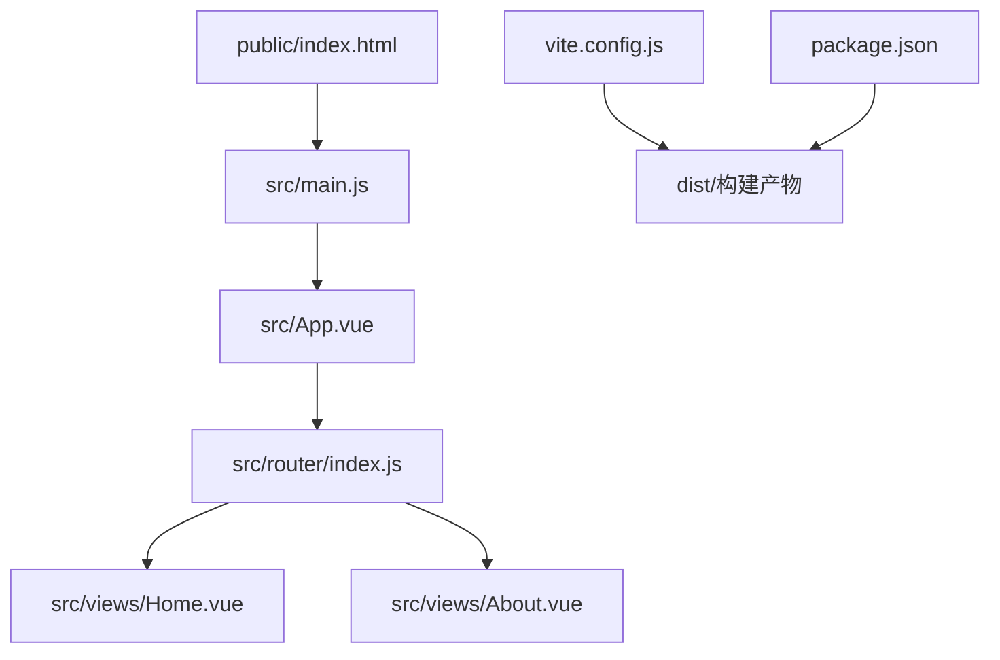
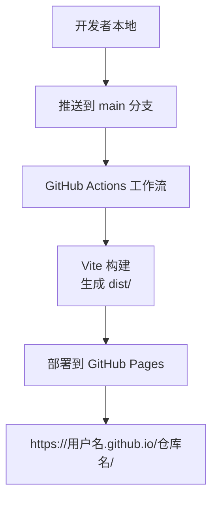
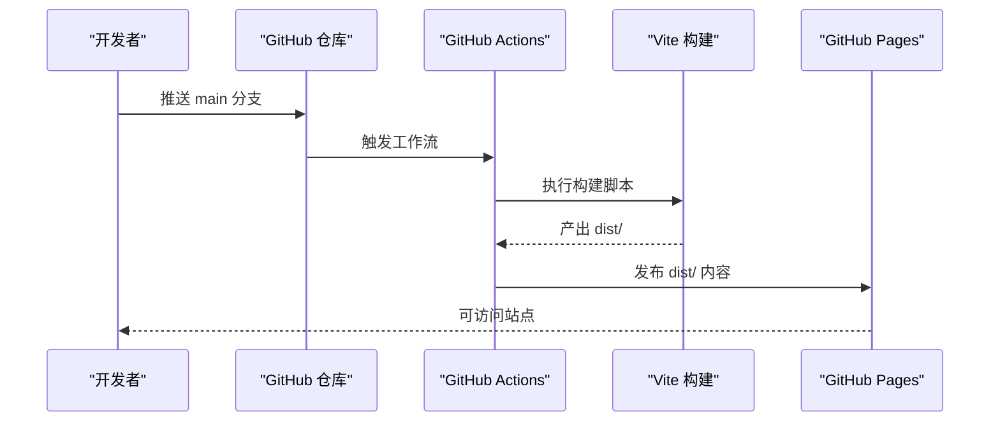
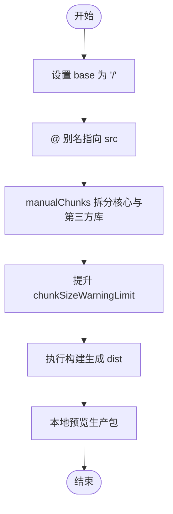
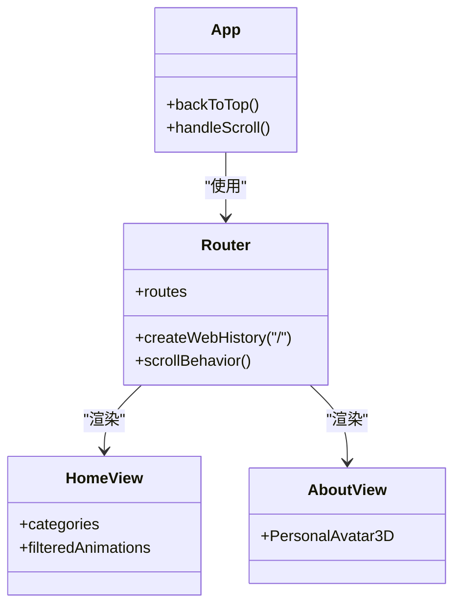
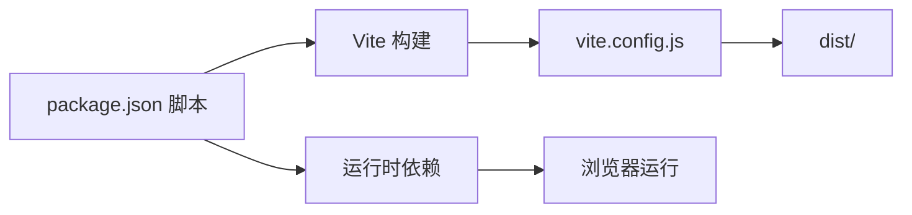

# 部署与发布

<cite>
**本文引用的文件**   
- [package.json](file://package.json)
- [vite.config.js](file://vite.config.js)
- [README.md](file://README.md)
- [index.html](file://index.html)
- [src/main.js](file://src/main.js)
- [src/router/index.js](file://src/router/index.js)
- [src/App.vue](file://src/App.vue)
- [src/views/Home.vue](file://src/views/Home.vue)
- [src/views/About.vue](file://src/views/About.vue)
</cite>

## 目录
1. [简介](#简介)
2. [项目结构](#项目结构)
3. [核心组件](#核心组件)
4. [架构总览](#架构总览)
5. [详细组件分析](#详细组件分析)
6. [依赖关系分析](#依赖关系分析)
7. [性能考量](#性能考量)
8. [故障排查指南](#故障排查指南)
9. [结论](#结论)
10. [附录](#附录)

## 简介
本指南面向使用 Vue 3 + Vite 的前端项目，聚焦于 GitHub Pages 的配置与自动化部署（GitHub Actions），并结合 Vite 构建配置进行优化，覆盖生产环境部署最佳实践（CDN、HTTPS、SEO）、版本管理策略（语义化版本与发布标签）、CI/CD 工作流、部署后监控与回滚策略，以及常见问题排查。

## 项目结构
该项目采用标准的 Vue 3 + Vite 结构，关键目录与文件如下：
- public：静态资源（如 favicon、index.html）
- src：源代码
  - components：通用组件
  - views：页面级组件
  - router：路由配置
  - App.vue、main.js：根组件与入口
- vite.config.js：Vite 构建配置
- package.json：脚本与依赖
- README.md：部署与使用说明

图表来源
- [index.html:1-15](file://index.html#L1-L15)
- [src/main.js:1-12](file://src/main.js#L1-L12)
- [src/App.vue:1-334](file://src/App.vue#L1-L334)
- [src/router/index.js:1-205](file://src/router/index.js#L1-L205)
- [src/views/Home.vue:1-349](file://src/views/Home.vue#L1-L349)
- [src/views/About.vue:1-181](file://src/views/About.vue#L1-L181)
- [vite.config.js:1-32](file://vite.config.js#L1-L32)
- [package.json:1-29](file://package.json#L1-L29)

章节来源
- [README.md:69-86](file://README.md#L69-L86)
- [package.json:1-29](file://package.json#L1-L29)
- [vite.config.js:1-32](file://vite.config.js#L1-L32)
- [index.html:1-15](file://index.html#L1-L15)
- [src/main.js:1-12](file://src/main.js#L1-L12)
- [src/router/index.js:1-205](file://src/router/index.js#L1-L205)
- [src/App.vue:1-334](file://src/App.vue#L1-L334)
- [src/views/Home.vue:1-349](file://src/views/Home.vue#L1-L349)
- [src/views/About.vue:1-181](file://src/views/About.vue#L1-L181)

## 核心组件
- 构建与打包
  - 使用 Vite 进行开发与生产构建；通过 RollupOptions 的 manualChunks 实现按需拆分核心依赖与第三方库，降低首屏体积与提升缓存命中率。
  - 通过 chunkSizeWarningLimit 提升大包容忍度，避免因 echarts 等大体积库导致的体积警告。
- 路由与页面
  - Vue Router 使用 createWebHistory，路径以“/”为基准，适配 GitHub Pages 子路径场景。
  - 多个动画/页面组件集中在 views 下，配合路由懒加载与按需渲染。
- 应用入口与全局配置
  - main.js 引入 highlight.js 并挂载至全局属性，便于代码高亮。
  - index.html 提供基础 meta 与 title，利于 SEO 与浏览器图标识别。

章节来源
- [vite.config.js:13-31](file://vite.config.js#L13-L31)
- [src/router/index.js:192-202](file://src/router/index.js#L192-L202)
- [src/main.js:1-12](file://src/main.js#L1-L12)
- [index.html:3-10](file://index.html#L3-L10)

## 架构总览
下图展示从源码到 GitHub Pages 的整体流程：开发者在本地运行或构建，GitHub Actions 在推送主分支时自动执行构建并将 dist 内容发布到 Pages。

图表来源
- [README.md:50-67](file://README.md#L50-L67)
- [package.json:6-10](file://package.json#L6-L10)
- [vite.config.js:13-16](file://vite.config.js#L13-L16)

章节来源
- [README.md:50-67](file://README.md#L50-L67)
- [package.json:6-10](file://package.json#L6-L10)

## 详细组件分析

### GitHub Pages 配置与自动化部署
- 启用 Pages
  - 在仓库 Settings → Pages 中，选择“GitHub Actions”作为 Source。
- 自动化工作流
  - README 指明已配置工作流文件 deploy.yml，位于 .github/workflows/deploy.yml。
  - 推送 main 分支即触发构建与部署。
- 访问地址
  - 部署完成后可通过 https://用户名.github.io/仓库名/ 访问站点。

图表来源
- [README.md:50-67](file://README.md#L50-L67)
- [package.json:6-10](file://package.json#L6-L10)

章节来源
- [README.md:50-67](file://README.md#L50-L67)

### Vite 构建配置优化
- 路径与别名
  - base 默认“/”，适合 Pages 子路径部署；resolve.alias 将 @ 指向 src，简化导入路径。
- 代码分割与缓存
  - manualChunks 将 vue 与 vue-router、highlight.js、marked、dompurify、echarts 等拆分为独立 chunk，提升缓存复用与并行加载效率。
- 体积警告阈值
  - chunkSizeWarningLimit 提升到 1200，缓解大库（如 echarts）带来的体积警告。
- 生产构建与预览
  - build 生成 dist；preview 用于本地预览生产包。

图表来源
- [vite.config.js:7-31](file://vite.config.js#L7-L31)
- [package.json:8-9](file://package.json#L8-L9)

章节来源
- [vite.config.js:7-31](file://vite.config.js#L7-L31)
- [package.json:8-9](file://package.json#L8-L9)

### 路由与页面渲染
- 路由历史模式
  - createWebHistory 与 “/” 基础路径，确保在 GitHub Pages 子路径下正常工作。
- 页面组件
  - Home.vue 展示动画卡片与分类筛选；About.vue 展示个人信息与联系方式。
- 全局导航与滚动行为
  - App.vue 提供返回顶部按钮与滚动进度指示，增强用户体验。

图表来源
- [src/router/index.js:192-202](file://src/router/index.js#L192-L202)
- [src/views/Home.vue:47-79](file://src/views/Home.vue#L47-L79)
- [src/views/About.vue:45-57](file://src/views/About.vue#L45-L57)
- [src/App.vue:104-121](file://src/App.vue#L104-L121)

章节来源
- [src/router/index.js:192-202](file://src/router/index.js#L192-L202)
- [src/views/Home.vue:47-79](file://src/views/Home.vue#L47-L79)
- [src/views/About.vue:45-57](file://src/views/About.vue#L45-L57)
- [src/App.vue:104-121](file://src/App.vue#L104-L121)

### SEO 与基础配置
- HTML 基础元信息
  - index.html 设置标题、描述与 viewport，有助于 SEO 与移动端适配。
- 全局代码高亮
  - main.js 引入 highlight.js 并挂载至全局，便于页面内代码块高亮。

章节来源
- [index.html:3-10](file://index.html#L3-L10)
- [src/main.js:4-6](file://src/main.js#L4-L6)

## 依赖关系分析
- 构建链路
  - package.json scripts 调用 Vite；vite.config.js 配置构建参数；最终输出 dist。
- 运行时依赖
  - Vue 3、Vue Router、highlight.js、marked、dompurify、echarts、three 等。
- 开发依赖
  - Vite、@vitejs/plugin-vue、less。

图表来源
- [package.json:6-27](file://package.json#L6-L27)
- [vite.config.js:1-32](file://vite.config.js#L1-L32)

章节来源
- [package.json:6-27](file://package.json#L6-L27)
- [vite.config.js:1-32](file://vite.config.js#L1-L32)

## 性能考量
- 代码分割
  - 使用 manualChunks 将核心库与第三方库拆分，减少单个包体积，提升缓存命中率。
- 体积阈值
  - 提升 chunkSizeWarningLimit，避免大库导致的体积警告干扰。
- 路由与组件
  - 路由懒加载与按需渲染，减少初始包体。
- SEO 与资源
  - 合理设置 meta 与标题，确保搜索引擎友好；图片与媒体资源建议外链至 CDN 以提升加载速度。

## 故障排查指南
- Pages 访问 404 或空白
  - 确认 Pages 来源为“GitHub Actions”，且工作流文件存在并可被触发。
  - 检查 base 与路由 history 配置是否匹配子路径部署。
- 构建失败
  - 检查 Node 版本与依赖安装；确认构建脚本与 Vite 配置无误。
- 资源路径错误
  - 确保 public 静态资源与 src 中相对路径引用正确；必要时使用绝对路径或 base 配置。
- SEO 不生效
  - 检查 index.html 的 meta 标签与标题是否正确设置。

章节来源
- [README.md:50-67](file://README.md#L50-L67)
- [vite.config.js:7-8](file://vite.config.js#L7-L8)
- [src/router/index.js:192-194](file://src/router/index.js#L192-L194)
- [index.html:3-10](file://index.html#L3-L10)

## 结论
本项目已具备完善的 GitHub Pages 自动化部署能力与合理的 Vite 构建优化策略。通过手动拆分关键依赖、提升体积警告阈值与正确的路由/路径配置，可在保证加载性能的同时获得良好的 SEO 体验。建议在生产环境中进一步引入 CDN、HTTPS 与监控体系，并建立规范的版本与发布标签管理流程，以保障长期稳定运行。

## 附录

### 生产环境部署最佳实践
- CDN 与缓存
  - 将静态资源托管至 CDN，利用缓存头与版本化文件名提升加载速度与缓存命中率。
- HTTPS
  - 使用 GitHub Pages 的自定义域名与 HTTPS，确保传输安全。
- SEO
  - 设置规范的 meta 标签、Open Graph 与结构化数据，提升搜索引擎可见性。
- 监控与回滚
  - 集成访问日志与错误上报；采用蓝绿/金丝雀发布策略；保留上一版本构建产物以便快速回滚。

### 版本管理与发布标签
- 语义化版本
  - 使用语义化版本号（主.次.补丁），在 package.json 中维护 version 字段。
- 发布标签
  - 推送 Git 标签以标记发布版本，便于追溯与回滚。
- 变更记录
  - 维护变更日志，记录每次发布的重要改动。

### CI/CD 工作流要点
- 触发条件
  - 仅在 main 分支推送时触发构建与部署。
- 步骤
  - 安装依赖、构建、上传 dist、发布到 Pages。
- 安全
  - 使用仓库权限最小化原则，避免泄露敏感令牌。