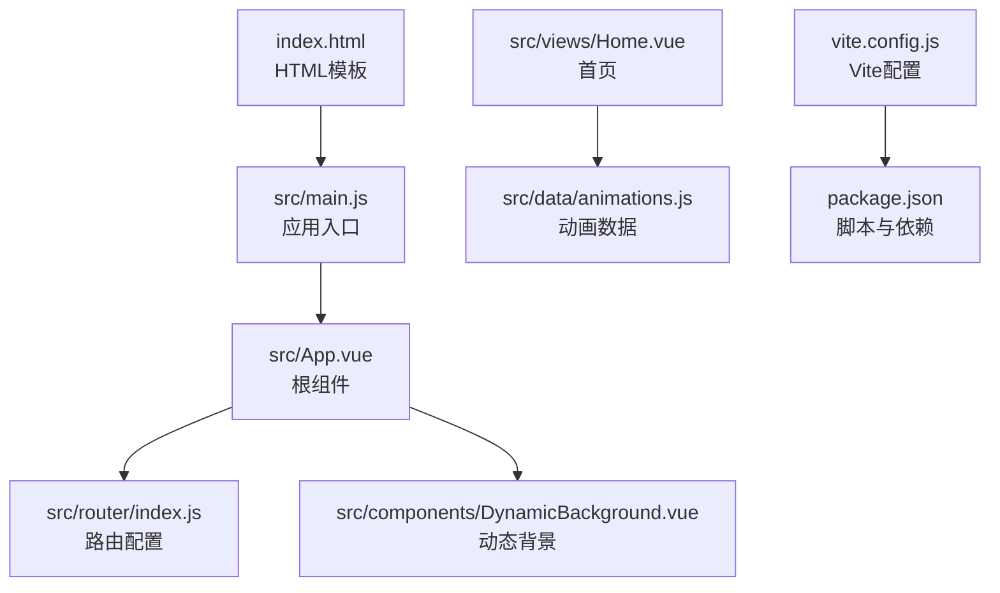
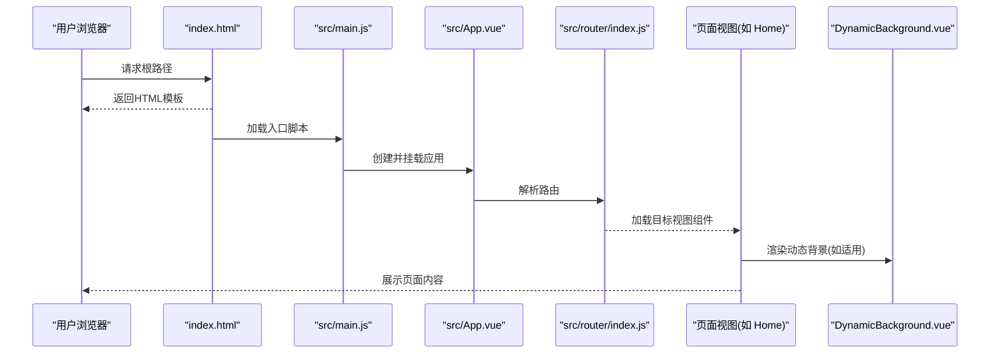
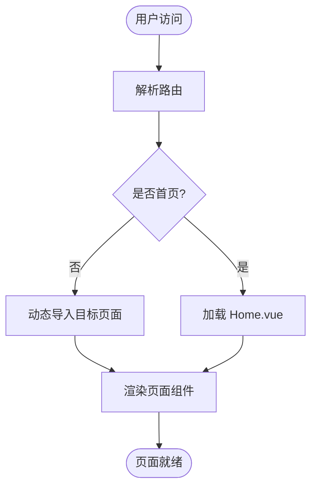
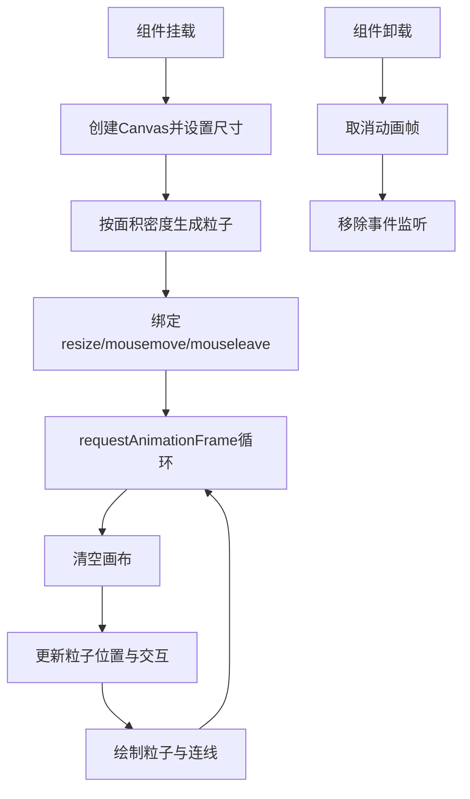
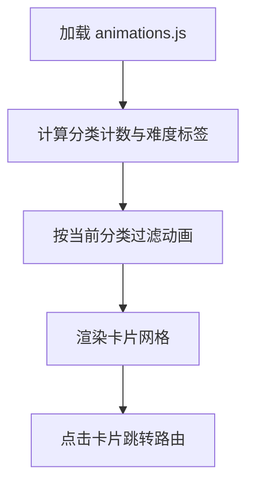
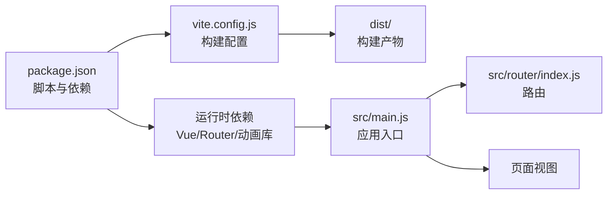

# 快速开始

<cite>
**本文引用的文件**
- [README.md](file://README.md)
- [package.json](file://package.json)
- [vite.config.js](file://vite.config.js)
- [index.html](file://index.html)
- [src/main.js](file://src/main.js)
- [src/router/index.js](file://src/router/index.js)
- [src/App.vue](file://src/App.vue)
- [src/components/DynamicBackground.vue](file://src/components/DynamicBackground.vue)
- [src/data/animations.js](file://src/data/animations.js)
- [src/views/Home.vue](file://src/views/Home.vue)
</cite>

## 目录
1. [简介](#简介)
2. [项目结构](#项目结构)
3. [核心组件](#核心组件)
4. [架构总览](#架构总览)
5. [详细组件分析](#详细组件分析)
6. [依赖关系分析](#依赖关系分析)
7. [性能注意事项](#性能注意事项)
8. [故障排除指南](#故障排除指南)
9. [结论](#结论)
10. [附录](#附录)

## 简介
本指南面向首次接触该动画博客项目的开发者，帮助你在约30分钟内完成环境准备、依赖安装、开发服务器启动与生产构建，并理解项目目录结构与关键配置。项目采用 Vue 3 + Vite 技术栈，结合多种动画与可视化库，提供丰富的交互体验。

## 项目结构
该项目采用“按功能模块组织”的前端工程化结构，核心入口与构建配置集中在根目录，源码位于 src 目录下，公共资源位于 public 目录。关键文件与职责如下：
- package.json：定义脚本命令、依赖与项目元信息
- vite.config.js：Vite 构建与开发服务器配置，含别名、打包拆分策略
- index.html：HTML 模板，定义基础 meta、标题与全局脚本注入点
- src/main.js：应用入口，创建 Vue 应用、挂载路由与代码高亮
- src/router/index.js：路由表，定义所有页面路径与懒加载组件
- src/App.vue：根组件，包含导航、动态背景与回到顶部逻辑
- src/components/DynamicBackground.vue：全屏 Canvas 动态背景与粒子交互
- src/data/animations.js：动画列表与分类数据，供首页展示
- src/views/Home.vue：首页，聚合动画卡片、分类筛选与难度标识

图表来源
- [index.html](file://index.html)
- [src/main.js](file://src/main.js)
- [src/App.vue](file://src/App.vue)
- [src/router/index.js](file://src/router/index.js)
- [src/components/DynamicBackground.vue](file://src/components/DynamicBackground.vue)
- [src/views/Home.vue](file://src/views/Home.vue)
- [src/data/animations.js](file://src/data/animations.js)
- [vite.config.js](file://vite.config.js)
- [package.json](file://package.json)

章节来源
- [README.md](file://README.md)
- [package.json](file://package.json)
- [vite.config.js](file://vite.config.js)
- [index.html](file://index.html)
- [src/main.js](file://src/main.js)
- [src/router/index.js](file://src/router/index.js)
- [src/App.vue](file://src/App.vue)
- [src/components/DynamicBackground.vue](file://src/components/DynamicBackground.vue)
- [src/data/animations.js](file://src/data/animations.js)
- [src/views/Home.vue](file://src/views/Home.vue)

## 核心组件
- 应用入口与初始化
  - 在入口文件中创建 Vue 应用、注册路由、挂载应用，并全局注册代码高亮工具。
- 根组件与导航
  - 根组件负责导航栏、动态背景、回到顶部按钮与主内容区布局。
- 路由系统
  - 使用 Vue Router 4 的历史模式，定义大量动画页面的懒加载路由，支持平滑滚动行为。
- 数据与首页
  - 首页通过读取动画数据，实现分类筛选、难度标签与卡片网格展示。
- 动态背景
  - 使用 Canvas 实现粒子系统，支持鼠标交互与粒子连线，适配窗口尺寸变化。

章节来源
- [src/main.js](file://src/main.js)
- [src/App.vue](file://src/App.vue)
- [src/router/index.js](file://src/router/index.js)
- [src/views/Home.vue](file://src/views/Home.vue)
- [src/data/animations.js](file://src/data/animations.js)
- [src/components/DynamicBackground.vue](file://src/components/DynamicBackground.vue)

## 架构总览
下图展示了从浏览器请求到页面渲染的关键流程：浏览器加载 HTML 模板，执行入口脚本，创建应用实例，解析路由并渲染对应视图，同时加载动态背景与动画资源。

图表来源
- [index.html](file://index.html)
- [src/main.js](file://src/main.js)
- [src/App.vue](file://src/App.vue)
- [src/router/index.js](file://src/router/index.js)
- [src/views/Home.vue](file://src/views/Home.vue)
- [src/components/DynamicBackground.vue](file://src/components/DynamicBackground.vue)

## 详细组件分析

### 路由与页面导航
- 路由采用 Web History 模式，基础路径为根路径，支持滚动行为记忆。
- 路由表包含多个动画页面，均通过动态导入实现按需加载，减少首屏体积。
- 首页作为默认路由，其余页面通过导航或卡片跳转进入。

图表来源
- [src/router/index.js](file://src/router/index.js)
- [src/views/Home.vue](file://src/views/Home.vue)

章节来源
- [src/router/index.js](file://src/router/index.js)
- [src/views/Home.vue](file://src/views/Home.vue)

### 动态背景与粒子系统
- 使用 Canvas 绘制粒子，根据窗口尺寸动态调整画布大小。
- 粒子具备边界反弹与鼠标交互，临近粒子之间绘制透明连线。
- 组件挂载时初始化画布与事件监听，卸载时清理动画帧与事件，避免内存泄漏。

图表来源
- [src/components/DynamicBackground.vue](file://src/components/DynamicBackground.vue)

章节来源
- [src/components/DynamicBackground.vue](file://src/components/DynamicBackground.vue)

### 首页数据与筛选
- 首页读取动画数据，支持按分类过滤与难度标签本地化。
- 使用过渡列表渲染动画卡片，点击卡片跳转至对应路由。

图表来源
- [src/views/Home.vue](file://src/views/Home.vue)
- [src/data/animations.js](file://src/data/animations.js)

章节来源
- [src/views/Home.vue](file://src/views/Home.vue)
- [src/data/animations.js](file://src/data/animations.js)

## 依赖关系分析
- 包管理与脚本
  - 通过 package.json 提供 dev/build/preview 三类脚本，分别用于开发、构建与预览。
- 构建与拆分
  - Vite 配置启用 Vue 插件与路径别名，构建阶段对核心依赖与第三方库进行手动分包，降低单块体积并提升缓存命中率。
- 运行时依赖
  - Vue 3、Vue Router 4、Three.js、p5.js、ECharts、Highlight.js、Marked、DOMPurify 等库构成页面交互与可视化能力。

图表来源
- [package.json](file://package.json)
- [vite.config.js](file://vite.config.js)
- [src/main.js](file://src/main.js)
- [src/router/index.js](file://src/router/index.js)

章节来源
- [package.json](file://package.json)
- [vite.config.js](file://vite.config.js)
- [src/main.js](file://src/main.js)
- [src/router/index.js](file://src/router/index.js)

## 性能注意事项
- 构建拆分策略
  - 通过 Rollup 的 manualChunks 将 Vue 生态与第三方库拆分为独立 chunk，有利于浏览器缓存复用与并行加载。
- 警告阈值调整
  - 针对大体积库（如 ECharts）调整 chunkSizeWarningLimit，避免过早触发体积警告。
- 代码分割
  - 路由组件采用动态导入，仅在访问时加载，显著降低首屏 JS 体积。

章节来源
- [vite.config.js](file://vite.config.js)

## 故障排除指南
- Node.js 版本不兼容
  - 环境要求 Node.js 18+，若出现编译错误或运行异常，请升级到推荐版本后再试。
- 包管理器选择
  - 支持 npm 或 yarn，建议统一团队使用的包管理器，避免 lock 文件冲突。
- 依赖安装失败
  - 若安装过程中出现网络超时或权限问题，可尝试更换镜像源或使用代理；必要时删除 node_modules 与锁定文件后重装。
- 开发服务器无法启动
  - 确认未占用默认端口（如 5173），若被占用可调整 Vite 端口或释放端口后重试。
- 构建产物为空或缺少资源
  - 确认构建命令已正确执行且无报错；检查输出目录 dist 是否存在；如使用自定义 base，请同步调整部署路径。
- 动态背景不渲染或闪烁
  - 检查浏览器控制台是否存在跨域或脚本加载错误；确认 Canvas 容器可见且尺寸有效；尝试刷新页面或禁用浏览器扩展后重试。
- 路由跳转无效
  - 确认路由路径与组件导出一致；检查路由模式与基础路径配置；在开发环境下留意控制台的路由警告信息。

章节来源
- [README.md](file://README.md)
- [vite.config.js](file://vite.config.js)
- [src/components/DynamicBackground.vue](file://src/components/DynamicBackground.vue)
- [src/router/index.js](file://src/router/index.js)

## 结论
本项目以 Vue 3 + Vite 为基础，结合丰富的动画与可视化库，提供了良好的开发体验与可扩展性。按照本指南完成环境准备与基础操作后，你可以在本地快速预览与调试，并顺利产出生产构建。后续可根据需要扩展新页面、优化性能或接入 CI/CD 流水线。

## 附录

### 环境要求与安装步骤
- 环境要求
  - Node.js 18+
  - 包管理器：npm 或 yarn
- 安装依赖
  - 在项目根目录执行安装命令，等待依赖下载完成。
- 启动开发服务器
  - 执行开发脚本后，在浏览器打开指定地址即可查看页面。
- 构建生产版本
  - 执行构建脚本，产物输出至 dist 目录，可直接部署至静态服务器或 GitHub Pages。

章节来源
- [README.md](file://README.md)
- [package.json](file://package.json)

### 关键配置文件说明
- package.json
  - 定义项目名称、版本、脚本命令与依赖项，决定开发与构建流程。
- vite.config.js
  - 配置插件、路径别名、构建输出目录与手动分包策略，影响打包体积与缓存效率。
- index.html
  - 提供 HTML 模板与全局 meta 标签，定义应用挂载点与外部脚本注入位置。
- src/main.js
  - 创建 Vue 应用、注册路由与代码高亮，负责应用初始化与全局配置。
- src/router/index.js
  - 定义所有页面路由与懒加载策略，支持滚动行为与历史模式。
- src/App.vue
  - 根组件，承载导航、动态背景与回到顶部交互。
- src/components/DynamicBackground.vue
  - Canvas 粒子系统，实现动态背景与鼠标交互。
- src/data/animations.js
  - 首页动画列表与分类数据，供首页筛选与展示。
- src/views/Home.vue
  - 首页视图，负责分类筛选、难度标签与卡片网格渲染。

章节来源
- [package.json](file://package.json)
- [vite.config.js](file://vite.config.js)
- [index.html](file://index.html)
- [src/main.js](file://src/main.js)
- [src/router/index.js](file://src/router/index.js)
- [src/App.vue](file://src/App.vue)
- [src/components/DynamicBackground.vue](file://src/components/DynamicBackground.vue)
- [src/data/animations.js](file://src/data/animations.js)
- [src/views/Home.vue](file://src/views/Home.vue)