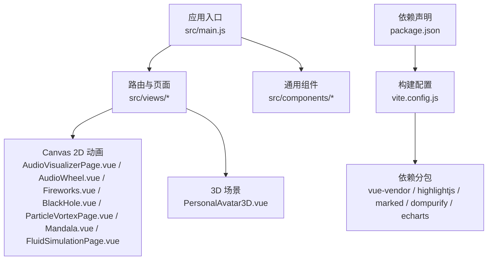
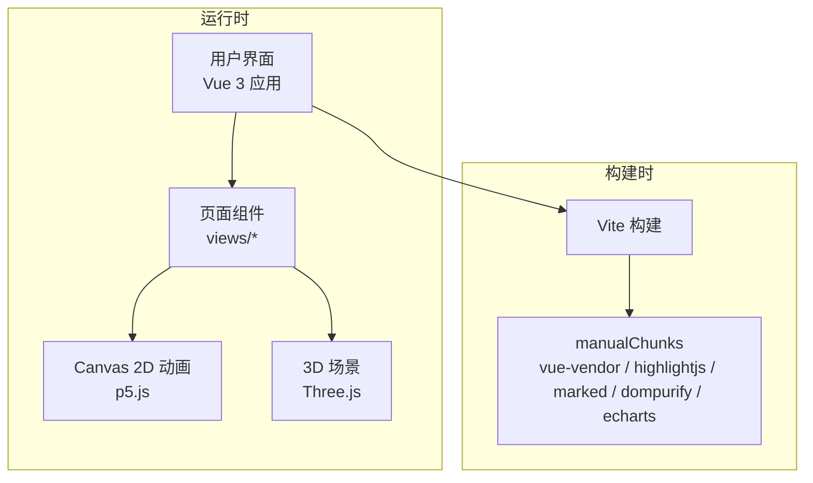
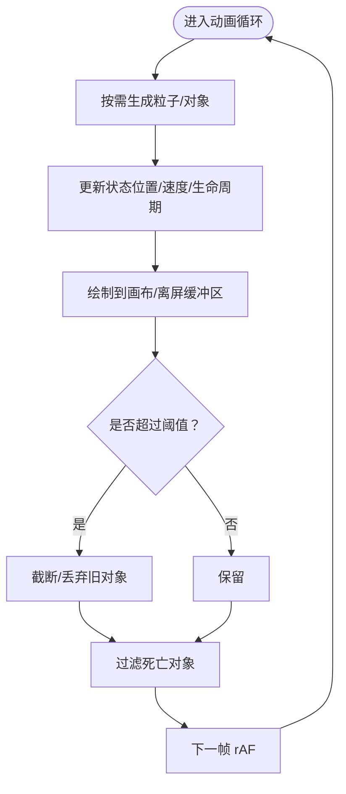
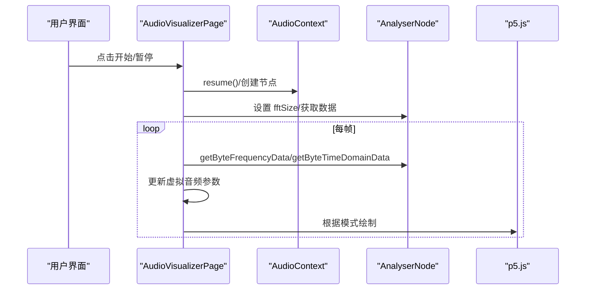
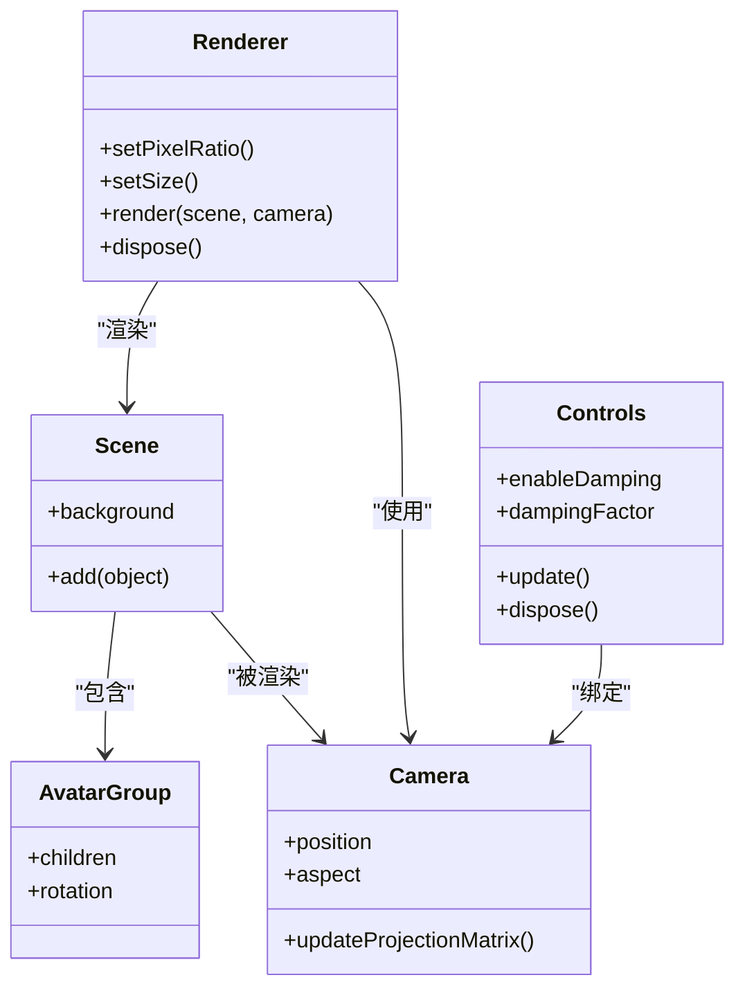
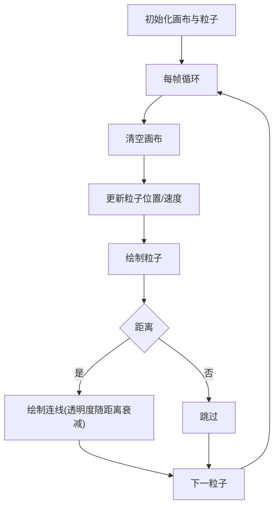
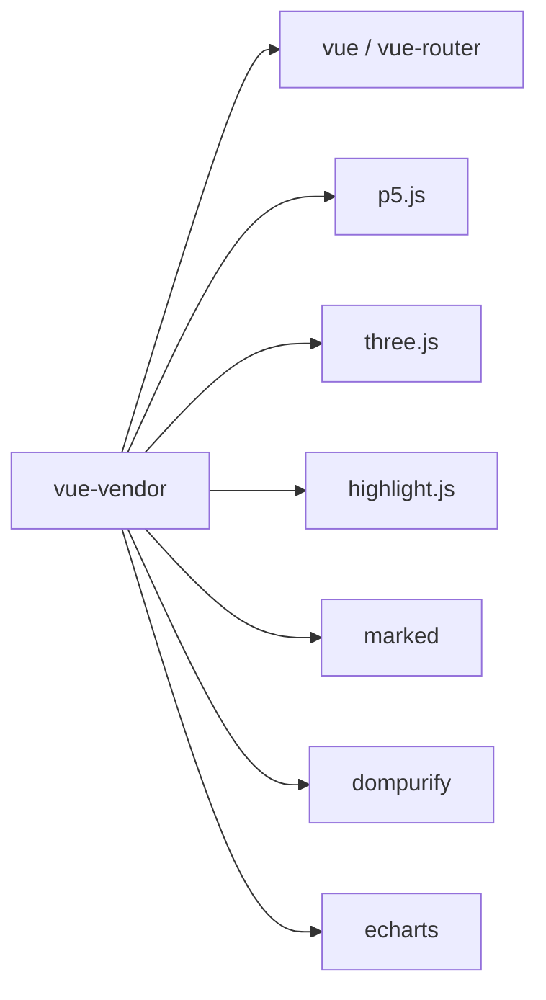

# 性能优化

<cite>
**本文引用的文件**
- [README.md](file://README.md)
- [package.json](file://package.json)
- [vite.config.js](file://vite.config.js)
- [src/main.js](file://src/main.js)
- [src/components/DynamicBackground.vue](file://src/components/DynamicBackground.vue)
- [src/components/PersonalAvatar3D.vue](file://src/components/PersonalAvatar3D.vue)
- [src/views/AudioVisualizerPage.vue](file://src/views/AudioVisualizerPage.vue)
- [src/views/AudioWheel.vue](file://src/views/AudioWheel.vue)
- [src/views/Fireworks.vue](file://src/views/Fireworks.vue)
- [src/views/BlackHole.vue](file://src/views/BlackHole.vue)
- [src/views/ParticleVortexPage.vue](file://src/views/ParticleVortexPage.vue)
- [src/views/Mandala.vue](file://src/views/Mandala.vue)
- [src/views/FluidSimulationPage.vue](file://src/views/FluidSimulationPage.vue)
- [src/data/animations.js](file://src/data/animations.js)
</cite>

## 目录
1. [简介](#简介)
2. [项目结构](#项目结构)
3. [核心组件](#核心组件)
4. [架构总览](#架构总览)
5. [详细组件分析](#详细组件分析)
6. [依赖关系分析](#依赖关系分析)
7. [性能考量与优化策略](#性能考量与优化策略)
8. [性能监控与指标分析](#性能监控与指标分析)
9. [移动端适配与体验优化](#移动端适配与体验优化)
10. [故障排查指南](#故障排查指南)
11. [结论](#结论)

## 简介
本文件面向动画博客项目的性能优化，聚焦三类核心能力：
- Canvas 2D 动画：粒子数量控制、动画循环优化、内存管理策略
- 3D 场景渲染：Three.js 的渲染优化、几何体简化与材质优化
- 音频可视化：Web Audio API 的高效使用与实时处理优化
同时提供性能监控工具使用指南、性能指标分析方法、移动端适配策略与用户体验提升技巧。

## 项目结构
项目采用 Vue 3 + Vite 构建，页面组件集中于 views 目录，通用组件位于 components 目录，入口在 main.js，打包与分包策略在 vite.config.js 中配置。音频可视化广泛使用 p5.js，3D 场景使用 Three.js，构建阶段通过手动分包策略拆分依赖，降低首屏体积。

图表来源
- [src/main.js:1-12](file://src/main.js#L1-L12)
- [vite.config.js:1-32](file://vite.config.js#L1-L32)
- [package.json:1-29](file://package.json#L1-L29)

章节来源
- [README.md:69-86](file://README.md#L69-L86)
- [src/main.js:1-12](file://src/main.js#L1-L12)
- [vite.config.js:13-31](file://vite.config.js#L13-L31)
- [package.json:11-22](file://package.json#L11-L22)

## 核心组件
- Canvas 2D 动画组件：AudioVisualizerPage、AudioWheel、Fireworks、BlackHole、ParticleVortexPage、Mandala、FluidSimulationPage
- 3D 场景组件：PersonalAvatar3D
- 通用背景：DynamicBackground（粒子背景）
- 动画清单：animations.js

章节来源
- [src/views/AudioVisualizerPage.vue:1-346](file://src/views/AudioVisualizerPage.vue#L1-L346)
- [src/views/AudioWheel.vue:1-250](file://src/views/AudioWheel.vue#L1-L250)
- [src/views/Fireworks.vue:1-339](file://src/views/Fireworks.vue#L1-L339)
- [src/views/BlackHole.vue:1-310](file://src/views/BlackHole.vue#L1-L310)
- [src/views/ParticleVortexPage.vue:1-293](file://src/views/ParticleVortexPage.vue#L1-L293)
- [src/views/Mandala.vue:1-261](file://src/views/Mandala.vue#L1-L261)
- [src/views/FluidSimulationPage.vue:1-281](file://src/views/FluidSimulationPage.vue#L1-L281)
- [src/components/PersonalAvatar3D.vue:1-344](file://src/components/PersonalAvatar3D.vue#L1-L344)
- [src/components/DynamicBackground.vue:1-185](file://src/components/DynamicBackground.vue#L1-L185)
- [src/data/animations.js:1-400](file://src/data/animations.js#L1-L400)

## 架构总览
整体架构围绕“页面组件 + 通用组件 + 依赖分包”的思路组织。页面组件负责具体动画逻辑，通用组件复用度高；构建阶段通过 Rollup manualChunks 将大体量依赖拆分，减少单个 chunk 体积，提升加载与执行效率。

图表来源
- [vite.config.js:17-29](file://vite.config.js#L17-L29)
- [package.json:11-22](file://package.json#L11-L22)

章节来源
- [vite.config.js:13-31](file://vite.config.js#L13-L31)
- [package.json:11-22](file://package.json#L11-L22)

## 详细组件分析

### Canvas 2D 动画：粒子数量控制与内存管理
- 控制策略
  - 动态粒子上限：如 ParticleVortexPage 限制粒子数量，超过阈值进行截断；FluidSimulationPage 同样限制最大粒子数，避免内存膨胀。
  - 按需生成：Mandala 使用离屏缓冲区（graphics）先绘制再一次性合成，减少主画布频繁绘制；BlackHole 按帧率概率生成粒子，避免持续高频创建。
  - 生命周期管理：ParticleVortexPage、FluidSimulationPage、Fireworks 中的粒子均在生命周期结束时从数组剔除，防止累积。
- 动画循环优化
  - 使用 requestAnimationFrame（p5.js 内部 draw 循环）统一调度，避免自定义定时器造成的抖动。
  - 半透明背景覆盖实现“拖尾”效果，减少全量重绘开销。
- 内存管理
  - 页面卸载时统一移除 p5 实例，释放 DOM 与上下文资源。
  - Three.js 场景组件在卸载时 dispose 渲染器与控制器，移除 DOM，避免内存泄漏。

图表来源
- [src/views/ParticleVortexPage.vue:189-192](file://src/views/ParticleVortexPage.vue#L189-L192)
- [src/views/FluidSimulationPage.vue:135-138](file://src/views/FluidSimulationPage.vue#L135-L138)
- [src/views/Fireworks.vue:226-242](file://src/views/Fireworks.vue#L226-L242)
- [src/views/Mandala.vue:31-33](file://src/views/Mandala.vue#L31-L33)

章节来源
- [src/views/ParticleVortexPage.vue:189-192](file://src/views/ParticleVortexPage.vue#L189-L192)
- [src/views/FluidSimulationPage.vue:135-138](file://src/views/FluidSimulationPage.vue#L135-L138)
- [src/views/Fireworks.vue:226-242](file://src/views/Fireworks.vue#L226-L242)
- [src/views/Mandala.vue:31-33](file://src/views/Mandala.vue#L31-L33)
- [src/views/BlackHole.vue:204-217](file://src/views/BlackHole.vue#L204-L217)

### Canvas 2D 音频可视化：Web Audio API 与实时处理
- 音频链路
  - 创建 AudioContext 与 Analyser，设置 fftSize，周期性读取频域/时域数据。
  - 使用虚拟音频源（振荡器）模拟音乐，动态调整频率与谐波混合，维持实时性。
- 绘制策略
  - AudioVisualizerPage 支持多种模式：波形图、频谱柱状图、圆形频谱、波形粒子、彩虹频谱；根据模式切换绘制路径，避免不必要的计算。
  - AudioWheel 使用历史帧聚合与平滑算法，减少闪烁与抖动，同时通过旋转中心偏移增强空间感。
- 性能要点
  - 仅在播放状态才采集与绘制，未播放时绘制提示文本。
  - 限制粒子数量（如 WaveParticles），避免高频创建销毁带来的 GC 压力。
  - 使用半透明背景覆盖实现拖尾，减少全量重绘。

图表来源
- [src/views/AudioVisualizerPage.vue:68-90](file://src/views/AudioVisualizerPage.vue#L68-L90)
- [src/views/AudioVisualizerPage.vue:103-124](file://src/views/AudioVisualizerPage.vue#L103-L124)
- [src/views/AudioWheel.vue:64-88](file://src/views/AudioWheel.vue#L64-L88)
- [src/views/AudioWheel.vue:90-99](file://src/views/AudioWheel.vue#L90-L99)

章节来源
- [src/views/AudioVisualizerPage.vue:68-90](file://src/views/AudioVisualizerPage.vue#L68-L90)
- [src/views/AudioVisualizerPage.vue:103-124](file://src/views/AudioVisualizerPage.vue#L103-L124)
- [src/views/AudioWheel.vue:64-88](file://src/views/AudioWheel.vue#L64-L88)
- [src/views/AudioWheel.vue:90-99](file://src/views/AudioWheel.vue#L90-L99)

### 3D 场景渲染：Three.js 优化与几何体/材质
- 渲染器与像素比
  - 使用 setPixelRatio 并限制最大值，兼顾清晰度与性能。
- 几何体与材质
  - 使用基础几何体组合（BoxGeometry 等）构建模型，避免复杂网格；必要时使用 BufferGeometry 与 InstancedMesh（建议）进一步优化。
  - 材质采用标准材质，开启必要的抗锯齿与透明通道，避免过度昂贵的着色器。
- 控制与交互
  - OrbitControls 启用阻尼与 damping，减少频繁重绘；禁用缩放等不必要操作。
- 动画循环
  - 使用 requestAnimationFrame 驱动渲染；每帧更新控制器与渲染场景，避免多余计算。
- 卸载清理
  - dispose 渲染器与控制器，移除 DOM，防止内存泄漏。

图表来源
- [src/components/PersonalAvatar3D.vue:19-61](file://src/components/PersonalAvatar3D.vue#L19-L61)
- [src/components/PersonalAvatar3D.vue:275-293](file://src/components/PersonalAvatar3D.vue#L275-L293)
- [src/components/PersonalAvatar3D.vue:313-331](file://src/components/PersonalAvatar3D.vue#L313-L331)

章节来源
- [src/components/PersonalAvatar3D.vue:36-38](file://src/components/PersonalAvatar3D.vue#L36-L38)
- [src/components/PersonalAvatar3D.vue:275-293](file://src/components/PersonalAvatar3D.vue#L275-L293)
- [src/components/PersonalAvatar3D.vue:313-331](file://src/components/PersonalAvatar3D.vue#L313-L331)

### Canvas 2D 背景：粒子连接与边界处理
- 粒子数量：按画布面积估算，避免过多粒子导致 O(n^2) 连线成本。
- 连线策略：仅在距离阈值内连线，使用透明度随距离衰减，降低绘制负担。
- 边界与交互：边界反弹与鼠标排斥力，保持稳定性与响应性。

图表来源
- [src/components/DynamicBackground.vue:58-86](file://src/components/DynamicBackground.vue#L58-L86)
- [src/components/DynamicBackground.vue:117-132](file://src/components/DynamicBackground.vue#L117-L132)
- [src/components/DynamicBackground.vue:134-154](file://src/components/DynamicBackground.vue#L134-L154)

章节来源
- [src/components/DynamicBackground.vue:89-96](file://src/components/DynamicBackground.vue#L89-L96)
- [src/components/DynamicBackground.vue:134-154](file://src/components/DynamicBackground.vue#L134-L154)

## 依赖关系分析
- 依赖拆分：通过 manualChunks 将 Vue 生态与第三方库拆分为独立 chunk，降低首屏依赖体积。
- 大型库按需：如 ECharts 仅在特定页面使用，避免全局引入造成体积膨胀。
- 运行时依赖：p5.js、Three.js、highlight.js、marked、dompurify、echarts 等按需加载。

图表来源
- [vite.config.js:19-28](file://vite.config.js#L19-L28)

章节来源
- [vite.config.js:13-31](file://vite.config.js#L13-L31)
- [package.json:11-22](file://package.json#L11-L22)

## 性能考量与优化策略

### Canvas 2D 动画优化
- 粒子数量控制
  - 依据画布面积动态估算粒子数量，避免 O(n^2) 连线与碰撞检测。
  - 设定最大阈值并截断，结合生命周期管理及时回收。
- 动画循环优化
  - 使用 rAF 统一调度，避免 setTimeout/setInterval 的抖动。
  - 采用半透明背景覆盖实现拖尾，减少全量重绘。
- 内存管理
  - 页面/组件卸载时移除实例、事件监听与 DOM，防止内存泄漏。
  - 对象池化（建议）：复用粒子/对象，减少频繁分配与 GC。

### 3D 场景渲染优化
- 渲染器与像素比
  - setPixelRatio 并限制最大值，兼顾清晰度与性能。
- 几何体与材质
  - 使用基础几何体组合，必要时使用 BufferGeometry 与 InstancedMesh。
  - 材质避免过度昂贵的着色器与多重贴图。
- 控制与交互
  - OrbitControls 启用阻尼与 damping，减少频繁重绘。
- 动画循环
  - 每帧仅更新控制器与渲染场景，避免冗余计算。

### 音频可视化优化
- Web Audio API
  - 合理设置 fftSize，平衡分辨率与性能；仅在播放状态采集与绘制。
  - 使用虚拟音频源模拟音乐，避免外部音频资源加载开销。
- 实时处理
  - 历史帧聚合与平滑算法减少闪烁；根据模式切换绘制路径。
  - 限制粒子数量，避免高频创建销毁带来的 GC 压力。

### 构建与分包优化
- manualChunks 拆分核心依赖与第三方库，降低单个 chunk 体积。
- 大型库按需引入，避免全局引入造成体积膨胀。

章节来源
- [vite.config.js:13-31](file://vite.config.js#L13-L31)
- [src/views/ParticleVortexPage.vue:189-192](file://src/views/ParticleVortexPage.vue#L189-L192)
- [src/views/FluidSimulationPage.vue:135-138](file://src/views/FluidSimulationPage.vue#L135-L138)
- [src/views/AudioVisualizerPage.vue:103-124](file://src/views/AudioVisualizerPage.vue#L103-L124)
- [src/views/AudioWheel.vue:90-99](file://src/views/AudioWheel.vue#L90-L99)

## 性能监控与指标分析
- 监控工具
  - 浏览器开发者工具：Performance 面板记录帧耗时、GC 活动；Memory 面板观察堆内存增长。
  - Lighthouse：评估首屏加载、交互延迟与内存使用。
  - FPS 计数器：在页面叠加 FPS 显示，直观感知帧率波动。
- 关键指标
  - 帧率（FPS）：目标稳定在 60fps；出现掉帧时优先检查粒子数量与绘制路径。
  - 回收周期（GC）：观察 GC 频率与暂停时间，定位内存泄漏或频繁分配。
  - CPU/内存峰值：关注长时间运行动画的峰值，避免主线程阻塞。
  - 首屏加载：关注 manualChunks 拆分后的加载时间与缓存命中情况。
- 分析方法
  - 逐步禁用功能模块，定位性能瓶颈（如连线绘制、历史帧聚合、控制器更新）。
  - 对热点函数进行采样，识别高耗时操作（如距离计算、颜色映射）。

章节来源
- [vite.config.js:13-31](file://vite.config.js#L13-L31)

## 移动端适配与体验优化
- 触摸交互
  - Canvas 2D 动画使用触摸事件替代鼠标事件，保证移动端可用性。
  - 3D 场景启用 OrbitControls 的移动端适配参数，提升操控体验。
- 性能权衡
  - 降低粒子数量与绘制复杂度，避免移动端发热与电量消耗。
  - 适当降低像素比或关闭抗锯齿，换取更流畅的帧率。
- 用户体验
  - 提供暂停/继续按钮，允许用户主动降低负载。
  - 在低端设备上提供“简化模式”，关闭非关键特效。

章节来源
- [src/views/AudioVisualizerPage.vue:253-266](file://src/views/AudioVisualizerPage.vue#L253-L266)
- [src/views/AudioWheel.vue:107-109](file://src/views/AudioWheel.vue#L107-L109)
- [src/components/PersonalAvatar3D.vue:42-44](file://src/components/PersonalAvatar3D.vue#L42-L44)

## 故障排查指南
- 动画卡顿
  - 检查粒子数量是否超过阈值；确认是否启用了历史帧聚合与平滑算法。
  - 观察 rAF 回调中的计算量，是否存在不必要的颜色映射或数学运算。
- 内存泄漏
  - 确认页面/组件卸载时是否移除了 p5 实例、Three.js 渲染器与控制器。
  - 检查事件监听器是否正确移除，避免闭包持有导致的泄漏。
- 音频无声或异常
  - 确认 AudioContext 是否处于 suspended 状态，需要用户交互后 resume。
  - 检查 Analyser 的 fftSize 设置与数据读取时机，避免阻塞主线程。
- 3D 场景黑屏或渲染异常
  - 检查相机投影矩阵与渲染器尺寸是否同步更新。
  - 确认材质与几何体是否正确创建，避免无效渲染。

章节来源
- [src/views/Fireworks.vue:285-289](file://src/views/Fireworks.vue#L285-L289)
- [src/views/BlackHole.vue:256-260](file://src/views/BlackHole.vue#L256-L260)
- [src/views/AudioVisualizerPage.vue:290-297](file://src/views/AudioVisualizerPage.vue#L290-L297)
- [src/components/PersonalAvatar3D.vue:313-331](file://src/components/PersonalAvatar3D.vue#L313-L331)

## 结论
本项目在 Canvas 2D、3D 与音频可视化三大领域均具备明确的性能优化路径：通过合理的粒子数量控制、动画循环优化与内存管理策略，结合 Three.js 的渲染与材质优化，以及 Web Audio API 的高效使用与实时处理，能够在桌面与移动端获得稳定的性能表现。配合构建期的依赖拆分与按需加载，进一步降低首屏体积与加载压力。建议持续使用性能监控工具进行回归测试，并根据设备差异提供“简化模式”，以提升整体用户体验。