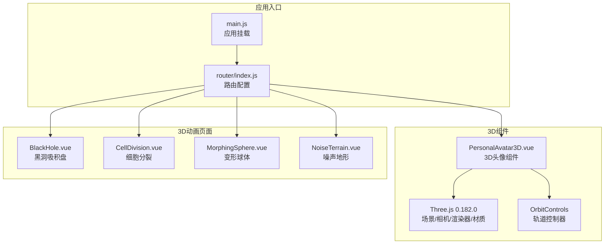
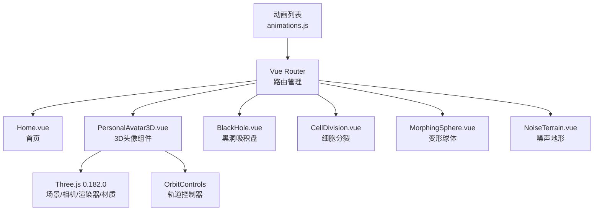
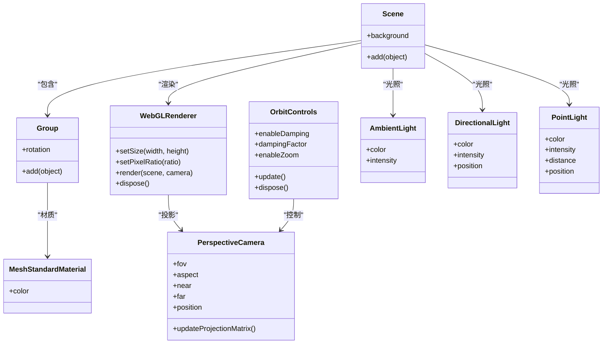
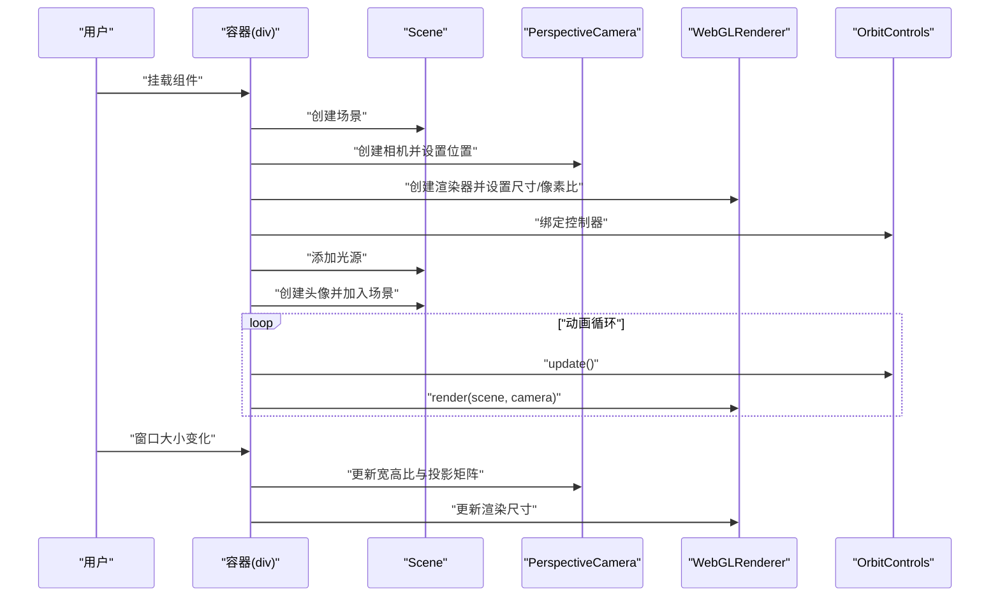
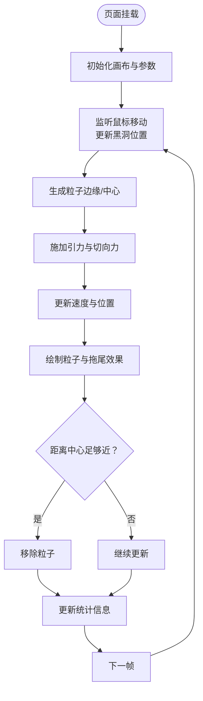
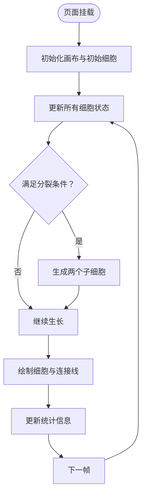
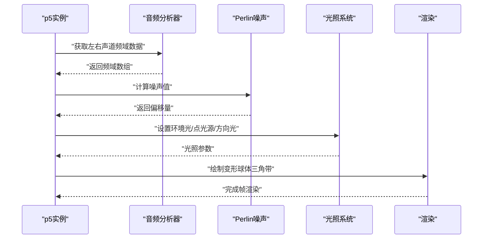
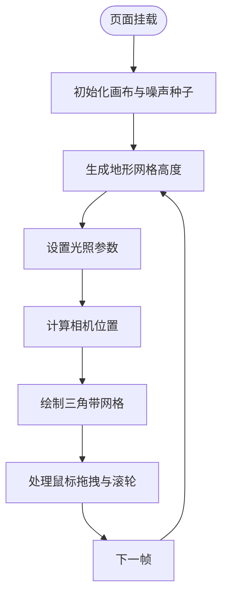
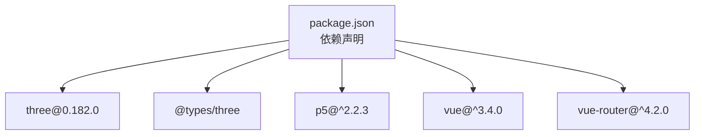

# 3D图形系统

<cite>
**本文档引用的文件**
- [package.json](file://package.json)
- [PersonalAvatar3D.vue](file://src/components/PersonalAvatar3D.vue)
- [BlackHole.vue](file://src/views/BlackHole.vue)
- [CellDivision.vue](file://src/views/CellDivision.vue)
- [animations.js](file://src/data/animations.js)
- [main.js](file://src/main.js)
- [router/index.js](file://src/router/index.js)
- [README.md](file://README.md)
- [FishPage.vue](file://src/views/FishPage.vue)
- [DancerPage.vue](file://src/views/DancerPage.vue)
- [MorphingSphere.vue](file://src/views/MorphingSphere.vue)
- [NoiseTerrain.vue](file://src/views/NoiseTerrain.vue)
</cite>

## 目录
1. [简介](#简介)
2. [项目结构](#项目结构)
3. [核心组件](#核心组件)
4. [架构总览](#架构总览)
5. [详细组件分析](#详细组件分析)
6. [依赖关系分析](#依赖关系分析)
7. [性能考虑](#性能考虑)
8. [故障排除指南](#故障排除指南)
9. [结论](#结论)
10. [附录](#附录)

## 简介
本项目是一个以动画博客为核心的前端项目，集成了多种2D/3D可视化效果。其中，3D图形系统基于 Three.js 0.182.0 实现，提供了可交互的3D头像展示组件（PersonalAvatar3D），以及多个3D动画页面（如黑洞吸积盘、噪声地形、变形球体等）。这些组件共同构成了一个现代化、高性能且易于扩展的可视化系统。

## 项目结构
项目采用 Vue 3 + Vite 的现代前端架构，路由通过 Vue Router 管理，3D 动画页面通过 p5.js 或 Three.js 实现。Three.js 作为核心 3D 引擎，被用于构建场景、相机、渲染器和材质系统，并结合轨道控制器实现交互式浏览。

**图表来源**
- [main.js:1-12](file://src/main.js#L1-L12)
- [router/index.js:1-205](file://src/router/index.js#L1-L205)
- [PersonalAvatar3D.vue:1-344](file://src/components/PersonalAvatar3D.vue#L1-L344)
- [BlackHole.vue:1-310](file://src/views/BlackHole.vue#L1-L310)
- [CellDivision.vue:1-261](file://src/views/CellDivision.vue#L1-L261)
- [MorphingSphere.vue:1-304](file://src/views/MorphingSphere.vue#L1-L304)
- [NoiseTerrain.vue:1-255](file://src/views/NoiseTerrain.vue#L1-L255)

**章节来源**
- [README.md:1-115](file://README.md#L1-L115)
- [package.json:1-29](file://package.json#L1-L29)
- [router/index.js:1-205](file://src/router/index.js#L1-L205)

## 核心组件
本节聚焦 Three.js 在项目中的集成与应用，重点分析 PersonalAvatar3D 组件的场景构建、相机配置、渲染器设置与材质系统，并概述 p5.js 在多个3D动画页面中的实现模式。

- Three.js 版本与依赖
  - 项目使用 Three.js 0.182.0，配合 @types/three 提供类型支持，确保开发体验与类型安全。
  - 通过 npm 安装 three 与 @types/three，保证与运行时环境一致。

- PersonalAvatar3D 组件
  - 场景构建：创建 Scene，设置透明背景，便于与其他页面元素叠加。
  - 相机配置：使用 PerspectiveCamera，设置视野、宽高比、近远裁剪面；初始位置位于(0, 2, 8)，面向场景中心。
  - 渲染器设置：启用抗锯齿与透明通道，按设备像素比限制在合理范围内，确保在高分屏下的清晰度与性能平衡。
  - 材质系统：使用 MeshStandardMaterial 构建史蒂夫风格角色，结合环境光、方向光与点光源，营造自然光照效果。
  - 交互设计：集成 OrbitControls，启用阻尼与平滑更新，禁用缩放，仅允许平移与旋转，提升浏览体验。
  - 动画循环：通过 requestAnimationFrame 驱动，实现头像的平滑旋转与光环的自转，同时更新控制器与渲染场景。

- p5.js 3D 动画页面
  - MorphingSphere：使用 WEBGL 模式，基于音频驱动的变形球体，结合 Perlin 噪声与光照系统，实现动态形变与色彩映射。
  - NoiseTerrain：使用 WEBGL 模式，基于柏林噪声生成地形网格，支持鼠标拖拽视角与滚轮缩放，实现沉浸式地形探索。
  - BlackHole：虽然主要使用 p5.js 进行2D绘制，但其“黑洞吸积盘”概念体现了3D空间中粒子围绕中心天体旋转的物理模拟思想，为理解3D场景中的引力场与轨道运动提供参考。
  - CellDivision：同样以 p5.js 为核心，通过类封装与状态机实现细胞的生长、分裂与连接，体现复杂系统在二维空间中的动态演化。

**章节来源**
- [package.json:11-22](file://package.json#L11-L22)
- [PersonalAvatar3D.vue:18-61](file://src/components/PersonalAvatar3D.vue#L18-L61)
- [PersonalAvatar3D.vue:63-237](file://src/components/PersonalAvatar3D.vue#L63-L237)
- [PersonalAvatar3D.vue:239-254](file://src/components/PersonalAvatar3D.vue#L239-L254)
- [PersonalAvatar3D.vue:256-293](file://src/components/PersonalAvatar3D.vue#L256-L293)
- [PersonalAvatar3D.vue:295-306](file://src/components/PersonalAvatar3D.vue#L295-L306)
- [PersonalAvatar3D.vue:308-331](file://src/components/PersonalAvatar3D.vue#L308-L331)
- [MorphingSphere.vue:72-234](file://src/views/MorphingSphere.vue#L72-L234)
- [NoiseTerrain.vue:27-193](file://src/views/NoiseTerrain.vue#L27-L193)
- [BlackHole.vue:28-254](file://src/views/BlackHole.vue#L28-L254)
- [CellDivision.vue:13-214](file://src/views/CellDivision.vue#L13-L214)

## 架构总览
下图展示了 Three.js 与 p5.js 在项目中的协作关系，以及与路由系统的集成方式。Three.js 主要用于可交互的3D头像展示，p5.js 则负责多种2D/3D动画效果的实现。

**图表来源**
- [router/index.js:1-205](file://src/router/index.js#L1-L205)
- [animations.js:1-400](file://src/data/animations.js#L1-L400)
- [PersonalAvatar3D.vue:1-344](file://src/components/PersonalAvatar3D.vue#L1-L344)
- [BlackHole.vue:1-310](file://src/views/BlackHole.vue#L1-L310)
- [CellDivision.vue:1-261](file://src/views/CellDivision.vue#L1-L261)
- [MorphingSphere.vue:1-304](file://src/views/MorphingSphere.vue#L1-L304)
- [NoiseTerrain.vue:1-255](file://src/views/NoiseTerrain.vue#L1-L255)

## 详细组件分析

### PersonalAvatar3D 组件（Three.js）
该组件实现了完整的 3D 头像系统，涵盖场景构建、相机配置、渲染器设置、材质系统、光照配置与交互控制。

**图表来源**
- [PersonalAvatar3D.vue:22-39](file://src/components/PersonalAvatar3D.vue#L22-L39)
- [PersonalAvatar3D.vue:41-46](file://src/components/PersonalAvatar3D.vue#L41-L46)
- [PersonalAvatar3D.vue:64-237](file://src/components/PersonalAvatar3D.vue#L64-L237)
- [PersonalAvatar3D.vue:240-254](file://src/components/PersonalAvatar3D.vue#L240-L254)

**图表来源**
- [PersonalAvatar3D.vue:18-61](file://src/components/PersonalAvatar3D.vue#L18-L61)
- [PersonalAvatar3D.vue:276-293](file://src/components/PersonalAvatar3D.vue#L276-L293)
- [PersonalAvatar3D.vue:295-306](file://src/components/PersonalAvatar3D.vue#L295-L306)

**章节来源**
- [PersonalAvatar3D.vue:18-61](file://src/components/PersonalAvatar3D.vue#L18-L61)
- [PersonalAvatar3D.vue:63-237](file://src/components/PersonalAvatar3D.vue#L63-L237)
- [PersonalAvatar3D.vue:239-254](file://src/components/PersonalAvatar3D.vue#L239-L254)
- [PersonalAvatar3D.vue:256-293](file://src/components/PersonalAvatar3D.vue#L256-L293)
- [PersonalAvatar3D.vue:295-306](file://src/components/PersonalAvatar3D.vue#L295-L306)
- [PersonalAvatar3D.vue:308-331](file://src/components/PersonalAvatar3D.vue#L308-L331)

### 黑洞吸积盘（BlackHole.vue）
该页面通过 p5.js 实现了黑洞吸积盘的粒子系统与引力模拟，强调了3D空间中粒子围绕中心天体旋转的物理现象。

**图表来源**
- [BlackHole.vue:28-254](file://src/views/BlackHole.vue#L28-L254)

**章节来源**
- [BlackHole.vue:28-254](file://src/views/BlackHole.vue#L28-L254)

### 细胞分裂（CellDivision.vue）
该页面通过 p5.js 实现了细胞的生长、布朗运动与分裂过程，展示了复杂系统在二维空间中的动态演化。

**图表来源**
- [CellDivision.vue:13-214](file://src/views/CellDivision.vue#L13-L214)

**章节来源**
- [CellDivision.vue:13-214](file://src/views/CellDivision.vue#L13-L214)

### 变形球体（MorphingSphere.vue）
该页面使用 p5.js 的 WEBGL 模式，基于音频驱动实现球体的动态形变与光照效果。

**图表来源**
- [MorphingSphere.vue:72-234](file://src/views/MorphingSphere.vue#L72-L234)

**章节来源**
- [MorphingSphere.vue:72-234](file://src/views/MorphingSphere.vue#L72-L234)

### 噪声地形（NoiseTerrain.vue）
该页面使用 p5.js 的 WEBGL 模式，基于柏林噪声生成地形网格，并支持鼠标交互控制视角与缩放。

**图表来源**
- [NoiseTerrain.vue:27-193](file://src/views/NoiseTerrain.vue#L27-L193)

**章节来源**
- [NoiseTerrain.vue:27-193](file://src/views/NoiseTerrain.vue#L27-L193)

## 依赖关系分析
项目依赖关系清晰，Three.js 与 p5.js 分别服务于不同类型的可视化需求。路由系统统一管理页面跳转，数据文件提供动画列表与分类信息。

**图表来源**
- [package.json:11-22](file://package.json#L11-L22)

**章节来源**
- [package.json:11-22](file://package.json#L11-L22)
- [router/index.js:1-205](file://src/router/index.js#L1-L205)
- [animations.js:1-400](file://src/data/animations.js#L1-L400)

## 性能考虑
- Three.js 渲染器像素比限制：通过 setPixelRatio 将像素比限制在合理范围内，避免在高分屏下过度消耗 GPU 资源。
- 控制器阻尼：启用 OrbitControls 的阻尼与平滑更新，减少频繁重绘带来的性能损耗。
- p5.js 3D 细分与分段：在 MorphingSphere 与 NoiseTerrain 中，通过减少三角带分段数量与层级绘制，显著降低渲染开销。
- 帧率与背景覆盖：在 BlackHole 与 DancerPage 中采用淡覆盖背景以产生拖尾效果，平衡视觉表现与性能。
- 音频分析与节拍检测：在 DancerPage 与 MorphingSphere 中，采用合理的采样与衰减策略，避免高频计算导致的卡顿。

[本节为通用性能建议，不直接分析具体文件]

## 故障排除指南
- Three.js 组件未渲染
  - 检查容器尺寸与初始化顺序，确保在 onMounted 生命周期内调用 initScene。
  - 确认渲染器 domElement 已正确附加至容器。
  - 参考路径：[PersonalAvatar3D.vue:18-61](file://src/components/PersonalAvatar3D.vue#L18-L61)

- 窗口大小变化导致画面拉伸
  - 确保在 resize 事件中更新相机宽高比与投影矩阵，并同步调整渲染器尺寸。
  - 参考路径：[PersonalAvatar3D.vue:295-306](file://src/components/PersonalAvatar3D.vue#L295-L306)

- 交互无效或卡顿
  - 检查 OrbitControls 的 enableDamping 与 dampingFactor 设置，确保控制器已正确绑定到渲染器 domElement。
  - 参考路径：[PersonalAvatar3D.vue:41-46](file://src/components/PersonalAvatar3D.vue#L41-L46)

- p5.js 3D 页面无法加载
  - 确认页面使用 WEBGL 模式创建画布，并在 onMounted 中初始化实例。
  - 参考路径：[MorphingSphere.vue:81-85](file://src/views/MorphingSphere.vue#L81-L85)、[NoiseTerrain.vue:32-34](file://src/views/NoiseTerrain.vue#L32-L34)

- 音频分析失败
  - 若无法获取麦克风权限，页面将切换到模拟节拍模式，确保逻辑分支正确处理。
  - 参考路径：[DancerPage.vue:194-221](file://src/views/DancerPage.vue#L194-L221)

**章节来源**
- [PersonalAvatar3D.vue:18-61](file://src/components/PersonalAvatar3D.vue#L18-L61)
- [PersonalAvatar3D.vue:295-306](file://src/components/PersonalAvatar3D.vue#L295-L306)
- [PersonalAvatar3D.vue:41-46](file://src/components/PersonalAvatar3D.vue#L41-L46)
- [MorphingSphere.vue:81-85](file://src/views/MorphingSphere.vue#L81-L85)
- [NoiseTerrain.vue:32-34](file://src/views/NoiseTerrain.vue#L32-L34)
- [DancerPage.vue:194-221](file://src/views/DancerPage.vue#L194-L221)

## 结论
本项目通过 Three.js 与 p5.js 的有机结合，构建了一个内容丰富、交互流畅的动画博客系统。Three.js 在可交互3D头像展示方面表现出色，而 p5.js 则为多种2D/3D动画提供了灵活的实现方式。通过合理的性能优化与故障排除策略，系统能够在不同设备上稳定运行，为用户提供沉浸式的视觉体验。

[本节为总结性内容，不直接分析具体文件]

## 附录
- 动画列表与分类：通过 animations.js 提供的分类与标签，帮助用户快速定位感兴趣的动画效果。
- 路由配置：router/index.js 统一管理所有页面路由，支持滚动行为与历史记录。
- 应用入口：main.js 负责应用挂载与全局配置，确保项目在浏览器中正常运行。

**章节来源**
- [animations.js:1-400](file://src/data/animations.js#L1-L400)
- [router/index.js:1-205](file://src/router/index.js#L1-L205)
- [main.js:1-12](file://src/main.js#L1-L12)