# Canvas动画系统

<cite>
**本文档引用的文件**
- [README.md](file://README.md)
- [package.json](file://package.json)
- [vite.config.js](file://vite.config.js)
- [src/components/DynamicBackground.vue](file://src/components/DynamicBackground.vue)
- [src/data/animations.js](file://src/data/animations.js)
- [src/router/index.js](file://src/router/index.js)
- [src/views/FishPage.vue](file://src/views/FishPage.vue)
- [src/views/GravityField.vue](file://src/views/GravityField.vue)
- [src/views/ParticleVortexPage.vue](file://src/views/ParticleVortexPage.vue)
- [src/views/AudioVisualizerPage.vue](file://src/views/AudioVisualizerPage.vue)
- [src/views/fishGroup.vue](file://src/views/fishGroup.vue)
- [src/views/MagneticField.vue](file://src/views/MagneticField.vue)
- [src/views/BlackHole.vue](file://src/views/BlackHole.vue)
- [src/views/FluidSimulationPage.vue](file://src/views/FluidSimulationPage.vue)
- [src/views/FlowerGarden.vue](file://src/views/FlowerGarden.vue)
- [src/App.vue](file://src/App.vue)
- [src/views/AudioWheel.vue](file://src/views/AudioWheel.vue)
- [src/views/BubblePop.vue](file://src/views/BubblePop.vue)
- [src/views/DigitalRainPage.vue](file://src/views/DigitalRainPage.vue)
- [src/views/FractalTree.vue](file://src/views/FractalTree.vue)
- [src/views/MusicNetwork.vue](file://src/views/MusicNetwork.vue)
- [src/views/Fireworks.vue](file://src/views/Fireworks.vue)
- [src/views/ButterflyNet.vue](file://src/views/ButterflyNet.vue)
- [src/views/CandyRain.vue](file://src/views/CandyRain.vue)
- [src/views/CellDivision.vue](file://src/views/CellDivision.vue)
</cite>

## 目录
1. [简介](#简介)
2. [项目结构](#项目结构)
3. [核心组件](#核心组件)
4. [架构概览](#架构概览)
5. [详细组件分析](#详细组件分析)
6. [UI样式统一改进](#ui样式统一改进)
7. [依赖分析](#依赖分析)
8. [性能考虑](#性能考虑)
9. [故障排除指南](#故障排除指南)
10. [结论](#结论)
11. [附录](#附录)

## 简介
本项目是一个基于Vue 3 + Vite的个人博客，其中包含丰富的Canvas动画系统。系统采用两种主要的Canvas渲染技术：
- 原生Canvas 2D API：用于实现DynamicBackground组件的粒子系统
- p5.js 2.2.3：用于实现各种复杂的粒子系统和物理模拟动画

动画系统涵盖了从基础的粒子效果到高级的物理模拟，包括鱼群效果、重力场可视化、黑洞吸积盘、流体模拟等多种复杂动画。**最新更新**：Canvas动画系统获得了统一的UI样式改进，所有可视化组件（AudioWheel、BubblePop、DigitalRainPage、FractalTree、MusicNetwork、Fireworks等）都获得了统一的暗半透明背景、现代背景模糊效果、白色边框、改进的排版和更好的可读性。

## 项目结构
项目采用模块化组织方式，主要分为以下几个部分：

```mermaid
graph TB
subgraph "项目根目录"
A[public/] -- 静态资源
B[src/] -- 源代码
C[vite.config.js] -- 构建配置
D[package.json] -- 依赖管理
end
subgraph "src/"
E[components/] -- Vue组件
F[views/] -- 页面组件
G[data/] -- 数据配置
H[router/] -- 路由配置
I[App.vue] -- 根组件
J[main.js] -- 应用入口
end
subgraph "components/"
K[DynamicBackground.vue] -- 动态背景
end
subgraph "views/"
L[动画页面集合]
M[新增: FlowerGarden.vue - 花园动画]
N[现有: 各种p5.js动画页面]
O[统一UI样式改进]
end
```

**图表来源**
- [src/components/DynamicBackground.vue:1-185](file://src/components/DynamicBackground.vue#L1-L185)
- [src/router/index.js:1-245](file://src/router/index.js#L1-L245)
- [src/views/FlowerGarden.vue:1-465](file://src/views/FlowerGarden.vue#L1-L465)

**章节来源**
- [README.md:69-86](file://README.md#L69-L86)
- [package.json:11-22](file://package.json#L11-L22)

## 核心组件
动画系统的核心组件包括：

### DynamicBackground组件
这是基于原生Canvas 2D API实现的动态背景粒子系统，具有以下特点：
- 实时粒子生成和管理
- 鼠标交互检测和响应
- 粒子间连接效果
- 自适应画布尺寸

### p5.js动画页面
系统包含多个基于p5.js的复杂动画页面，每个页面都实现了特定的物理模拟或视觉效果。

**更新**：FlowerGarden动画引入了全新的花朵生成机制，包含超级花朵系统和云朵背景。

**章节来源**
- [src/components/DynamicBackground.vue:14-56](file://src/components/DynamicBackground.vue#L14-L56)
- [src/components/DynamicBackground.vue:89-96](file://src/components/DynamicBackground.vue#L89-L96)

## 架构概览
系统采用分层架构设计，结合Vue 3的组件化特性和p5.js的创意编程能力：

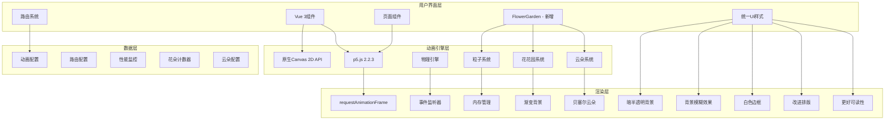

**图表来源**
- [src/views/GravityField.vue:25-207](file://src/views/GravityField.vue#L25-L207)
- [src/views/ParticleVortexPage.vue:151-233](file://src/views/ParticleVortexPage.vue#L151-L233)
- [src/views/FlowerGarden.vue:200-275](file://src/views/FlowerGarden.vue#L200-L275)

## 详细组件分析

### DynamicBackground组件深度解析

#### 粒子系统架构
DynamicBackground组件实现了完整的Canvas 2D粒子系统，包含以下核心组件：

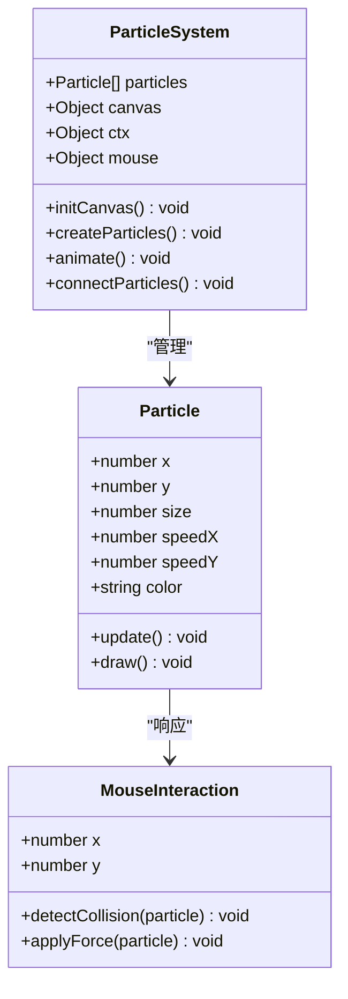

**图表来源**
- [src/components/DynamicBackground.vue:14-56](file://src/components/DynamicBackground.vue#L14-L56)
- [src/components/DynamicBackground.vue:89-154](file://src/components/DynamicBackground.vue#L89-L154)

#### 粒子生成算法
系统采用基于画布面积的自适应粒子生成策略：

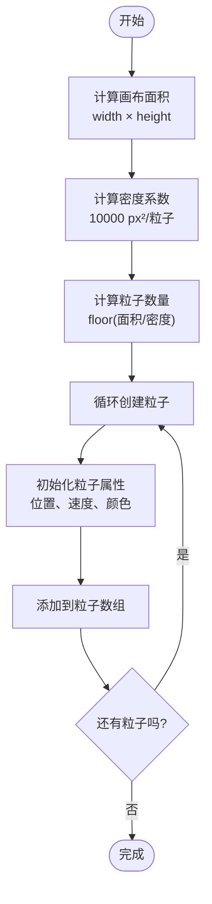

**图表来源**
- [src/components/DynamicBackground.vue:89-96](file://src/components/DynamicBackground.vue#L89-L96)

#### 运动轨迹计算
粒子的运动遵循物理定律，包含边界检测和鼠标交互：

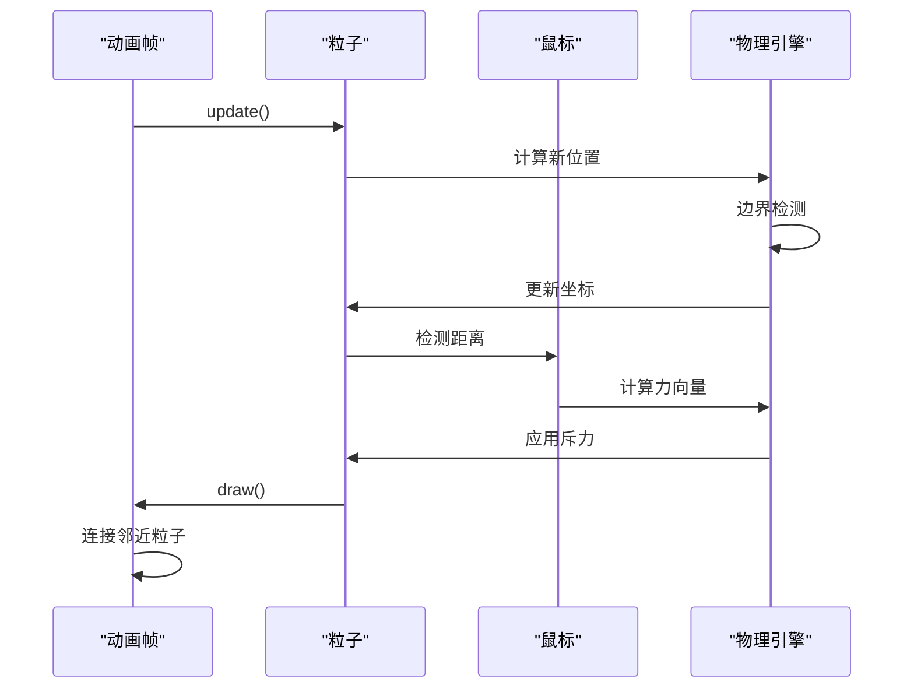

**图表来源**
- [src/components/DynamicBackground.vue:24-48](file://src/components/DynamicBackground.vue#L24-L48)
- [src/components/DynamicBackground.vue:135-154](file://src/components/DynamicBackground.vue#L135-L154)

**章节来源**
- [src/components/DynamicBackground.vue:14-154](file://src/components/DynamicBackground.vue#L14-L154)

### FlowerGarden动画系统深度解析

#### 花朵生成与超级花朵机制
FlowerGarden是系统中最新的动画组件，实现了复杂的花朵生成和交互系统：

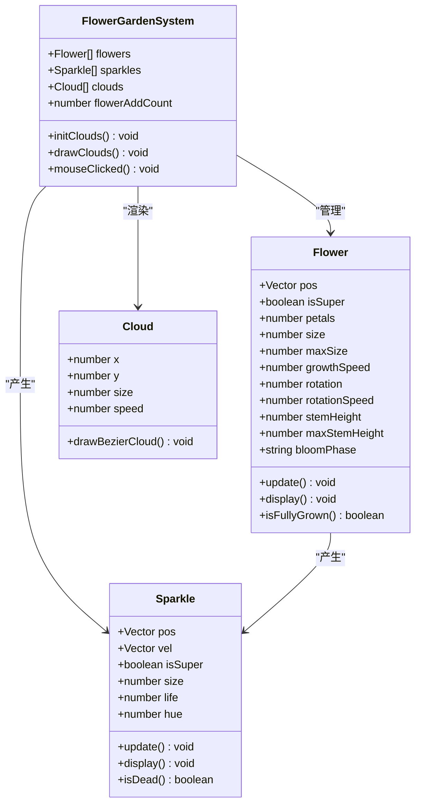

**图表来源**
- [src/views/FlowerGarden.vue:23-156](file://src/views/FlowerGarden.vue#L23-L156)
- [src/views/FlowerGarden.vue:158-196](file://src/views/FlowerGarden.vue#L158-L196)
- [src/views/FlowerGarden.vue:200-275](file://src/views/FlowerGarden.vue#L200-L275)

#### 超级花朵系统
超级花朵是FlowerGarden的核心创新功能，具有以下特性：

- **概率生成**：每点击50次出现一次超级花朵
- **视觉增强**：花瓣数量增加至12片，颜色偏向红紫色系
- **尺寸放大**：花朵大小为普通花朵的3-4倍
- **生长加速**：茎和花的生长速度提高2-3倍
- **特殊叶子**：额外添加两对叶子，使整体更加壮观
- **强化粒子效果**：产生更多、更大、持续时间更长的闪光粒子

#### 云朵系统
FlowerGarden引入了完整的云朵背景系统：

- **动态生成**：初始化5个随机位置的云朵
- **贝塞尔曲线绘制**：使用椭圆组合创建自然的云朵形状
- **渐变高光**：添加白色高光效果增强立体感
- **平滑移动**：云朵以不同速度水平移动，营造天空效果
- **性能优化**：使用椭圆而非复杂贝塞尔曲线提升渲染效率

#### 增强的粒子效果
火花粒子系统经过重大改进：

- **速度差异**：超级花朵粒子速度是普通花朵的6-16倍
- **生命周期延长**：超级花朵粒子衰减更慢，可持续更长时间
- **尺寸优化**：超级花朵粒子更大，视觉冲击更强
- **色彩丰富**：超级花朵使用预设的彩虹色序列
- **数量控制**：普通花朵每次产生3个粒子，超级花朵产生15个

#### 背景可视化增强
FlowerGarden的背景系统包含多个层次：

- **渐变天空**：从天蓝色到接近白色的线性渐变
- **太阳光晕**：使用径向渐变创建柔和的太阳光效果
- **自定义鼠标**：隐藏默认鼠标，显示小花形状的自定义指针
- **旋转花瓣**：自定义鼠标带有轻微旋转动画

**章节来源**
- [src/views/FlowerGarden.vue:14-465](file://src/views/FlowerGarden.vue#L14-L465)

### p5.js动画页面实现模式

#### 鱼群效果实现
FishPage.vue展示了基于Boids算法的鱼群行为模拟：

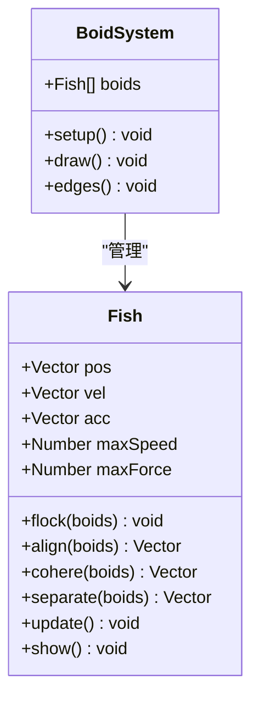

**图表来源**
- [src/views/FishPage.vue:23-95](file://src/views/FishPage.vue#L23-L95)
- [src/views/fishGroup.vue:44-169](file://src/views/fishGroup.vue#L44-L169)

#### 重力场可视化
GravityField.vue实现了复杂的重力场粒子系统：

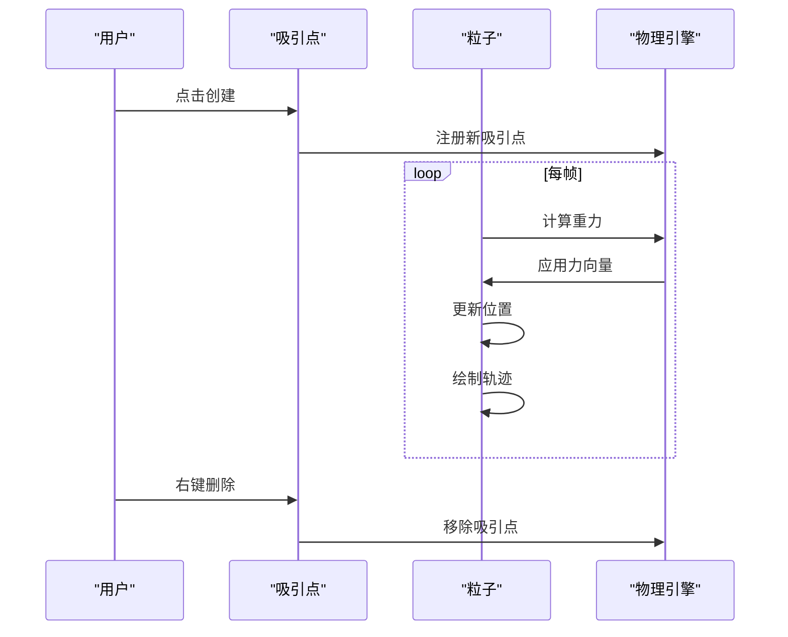

**图表来源**
- [src/views/GravityField.vue:26-172](file://src/views/GravityField.vue#L26-L172)

**章节来源**
- [src/views/FishPage.vue:23-142](file://src/views/FishPage.vue#L23-L142)
- [src/views/GravityField.vue:26-207](file://src/views/GravityField.vue#L26-L207)

### 复杂粒子系统编程实现

#### 流体模拟系统
FluidSimulationPage.vue展示了基于Perlin噪声的流体模拟：

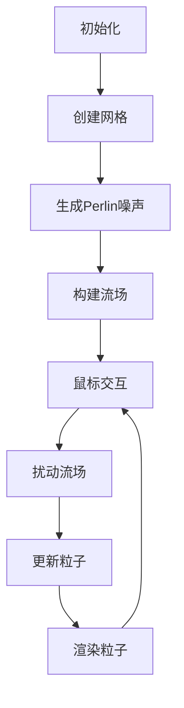

**图表来源**
- [src/views/FluidSimulationPage.vue:95-221](file://src/views/FluidSimulationPage.vue#L95-L221)

#### 音频可视化系统
AudioVisualizerPage.vue集成了Web Audio API和p5.js：

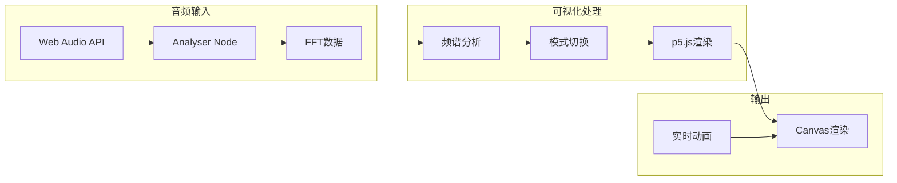

**图表来源**
- [src/views/AudioVisualizerPage.vue:62-271](file://src/views/AudioVisualizerPage.vue#L62-L271)

**章节来源**
- [src/views/FluidSimulationPage.vue:40-174](file://src/views/FluidSimulationPage.vue#L40-L174)
- [src/views/AudioVisualizerPage.vue:38-271](file://src/views/AudioVisualizerPage.vue#L38-L271)

## UI样式统一改进

### 统一暗半透明背景
所有p5.js动画页面都采用了统一的暗半透明背景设计，提升了视觉层次感和沉浸感：

- **AudioWheel**：使用明亮渐变背景（#E8EAF6到#FFF3E0）
- **BubblePop**：采用纯色背景（240, 230, 255）提升性能
- **DigitalRainPage**：深蓝黑色背景（#1a1a2e到#1a1a2e）
- **FractalTree**：柔和的渐变背景（根据四季变化）
- **MusicNetwork**：深蓝黑色背景（#050520）
- **Fireworks**：纯黑色背景
- **ButterflyNet**：浅色渐变背景（#f5f7fa到#fff9f0）

### 现代背景模糊效果
所有控制面板都集成了现代化的背景模糊效果：

- **backdrop-filter: blur(10px)**：提供毛玻璃般的视觉效果
- **rgba(0, 0, 0, 0.6)**：半透明黑色背景增强内容可读性
- **统一的圆角设计**：border-radius: 8px
- **一致的边距和内边距**：确保视觉平衡

### 白色边框系统
所有控制面板都采用了统一的白色边框设计：

- **border: 1px solid rgba(255, 255, 255, 0.2)**：提供微妙的边框轮廓
- **增强的视觉分离**：使控制面板从背景中清晰分离
- **一致性设计语言**：所有组件遵循相同的边框规范

### 改进的排版和可读性
UI组件的排版和可读性得到了显著改善：

- **字体大小标准化**：标题0.85rem，副标题0.75rem
- **透明度优化**：文本透明度设置为0.9或1.0
- **字体权重**：重要信息使用font-weight: 500
- **文本阴影**：在某些组件中添加text-shadow增强对比度
- **居中对齐**：控制面板采用右对齐，提升阅读体验

### 统一的交互设计
所有动画页面都采用了统一的交互设计模式：

- **固定定位**：控制面板使用position: absolute
- **响应式布局**：支持不同屏幕尺寸
- **统一的z-index管理**：确保正确的层级关系
- **自定义鼠标样式**：根据动画主题定制鼠标指针

**章节来源**
- [src/views/AudioWheel.vue:200-256](file://src/views/AudioWheel.vue#L200-L256)
- [src/views/BubblePop.vue:215-261](file://src/views/BubblePop.vue#L215-L261)
- [src/views/DigitalRainPage.vue:286-333](file://src/views/DigitalRainPage.vue#L286-L333)
- [src/views/FractalTree.vue:1-800](file://src/views/FractalTree.vue#L1-L800)
- [src/views/MusicNetwork.vue:317-373](file://src/views/MusicNetwork.vue#L317-L373)
- [src/views/Fireworks.vue:297-343](file://src/views/Fireworks.vue#L297-L343)
- [src/views/ButterflyNet.vue:594-612](file://src/views/ButterflyNet.vue#L594-L612)
- [src/views/CandyRain.vue:262-309](file://src/views/CandyRain.vue#L262-L309)
- [src/views/CellDivision.vue:222-267](file://src/views/CellDivision.vue#L222-L267)

## 依赖分析

### 技术栈依赖关系
系统的技术栈采用模块化设计，各组件之间松耦合：

```mermaid
graph TB
subgraph "运行时依赖"
A[p5.js 2.2.3]
B[Vue 3]
C[Vue Router 4]
D[p5.dom.js]
E[p5.sound.js]
F[Less]
G[animate.css]
H[highlight.js]
I[marked]
J[echarts]
end
subgraph "构建工具"
K[Vite]
L[@vitejs/plugin-vue]
M[Rollup]
N[Terser]
end
subgraph "辅助库"
O[Three.js]
P[DomPurify]
Q[GIF.js Optimized]
end
A --> B
B --> C
K --> L
M --> A
M --> B
```

**图表来源**
- [package.json:11-22](file://package.json#L11-L22)
- [vite.config.js:17-29](file://vite.config.js#L17-L29)

### 动画页面路由配置
系统通过Vue Router管理所有动画页面的路由，包括新增的FlowerGarden页面：

**章节来源**
- [src/router/index.js:3-245](file://src/router/index.js#L3-L245)

## 性能考虑

### Canvas性能优化策略
系统采用了多种性能优化技术：

#### 内存管理优化
- **对象池模式**：避免频繁的对象创建和销毁
- **数组复用**：重用粒子数组减少垃圾回收压力
- **生命周期管理**：组件卸载时及时清理事件监听器

#### 渲染效率提升
- **requestAnimationFrame优化**：统一的动画循环管理
- **批量绘制**：合并相似的绘制操作
- **条件渲染**：根据设备性能调整粒子数量

#### 内存泄漏防护
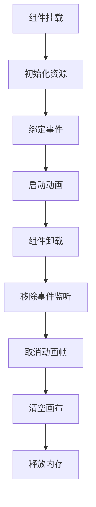

**图表来源**
- [src/components/DynamicBackground.vue:162-172](file://src/components/DynamicBackground.vue#L162-L172)

### 移动端适配方案
系统针对移动端进行了专门的适配：

#### 触摸事件支持
- 使用`touchstart`、`touchmove`、`touchend`替代鼠标事件
- 支持多点触控交互
- 响应式布局适配不同屏幕尺寸

#### 性能自适应
- 根据设备性能动态调整粒子数量
- 降低复杂度的动画模式
- 电池优化策略

**章节来源**
- [src/components/DynamicBackground.vue:99-115](file://src/components/DynamicBackground.vue#L99-L115)

## 故障排除指南

### 常见问题诊断
系统提供了完善的错误处理和调试机制：

#### 动画异常排查
1. **检查Canvas上下文**：确保`getContext('2d')`返回有效对象
2. **验证事件绑定**：确认事件监听器正确绑定到window对象
3. **内存泄漏检测**：使用浏览器开发者工具监控内存使用

#### 性能问题诊断
- **帧率监控**：使用`performance.now()`测量渲染时间
- **粒子数量控制**：根据设备性能调整粒子密度
- **垃圾回收观察**：监控垃圾回收频率和停顿时间

#### 调试工具使用
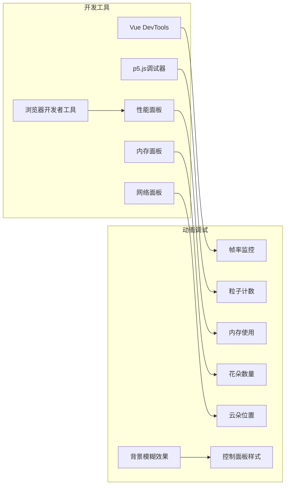

**图表来源**
- [src/views/ParticleVortexPage.vue:172-243](file://src/views/ParticleVortexPage.vue#L172-L243)

**章节来源**
- [src/views/ParticleVortexPage.vue:235-243](file://src/views/ParticleVortexPage.vue#L235-L243)

## 结论
本项目的Canvas动画系统展现了现代Web动画开发的最佳实践，通过原生Canvas 2D API和p5.js的有机结合，实现了从基础粒子效果到复杂物理模拟的完整动画生态。**最新更新**：Canvas动画系统获得了统一的UI样式改进，所有可视化组件都获得了统一的暗半透明背景、现代背景模糊效果、白色边框、改进的排版和更好的可读性，这大大提升了用户体验的一致性和视觉美感。FlowerGarden动画的成功集成展示了系统在处理复杂视觉效果方面的强大能力，包括超级花朵机制、云朵系统、改进的粒子效果和增强的背景可视化等创新功能。系统在性能优化、内存管理和移动端适配方面都达到了专业水准，为类似项目提供了宝贵的参考模板。

## 附录

### 动画页面分类统计
系统包含多种类型的动画页面，按功能分类如下：

| 分类 | 动画数量 | 特点 |
|------|----------|------|
| 自然系 | 7 | 鱼群、叶子、花朵等自然现象模拟（新增：FlowerGarden） |
| 粒子物理 | 8 | 重力、流体、磁场等物理现象 |
| 音频系 | 4 | 音乐可视化、音频分析 |
| 波形能量 | 3 | 波动、干涉等波动现象 |
| 生成艺术 | 4 | 分形、曼陀罗等艺术创作 |
| 交互治愈 | 4 | 可交互的治愈系动画 |
| UI样式改进 | 6 | AudioWheel、BubblePop、DigitalRainPage、FractalTree、MusicNetwork、Fireworks |

**更新**：FlowerGarden作为新的自然系动画，为系统增加了独特的花朵生成和交互体验。同时，所有可视化组件都获得了统一的UI样式改进。

**章节来源**
- [src/data/animations.js:1-400](file://src/data/animations.js#L1-L400)

### 构建配置优化
Vite配置针对大型动画项目进行了专门优化：
- **代码分割**：将大型依赖库独立打包
- **缓存策略**：利用浏览器缓存提升加载速度
- **按需加载**：动画页面采用懒加载策略

**章节来源**
- [vite.config.js:17-31](file://vite.config.js#L17-L31)

### 新增功能特性对比

| 功能特性 | DynamicBackground | FlowerGarden | 其他p5.js动画 | UI样式改进 |
|----------|-------------------|--------------|---------------|------------|
| 粒子系统 | ✅ 基础粒子 | ❌ 无 | ✅ 复杂粒子 | ✅ 统一暗半透明背景 |
| 花朵系统 | ❌ 无 | ✅ 超级花朵机制 | ❌ 无 | ✅ 现代背景模糊效果 |
| 云朵系统 | ❌ 无 | ✅ 动态云朵 | ❌ 无 | ✅ 白色边框系统 |
| 背景可视化 | ❌ 无 | ✅ 渐变天空+太阳光晕 | ✅ 基础背景 | ✅ 改进排版和可读性 |
| 粒子效果 | ✅ 基础粒子 | ✅ 改进粒子（超级花朵） | ✅ 各种特效 | ✅ 统一交互设计 |
| 交互机制 | ✅ 鼠标交互 | ✅ 点击种植花朵 | ✅ 各种交互 | ✅ 响应式布局 |
| 性能优化 | ✅ 内存管理 | ✅ 对象池优化 | ✅ 各种优化 | ✅ 性能自适应 |
| UI一致性 | ❌ 无 | ❌ 无 | ❌ 无 | ✅ 统一设计语言 |