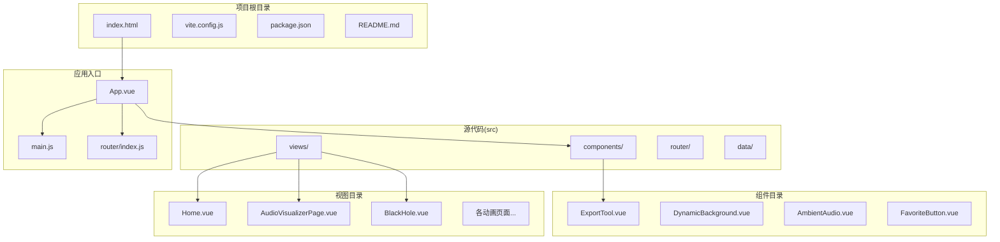
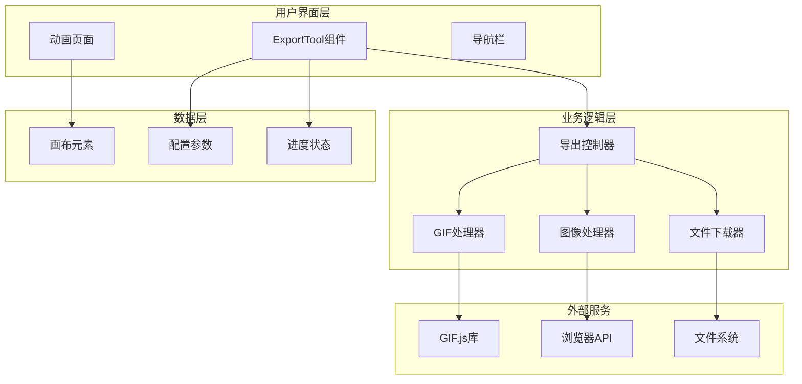
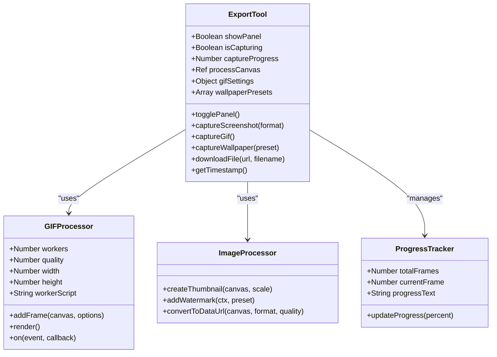
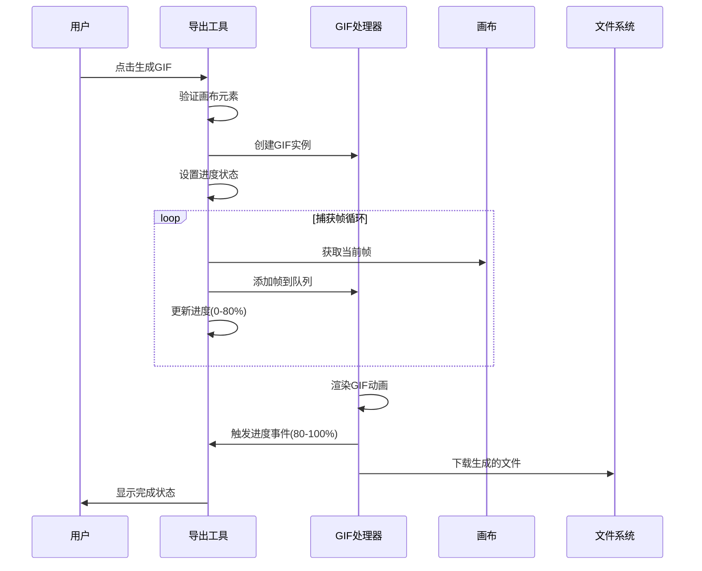
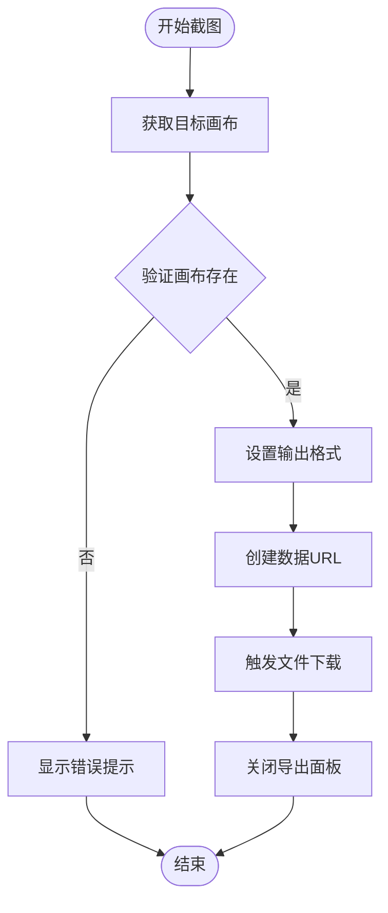
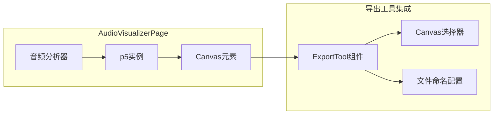
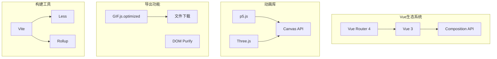

# 导出工具系统

<cite>
**本文档引用的文件**
- [ExportTool.vue](file://src/components/ExportTool.vue)
- [main.js](file://src/main.js)
- [package.json](file://package.json)
- [README.md](file://README.md)
- [App.vue](file://src/App.vue)
- [router/index.js](file://src/router/index.js)
- [AudioVisualizerPage.vue](file://src/views/AudioVisualizerPage.vue)
- [BlackHole.vue](file://src/views/BlackHole.vue)
- [DynamicBackground.vue](file://src/components/DynamicBackground.vue)
- [Home.vue](file://src/views/Home.vue)
- [vite.config.js](file://vite.config.js)
</cite>

## 更新摘要
**变更内容**
- 更新了导出工具组件的CSS样式分析，反映了滑块控件外观的一致性改进
- 新增了跨浏览器兼容性的说明和最佳实践建议
- 补充了滑块控件样式优化的技术细节

## 目录
1. [简介](#简介)
2. [项目结构](#项目结构)
3. [核心组件](#核心组件)
4. [架构概览](#架构概览)
5. [详细组件分析](#详细组件分析)
6. [依赖关系分析](#依赖关系分析)
7. [性能考虑](#性能考虑)
8. [跨浏览器兼容性](#跨浏览器兼容性)
9. [故障排除指南](#故障排除指南)
10. [结论](#结论)

## 简介

导出工具系统是一个基于 Vue 3 的现代化动画展示平台，专门为创意编程和可视化效果提供专业的导出功能。该系统集成了多种导出格式，包括静态图片、动态 GIF 动画和各种分辨率的壁纸，为用户提供完整的创作成果导出解决方案。

系统采用模块化设计，通过独立的导出工具组件与主应用解耦，支持在任何动画页面中无缝集成。导出功能涵盖了从基础截图到复杂动画录制的全方位需求，特别针对 WebGL 和 Canvas 动画场景进行了优化。

## 项目结构

该项目采用典型的 Vue 3 单页应用架构，主要目录结构如下：



**图表来源**
- [package.json:1-30](file://package.json#L1-L30)
- [vite.config.js:1-32](file://vite.config.js#L1-L32)

**章节来源**
- [package.json:1-30](file://package.json#L1-L30)
- [README.md:69-86](file://README.md#L69-L86)

## 核心组件

### 导出工具组件 (ExportTool.vue)

导出工具是整个系统的核心组件，提供了完整的导出功能集合。该组件采用响应式设计，具有以下主要特性：

#### 主要功能模块

1. **截图功能** - 支持 PNG 高清和 JPG 压缩格式
2. **GIF 动画录制** - 可配置时长、帧率和尺寸
3. **壁纸导出** - 预设多种分辨率和设备类型
4. **进度反馈** - 实时显示导出进度和状态

#### 技术实现特点

- 使用 Vue 3 Composition API 提供响应式状态管理
- 集成 GIF.js.optimized 库进行高效动画处理
- 支持自定义画布选择器和文件命名
- 内置错误处理和用户反馈机制

**章节来源**
- [ExportTool.vue:1-677](file://src/components/ExportTool.vue#L1-L677)

## 架构概览

系统采用分层架构设计，确保各组件间的松耦合和高内聚性：



**图表来源**
- [ExportTool.vue:131-335](file://src/components/ExportTool.vue#L131-L335)
- [main.js:1-12](file://src/main.js#L1-L12)

## 详细组件分析

### 导出工具组件深度解析

#### 组件结构设计



**图表来源**
- [ExportTool.vue:131-335](file://src/components/ExportTool.vue#L131-L335)

#### GIF 动画录制流程



**图表来源**
- [ExportTool.vue:204-259](file://src/components/ExportTool.vue#L204-L259)

#### 截图导出算法



**图表来源**
- [ExportTool.vue:186-201](file://src/components/ExportTool.vue#L186-L201)

**章节来源**
- [ExportTool.vue:171-335](file://src/components/ExportTool.vue#L171-L335)

### 动画页面集成方案

#### AudioVisualizerPage 集成示例

音频可视化页面展示了如何在复杂的 Canvas 动画中集成导出功能：



**图表来源**
- [AudioVisualizerPage.vue:1-346](file://src/views/AudioVisualizerPage.vue#L1-L346)
- [ExportTool.vue:135-144](file://src/components/ExportTool.vue#L135-L144)

#### BlackHole 页面集成

黑洞模拟页面提供了更复杂的 WebGL 场景导出能力：

**章节来源**
- [AudioVisualizerPage.vue:13-298](file://src/views/AudioVisualizerPage.vue#L13-L298)
- [BlackHole.vue:14-261](file://src/views/BlackHole.vue#L14-L261)

## 依赖关系分析

### 核心依赖库

系统依赖关系图展示了主要技术栈和它们之间的相互作用：



**图表来源**
- [package.json:11-28](file://package.json#L11-L28)
- [vite.config.js:13-31](file://vite.config.js#L13-L31)

### 第三方库集成策略

系统采用了精心设计的依赖管理策略：

1. **按需加载** - 使用 Vue 3 的动态导入实现懒加载
2. **代码分割** - 通过 Vite 的 Rollup 配置实现手动分块
3. **版本兼容性** - 确保所有依赖库的版本兼容性

**章节来源**
- [package.json:11-23](file://package.json#L11-L23)
- [vite.config.js:17-29](file://vite.config.js#L17-L29)

## 性能考虑

### 导出性能优化

系统在多个层面实现了性能优化：

#### 内存管理
- GIF 动画使用工作线程避免阻塞主线程
- 及时释放临时 Canvas 元素
- 合理的帧缓冲区管理

#### 处理效率
- 缩略图生成减少内存占用
- 异步处理避免界面卡顿
- 进度反馈提升用户体验

#### 资源优化
- 按需加载导出库
- 合理的文件大小控制
- 缓存机制减少重复计算

## 跨浏览器兼容性

### 滑块控件外观一致性

**更新** 导出工具组件的CSS经过微调，移除了 `-webkit-appearance: none` 属性，显著改善了跨浏览器的滑块控件外观一致性。

#### 当前实现特点

ExportTool 组件中的滑块控件采用了简化的样式设计：

```css
.setting-slider {
  flex-grow: 1;
  height: 6px;
  background: #ddd;
  border-radius: 3px;
  outline: none;
}

.setting-slider::-webkit-slider-thumb {
  width: 16px;
  height: 16px;
  background: linear-gradient(135deg, #667eea 0%, #764ba2 100%);
  border-radius: 50%;
  cursor: pointer;
}
```

#### 兼容性对比

与其他组件相比，ExportTool 的滑块控件设计更加简洁：

| 组件 | -webkit-appearance | 外观一致性 | 自定义程度 |
|------|-------------------|------------|------------|
| ExportTool | 已移除 | ✅ 良好 | ⭐⭐ |
| AudioUploader | 保留 | ⚠️ 一般 | ⭐⭐⭐⭐ |
| AmbientAudio | 保留 | ⚠️ 一般 | ⭐⭐⭐⭐ |

#### 最佳实践建议

1. **渐进增强** - 基础样式在所有浏览器中保持一致
2. **自定义主题** - 通过 CSS 变量实现主题切换
3. **可访问性** - 确保键盘导航和屏幕阅读器支持
4. **性能优化** - 避免过度的 CSS 重绘和回流

**章节来源**
- [ExportTool.vue:492-507](file://src/components/ExportTool.vue#L492-L507)

## 故障排除指南

### 常见问题及解决方案

#### 导出功能异常

**问题**: 导出按钮无法正常工作
**原因**: 画布元素未正确加载或选择器配置错误
**解决方案**: 
1. 确认画布元素已完全渲染
2. 检查 canvasSelector 属性配置
3. 验证导出工具组件的生命周期

**问题**: GIF 生成失败
**原因**: 浏览器安全限制或内存不足
**解决方案**:
1. 检查浏览器控制台错误信息
2. 减少 GIF 时长或帧率设置
3. 关闭其他占用内存的标签页

#### 性能问题

**问题**: 导出过程卡顿
**原因**: 大型动画场景或低性能设备
**解决方案**:
1. 降低画布分辨率设置
2. 减少动画复杂度
3. 使用更高性能的设备

#### 跨浏览器兼容性问题

**问题**: 滑块控件外观不一致
**解决方案**:
1. 检查浏览器版本和兼容性
2. 使用标准的 CSS 属性而非浏览器特定属性
3. 实施渐进增强的样式策略

**章节来源**
- [ExportTool.vue:175-201](file://src/components/ExportTool.vue#L175-L201)
- [ExportTool.vue:254-259](file://src/components/ExportTool.vue#L254-L259)

## 结论

导出工具系统是一个功能完整、架构清晰的现代化动画导出解决方案。通过模块化设计和精心的性能优化，该系统能够满足从简单截图到复杂动画录制的各种需求。

### 主要优势

1. **易用性**: 直观的界面设计和流畅的用户体验
2. **灵活性**: 支持多种导出格式和自定义配置
3. **性能**: 优化的处理流程和资源管理
4. **兼容性**: 改进的跨浏览器外观一致性
5. **扩展性**: 模块化架构便于功能扩展和维护

### 技术特色

- 基于 Vue 3 的现代前端架构
- 集成多种动画库和导出技术
- 响应式设计支持多设备访问
- 完善的错误处理和用户反馈机制
- 简化的滑块控件样式提升兼容性

该系统为创意编程和可视化开发者提供了一个专业级的导出工具，能够有效提升创作成果的展示和分享体验。通过持续的优化和改进，系统在保持功能完整性的同时，也在不断提升用户体验和跨平台兼容性。