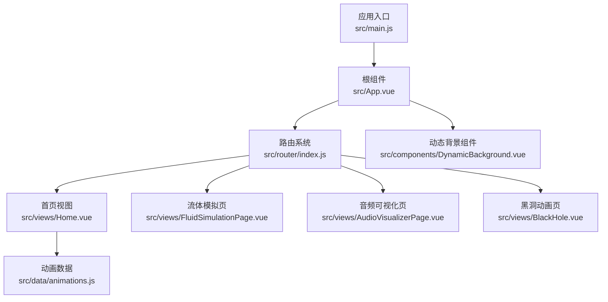
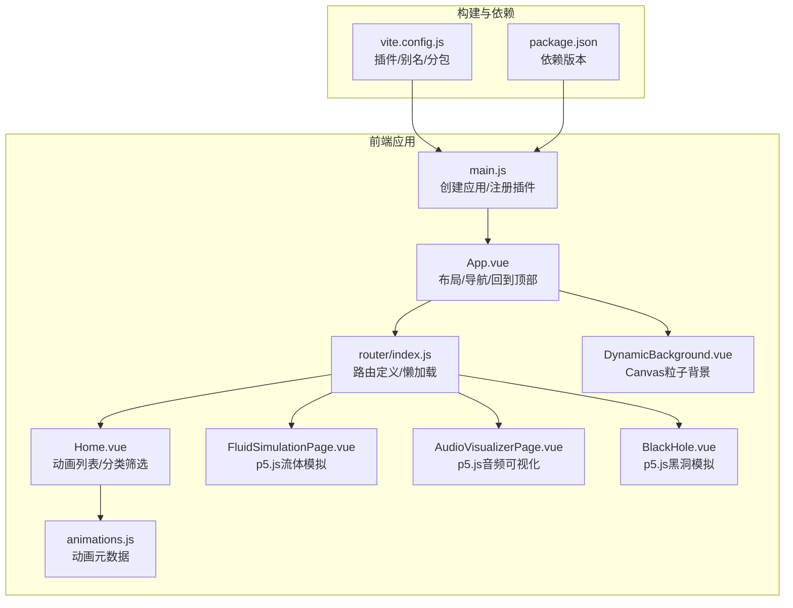
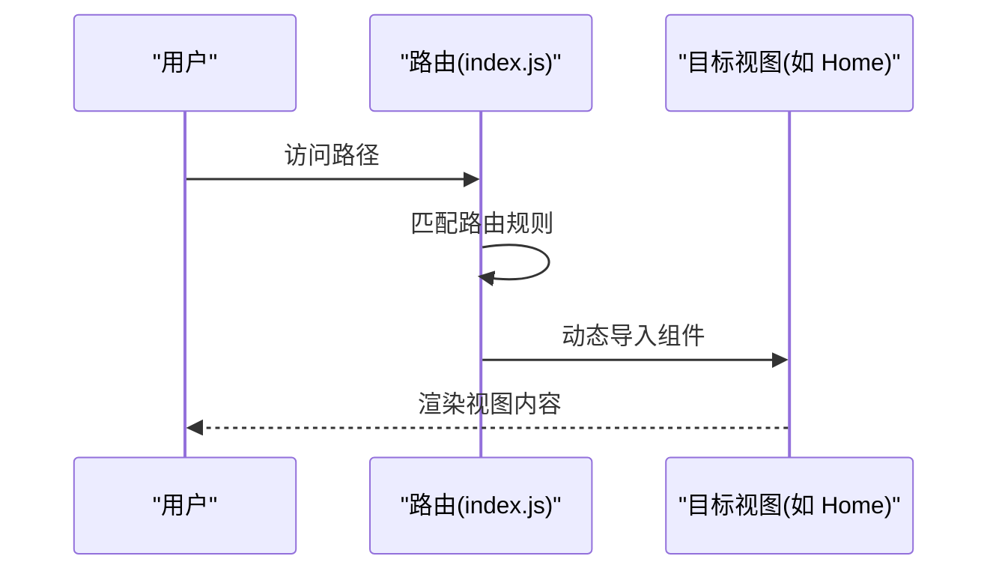
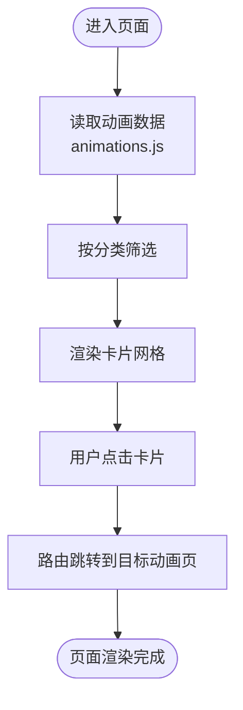
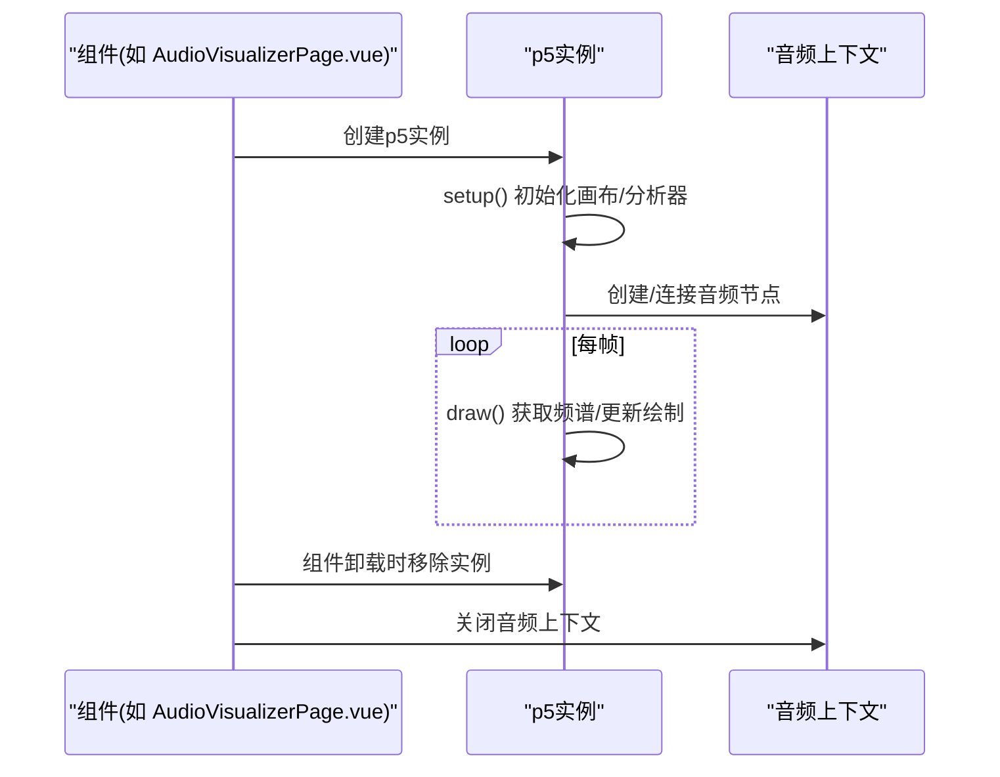
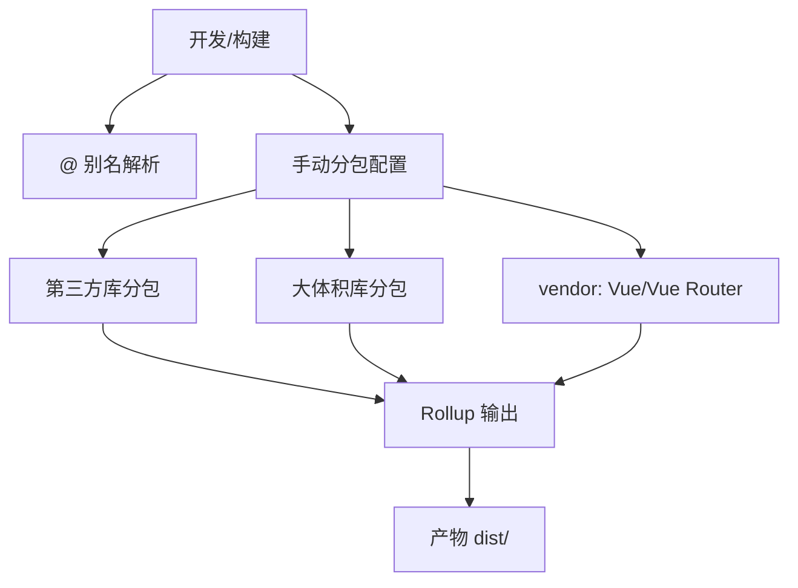
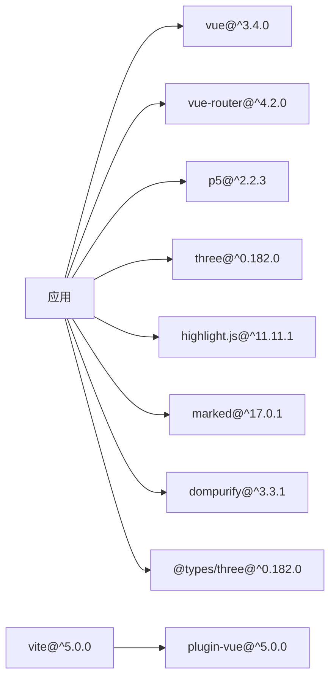

# 技术架构

<cite>
**本文引用的文件**
- [package.json](file://package.json)
- [vite.config.js](file://vite.config.js)
- [src/main.js](file://src/main.js)
- [src/App.vue](file://src/App.vue)
- [src/router/index.js](file://src/router/index.js)
- [src/components/DynamicBackground.vue](file://src/components/DynamicBackground.vue)
- [src/data/animations.js](file://src/data/animations.js)
- [src/views/Home.vue](file://src/views/Home.vue)
- [src/views/FluidSimulationPage.vue](file://src/views/FluidSimulationPage.vue)
- [src/views/AudioVisualizerPage.vue](file://src/views/AudioVisualizerPage.vue)
- [src/views/BlackHole.vue](file://src/views/BlackHole.vue)
</cite>

## 目录
1. [引言](#引言)
2. [项目结构](#项目结构)
3. [核心组件](#核心组件)
4. [架构总览](#架构总览)
5. [详细组件分析](#详细组件分析)
6. [依赖分析](#依赖分析)
7. [性能考虑](#性能考虑)
8. [故障排查指南](#故障排查指南)
9. [结论](#结论)
10. [附录](#附录)

## 引言
本项目是一个以“动画博客”为主题的技术演示站点，采用 Vue 3 + Vite 的现代化前端架构，结合 p5.js 图形系统与部分 Three.js 类型声明，构建了丰富的交互式动画页面集合。系统通过组件化架构、路由系统与构建工具配置，实现了高性能、可扩展且易于维护的前端应用。

## 项目结构
项目采用按功能域划分的目录组织方式，核心模块包括：
- 应用入口与全局配置：src/main.js、src/App.vue
- 路由系统：src/router/index.js
- 视图页面：src/views 下的各动画页面
- 组件：src/components 下的通用组件（如动态背景）
- 数据：src/data 下的动画元数据与分类信息
- 构建配置：vite.config.js
- 依赖管理：package.json

**图表来源**
- [src/main.js:1-12](file://src/main.js#L1-L12)
- [src/App.vue:1-334](file://src/App.vue#L1-L334)
- [src/router/index.js:1-205](file://src/router/index.js#L1-L205)
- [src/views/Home.vue:1-349](file://src/views/Home.vue#L1-L349)
- [src/views/FluidSimulationPage.vue:1-281](file://src/views/FluidSimulationPage.vue#L1-L281)
- [src/views/AudioVisualizerPage.vue:1-346](file://src/views/AudioVisualizerPage.vue#L1-L346)
- [src/views/BlackHole.vue:1-310](file://src/views/BlackHole.vue#L1-L310)
- [src/components/DynamicBackground.vue:1-185](file://src/components/DynamicBackground.vue#L1-L185)
- [src/data/animations.js:1-400](file://src/data/animations.js#L1-L400)

**章节来源**
- [src/main.js:1-12](file://src/main.js#L1-L12)
- [src/App.vue:1-334](file://src/App.vue#L1-L334)
- [src/router/index.js:1-205](file://src/router/index.js#L1-L205)
- [vite.config.js:1-32](file://vite.config.js#L1-L32)
- [package.json:1-29](file://package.json#L1-L29)

## 核心组件
- 应用入口与全局插件注册：创建 Vue 应用实例，挂载路由，并注册全局高亮工具。
- 根组件：负责导航、主内容区布局、回到顶部按钮与动态背景组件的组合。
- 路由系统：基于 Vue Router 4 的 Web History 模式，支持懒加载与滚动行为控制。
- 动态背景组件：基于 Canvas 的粒子系统，实现鼠标交互与粒子连线。
- 动画数据：集中管理所有动画的元数据、分类与难度信息，供首页筛选与展示使用。

**章节来源**
- [src/main.js:1-12](file://src/main.js#L1-L12)
- [src/App.vue:1-334](file://src/App.vue#L1-L334)
- [src/router/index.js:1-205](file://src/router/index.js#L1-L205)
- [src/components/DynamicBackground.vue:1-185](file://src/components/DynamicBackground.vue#L1-L185)
- [src/data/animations.js:1-400](file://src/data/animations.js#L1-L400)

## 架构总览
系统采用“单页应用 + 组件化 + 懒加载”的架构模式，结合 Vite 的快速开发与构建能力，实现高性能的动画页面加载与运行。

**图表来源**
- [src/main.js:1-12](file://src/main.js#L1-L12)
- [src/App.vue:1-334](file://src/App.vue#L1-L334)
- [src/router/index.js:1-205](file://src/router/index.js#L1-L205)
- [src/components/DynamicBackground.vue:1-185](file://src/components/DynamicBackground.vue#L1-L185)
- [src/views/Home.vue:1-349](file://src/views/Home.vue#L1-L349)
- [src/views/FluidSimulationPage.vue:1-281](file://src/views/FluidSimulationPage.vue#L1-L281)
- [src/views/AudioVisualizerPage.vue:1-346](file://src/views/AudioVisualizerPage.vue#L1-L346)
- [src/views/BlackHole.vue:1-310](file://src/views/BlackHole.vue#L1-L310)
- [src/data/animations.js:1-400](file://src/data/animations.js#L1-L400)
- [vite.config.js:1-32](file://vite.config.js#L1-L32)
- [package.json:1-29](file://package.json#L1-L29)

## 详细组件分析

### 路由系统设计
- 路由模式：基于 Web History，支持基础路径前缀。
- 懒加载：各视图组件通过动态导入实现按需加载，减少首屏体积。
- 滚动行为：返回顶部或保留滚动位置，提升用户体验。
- 扩展性：新增动画页面仅需在路由表中添加条目即可接入。

**图表来源**
- [src/router/index.js:1-205](file://src/router/index.js#L1-L205)

**章节来源**
- [src/router/index.js:1-205](file://src/router/index.js#L1-L205)

### 组件通信与数据流
- 根组件 App.vue：通过计算属性判断当前页面类型，控制回到顶部按钮与主内容区全屏样式；同时注入动态背景组件。
- 首页 Home.vue：从动画数据模块读取元数据，基于分类进行筛选与展示；使用过渡动画增强交互体验。
- 动态背景 DynamicBackground.vue：内部封装 Canvas 粒子系统，通过生命周期钩子完成初始化与清理，避免内存泄漏。

**图表来源**
- [src/views/Home.vue:1-349](file://src/views/Home.vue#L1-L349)
- [src/data/animations.js:1-400](file://src/data/animations.js#L1-L400)

**章节来源**
- [src/App.vue:1-334](file://src/App.vue#L1-L334)
- [src/views/Home.vue:1-349](file://src/views/Home.vue#L1-L349)
- [src/components/DynamicBackground.vue:1-185](file://src/components/DynamicBackground.vue#L1-L185)
- [src/data/animations.js:1-400](file://src/data/animations.js#L1-L400)

### p5.js 图形系统与 Three.js 类型声明
- p5.js 集成：在多个动画页面中直接引入 p5，通过 sketch 回调函数实现画布初始化、帧循环与交互处理。
- Three.js 类型声明：项目包含 Three.js 的类型声明依赖，便于在需要 3D 场景时进行类型安全开发与 IDE 支持。
- 性能考量：p5 实例在组件卸载时被移除，避免内存泄漏；Canvas 尺寸随窗口变化自适应。

**图表来源**
- [src/views/AudioVisualizerPage.vue:1-346](file://src/views/AudioVisualizerPage.vue#L1-L346)

**章节来源**
- [src/views/FluidSimulationPage.vue:1-281](file://src/views/FluidSimulationPage.vue#L1-L281)
- [src/views/AudioVisualizerPage.vue:1-346](file://src/views/AudioVisualizerPage.vue#L1-L346)
- [src/views/BlackHole.vue:1-310](file://src/views/BlackHole.vue#L1-L310)
- [package.json:11-21](file://package.json#L11-L21)

### 构建工具与分包策略
- 插件与别名：启用 Vue 插件，设置路径别名 @ 指向 src，简化导入路径。
- 分包策略：将核心依赖（Vue、Vue Router）与常用第三方库（highlight.js、marked、dompurify、echarts）拆分为独立 chunk，降低重复加载与缓存失效风险。
- 警告阈值：针对大体积库（如 echarts）调整 chunkSizeWarningLimit，避免构建警告干扰。

**图表来源**
- [vite.config.js:1-32](file://vite.config.js#L1-L32)

**章节来源**
- [vite.config.js:1-32](file://vite.config.js#L1-L32)

## 依赖分析
- 运行时依赖
  - Vue 3 与 Vue Router 4：提供响应式与路由能力。
  - p5.js：图形与动画渲染的核心库。
  - highlight.js、marked、dompurify：文本渲染与安全处理。
  - three：3D 渲染（含类型声明）。
- 开发依赖
  - Vite 与 @vitejs/plugin-vue：现代化构建与热更新。
  - less：CSS 预处理器。

**图表来源**
- [package.json:11-27](file://package.json#L11-L27)

**章节来源**
- [package.json:1-29](file://package.json#L1-29)

## 性能考虑
- 懒加载与分包：路由与第三方库分包，减少首屏资源体积。
- Canvas 与 p5：在动画页内按需创建实例并在卸载时销毁，避免常驻内存。
- 响应式与过渡：使用 Vue 的过渡与计算属性，减少不必要的重渲染。
- 构建优化：合理设置 chunk 大小与分包策略，提升缓存命中率。

[本节为通用性能建议，不直接分析具体文件]

## 故障排查指南
- 页面空白或组件未渲染
  - 检查路由配置与组件导出是否正确。
  - 确认 p5 实例在卸载时被移除，避免重复创建导致冲突。
- Canvas 无法绘制或尺寸异常
  - 确认画布容器存在且尺寸正确，监听窗口 resize 事件。
- 音频相关问题
  - 确保音频上下文在组件卸载时关闭，避免后台持续占用。
- 构建警告或体积过大
  - 检查分包配置与 chunkSizeWarningLimit 设置。

**章节来源**
- [src/views/FluidSimulationPage.vue:223-231](file://src/views/FluidSimulationPage.vue#L223-L231)
- [src/views/AudioVisualizerPage.vue:286-297](file://src/views/AudioVisualizerPage.vue#L286-L297)
- [src/components/DynamicBackground.vue:156-172](file://src/components/DynamicBackground.vue#L156-L172)
- [vite.config.js:13-31](file://vite.config.js#L13-L31)

## 结论
本项目通过 Vue 3 + Vite 的现代化技术栈，结合 p5.js 图形系统与合理的构建分包策略，构建了一个高性能、可扩展的动画博客平台。路由系统与组件化架构保证了良好的可维护性，而动态背景与多类动画页面则展示了前端图形渲染的多样性与表现力。

## 附录
- 系统边界
  - 前端应用边界：浏览器环境内的单页应用，路由与组件构成的 UI 层。
  - 第三方依赖边界：通过包管理器统一管理，构建阶段进行分包与优化。
- 最佳实践
  - 优先使用 Composition API 与组合式组件，提升逻辑复用与可测试性。
  - 对重型动画页面采用懒加载与按需初始化，优化首屏性能。
  - 在组件生命周期中严格管理外部资源（Canvas、音频、事件监听），防止内存泄漏。