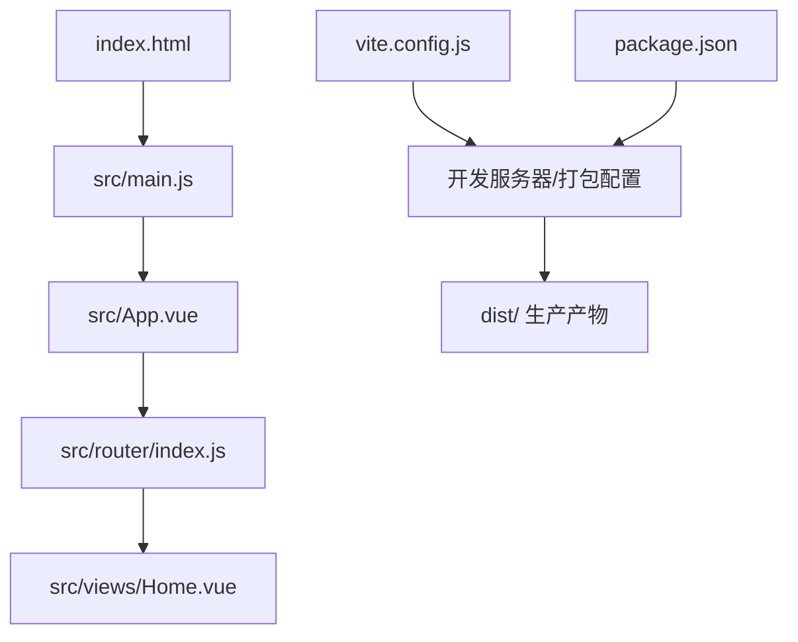
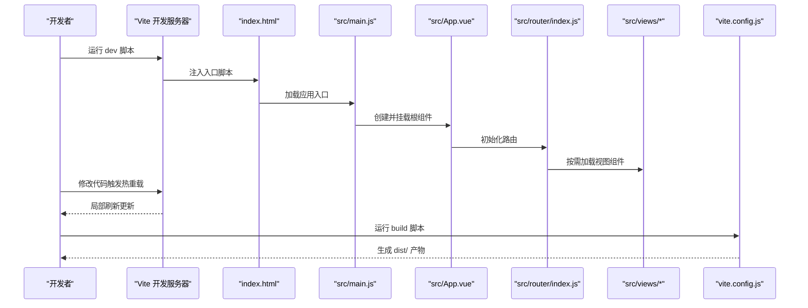
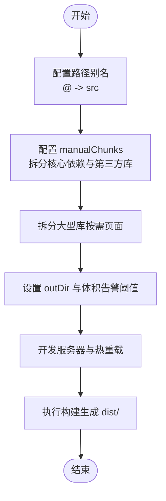
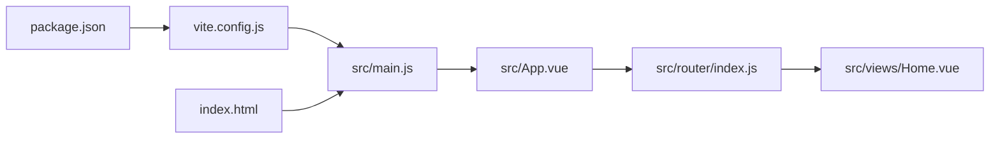

# 构建配置

<cite>
**本文引用的文件**
- [vite.config.js](file://vite.config.js)
- [package.json](file://package.json)
- [index.html](file://index.html)
- [src/main.js](file://src/main.js)
- [src/App.vue](file://src/App.vue)
- [src/router/index.js](file://src/router/index.js)
- [src/views/Home.vue](file://src/views/Home.vue)
- [README.md](file://README.md)
</cite>

## 目录
1. [简介](#简介)
2. [项目结构](#项目结构)
3. [核心组件](#核心组件)
4. [架构总览](#架构总览)
5. [详细组件分析](#详细组件分析)
6. [依赖关系分析](#依赖关系分析)
7. [性能考量](#性能考量)
8. [故障排查指南](#故障排查指南)
9. [结论](#结论)
10. [附录](#附录)

## 简介
本文件面向动画博客项目的构建配置，围绕 Vite 5.0 的配置策略进行系统化说明，覆盖开发服务器设置、代码分割与热重载机制、构建优化（静态资源处理、插件系统、生产优化）、依赖管理与脚本命令、HTML 模板与注入机制，并给出性能优化建议、CDN 方案与部署策略，以及常见问题诊断与解决思路。

## 项目结构
该项目采用 Vue 3 + Vite 的单页应用结构，核心目录与文件如下：
- 源码入口：src/main.js
- 应用根组件：src/App.vue
- 路由配置：src/router/index.js
- 视图组件：src/views 下的各页面
- 构建配置：vite.config.js
- 依赖与脚本：package.json
- HTML 模板：index.html
- README 提供部署与开发流程说明

图表来源
- [index.html](file://index.html)
- [src/main.js](file://src/main.js)
- [src/App.vue](file://src/App.vue)
- [src/router/index.js](file://src/router/index.js)
- [src/views/Home.vue](file://src/views/Home.vue)
- [vite.config.js](file://vite.config.js)
- [package.json](file://package.json)

章节来源
- [README.md](file://README.md)
- [index.html](file://index.html)
- [src/main.js](file://src/main.js)
- [src/App.vue](file://src/App.vue)
- [src/router/index.js](file://src/router/index.js)
- [src/views/Home.vue](file://src/views/Home.vue)
- [vite.config.js](file://vite.config.js)
- [package.json](file://package.json)

## 核心组件
本节聚焦构建配置的关键方面：开发服务器、代码分割、热重载、插件系统、静态资源与生产优化。

- 开发服务器与热重载
  - 使用 Vite 内置的开发服务器，默认端口与路径行为由 Vite 控制；通过 package.json 的 scripts 启动 dev 与 preview。
  - 热重载由 Vite 的模块热替换机制提供，无需额外配置即可生效。

- 代码分割与手动分包
  - 通过 Rollup 的 manualChunks 将核心依赖与第三方库拆分为独立 chunk，提升缓存命中率与并行加载效率。
  - 对仅在特定页面使用的大型库（如可视化库）单独拆分，避免非必要页面加载大体积依赖。

- 插件系统
  - 默认启用 Vue 官方插件，用于编译单文件组件与运行时增强。
  - 可按需扩展更多插件（如预处理器、压缩器等），但当前配置保持精简。

- 静态资源与别名
  - 通过路径别名简化导入语句，提升可维护性。
  - 构建输出目录与基础路径在配置中明确，确保 GitHub Pages 等托管平台正确解析资源。

- 生产优化
  - 明确 outDir 与 chunkSizeWarningLimit，平衡体积与警告阈值。
  - 通过 manualChunks 降低首屏阻塞，优化关键路径资源。

章节来源
- [vite.config.js](file://vite.config.js)
- [package.json](file://package.json)

## 架构总览
下图展示从开发到生产的整体流程，包括入口、路由、视图与构建配置之间的交互。

图表来源
- [index.html](file://index.html)
- [src/main.js](file://src/main.js)
- [src/App.vue](file://src/App.vue)
- [src/router/index.js](file://src/router/index.js)
- [src/views/Home.vue](file://src/views/Home.vue)
- [vite.config.js](file://vite.config.js)
- [package.json](file://package.json)

## 详细组件分析

### Vite 配置分析（vite.config.js）
- 插件与基础设置
  - 启用 Vue 插件以支持 SFC 编译。
  - 设置路径别名为 @ 指向 src，便于统一导入。
  - base 为根路径，配合 GitHub Pages 等平台部署。

- 代码分割策略
  - 使用 manualChunks 将核心依赖（如框架与路由）拆分为独立 chunk，提升复用与缓存效果。
  - 将常用第三方库（如代码高亮、解析库、清理库）拆分为独立 chunk。
  - 将大型库（如可视化库）拆分为独立 chunk，仅在需要的页面按需加载，减少首屏体积。

- 构建输出与体积告警
  - outDir 指定生产产物目录。
  - 调整 chunkSizeWarningLimit 以适应大型库的实际体积。

图表来源
- [vite.config.js](file://vite.config.js)

章节来源
- [vite.config.js](file://vite.config.js)

### 依赖与脚本（package.json）
- 依赖管理
  - 运行时依赖包含 Vue 3、Vue Router、动画与可视化相关库（如 p5、three、echarts 等），以及代码高亮、解析与清理工具。
  - 开发时依赖包含 Vite 与 Vue 插件，以及样式预处理工具。

- 脚本命令
  - dev：启动开发服务器。
  - build：生成生产构建产物至 dist。
  - preview：本地预览生产构建结果。

- 版本与类型
  - 项目为 ES Module 类型，使用现代 Node 与 npm/yarn 生态。

章节来源
- [package.json](file://package.json)

### HTML 模板与注入（index.html）
- 模板结构
  - 提供基础 meta 信息与站点描述。
  - 引入外部音频库脚本，延迟加载以避免阻塞首屏。
  - 通过模块脚本引入应用入口 main.js。

- 注入机制
  - Vite 在开发时自动注入入口脚本与模块脚本，生产构建时由 Rollup 输出静态资源并由 index.html 引用。

章节来源
- [index.html](file://index.html)

### 应用入口与全局初始化（src/main.js）
- 入口职责
  - 创建 Vue 应用实例，安装路由，挂载根组件。
  - 全局注册代码高亮工具，便于在组件中使用。

- 与构建的关系
  - 入口文件作为 Rollup 入口参与代码分割决策，影响 vendor 与业务代码的划分。

章节来源
- [src/main.js](file://src/main.js)

### 路由与视图（src/router/index.js 与 src/views/Home.vue）
- 路由配置
  - 使用 history 模式，基础路径为根路径。
  - 采用动态导入实现按需加载视图组件，天然契合代码分割策略。

- 首屏优化
  - 首页组件与路由联动，结合 manualChunks 与动态导入，减少首屏加载体积。

章节来源
- [src/router/index.js](file://src/router/index.js)
- [src/views/Home.vue](file://src/views/Home.vue)

### 根组件与样式（src/App.vue）
- 组件职责
  - 提供全局导航、主内容区与回到顶部按钮等通用 UI。
  - 使用 Less 预处理样式，定义主题变量与响应式布局。

- 与构建的关系
  - 样式文件参与构建打包，建议按需引入与拆分，避免全局样式过大影响首屏。

章节来源
- [src/App.vue](file://src/App.vue)

## 依赖关系分析
下图展示关键文件之间的依赖关系与调用链。

图表来源
- [package.json](file://package.json)
- [vite.config.js](file://vite.config.js)
- [src/main.js](file://src/main.js)
- [src/App.vue](file://src/App.vue)
- [src/router/index.js](file://src/router/index.js)
- [src/views/Home.vue](file://src/views/Home.vue)
- [index.html](file://index.html)

章节来源
- [package.json](file://package.json)
- [vite.config.js](file://vite.config.js)
- [src/main.js](file://src/main.js)
- [src/App.vue](file://src/App.vue)
- [src/router/index.js](file://src/router/index.js)
- [src/views/Home.vue](file://src/views/Home.vue)
- [index.html](file://index.html)

## 性能考量
- 代码分割与懒加载
  - 通过 manualChunks 将核心依赖与第三方库拆分，结合路由动态导入，最大化缓存复用与并行下载。
  - 对大型库（如可视化库）单独拆分，仅在目标页面加载，降低首屏负担。

- 静态资源优化
  - 图片与媒体资源建议压缩与按需加载；CSS 采用预处理并在构建时合并与最小化。
  - 使用 CDN 引入不常变更的外部库，进一步缩短加载时间。

- 构建体积控制
  - 调整 chunkSizeWarningLimit 以匹配实际依赖体积，避免误报。
  - 定期审计依赖树，移除未使用或重复依赖。

- 预渲染与缓存策略
  - 在静态站点场景下考虑预渲染或服务端渲染（SSR）以提升首屏性能。
  - 配置浏览器缓存头与资源指纹，提升二次访问速度。

[本节为通用性能建议，不直接分析具体文件，故无“章节来源”]

## 故障排查指南
- 开发服务器无法启动或端口冲突
  - 检查本地端口占用情况，或调整 Vite 开发服务器端口配置。
  - 确认 Node.js 版本满足项目要求。

- 热重载不生效
  - 确保未禁用 HMR；检查浏览器控制台是否存在语法或模块解析错误。
  - 避免在入口或全局状态中抛出未捕获异常导致热更新中断。

- 构建产物路径错误（如资源 404）
  - 确认基础路径 base 与部署路径一致；在 GitHub Pages 等子路径部署场景下，确保路由模式与基础路径匹配。
  - 检查 outDir 与实际产物目录一致。

- 大型库导致体积告警
  - 结合 manualChunks 将大型库拆分为独立 chunk；对仅在特定页面使用的库采用动态导入。
  - 若仍超限，评估是否可通过 CDN 引入或按需加载策略进一步优化。

- 第三方脚本加载问题
  - 外部脚本采用 defer 加载，避免阻塞主线程；若出现跨域或安全策略问题，检查 CSP 与资源来源。

章节来源
- [vite.config.js](file://vite.config.js)
- [index.html](file://index.html)
- [README.md](file://README.md)

## 结论
本项目的 Vite 构建配置以“按需加载 + 手动分包 + 路由懒加载”为核心策略，在保证开发体验的同时显著优化了生产体积与加载性能。通过明确的路径别名、清晰的依赖管理与合理的构建参数，项目具备良好的可维护性与可扩展性。建议在后续迭代中持续关注依赖体积变化，配合 CDN 与缓存策略进一步提升性能与稳定性。

[本节为总结性内容，不直接分析具体文件，故无“章节来源”]

## 附录
- 部署到 GitHub Pages 的参考流程
  - 在仓库设置中启用 Pages，并选择使用 CI/CD 工作流进行自动构建与部署。
  - 确保基础路径与路由模式与部署路径一致，避免资源与路由 404。

章节来源
- [README.md](file://README.md)