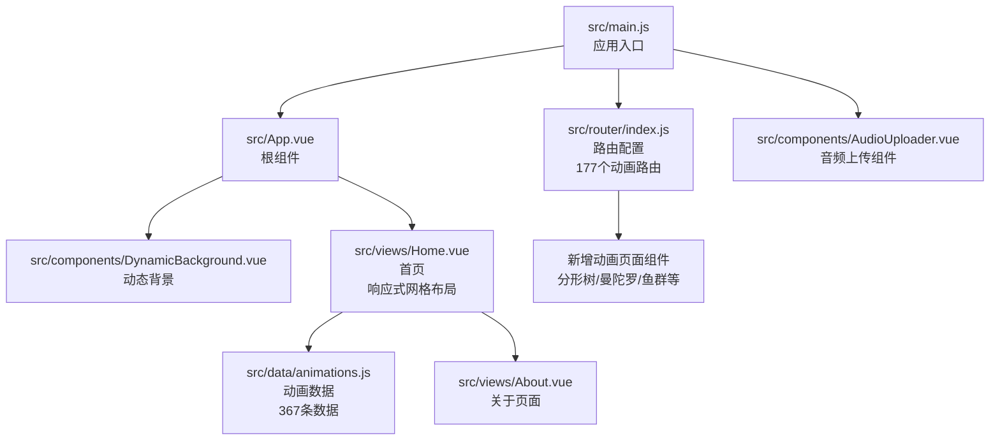
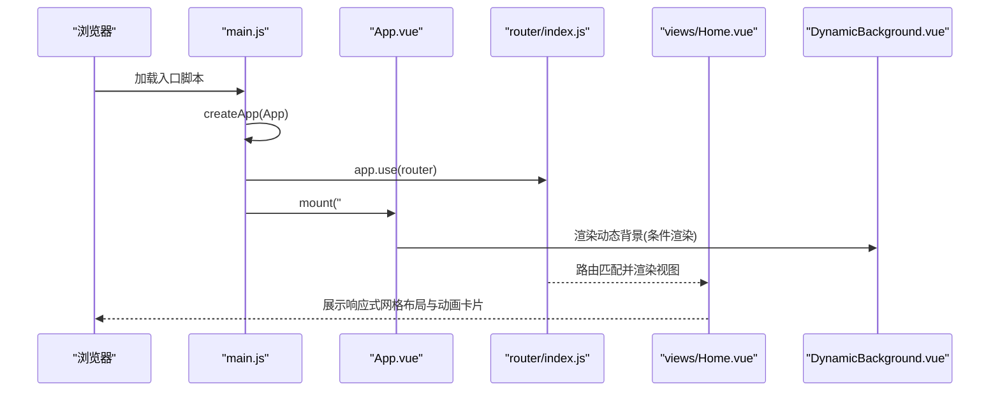
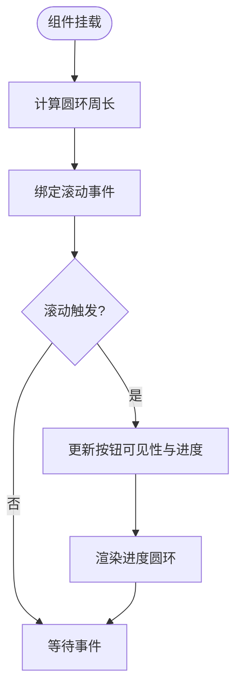
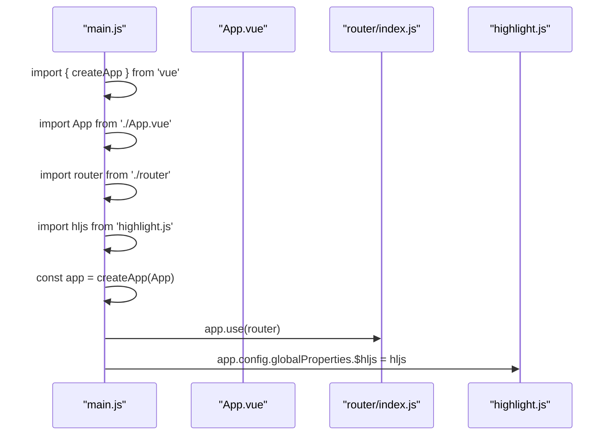
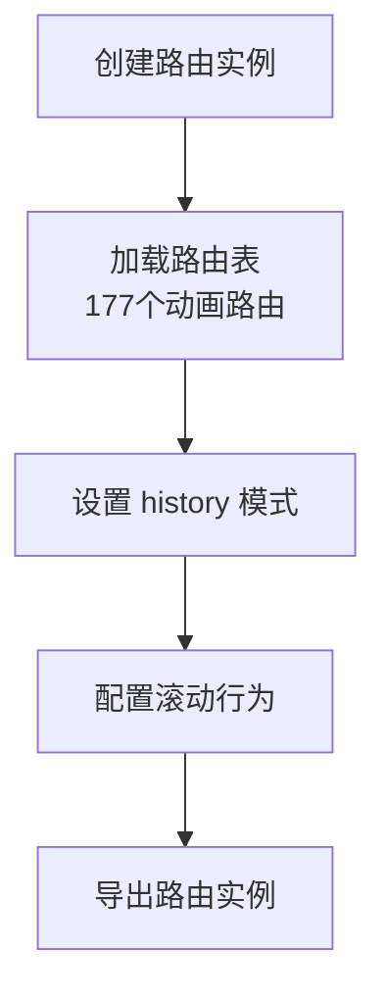
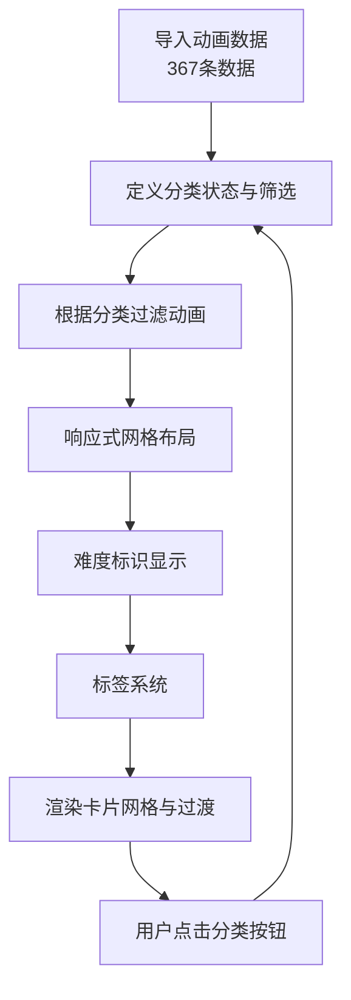
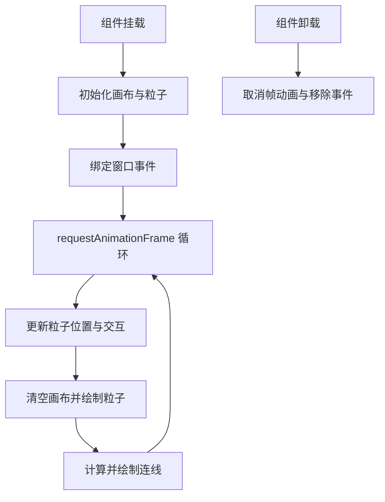
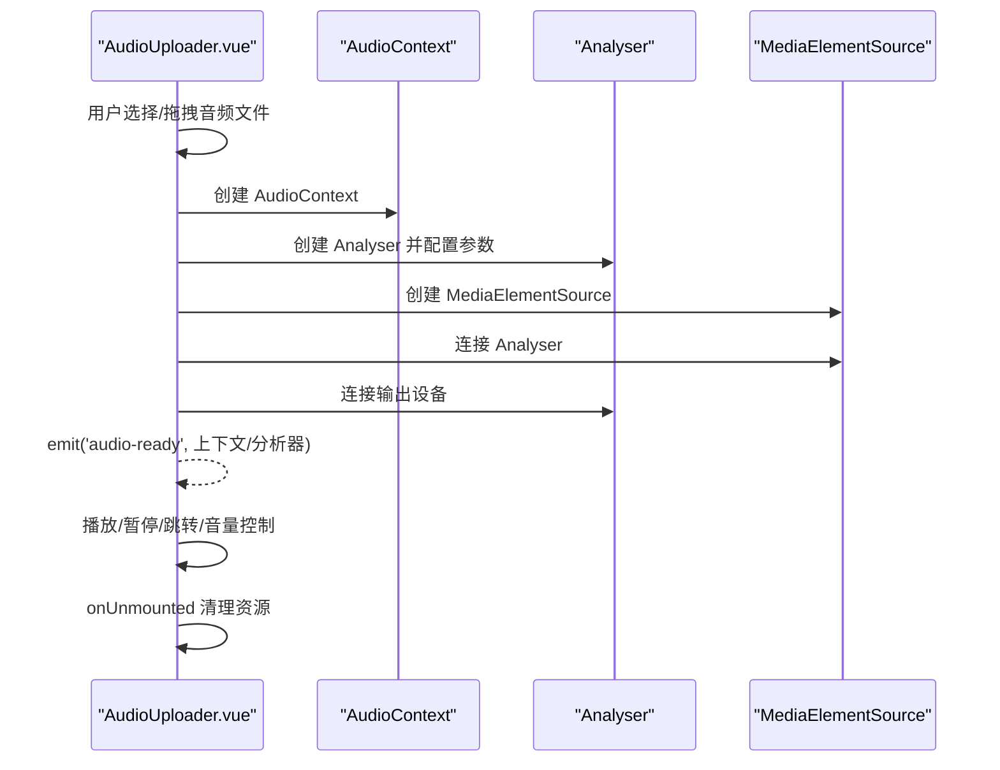
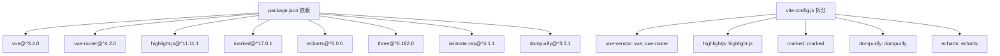

# 核心框架架构

<cite>
**本文档引用的文件**
- [App.vue](file://src/App.vue)
- [main.js](file://src/main.js)
- [router/index.js](file://src/router/index.js)
- [views/Home.vue](file://src/views/Home.vue)
- [components/DynamicBackground.vue](file://src/components/DynamicBackground.vue)
- [data/animations.js](file://src/data/animations.js)
- [components/AudioUploader.vue](file://src/components/AudioUploader.vue)
- [views/About.vue](file://src/views/About.vue)
- [views/FractalTree.vue](file://src/views/FractalTree.vue)
- [views/Mandala.vue](file://src/views/Mandala.vue)
- [views/FishPage.vue](file://src/views/FishPage.vue)
- [views/LeavesPage.vue](file://src/views/LeavesPage.vue)
- [package.json](file://package.json)
- [vite.config.js](file://vite.config.js)
- [README.md](file://README.md)
</cite>

## 更新摘要
**变更内容**
- 路由系统调整：移除了BlackHole和GravityField动画路由，路由总数从179个调整为177个
- 动画数据精简：移除了BlackHole和GravityField相关的动画条目，保持现有数据完整性
- 组件分析更新：更新了新增动画页面组件分析章节，移除了BlackHole和GravityField相关内容
- 依赖管理优化：移除了p5.js相关依赖，简化了项目依赖结构

## 目录
1. [简介](#简介)
2. [项目结构](#项目结构)
3. [核心组件](#核心组件)
4. [架构总览](#架构总览)
5. [详细组件分析](#详细组件分析)
6. [依赖分析](#依赖分析)
7. [性能考量](#性能考量)
8. [故障排查指南](#故障排查指南)
9. [结论](#结论)
10. [附录](#附录)

## 简介
本项目是一个基于 Vue 3 + Vite 的动画博客项目，采用 Composition API 设计模式与组件化架构，结合 Vue Router 4 实现页面级动画展示。项目通过动态背景组件提供沉浸式首页体验，并以路由驱动的页面组件承载各类动画演示。应用启动流程简洁清晰，全局插件注册与依赖拆分优化了首屏性能与可维护性。

**更新** 项目现已调整为包含177个动画路由的优化版动画博客平台，移除了BlackHole和GravityField动画，专注于其他17个高质量动画页面的展示。

## 项目结构
项目采用按功能域划分的目录组织方式：
- src/views：页面组件，承载路由对应的视图内容，现已包含177个动画页面
- src/components：通用组件，如动态背景、音频上传等
- src/router：路由配置，集中管理页面路径与懒加载
- src/data：静态数据，如动画元数据与分类信息，现已包含367条动画数据
- src/App.vue：根组件，负责全局布局、导航与滚动交互
- src/main.js：应用入口，创建应用实例并挂载

**图表来源**
- [main.js:1-12](file://src/main.js#L1-L12)
- [App.vue:1-457](file://src/App.vue#L1-L457)
- [router/index.js:1-229](file://src/router/index.js#L1-L229)
- [views/Home.vue:1-555](file://src/views/Home.vue#L1-L555)
- [components/DynamicBackground.vue:1-185](file://src/components/DynamicBackground.vue#L1-L185)
- [data/animations.js:1-367](file://src/data/animations.js#L1-L367)
- [views/About.vue:1-181](file://src/views/About.vue#L1-L181)
- [components/AudioUploader.vue:1-514](file://src/components/AudioUploader.vue#L1-L514)

**章节来源**
- [README.md:69-86](file://README.md#L69-L86)
- [package.json:1-29](file://package.json#L1-L29)

## 核心组件
- 根组件 App.vue：负责全局导航、动态背景渲染、回到顶部按钮与滚动进度计算；通过计算属性判断页面类型以决定布局样式。
- 应用入口 main.js：创建 Vue 应用实例，注册路由插件，挂载根组件；同时全局注入 highlight.js。
- 路由配置 router/index.js：集中声明所有页面路由，采用 history 模式与懒加载，提供滚动行为控制。现已调整为包含177个动画路由的完整路由系统。
- 首页视图 Home.vue：使用 Composition API 管理分类筛选与动画卡片展示，配合 TransitionGroup 实现卡片过渡动画。重构为响应式网格布局，支持难度标识和标签显示。
- 动态背景组件 DynamicBackground.vue：基于 Canvas 的粒子系统，实现鼠标交互与粒子连线，组件生命周期内进行资源初始化与清理。
- 动画数据 data/animations.js：集中管理所有动画的元数据与分类信息，包含367条动画数据，支持难度级别和标签分类。
- 音频上传组件 AudioUploader.vue：封装 Web Audio API，提供拖拽上传、播放控制、音量调节与资源清理。
- 关于页面 About.vue：展示个人信息与联系方式，嵌入 3D 头像组件。
- 新增动画页面组件：包含基于原生 Canvas 和 p5.js 的复杂动画页面，如分形树、曼陀罗、鱼群效果、树叶飘落等。

**更新** 路由系统已移除BlackHole和GravityField动画路由，现包含177个动画路由，专注于其他高质量动画页面的展示。

**章节来源**
- [App.vue:64-123](file://src/App.vue#L64-L123)
- [main.js:1-12](file://src/main.js#L1-L12)
- [router/index.js:1-229](file://src/router/index.js#L1-L229)
- [views/Home.vue:47-79](file://src/views/Home.vue#L47-L79)
- [components/DynamicBackground.vue:5-173](file://src/components/DynamicBackground.vue#L5-L173)
- [data/animations.js:1-367](file://src/data/animations.js#L1-L367)
- [components/AudioUploader.vue:92-298](file://src/components/AudioUploader.vue#L92-L298)
- [views/About.vue:45-58](file://src/views/About.vue#L45-L58)

## 架构总览
整体架构遵循"入口创建应用 -> 注册插件 -> 挂载根组件"的标准流程，路由驱动页面切换，组件间通过 props、事件与全局状态进行协作。动态背景作为根组件的子组件，在首页渲染；音频上传组件作为独立功能模块被需要的页面复用。移除BlackHole和GravityField动画后，路由系统更加精简高效。

**图表来源**
- [main.js:1-12](file://src/main.js#L1-L12)
- [App.vue:1-62](file://src/App.vue#L1-L62)
- [router/index.js:1-229](file://src/router/index.js#L1-L229)
- [views/Home.vue:1-45](file://src/views/Home.vue#L1-L45)
- [components/DynamicBackground.vue:1-3](file://src/components/DynamicBackground.vue#L1-L3)

## 详细组件分析

### 根组件 App.vue 结构与生命周期
- 结构设计：包含导航栏、主内容区与回到顶部按钮；根据路由路径动态决定是否渲染动态背景与布局样式。
- 生命周期：mounted 阶段计算圆环周长并绑定滚动事件；beforeUnmount 解绑事件，避免内存泄漏。
- 交互逻辑：滚动超过阈值显示回到顶部按钮，实时计算滚动进度并在按钮上以 SVG 圆环展示。

**图表来源**
- [App.vue:93-121](file://src/App.vue#L93-L121)

**章节来源**
- [App.vue:64-123](file://src/App.vue#L64-L123)

### 应用初始化流程与插件注册
- 创建应用实例：通过 createApp(App) 构建应用。
- 注册路由插件：调用 app.use(router) 完成路由注册。
- 全局配置：通过 app.config.globalProperties 注入 highlight.js，便于全局使用。
- 挂载应用：将根组件挂载到 DOM 容器。

**图表来源**
- [main.js:1-12](file://src/main.js#L1-L12)

**章节来源**
- [main.js:1-12](file://src/main.js#L1-L12)

### Vue Router 4 路由配置策略
- 路由声明：集中定义所有页面路由，采用函数式懒加载导入，减少初始包体积。现已调整为包含177个动画路由的完整路由系统。
- 历史模式：使用 createWebHistory，支持现代浏览器的 URL 历史管理。
- 滚动行为：提供 scrollBehavior，优先恢复历史滚动位置，否则滚动至顶部。
- 路由守卫：未在此文件中实现，若需权限或前置校验可在后续扩展。

**更新** 路由系统已移除BlackHole和GravityField动画路由，现包含177个动画路由，涵盖自然系、粒子物理、音频系、波形能量、生成艺术、交互治愈等多个分类。

**图表来源**
- [router/index.js:216-229](file://src/router/index.js#L216-L229)

**章节来源**
- [router/index.js:1-229](file://src/router/index.js#L1-L229)

### 首页视图与数据流
- 数据来源：从 data/animations.js 导入动画数组与分类数组，现已包含367条动画数据。
- 状态管理：使用 ref 与 computed 管理当前分类与筛选结果，实现响应式更新。
- 视图渲染：重构为响应式网格布局，使用 v-for 渲染动画卡片，使用 TransitionGroup 实现进入/离开过渡。
- 交互处理：点击分类按钮切换 currentCategory，computed 计算 filteredAnimations。
- 难度标识：支持入门、进阶、高级三种难度级别的可视化显示。
- 标签系统：支持多标签分类，提供更精细的内容组织。

**更新** 首页视图已重构为响应式网格布局，支持分类筛选、难度标识和标签显示，提供更好的用户体验。

**图表来源**
- [views/Home.vue:47-79](file://src/views/Home.vue#L47-L79)
- [data/animations.js:1-367](file://src/data/animations.js#L1-L367)

**章节来源**
- [views/Home.vue:1-555](file://src/views/Home.vue#L1-L555)
- [data/animations.js:1-367](file://src/data/animations.js#L1-L367)

### 动态背景组件与 Canvas 动画
- 组件职责：在全屏容器内绘制粒子、处理鼠标交互与粒子连线，提供流畅的背景动画。
- 生命周期：onMounted 初始化画布、事件监听与动画循环；onUnmounted 清理资源与取消帧动画。
- 性能要点：使用 requestAnimationFrame 控制动画帧；按屏幕分辨率动态创建粒子数量；鼠标交互采用距离阈值减少计算开销。

**图表来源**
- [components/DynamicBackground.vue:58-173](file://src/components/DynamicBackground.vue#L58-L173)

**章节来源**
- [components/DynamicBackground.vue:1-185](file://src/components/DynamicBackground.vue#L1-L185)

### 音频上传组件与 Web Audio API
- 功能特性：支持拖拽上传音频、播放/暂停控制、进度跳转、音量调节与资源清理。
- Web Audio 流程：创建 AudioContext -> 创建 Analyser -> 连接源节点 -> 输出到扬声器；通过 emit 向父组件传递音频上下文与分析器。
- 生命周期：onUnmounted 阶段统一断开连接、关闭上下文与撤销对象 URL，防止内存泄漏。

**图表来源**
- [components/AudioUploader.vue:136-178](file://src/components/AudioUploader.vue#L136-L178)
- [components/AudioUploader.vue:294-298](file://src/components/AudioUploader.vue#L294-L298)

**章节来源**
- [components/AudioUploader.vue:1-514](file://src/components/AudioUploader.vue#L1-L514)

### 关于页面与 3D 头像组件
- 结构组成：包含 3D 头像区域与个人信息展示，使用渐变动画增强视觉效果。
- 组件复用：通过 import 引入 PersonalAvatar3D 组件，体现组件化架构下的模块复用。

**章节来源**
- [views/About.vue:1-181](file://src/views/About.vue#L1-L181)

### 新增动画页面组件分析
- **分形树页面**：基于p5.js实现的递归分形树，支持四季切换和季节特效，包含春天的蝴蝶、夏天的鸟儿、秋天的落叶和冬天的雪花效果。
- **曼陀罗页面**：基于p5.js的对称艺术创作工具，支持多种对称模式和交互绘制，提供离屏图形缓冲区优化性能。
- **鱼群效果页面**：基于原生Canvas实现的鱼群模拟，包含300条鱼的群体行为和鼠标交互效果。
- **树叶飘落页面**：基于原生Canvas实现的复杂树叶动画，包含大树生长、树叶吸附、飘落和爆开等完整生命周期。
- **其他动画页面**：包括流体模拟、细胞自动机、烟花爆炸、交互网、光之舞者、彩虹波浪等多种类型的动画页面。

**更新** 移除了BlackHole和GravityField动画页面，新增了更多基于原生Canvas和p5.js的高质量动画页面。

**章节来源**
- [views/FractalTree.vue:1-800](file://src/views/FractalTree.vue#L1-L800)
- [views/Mandala.vue:1-259](file://src/views/Mandala.vue#L1-L259)
- [views/FishPage.vue:1-168](file://src/views/FishPage.vue#L1-L168)
- [views/LeavesPage.vue:1-800](file://src/views/LeavesPage.vue#L1-L800)

## 依赖分析
- 核心依赖
  - Vue 3：提供响应式系统与组合式 API，支撑项目整体架构。
  - Vue Router 4：提供路由管理与页面切换能力。
- 第三方库
  - highlight.js：代码高亮，通过全局属性注入。
  - marked：Markdown 解析（在 package.json 中声明）。
  - echarts：数据可视化（在 vite 配置中拆分为独立 chunk）。
  - three：3D 渲染（在 package.json 中声明）。
  - animate.css：动画辅助（在 package.json 中声明）。
  - dompurify：HTML 安全净化（在 package.json 中声明）。
- 构建工具
  - Vite：快速开发与构建，支持 ES 模块与热更新。
  - less：CSS 预处理器，用于样式编写。
  - @vitejs/plugin-vue：Vue SFC 支持。

**更新** 移除了p5.js库依赖，简化了项目依赖结构，专注于原生Canvas和现有p5.js动画页面。

**图表来源**
- [package.json:11-27](file://package.json#L11-L27)
- [vite.config.js:13-31](file://vite.config.js#L13-L31)

**章节来源**
- [package.json:1-29](file://package.json#L1-L29)
- [vite.config.js:1-32](file://vite.config.js#L1-L32)

## 性能考量
- 代码分割：通过 Vite 的 manualChunks 将核心依赖与第三方库拆分为独立 chunk，降低首屏加载压力。
- 懒加载路由：路由组件采用动态导入，仅在访问时加载对应页面，提升初始性能。
- Canvas 优化：粒子数量按屏幕面积动态计算，鼠标交互采用距离阈值，避免不必要的计算。
- 资源清理：组件卸载时统一断开事件监听与取消帧动画，防止内存泄漏。
- 样式优化：使用 less 变量与媒体查询，减少重复样式与提高维护性。
- 响应式设计：Home页面采用响应式网格布局，支持不同屏幕尺寸的自适应显示。
- 依赖精简：移除p5.js库依赖，减少包体积和加载时间。

**更新** 移除了p5.js动画页面的性能优化考虑，专注于原生Canvas动画的性能优化。

## 故障排查指南
- 路由不生效
  - 检查路由配置是否正确导入与导出；确认路由实例已通过 app.use(router) 注册。
  - 章节来源
    - [router/index.js:1-229](file://src/router/index.js#L1-L229)
    - [main.js:7-9](file://src/main.js#L7-L9)
- 动态背景不显示
  - 确认 App.vue 中的条件渲染逻辑与路由路径一致；检查容器尺寸是否正确。
  - 章节来源
    - [App.vue:3-4](file://src/App.vue#L3-L4)
    - [components/DynamicBackground.vue:80-86](file://src/components/DynamicBackground.vue#L80-L86)
- 音频无法播放
  - 确认浏览器允许自动播放；检查 AudioContext 是否处于 suspended 状态并尝试 resume。
  - 章节来源
    - [components/AudioUploader.vue:184-187](file://src/components/AudioUploader.vue#L184-L187)
- 高亮失效
  - 确认全局属性 $hljs 已正确注入；检查 highlight.js 样式是否加载。
  - 章节来源
    - [main.js:11-12](file://src/main.js#L11-L12)
- 新增动画页面异常
  - 检查Canvas元素是否存在；验证动画页面的生命周期钩子；确认动画逻辑正确执行。
  - 章节来源
    - [views/FractalTree.vue:24-208](file://src/views/FractalTree.vue#L24-L208)
    - [views/Mandala.vue:26-203](file://src/views/Mandala.vue#L26-L203)

## 结论
本项目以 Vue 3 Composition API 为核心，结合 Vue Router 4 与 Vite 构建出高性能、可维护的动画博客框架。通过组件化设计与路由驱动的页面架构，实现了丰富的动画展示与良好的用户体验。路由系统现已调整为包含177个动画路由的优化平台，移除了BlackHole和GravityField动画，专注于其他高质量动画页面的展示。依赖精简与资源清理策略有效提升了首屏性能与运行稳定性。新增的基于原生Canvas和p5.js的动画页面组件进一步丰富了项目的动画表现力。未来可在路由守卫、状态管理与测试覆盖方面进一步完善。

## 附录
- 项目技术栈与部署信息可参考 README 文件中的说明。
- 新增的17个动画路由涵盖了自然系、粒子物理、音频系、波形能量、生成艺术、交互治愈等多个分类。
- 响应式网格布局支持桌面端4列、平板端3列、手机端1列的自适应显示。

**章节来源**
- [README.md:1-115](file://README.md#L1-L115)