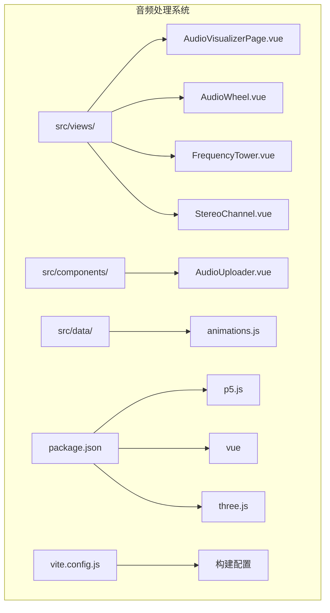
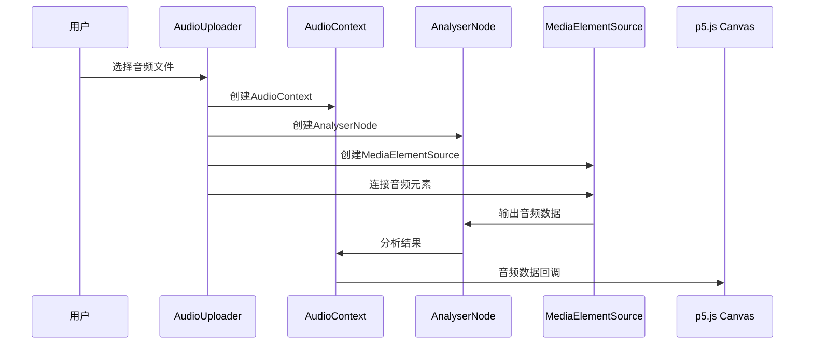
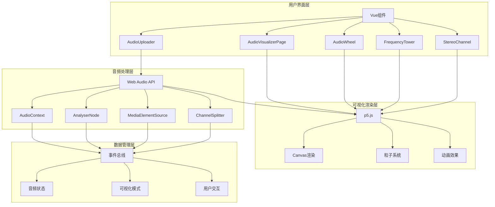
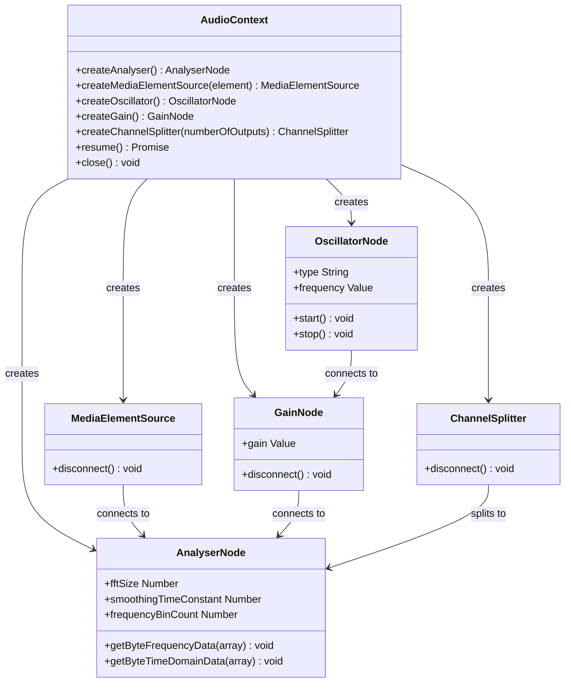
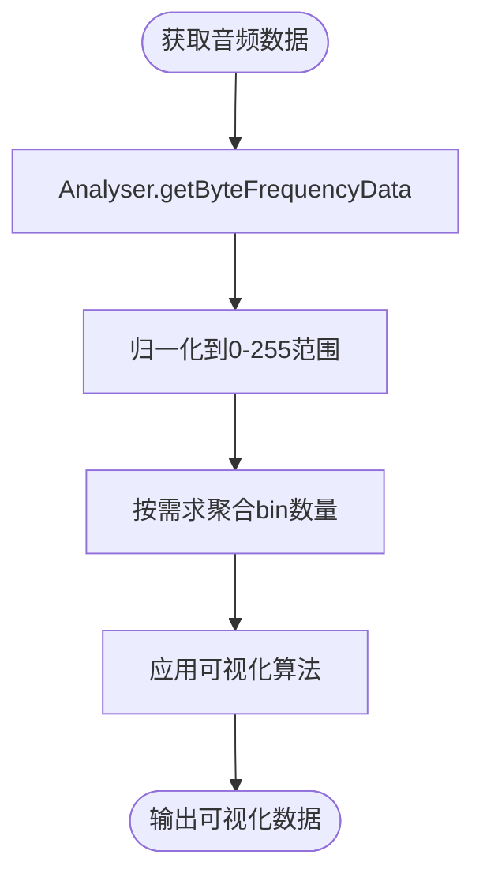
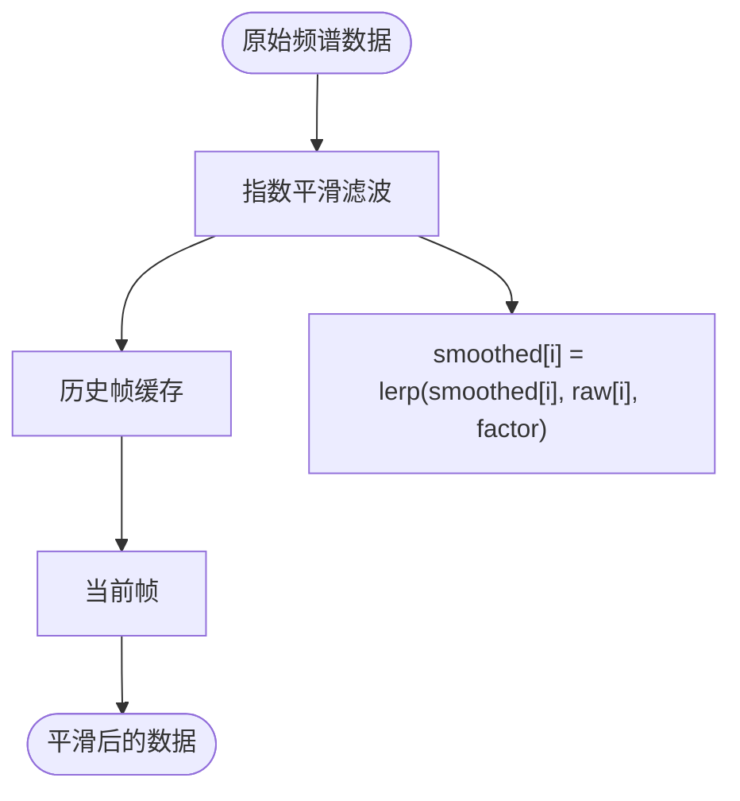
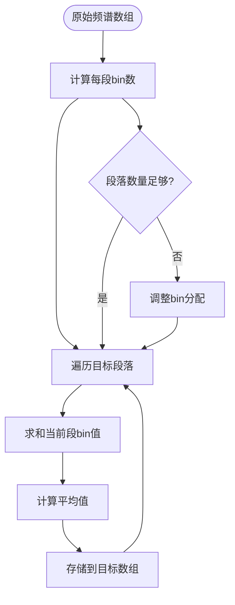
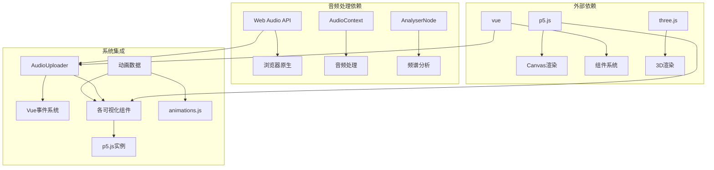

# 音频处理系统

<cite>
**本文档引用的文件**
- [AudioVisualizerPage.vue](file://src/views/AudioVisualizerPage.vue)
- [AudioWheel.vue](file://src/views/AudioWheel.vue)
- [FrequencyTower.vue](file://src/views/FrequencyTower.vue)
- [AudioUploader.vue](file://src/components/AudioUploader.vue)
- [StereoChannel.vue](file://src/views/StereoChannel.vue)
- [package.json](file://package.json)
- [vite.config.js](file://vite.config.js)
- [animations.js](file://src/data/animations.js)
</cite>

## 目录
1. [简介](#简介)
2. [项目结构](#项目结构)
3. [核心组件](#核心组件)
4. [架构概览](#架构概览)
5. [详细组件分析](#详细组件分析)
6. [依赖关系分析](#依赖关系分析)
7. [性能考虑](#性能考虑)
8. [故障排除指南](#故障排除指南)
9. [结论](#结论)

## 简介

动画博客项目的音频处理系统是一个基于Web Audio API构建的实时音频可视化框架。该系统通过Vue 3组件化架构，结合p5.js图形库，实现了多种音频可视化效果，包括波形图、频谱分析、圆形音频轮盘和立体声道分离等。

系统的核心优势在于其模块化设计，每个音频可视化组件都是独立的Vue单文件组件，通过统一的AudioUploader组件管理音频输入和Web Audio API上下文。这种设计使得音频处理逻辑与可视化渲染完全分离，便于维护和扩展。

## 项目结构

音频处理系统主要分布在以下目录结构中：

**图表来源**
- [AudioVisualizerPage.vue:1-346](file://src/views/AudioVisualizerPage.vue#L1-L346)
- [AudioWheel.vue:1-250](file://src/views/AudioWheel.vue#L1-L250)
- [FrequencyTower.vue:1-266](file://src/views/FrequencyTower.vue#L1-L266)
- [AudioUploader.vue:1-514](file://src/components/AudioUploader.vue#L1-L514)

**章节来源**
- [package.json:1-29](file://package.json#L1-L29)
- [vite.config.js:1-32](file://vite.config.js#L1-L32)

## 核心组件

### AudioUploader组件

AudioUploader是整个音频处理系统的核心入口组件，负责管理音频文件上传、Web Audio API上下文初始化和音频节点连接。

**主要功能特性：**
- 文件拖拽上传支持MP3、WAV、OGG、M4A格式
- AudioContext自动兼容处理（标准API与webkit前缀）
- AnalyserNode配置与音频节点链路建立
- 实时播放控制（播放/暂停、进度跳转、音量调节）

**音频节点架构：**

**图表来源**
- [AudioUploader.vue:150-178](file://src/components/AudioUploader.vue#L150-L178)

**章节来源**
- [AudioUploader.vue:135-178](file://src/components/AudioUploader.vue#L135-L178)

### AudioVisualizerPage组件

AudioVisualizerPage实现了完整的虚拟音频生成和多模式可视化功能，是系统中最复杂的音频可视化组件。

**核心特性：**
- 虚拟音频生成（振荡器+谐波合成）
- 五种可视化模式（波形图、频谱柱状图、圆形频谱、波形粒子、彩虹频谱）
- 实时音频分析与数据处理
- 动态粒子系统集成

**虚拟音频生成机制：**
系统使用Web Audio API创建一个Sine波振荡器，并通过数学函数生成复杂的音频信号：
- 基础频率：220Hz + 440Hz × sin(t × 2) + 220Hz × sin(t × 5)
- 谐波混合：基频×0.5 + 倍频×0.2 + 三倍频×0.1 + 半频×0.2

**章节来源**
- [AudioVisualizerPage.vue:68-142](file://src/views/AudioVisualizerPage.vue#L68-L142)

### AudioWheel组件

AudioWheel专注于圆形音频可视化，实现了独特的"音频轮盘"效果。

**技术特点：**
- 多层历史频谱数据追踪（5帧历史）
- 圆形频谱绘制算法
- 鼠标控制的旋转中心偏移
- 中心脉冲效果与拖尾动画

**数据聚合策略：**
将AnalyserNode的原始频谱数据从数千个bin聚合到128个频段，通过求平均值实现平滑处理。

**章节来源**
- [AudioWheel.vue:44-125](file://src/views/AudioWheel.vue#L44-L125)

### FrequencyTower组件

FrequencyTower实现了"频谱塔林"效果，将音频频率转换为城市天际线般的建筑群。

**核心算法：**
- 将2048个频域bin聚合到64个塔楼
- 每个塔楼的高度与对应频率强度成正比
- 色相从左到右从红色渐变到蓝色

**视觉效果：**
- 塔楼主体：HSB色彩模型，明度随高度变化
- 发光效果：顶部光晕和高亮线条
- 连接线：相邻塔楼间的半透明连接

**章节来源**
- [FrequencyTower.vue:42-105](file://src/views/FrequencyTower.vue#L42-L105)

### StereoChannel组件

StereoChannel专门处理立体声分离可视化，展示左右声道的独立音频分析结果。

**声道分离技术：**
- 使用ChannelSplitter将立体声分离为左右声道
- 分别创建左右AnalyserNode进行独立分析
- 中心对称布局，左侧紫色系，右侧青色系

**粒子系统集成：**
高频部分产生粒子效果，粒子具有重力、透明度衰减和随机运动特性。

**章节来源**
- [StereoChannel.vue:65-100](file://src/views/StereoChannel.vue#L65-L100)

## 架构概览

音频处理系统的整体架构采用分层设计，确保了良好的模块化和可维护性：

**图表来源**
- [AudioUploader.vue:95-175](file://src/components/AudioUploader.vue#L95-L175)
- [AudioVisualizerPage.vue:13-288](file://src/views/AudioVisualizerPage.vue#L13-L288)

## 详细组件分析

### Web Audio API架构

系统中的所有音频处理都基于Web Audio API的标准架构：

**图表来源**
- [AudioUploader.vue:150-178](file://src/components/AudioUploader.vue#L150-L178)
- [AudioVisualizerPage.vue:68-89](file://src/views/AudioVisualizerPage.vue#L68-L89)

### 频谱分析算法

系统实现了多种频谱分析算法来处理音频数据：

**1. 基础频谱分析**

**2. 数据平滑处理**

**3. 频率聚合算法**

**图表来源**
- [AudioWheel.vue:71-88](file://src/views/AudioWheel.vue#L71-L88)
- [FrequencyTower.vue:76-90](file://src/views/FrequencyTower.vue#L76-L90)

### 可视化模式实现

#### 波形图模式
波形图直接使用时域数据进行绘制，通过p5.js的beginShape和vertex函数连接数据点形成连续曲线。

#### 频谱柱状图模式
将频域数据映射到矩形柱的高度，使用HSB色彩模型实现从蓝色到红色的渐变效果。

#### 圆形频谱模式
将频谱数据映射到圆形坐标系，每个频段对应一个角度位置的径向条。

#### 波形粒子模式
基于时域数据的振幅阈值检测，当超过设定阈值时生成粒子，粒子具有生命周期和物理属性。

#### 彩虹频谱模式
使用HSB色彩模型，将频段索引映射到色相值，实现完整的彩虹色谱效果。

**章节来源**
- [AudioVisualizerPage.vue:144-251](file://src/views/AudioVisualizerPage.vue#L144-L251)

### 虚拟音频生成机制

AudioVisualizerPage实现了完整的虚拟音频生成系统：

**数学基础：**
- 基础频率调制：f(t) = 220 + 440 × sin(2t) + 220 × sin(5t)
- 谐波合成：混合基频、倍频、三倍频和半频成分
- 动态音量控制：通过GainNode的瞬时值设置实现播放/暂停

**音频缓冲区管理：**
- AnalyserNode的frequencyBinCount决定数据数组大小
- 使用Uint8Array进行高效内存管理
- 实时数据读取避免阻塞主线程

**章节来源**
- [AudioVisualizerPage.vue:126-142](file://src/views/AudioVisualizerPage.vue#L126-L142)

## 依赖关系分析

音频处理系统的依赖关系呈现清晰的层次结构：

**图表来源**
- [package.json:11-22](file://package.json#L11-L22)
- [vite.config.js:17-29](file://vite.config.js#L17-L29)

**章节来源**
- [package.json:1-29](file://package.json#L1-29)
- [vite.config.js:1-32](file://vite.config.js#L1-L32)

## 性能考虑

### 内存管理优化

**1. 数据结构优化**
- 使用Uint8Array替代普通数组，减少内存占用
- 固定长度数组避免频繁的内存分配
- 历史数据缓存采用队列结构，支持固定容量限制

**2. 渲染性能优化**
- p5.js的半透明背景实现拖尾效果，避免全屏重绘
- 粒子系统使用对象池模式，复用已创建的对象
- 频谱数据聚合减少绘制调用次数

**3. 音频处理优化**
- AnalyserNode的fftSize设置平衡精度与性能
- smoothingTimeConstant控制频谱平滑程度
- 虚拟音频生成使用数学函数，避免复杂音频文件I/O

### 浏览器兼容性

**1. Web Audio API兼容性**
- 自动检测AudioContext构造函数
- 提供webkit前缀兼容处理
- 捕获异常确保优雅降级

**2. Canvas渲染兼容性**
- p5.js提供跨浏览器Canvas API封装
- 使用CSS3滤镜实现现代视觉效果
- 响应式设计适配不同屏幕尺寸

**3. 文件上传兼容性**
- HTML5拖拽API与传统文件选择结合
- 多格式音频文件支持
- 对象URL管理避免内存泄漏

## 故障排除指南

### 常见问题诊断

**1. 音频无法播放**
- 检查AudioContext状态是否为"suspended"
- 确认用户手势触发AudioContext.resume()
- 验证音频文件格式支持情况

**2. 可视化无响应**
- 确认AnalyserNode正确连接到音频源
- 检查frequencyBinCount与数据数组长度匹配
- 验证p5.js实例正确初始化

**3. 性能问题**
- 监控帧率和内存使用情况
- 检查是否有过多粒子同时存在
- 优化频谱数据聚合策略

### 调试工具使用

**1. Web Audio Inspector**
- 使用Chrome DevTools的Audio标签页
- 监控音频节点连接状态
- 分析音频数据流

**2. 性能分析**
- 使用Performance面板监控渲染性能
- 检查JavaScript执行时间
- 分析内存泄漏情况

**3. 控制台日志**
- 在AudioUploader中添加错误处理日志
- 监控事件触发顺序
- 跟踪组件生命周期

**章节来源**
- [AudioUploader.vue:175-178](file://src/components/AudioUploader.vue#L175-L178)
- [AudioVisualizerPage.vue:290-297](file://src/views/AudioVisualizerPage.vue#L290-L297)

## 结论

动画博客项目的音频处理系统展现了现代Web音频技术的强大能力。通过精心设计的架构，系统成功地将复杂的音频分析、实时可视化和高性能渲染有机结合。

**系统优势：**
- 模块化设计便于维护和扩展
- 多种可视化模式满足不同需求
- 虚拟音频生成提供完整演示体验
- 跨浏览器兼容性确保广泛适用性

**技术特色：**
- 基于Web Audio API的纯前端音频处理
- p5.js实现的高质量图形渲染
- Vue 3组件化架构的最佳实践
- 实时性能优化和内存管理

该系统为Web音频可视化提供了优秀的参考实现，展示了如何在浏览器环境中构建专业级的音频处理应用。