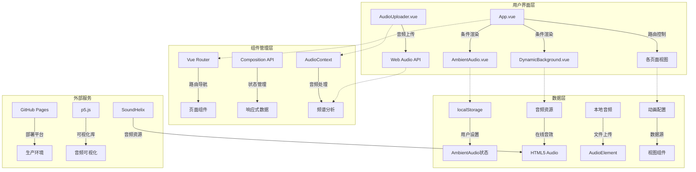
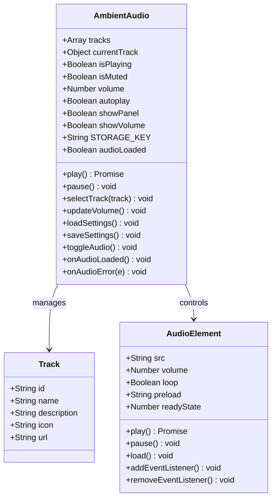
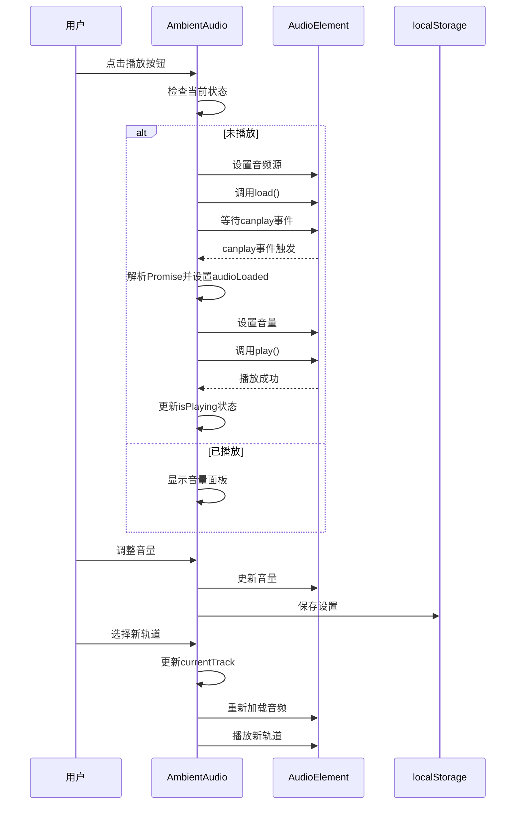
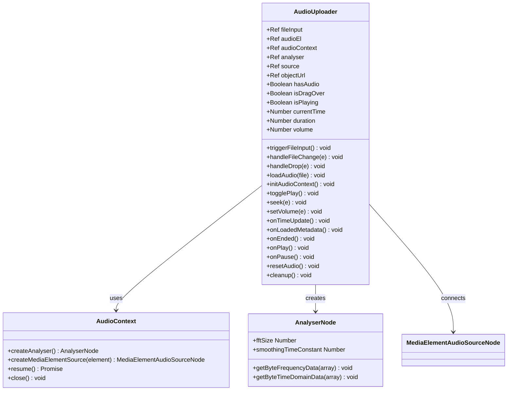
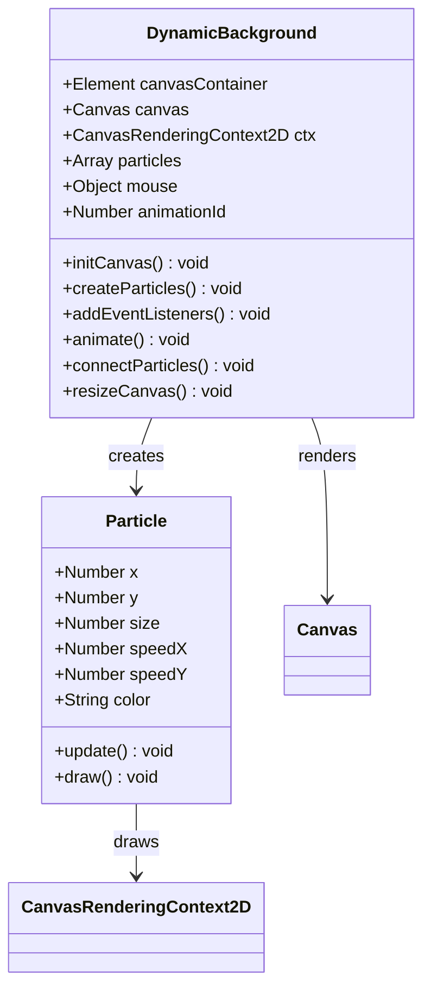
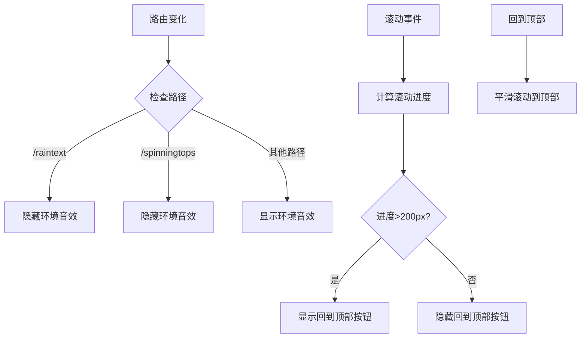

# 环境音频系统

<cite>
**本文档引用的文件**
- [AmbientAudio.vue](file://src/components/AmbientAudio.vue)
- [App.vue](file://src/App.vue)
- [DynamicBackground.vue](file://src/components/DynamicBackground.vue)
- [AudioUploader.vue](file://src/components/AudioUploader.vue)
- [AudioVisualizerPage.vue](file://src/views/AudioVisualizerPage.vue)
- [AudioWheel.vue](file://src/views/AudioWheel.vue)
- [StereoChannel.vue](file://src/views/StereoChannel.vue)
- [main.js](file://src/main.js)
- [index.js](file://src/router/index.js)
- [package.json](file://package.json)
- [vite.config.js](file://vite.config.js)
- [README.md](file://README.md)
- [Home.vue](file://src/views/Home.vue)
- [About.vue](file://src/views/About.vue)
- [JourneysPage.vue](file://src/views/JourneysPage.vue)
- [animations.js](file://src/data/animations.js)
- [journeys.js](file://src/data/journeys.js)
- [index.html](file://index.html)
</cite>

## 更新摘要
**变更内容**
- 更新了音频加载机制的详细分析，包括canplay事件优化和5秒超时机制
- 新增了错误处理增强和用户友好提示的相关内容
- 移除了CDN托管p5.sound库依赖的说明
- 更新了音频系统架构图以反映最新的优化

## 目录
1. [简介](#简介)
2. [项目结构](#项目结构)
3. [核心组件](#核心组件)
4. [架构概览](#架构概览)
5. [详细组件分析](#详细组件分析)
6. [依赖关系分析](#依赖关系分析)
7. [性能考虑](#性能考虑)
8. [故障排除指南](#故障排除指南)
9. [结论](#结论)

## 简介

环境音频系统是一个基于Vue 3 + Vite构建的现代前端项目，专注于提供沉浸式的音频体验。该项目不仅包含丰富的可视化动画效果，还集成了一个功能完整的环境音效控制系统，为用户提供可定制的背景音乐体验。

该项目采用响应式设计理念，支持多种设备访问，并通过模块化的组件架构实现了高度的可维护性和扩展性。系统的核心特色包括：

- **沉浸式环境音效**：提供多种自然和抽象的背景音乐选择
- **智能音量控制**：支持渐变音量调节和静音功能
- **个性化设置**：通过localStorage保存用户偏好设置
- **流畅的用户体验**：优化的动画效果和交互设计
- **响应式布局**：适配各种屏幕尺寸和设备类型
- **优化的音频加载机制**：使用HTML5 Audio API的canplay事件，5秒超时机制，增强的错误处理

## 项目结构

该项目采用标准的Vue 3单页应用架构，具有清晰的文件组织结构：

```mermaid
graph TB
subgraph "项目根目录"
A[public/] -- 静态资源
B[src/] -- 源代码
C[index.html] -- 应用入口
D[vite.config.js] -- 构建配置
E[package.json] -- 依赖管理
end
subgraph "src/ 源代码目录"
F[components/] -- Vue组件
G[views/] -- 页面视图
H[data/] -- 数据配置
I[router/] -- 路由配置
J[App.vue] -- 根组件
K[main.js] -- 应用入口
end
subgraph "components/ 组件目录"
L[AmbientAudio.vue] -- 环境音效控制
M[DynamicBackground.vue] -- 动态背景
N[AudioUploader.vue] -- 音频上传
O[JourneyPlayer.vue] -- 旅程播放器
end
subgraph "views/ 视图目录"
P[Home.vue] -- 首页
Q[About.vue] -- 关于页面
R[JourneysPage.vue] -- 旅程页面
S[各动画页面] -- 30+个动画页面
T[AudioVisualizerPage.vue] -- 音频可视化
U[AudioWheel.vue] -- 音频轮盘
V[StereoChannel.vue] -- 立体声通道
end
subgraph "data/ 数据目录"
W[animations.js] -- 动画配置
X[journeys.js] -- 旅程配置
end
```

**图表来源**
- [main.js:1-12](file://src/main.js#L1-L12)
- [App.vue:1-353](file://src/App.vue#L1-L353)
- [index.js:1-210](file://src/router/index.js#L1-L210)

**章节来源**
- [README.md:69-86](file://README.md#L69-L86)
- [package.json:1-30](file://package.json#L1-L30)

## 核心组件

### 环境音效控制器 (AmbientAudio)

环境音效控制器是整个系统的核心组件，提供了完整的音频播放、控制和管理功能。该组件采用Vue 3 Composition API实现，具有以下关键特性：

- **多轨道支持**：内置5种不同类型的环境音效
- **智能状态管理**：自动处理播放、暂停、静音等状态
- **持久化存储**：使用localStorage保存用户偏好设置
- **响应式界面**：提供直观的音量控制和轨道选择界面
- **优化的音频加载**：使用HTML5 Audio API的canplay事件，5秒超时机制，增强的错误处理

### 动态背景系统 (DynamicBackground)

动态背景系统为应用提供了流畅的视觉体验，通过Canvas API实现粒子动画效果：

- **粒子物理模拟**：基于Canvas的粒子系统，支持边界检测和鼠标交互
- **实时连接效果**：粒子间的动态连接线，营造空间感
- **自适应布局**：根据容器大小动态调整粒子密度和画布尺寸

### 音频上传器 (AudioUploader)

音频上传器组件提供了本地音频文件的上传和播放功能，集成了Web Audio API：

- **本地音频处理**：支持MP3、WAV、OGG、M4A等多种音频格式
- **Web Audio API集成**：提供频谱分析和音频可视化能力
- **实时播放控制**：支持播放/暂停、进度跳转、音量调节
- **资源管理**：自动清理音频上下文和事件监听器

### 应用主组件 (App)

应用主组件负责协调各个子组件的渲染和交互，实现了全局的状态管理和布局控制：

- **条件渲染**：根据路由状态决定组件的显示和隐藏
- **全局样式**：统一的应用主题和样式管理
- **用户交互**：回到顶部按钮和导航控制

**章节来源**
- [AmbientAudio.vue:85-283](file://src/components/AmbientAudio.vue#L85-L283)
- [DynamicBackground.vue:5-173](file://src/components/DynamicBackground.vue#L5-L173)
- [AudioUploader.vue:92-298](file://src/components/AudioUploader.vue#L92-L298)
- [App.vue:73-133](file://src/App.vue#L73-L133)

## 架构概览

系统采用模块化的架构设计，各个组件之间通过Vue的组件通信机制进行协作：



**图表来源**
- [App.vue:3-36](file://src/App.vue#L3-L36)
- [AmbientAudio.vue:85-125](file://src/components/AmbientAudio.vue#L85-L125)
- [DynamicBackground.vue:58-78](file://src/components/DynamicBackground.vue#L58-L78)
- [AudioUploader.vue:150-178](file://src/components/AudioUploader.vue#L150-L178)

系统的核心交互流程遵循Vue的单向数据流原则，确保了数据的一致性和可预测性。

## 详细组件分析

### 环境音效控制器组件分析

#### 组件架构设计



**图表来源**
- [AmbientAudio.vue:85-125](file://src/components/AmbientAudio.vue#L85-L125)
- [AmbientAudio.vue:129-138](file://src/components/AmbientAudio.vue#L129-L138)

#### 优化的音频加载流程



**图表来源**
- [AmbientAudio.vue:198-256](file://src/components/AmbientAudio.vue#L198-L256)
- [AmbientAudio.vue:280-287](file://src/components/AmbientAudio.vue#L280-L287)

#### 音效轨道配置

系统内置了5种精心挑选的环境音效轨道：

| 轨道ID | 名称 | 描述 | 图标 | 音频URL |
|--------|------|------|------|---------|
| ambient-nature | 自然之声 | 轻柔的鸟鸣与风声 | 🌿 | SoundHelix Song-1 |
| ambient-space | 宇宙回响 | 深邃的空灵音景 | 🌌 | SoundHelix Song-2 |
| ambient-rain | 雨声白噪音 | 舒缓的雨天氛围 | 🌧️ | SoundHelix Song-3 |
| ambient-meditation | 冥想音乐 | 平静的冥想背景音 | 🧘 | SoundHelix Song-4 |
| ambient-piano | 轻音乐 | 优美的钢琴旋律 | 🎹 | SoundHelix Song-8 |

每个轨道都经过精心选择，确保在不同场景下都能提供最佳的用户体验。

**章节来源**
- [AmbientAudio.vue:88-125](file://src/components/AmbientAudio.vue#L88-L125)
- [AmbientAudio.vue:156-182](file://src/components/AmbientAudio.vue#L156-L182)

### 音频上传器组件分析

#### Web Audio API架构



**图表来源**
- [AudioUploader.vue:92-178](file://src/components/AudioUploader.vue#L92-L178)
- [AudioUploader.vue:135-148](file://src/components/AudioUploader.vue#L135-L148)

#### 音频处理流程

音频上传器组件实现了完整的音频处理管道：

1. **文件上传**：支持拖拽和点击选择音频文件
2. **对象URL创建**：使用URL.createObjectURL()创建临时音频URL
3. **AudioContext初始化**：创建Web Audio API上下文
4. **频谱分析器创建**：配置AnalyserNode进行频谱分析
5. **音频源连接**：将AudioElement连接到AnalyserNode
6. **实时可视化**：通过emit事件向父组件传递音频数据

#### 资源管理策略

- **自动清理**：组件卸载时自动清理AudioContext和事件监听器
- **内存管理**：及时释放对象URL和音频资源
- **异常处理**：捕获并处理AudioContext初始化失败的情况

**章节来源**
- [AudioUploader.vue:150-178](file://src/components/AudioUploader.vue#L150-L178)
- [AudioUploader.vue:252-297](file://src/components/AudioUploader.vue#L252-L297)

### 动态背景系统分析

#### 粒子系统架构



**图表来源**
- [DynamicBackground.vue:14-56](file://src/components/DynamicBackground.vue#L14-L56)
- [DynamicBackground.vue:58-78](file://src/components/DynamicBackground.vue#L58-L78)

#### 物理模拟算法

动态背景系统实现了复杂的物理模拟算法：

1. **粒子生成**：根据画布面积动态计算粒子数量，确保在不同分辨率下的性能平衡
2. **边界检测**：粒子遇到画布边缘时进行反弹，模拟无限空间的效果
3. **鼠标交互**：粒子受到鼠标位置的影响，产生自然的跟随效果
4. **连接算法**：距离相近的粒子之间建立连接线，营造三维空间感

#### 性能优化策略

- **请求动画帧**：使用`requestAnimationFrame`确保60fps的流畅动画
- **事件委托**：在window对象上监听全局事件，避免重复绑定
- **内存管理**：组件卸载时清理所有事件监听器和动画帧
- **自适应密度**：根据画布尺寸动态调整粒子密度，平衡视觉效果和性能

**章节来源**
- [DynamicBackground.vue:88-96](file://src/components/DynamicBackground.vue#L88-L96)
- [DynamicBackground.vue:117-154](file://src/components/DynamicBackground.vue#L117-L154)

### 应用主组件分析

#### 路由集成机制

App.vue作为应用的根组件，实现了与Vue Router的深度集成：



**图表来源**
- [App.vue:91-132](file://src/App.vue#L91-L132)

#### 全局状态管理

应用主组件负责管理全局状态和用户交互：

- **滚动进度跟踪**：实时计算页面滚动进度并更新进度环
- **条件渲染控制**：根据路由状态智能显示或隐藏组件
- **用户交互反馈**：提供平滑的回到顶部交互体验

**章节来源**
- [App.vue:15-36](file://src/App.vue#L15-L36)
- [App.vue:115-132](file://src/App.vue#L115-L132)

## 依赖关系分析

### 技术栈依赖

项目采用了现代化的前端技术栈，具有清晰的依赖层次：

```mermaid
graph TB
subgraph "运行时依赖"
A[Vue 3.4.0] -- 前端框架
B[Vue Router 4.2.0] -- 路由管理
C[Three.js 0.182.0] -- 3D图形
D[p5.js 2.2.3] -- 多媒体
E[highlight.js 11.11.1] -- 代码高亮
F[echarts 6.0.0] -- 数据可视化
end
subgraph "开发依赖"
G[@vitejs/plugin-vue] -- Vue插件
H[Vite 5.0.0] -- 构建工具
I[less 4.5.1] -- CSS预处理器
end
subgraph "工具库"
J[animate.css 4.1.1] -- 动画库
K[dompurify 3.3.1] -- HTML净化
L[gif.js.optimized 1.0.1] -- GIF处理
M[marked 17.0.1] -- Markdown解析
end
```

**图表来源**
- [package.json:11-28](file://package.json#L11-L28)

### 构建优化策略

Vite配置实现了多项性能优化：

- **代码分割**：将大型依赖库拆分为独立的chunk
- **懒加载**：路由级别的代码分割，提升首屏加载速度
- **预构建**：对依赖进行预构建，减少开发服务器启动时间
- **缓存策略**：利用浏览器缓存机制提升二次加载速度

### 移除CDN依赖

**更新** 项目已移除CDN托管的p5.sound库依赖，改为通过npm导入

项目配置中明确注释说明不再使用CDN方式引入p5.sound：

```javascript
<!-- p5.sound 将通过 npm 导入，不再使用 CDN -->
```

这带来了以下优势：
- **更好的版本控制**：通过package.json精确控制p5.js版本
- **离线可用性**：无需网络即可加载音频可视化功能
- **构建优化**：可以与其他依赖一起进行代码分割和优化
- **安全性**：避免CDN可能的安全风险

**章节来源**
- [package.json:11-23](file://package.json#L11-L23)
- [vite.config.js:13-31](file://vite.config.js#L13-L31)
- [index.html:9](file://index.html#L9)

## 性能考虑

### 加载性能优化

系统在多个层面实现了性能优化：

1. **优化的音频加载机制**：使用HTML5 Audio API的`canplay`事件替代`canplaythrough`事件，显著减少音频准备时间
2. **5秒超时机制**：将音频加载超时时间从默认值缩短到5秒，提升用户体验
3. **资源懒加载**：非关键资源采用懒加载策略
4. **图片优化**：使用WebP格式和适当的压缩比
5. **CSS优化**：采用scoped样式和CSS变量减少样式计算
6. **JavaScript优化**：模块化打包和Tree Shaking

### 运行时性能优化

- **动画性能**：使用transform和opacity属性避免重排
- **事件处理**：使用节流和防抖优化高频事件
- **内存管理**：及时清理事件监听器和定时器
- **渲染优化**：合理使用虚拟DOM和组件缓存
- **音频资源管理**：AudioUploader组件自动清理音频上下文

### 移动端适配

系统针对移动端进行了专门优化：

- **触摸友好的交互**：按钮大小和间距符合移动端操作习惯
- **响应式布局**：使用flexbox和grid实现自适应布局
- **性能监控**：在低端设备上自动降低动画复杂度
- **音频优化**：移动端使用更短的音频缓冲区

## 故障排除指南

### 常见问题及解决方案

#### 音频无法播放

**问题描述**：用户点击播放按钮但音频没有响应

**可能原因**：
1. 浏览器阻止自动播放
2. 音频资源加载失败
3. 浏览器兼容性问题
4. 网络连接不稳定

**解决方案**：
1. 确保用户有明确的交互动作后再播放音频
2. 检查网络连接和音频URL的有效性
3. 提供备用音频源或错误提示
4. 实现5秒超时机制，避免长时间等待

#### 音效设置丢失

**问题描述**：刷新页面后音效设置恢复默认值

**可能原因**：
1. localStorage访问权限受限
2. 浏览器隐私模式
3. 存储空间不足

**解决方案**：
1. 检查浏览器的localStorage支持情况
2. 提供设置同步机制
3. 实现降级方案

#### 动画性能问题

**问题描述**：页面动画卡顿或掉帧

**可能原因**：
1. 粒子数量过多
2. 设备性能不足
3. 事件监听器过多

**解决方案**：
1. 动态调整粒子密度
2. 实现性能自适应机制
3. 优化事件处理逻辑

#### 音频上传失败

**问题描述**：本地音频文件无法上传或播放

**可能原因**：
1. 文件格式不支持
2. AudioContext初始化失败
3. 浏览器兼容性问题

**解决方案**：
1. 检查文件格式是否在支持列表中（MP3, WAV, OGG, M4A）
2. 确认浏览器支持Web Audio API
3. 提供错误提示和降级方案

**章节来源**
- [AmbientAudio.vue:242-255](file://src/components/AmbientAudio.vue#L242-L255)
- [DynamicBackground.vue:162-172](file://src/components/DynamicBackground.vue#L162-L172)
- [AudioUploader.vue:175-178](file://src/components/AudioUploader.vue#L175-L178)

## 结论

环境音频系统展现了现代前端开发的最佳实践，通过精心设计的架构和优化的实现，为用户提供了优质的音频体验。系统的主要优势包括：

1. **模块化设计**：清晰的组件分离和职责划分
2. **性能优化**：多层面的性能考虑和优化策略，包括优化的音频加载机制
3. **用户体验**：注重细节的交互设计和反馈机制
4. **可扩展性**：灵活的架构支持未来功能扩展
5. **技术先进性**：采用最新的Web Audio API和HTML5 Audio技术

该系统不仅是一个功能完整的音频播放器，更是现代前端技术应用的典范，为类似项目的开发提供了宝贵的参考经验。特别是其优化的音频加载机制和增强的错误处理，为用户提供了更加稳定和流畅的音频体验。

**更新** 系统现已移除CDN托管的p5.sound库依赖，采用npm导入方式，提升了版本控制、离线可用性和安全性。同时通过HTML5 Audio API的优化使用和5秒超时机制，显著改善了音频加载性能和用户体验。