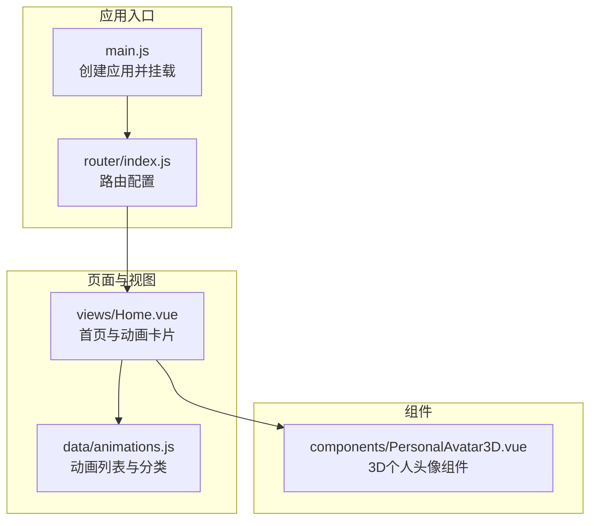
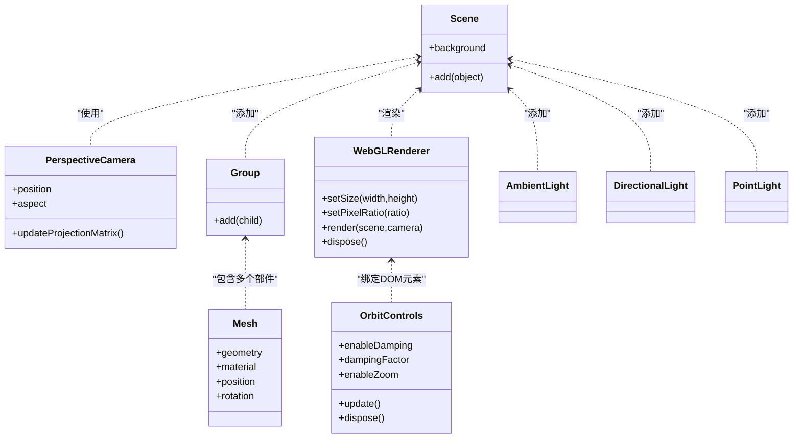
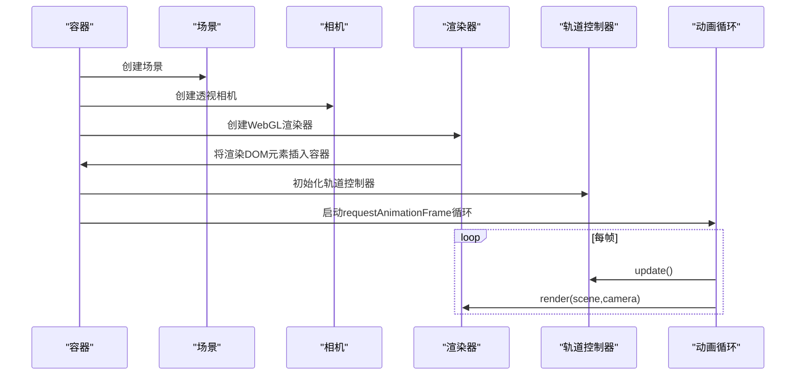
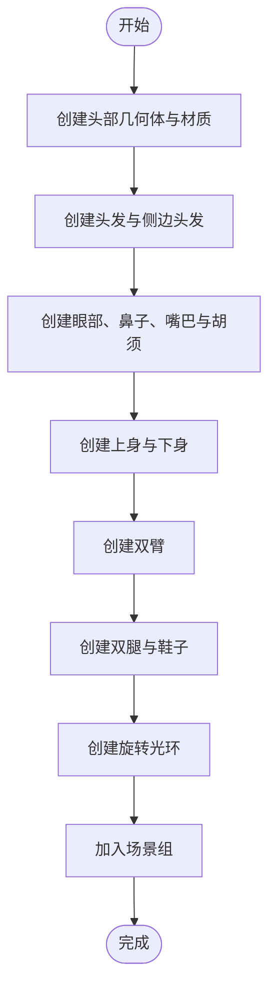
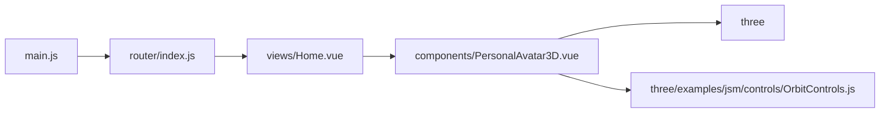

# 3D个人头像

<cite>
**本文引用的文件**
- [PersonalAvatar3D.vue](file://src/components/PersonalAvatar3D.vue)
- [package.json](file://package.json)
- [README.md](file://README.md)
- [main.js](file://src/main.js)
- [router/index.js](file://src/router/index.js)
- [Home.vue](file://src/views/Home.vue)
- [animations.js](file://src/data/animations.js)
</cite>

## 目录
1. [简介](#简介)
2. [项目结构](#项目结构)
3. [核心组件](#核心组件)
4. [架构总览](#架构总览)
5. [详细组件分析](#详细组件分析)
6. [依赖关系分析](#依赖关系分析)
7. [性能考虑](#性能考虑)
8. [故障排查指南](#故障排查指南)
9. [结论](#结论)
10. [附录](#附录)

## 简介
本文件为“3D个人头像”组件的技术文档，围绕基于 Three.js 的史蒂夫风格角色模型进行系统化说明。内容涵盖：
- Three.js 场景构建流程（场景初始化、相机设置、渲染器配置、光源系统）
- 史蒂夫风格角色模型的几何体生成、材质应用与纹理贴图策略
- 轨道控制器的实现原理（视角控制、缩放限制、交互响应）
- 光照系统配置（环境光、方向光、点光源与材质属性）
- 组件 API 接口、使用示例与自定义配置选项
- 性能优化建议与浏览器兼容性说明

该组件采用 Vue 3 Composition API 编写，通过 WebGL 渲染器在容器内展示 3D 场景，并提供平滑的鼠标交互与自动旋转光环效果。

## 项目结构
该项目采用 Vue 3 + Vite 构建，3D 个人头像组件位于组件目录中，作为独立可复用模块使用。路由系统支持多页面导航，首页用于展示各类动画卡片，3D 个人头像可作为页面或组件嵌入。

图表来源
- [main.js:1-12](file://src/main.js#L1-L12)
- [router/index.js:1-205](file://src/router/index.js#L1-L205)
- [Home.vue:1-200](file://src/views/Home.vue#L1-L200)
- [animations.js:1-400](file://src/data/animations.js#L1-L400)
- [PersonalAvatar3D.vue:1-344](file://src/components/PersonalAvatar3D.vue#L1-L344)

章节来源
- [README.md:1-115](file://README.md#L1-L115)
- [package.json:1-29](file://package.json#L1-L29)

## 核心组件
3D 个人头像组件通过 Composition API 实现，包含以下关键职责：
- 场景初始化：创建场景、相机、渲染器与轨道控制器
- 角色模型构建：使用 BoxGeometry 组合史蒂夫风格角色
- 光源系统：环境光、方向光与点光源
- 交互逻辑：鼠标移动驱动角色旋转，控制器处理视角与缩放
- 动画循环：requestAnimationFrame 驱动渲染与控制器更新
- 生命周期清理：组件卸载时释放资源

章节来源
- [PersonalAvatar3D.vue:5-344](file://src/components/PersonalAvatar3D.vue#L5-L344)

## 架构总览
下图展示了组件内部的类与对象关系，以及与 Three.js 的交互方式。

图表来源
- [PersonalAvatar3D.vue:18-61](file://src/components/PersonalAvatar3D.vue#L18-L61)
- [PersonalAvatar3D.vue:64-237](file://src/components/PersonalAvatar3D.vue#L64-L237)
- [PersonalAvatar3D.vue:240-254](file://src/components/PersonalAvatar3D.vue#L240-L254)
- [PersonalAvatar3D.vue:276-293](file://src/components/PersonalAvatar3D.vue#L276-L293)

## 详细组件分析

### 场景初始化与渲染管线
- 场景创建：新建场景并设置背景为透明
- 相机设置：透视相机，初始位置位于(0, 2, 8)，根据容器尺寸计算宽高比
- 渲染器配置：启用抗锯齿与透明背景；像素比限制在设备像素比与2之间
- 控制器初始化：启用阻尼与阻尼系数，禁用缩放，绑定渲染器 DOM 元素
- 启动动画循环与窗口尺寸监听

图表来源
- [PersonalAvatar3D.vue:18-61](file://src/components/PersonalAvatar3D.vue#L18-L61)
- [PersonalAvatar3D.vue:276-293](file://src/components/PersonalAvatar3D.vue#L276-L293)

章节来源
- [PersonalAvatar3D.vue:18-61](file://src/components/PersonalAvatar3D.vue#L18-L61)

### 史蒂夫风格角色模型
角色由多个立方体几何体组成，使用标准材质统一光照响应。关键步骤：
- 头部与头发：使用 BoxGeometry 与 MeshStandardMaterial
- 面部特征：眼睛（白眼球与瞳孔）、鼻子、嘴巴、胡须
- 身体结构：上身（衬衫）、下身（裤子）、四肢与鞋子
- 旋转光环：使用环面几何体，双面材质，透明度与旋转动画

图表来源
- [PersonalAvatar3D.vue:64-237](file://src/components/PersonalAvatar3D.vue#L64-L237)

章节来源
- [PersonalAvatar3D.vue:64-237](file://src/components/PersonalAvatar3D.vue#L64-L237)

### 轨道控制器实现原理
- 阻尼开启与系数：提供顺滑的视角过渡
- 缩放限制：禁用缩放，避免破坏人物比例
- 交互响应：鼠标拖拽改变视角，键盘与滚轮默认行为由控制器接管
- 更新时机：每帧调用控制器更新，确保阻尼与输入同步

章节来源
- [PersonalAvatar3D.vue:42-46](file://src/components/PersonalAvatar3D.vue#L42-L46)
- [PersonalAvatar3D.vue:287-289](file://src/components/PersonalAvatar3D.vue#L287-L289)

### 光照系统配置
- 环境光：提供基础漫反射，强度适中
- 方向光：模拟太阳光，投射方向与强度
- 点光源：强调特定区域，提升立体感
- 材质属性：使用标准材质以获得真实光照响应

章节来源
- [PersonalAvatar3D.vue:240-254](file://src/components/PersonalAvatar3D.vue#L240-L254)

### 鼠标交互与自动旋转
- 鼠标移动：计算归一化坐标，映射到目标旋转角度
- 自动旋转：平滑插值到目标角度，实现自然过渡
- 离开容器：恢复初始旋转状态
- 环旋转动：对最后一个子对象执行绕 Z 轴旋转

章节来源
- [PersonalAvatar3D.vue:257-273](file://src/components/PersonalAvatar3D.vue#L257-L273)
- [PersonalAvatar3D.vue:276-293](file://src/components/PersonalAvatar3D.vue#L276-L293)

### 组件生命周期与资源清理
- 挂载：初始化场景、模型、光源与交互
- 卸载：取消动画帧、释放控制器、销毁渲染器、移除事件监听

章节来源
- [PersonalAvatar3D.vue:308-331](file://src/components/PersonalAvatar3D.vue#L308-L331)

## 依赖关系分析
- 运行时依赖：Vue 3、Three.js、OrbitControls 示例模块
- 构建工具：Vite
- 应用入口：main.js 注册路由并挂载应用
- 路由系统：router/index.js 提供页面导航
- 页面集成：Home.vue 展示动画卡片，可嵌入 3D 个人头像组件

图表来源
- [main.js:1-12](file://src/main.js#L1-L12)
- [router/index.js:1-205](file://src/router/index.js#L1-L205)
- [PersonalAvatar3D.vue:7-8](file://src/components/PersonalAvatar3D.vue#L7-L8)

章节来源
- [package.json:11-21](file://package.json#L11-L21)
- [PersonalAvatar3D.vue:7-8](file://src/components/PersonalAvatar3D.vue#L7-L8)

## 性能考虑
- 像素比限制：渲染器像素比限制在设备像素比与2之间，平衡清晰度与性能
- 几何体简化：使用 BoxGeometry 构建角色，减少顶点与面数
- 材质选择：MeshStandardMaterial 支持物理光照，但需注意光源数量与复杂度
- 动画帧率：使用 requestAnimationFrame，避免固定时间步长导致卡顿
- 资源释放：组件卸载时释放控制器与渲染器，防止内存泄漏
- 交互优化：阻尼系数与平滑插值降低抖动，提升用户体验

章节来源
- [PersonalAvatar3D.vue:36-39](file://src/components/PersonalAvatar3D.vue#L36-L39)
- [PersonalAvatar3D.vue:43-44](file://src/components/PersonalAvatar3D.vue#L43-L44)
- [PersonalAvatar3D.vue:276-293](file://src/components/PersonalAvatar3D.vue#L276-L293)
- [PersonalAvatar3D.vue:314-331](file://src/components/PersonalAvatar3D.vue#L314-L331)

## 故障排查指南
- 场景未显示
  - 检查容器尺寸是否为 0，确保初始化在容器可用后执行
  - 确认渲染器已插入容器 DOM
- 视角异常或无法旋转
  - 确认轨道控制器已正确绑定渲染器 DOM 元素
  - 检查阻尼与更新调用是否在动画循环中
- 光影效果不明显
  - 调整环境光与方向光强度
  - 确保材质为标准材质并接收光源
- 内存泄漏
  - 卸载时调用控制器与渲染器的释放方法
  - 移除窗口 resize 事件监听

章节来源
- [PersonalAvatar3D.vue:18-61](file://src/components/PersonalAvatar3D.vue#L18-L61)
- [PersonalAvatar3D.vue:240-254](file://src/components/PersonalAvatar3D.vue#L240-L254)
- [PersonalAvatar3D.vue:314-331](file://src/components/PersonalAvatar3D.vue#L314-L331)

## 结论
3D 个人头像组件通过简洁的几何体组合与标准材质，实现了可交互的史蒂夫风格角色模型。轨道控制器提供了顺滑的视角控制，配合环境光、方向光与点光源营造出良好的视觉效果。组件具备完善的生命周期管理与性能优化策略，适合在现代浏览器中稳定运行。未来可在材质贴图、阴影与后处理等方面进一步增强表现力。

## 附录

### 组件 API 与使用示例
- 组件名称：PersonalAvatar3D
- 使用方式：直接在页面中引入组件并提供容器占位
- 自定义配置项（可通过扩展添加）：
  - 相机参数：视野、近远裁剪面
  - 控制器参数：阻尼系数、缩放范围
  - 光源参数：环境光强度、方向光方向与强度、点光源位置与范围
  - 角色颜色与尺寸：通过材质与几何体参数调整
- 事件与交互：
  - 鼠标移动：驱动角色旋转
  - 窗口大小变化：自动更新相机与渲染器尺寸

章节来源
- [PersonalAvatar3D.vue:18-61](file://src/components/PersonalAvatar3D.vue#L18-L61)
- [PersonalAvatar3D.vue:257-273](file://src/components/PersonalAvatar3D.vue#L257-L273)
- [PersonalAvatar3D.vue:295-306](file://src/components/PersonalAvatar3D.vue#L295-L306)

### 浏览器兼容性
- Three.js 与 OrbitControls 基于现代 Web API，建议在主流桌面浏览器中使用
- 如需支持旧版浏览器，需引入相应 polyfill 与降级方案
- 移动端触摸支持可通过控制器扩展实现，当前实现聚焦于桌面交互

章节来源
- [package.json:19](file://package.json#L19)
- [PersonalAvatar3D.vue:42-46](file://src/components/PersonalAvatar3D.vue#L42-L46)