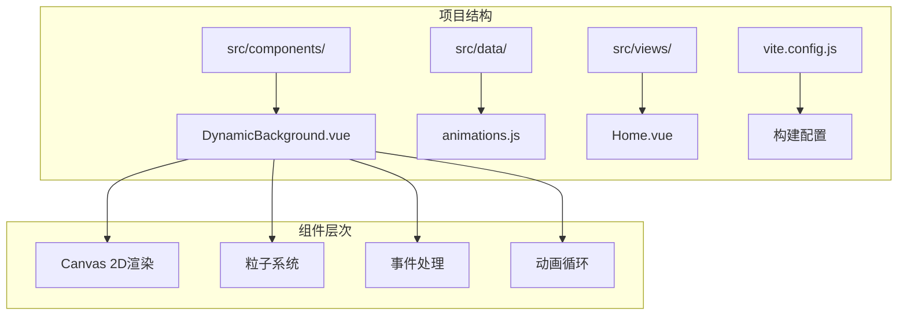
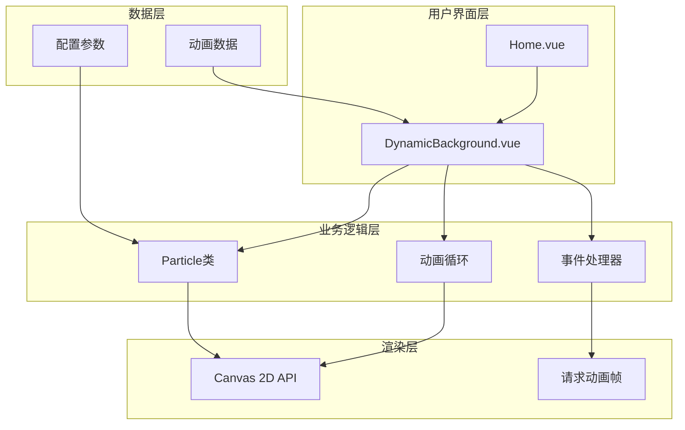
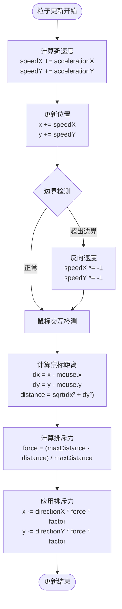
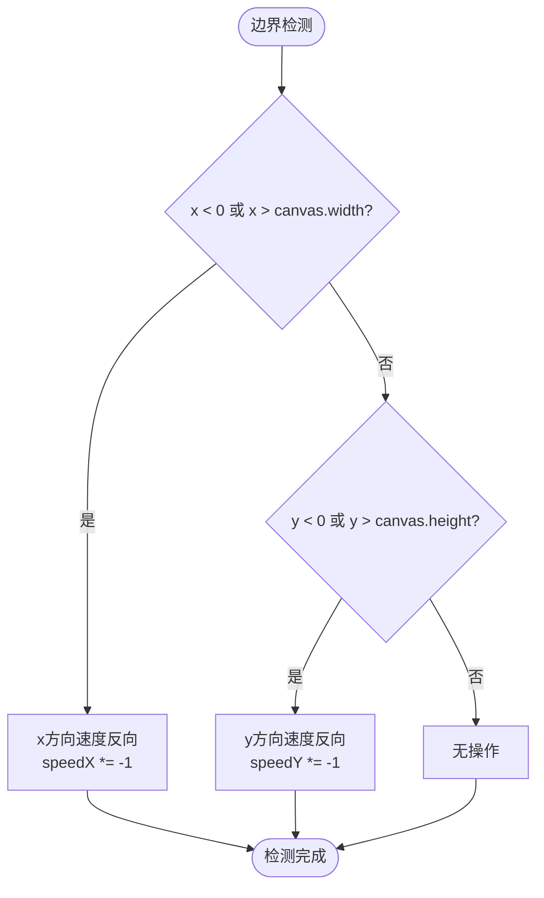
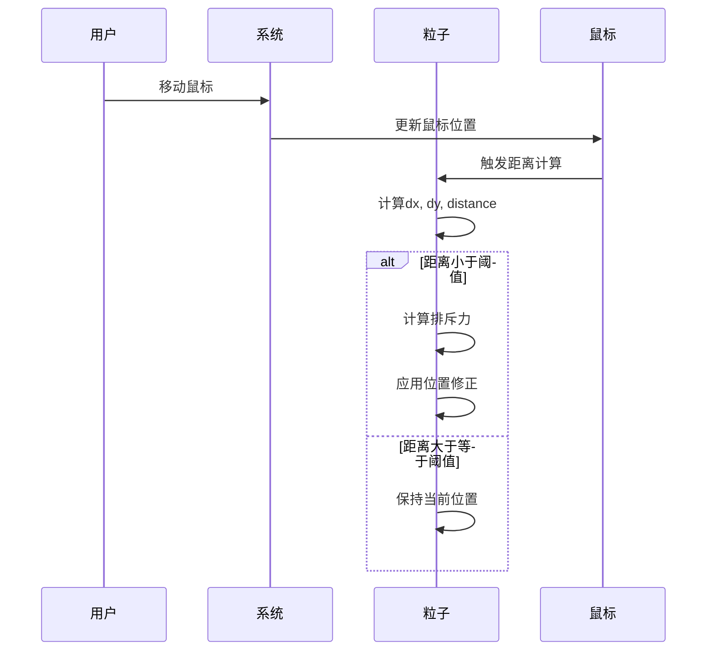
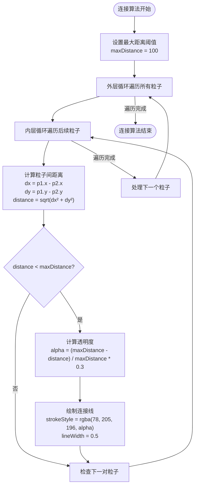
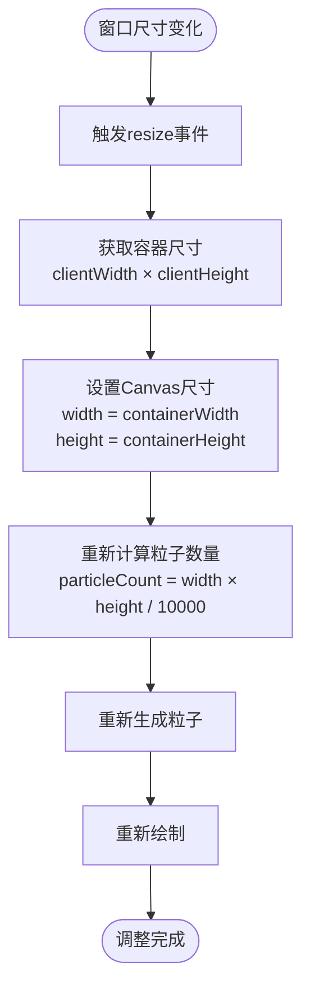
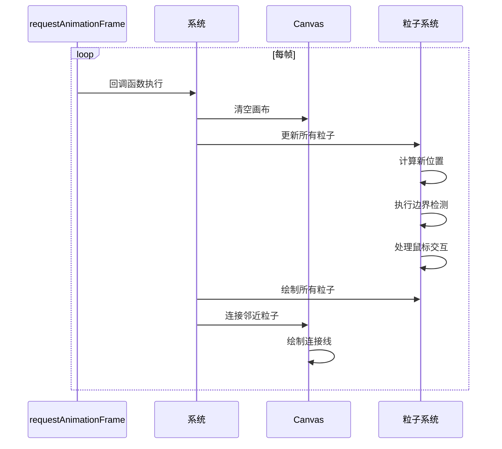
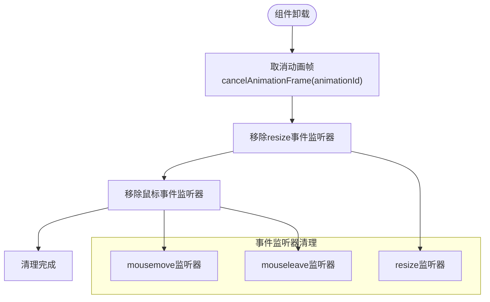
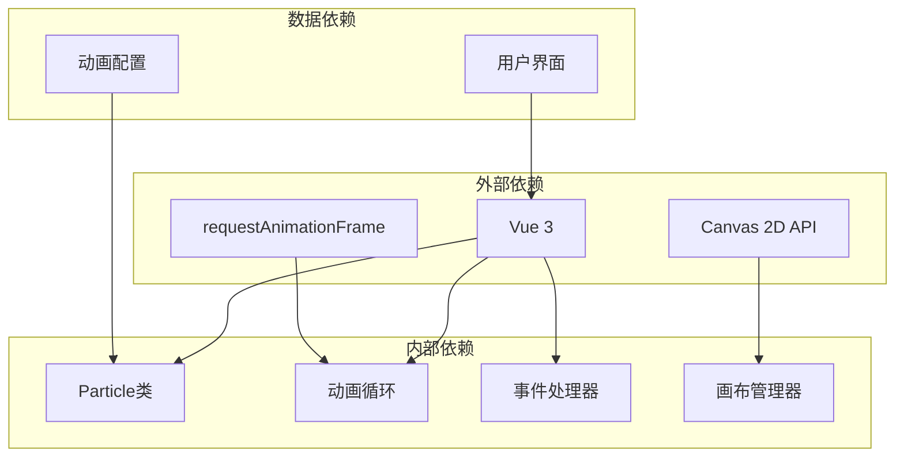

# 动态背景系统

<cite>
**本文档引用的文件**
- [DynamicBackground.vue](file://src/components/DynamicBackground.vue)
- [animations.js](file://src/data/animations.js)
- [Home.vue](file://src/views/Home.vue)
- [vite.config.js](file://vite.config.js)
</cite>

## 目录
1. [简介](#简介)
2. [项目结构](#项目结构)
3. [核心组件](#核心组件)
4. [架构概览](#架构概览)
5. [详细组件分析](#详细组件分析)
6. [依赖关系分析](#依赖关系分析)
7. [性能考虑](#性能考虑)
8. [故障排除指南](#故障排除指南)
9. [结论](#结论)
10. [附录](#附录)

## 简介

动态背景系统是一个基于Vue 3 Composition API和Canvas 2D的粒子动画组件，为网站提供美观的动态背景效果。该系统实现了完整的粒子物理模拟，包括粒子运动、边界检测、鼠标交互和粒子连接算法，并提供了响应式的画布尺寸调整机制。

## 项目结构

动态背景系统位于项目的组件目录中，采用模块化设计，便于维护和扩展。



**图表来源**
- [DynamicBackground.vue:1-185](file://src/components/DynamicBackground.vue#L1-L185)
- [animations.js:1-400](file://src/data/animations.js#L1-L400)

**章节来源**
- [DynamicBackground.vue:1-185](file://src/components/DynamicBackground.vue#L1-L185)
- [animations.js:1-400](file://src/data/animations.js#L1-L400)

## 核心组件

### DynamicBackground 组件

DynamicBackground 是一个基于Vue 3 Composition API的响应式组件，负责管理整个粒子动画系统。

#### 主要特性
- **Canvas 2D渲染**: 使用原生Canvas API进行高性能渲染
- **粒子系统**: 实现了完整的粒子物理模拟
- **鼠标交互**: 支持实时鼠标位置跟踪和交互效果
- **响应式布局**: 自动适配容器尺寸变化
- **内存管理**: 提供完整的资源清理机制

#### 关键属性
- `particles`: 粒子数组，存储所有活动粒子
- `mouse`: 鼠标位置对象，包含x和y坐标
- `canvas`: Canvas元素引用
- `ctx`: Canvas 2D上下文
- `animationId`: requestAnimationFrame的ID

**章节来源**
- [DynamicBackground.vue:8-12](file://src/components/DynamicBackground.vue#L8-L12)
- [DynamicBackground.vue:14-56](file://src/components/DynamicBackground.vue#L14-L56)

## 架构概览

动态背景系统采用分层架构设计，各组件职责明确，耦合度低。



**图表来源**
- [DynamicBackground.vue:14-172](file://src/components/DynamicBackground.vue#L14-L172)
- [Home.vue:1-80](file://src/views/Home.vue#L1-L80)

## 详细组件分析

### 粒子类设计

粒子类是整个系统的核心，实现了完整的粒子物理模拟。

#### 粒子属性
- `x, y`: 粒子位置坐标
- `size`: 粒子大小
- `speedX, speedY`: 粒子速度向量
- `color`: 粒子颜色（RGBA格式）

#### 粒子运动算法



**图表来源**
- [DynamicBackground.vue:24-48](file://src/components/DynamicBackground.vue#L24-L48)

#### 边界检测机制

系统实现了完整的边界检测，确保粒子不会移出画布范围。



**图表来源**
- [DynamicBackground.vue:28-31](file://src/components/DynamicBackground.vue#L28-L31)

#### 鼠标交互逻辑

鼠标交互通过距离计算实现，当鼠标靠近粒子时产生排斥效果。



**图表来源**
- [DynamicBackground.vue:33-47](file://src/components/DynamicBackground.vue#L33-L47)

**章节来源**
- [DynamicBackground.vue:14-56](file://src/components/DynamicBackground.vue#L14-L56)

### 粒子连接算法

粒子连接算法实现了粒子间的视觉连接效果，营造出动态的网络结构。

#### 连接算法实现



**图表来源**
- [DynamicBackground.vue:135-154](file://src/components/DynamicBackground.vue#L135-L154)

#### 距离计算优化

系统使用欧几里得距离公式计算粒子间距离：
```
distance = √[(x₂ - x₁)² + (y₂ - y₁)²]
```

透明度渐变采用线性插值：
```
alpha = (maxDistance - distance) / maxDistance × multiplier
```

**章节来源**
- [DynamicBackground.vue:135-154](file://src/components/DynamicBackground.vue#L135-L154)

### 响应式画布尺寸调整

系统实现了完整的响应式画布尺寸调整机制，确保在不同设备和窗口大小下都能正常工作。

#### 尺寸调整流程



**图表来源**
- [DynamicBackground.vue:80-96](file://src/components/DynamicBackground.vue#L80-L96)

**章节来源**
- [DynamicBackground.vue:80-96](file://src/components/DynamicBackground.vue#L80-L96)

### 动画循环实现

动画循环使用requestAnimationFrame实现高效的动画渲染。

#### 动画循环流程



**图表来源**
- [DynamicBackground.vue:118-132](file://src/components/DynamicBackground.vue#L118-L132)

**章节来源**
- [DynamicBackground.vue:118-132](file://src/components/DynamicBackground.vue#L118-L132)

### 内存管理和清理机制

系统提供了完整的内存管理和清理机制，确保组件卸载时释放所有资源。

#### 清理流程



**图表来源**
- [DynamicBackground.vue:161-172](file://src/components/DynamicBackground.vue#L161-L172)

**章节来源**
- [DynamicBackground.vue:161-172](file://src/components/DynamicBackground.vue#L161-L172)

## 依赖关系分析

动态背景系统与其他组件存在以下依赖关系：



**图表来源**
- [DynamicBackground.vue:6-11](file://src/components/DynamicBackground.vue#L6-L11)
- [animations.js:1-400](file://src/data/animations.js#L1-L400)

**章节来源**
- [DynamicBackground.vue:6-11](file://src/components/DynamicBackground.vue#L6-L11)
- [animations.js:1-400](file://src/data/animations.js#L1-L400)

## 性能考虑

### 性能优化策略

1. **粒子数量控制**: 基于画布面积动态计算粒子数量，避免过度渲染
2. **事件监听优化**: 使用window对象监听全局事件，提高事件捕获率
3. **内存管理**: 组件卸载时彻底清理所有事件监听器和动画帧
4. **渲染优化**: 使用Canvas 2D API进行硬件加速渲染

### 性能监控指标

- **帧率**: 使用requestAnimationFrame实现60fps目标
- **内存使用**: 动态管理粒子对象生命周期
- **CPU占用**: 优化距离计算和连接算法

## 故障排除指南

### 常见问题及解决方案

#### 粒子不显示
- 检查Canvas尺寸是否正确设置
- 验证粒子颜色格式是否有效
- 确认动画循环是否正常运行

#### 鼠标交互失效
- 确认事件监听器已正确绑定
- 检查鼠标坐标转换是否正确
- 验证边界检测逻辑

#### 性能问题
- 减少粒子数量或增加粒子间距
- 优化连接算法的复杂度
- 检查是否有内存泄漏

**章节来源**
- [DynamicBackground.vue:161-172](file://src/components/DynamicBackground.vue#L161-L172)

## 结论

动态背景系统是一个功能完整、性能优秀的Canvas 2D粒子动画解决方案。系统实现了：
- 完整的粒子物理模拟
- 实时鼠标交互
- 动态粒子连接效果
- 响应式尺寸调整
- 全面的内存管理

该系统为网站提供了美观且高性能的动态背景效果，同时保持了良好的可维护性和扩展性。

## 附录

### 使用示例

在Vue组件中使用动态背景：

```vue
<template>
  <div>
    <DynamicBackground />
    <!-- 其他内容 -->
  </div>
</template>

<script setup>
import DynamicBackground from '@/components/DynamicBackground.vue'
</script>
```

### 配置参数

系统支持以下配置参数：
- `particleCount`: 粒子数量（基于画布面积自动计算）
- `maxDistance`: 粒子连接最大距离
- `mouseRadius`: 鼠标交互影响半径
- `color`: 粒子颜色配置

### 自定义选项

- **颜色主题**: 可通过CSS变量自定义粒子颜色
- **动画速度**: 可调整粒子速度参数
- **交互强度**: 可调节鼠标交互的影响力
- **连接样式**: 可自定义连接线的颜色和透明度