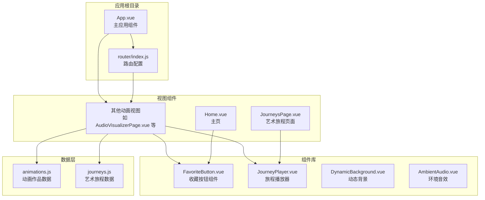
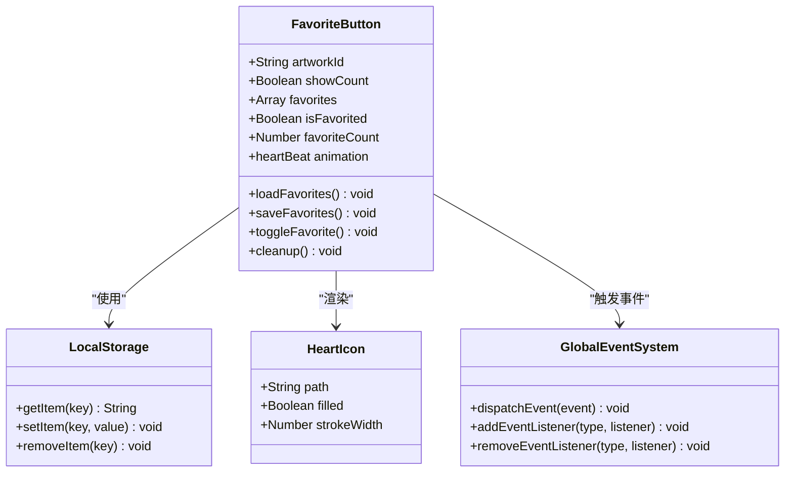
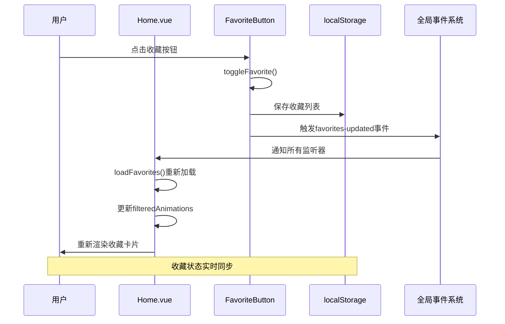
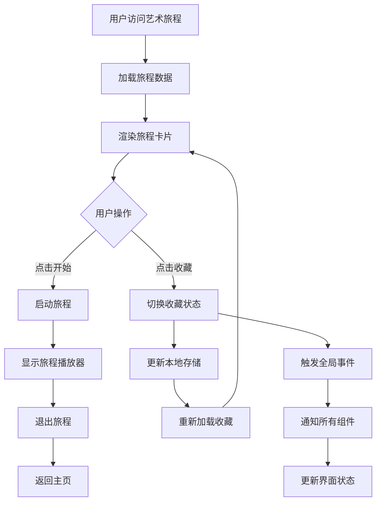
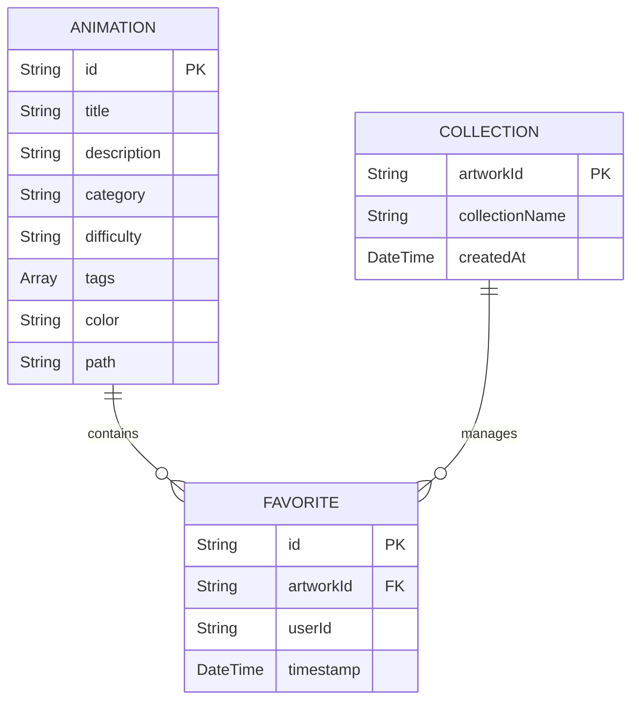
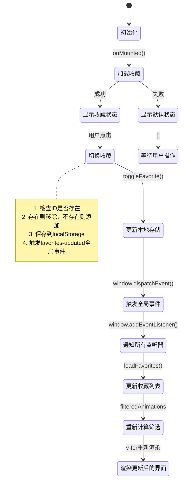
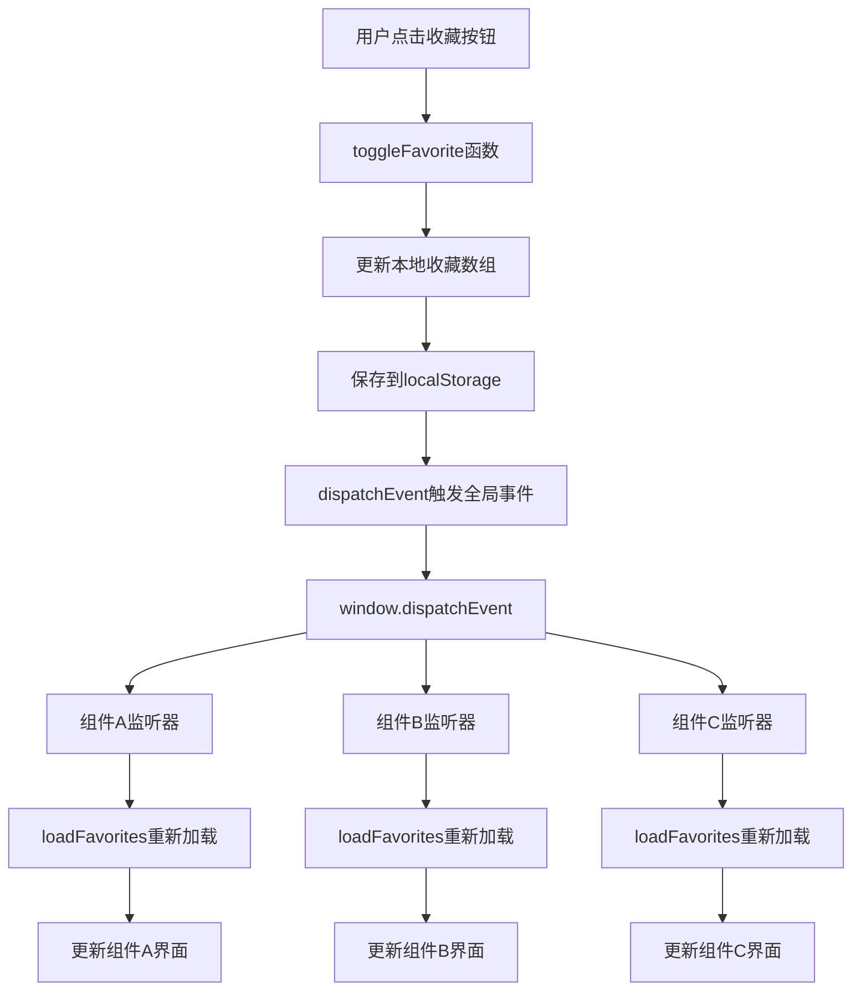
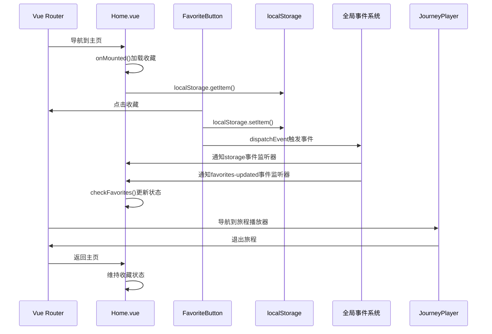
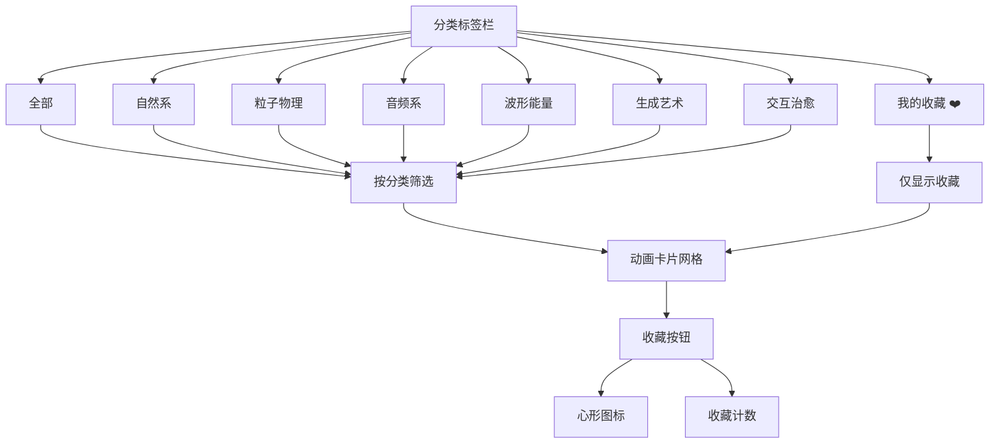

# 收藏管理功能

<cite>
**本文档引用的文件**
- [FavoriteButton.vue](file://src/components/FavoriteButton.vue)
- [Home.vue](file://src/views/Home.vue)
- [JourneysPage.vue](file://src/views/JourneysPage.vue)
- [JourneyPlayer.vue](file://src/components/JourneyPlayer.vue)
- [animations.js](file://src/data/animations.js)
- [journeys.js](file://src/data/journeys.js)
- [router/index.js](file://src/router/index.js)
- [App.vue](file://src/App.vue)
</cite>

## 更新摘要
**变更内容**
- 新增全局事件通知系统：收藏按钮通过window.dispatchEvent触发favorites-updated事件
- 改进事件监听管理和内存清理机制
- 增强全应用范围的收藏状态同步能力
- 完善事件生命周期管理

## 目录
1. [简介](#简介)
2. [项目结构概览](#项目结构概览)
3. [核心组件分析](#核心组件分析)
4. [收藏系统架构](#收藏系统架构)
5. [数据流分析](#数据流分析)
6. [用户界面设计](#用户界面设计)
7. [性能优化考虑](#性能优化考虑)
8. [故障排除指南](#故障排除指南)
9. [总结](#总结)

## 简介

收藏管理功能是本音乐可视化项目的核心特性之一，它允许用户对喜欢的动画作品进行个性化收藏，并提供便捷的收藏管理和浏览体验。该功能通过Vue 3的响应式系统和localStorage持久化存储，实现了跨会话的数据保存和实时更新。

该项目包含丰富的动画作品，涵盖自然、粒子物理、音频、波形能量、生成艺术和交互治愈等多个类别，为用户提供了多样化的视觉体验选择。

**更新** 新增全局事件通知系统，通过window.dispatchEvent触发favorites-updated事件，实现全应用范围的收藏状态同步，显著提升了组件间通信效率和用户体验一致性。

## 项目结构概览

项目采用模块化的Vue 3单页应用架构，主要目录结构如下：

**图表来源**
- [App.vue:1-421](file://src/App.vue#L1-L421)
- [router/index.js:1-210](file://src/router/index.js#L1-L210)

**章节来源**
- [App.vue:1-421](file://src/App.vue#L1-L421)
- [router/index.js:1-210](file://src/router/index.js#L1-L210)

## 核心组件分析

### 收藏按钮组件 (FavoriteButton.vue)

收藏按钮是整个收藏系统的核心组件，实现了完整的收藏状态管理功能：

**图表来源**
- [FavoriteButton.vue:23-91](file://src/components/FavoriteButton.vue#L23-L91)

该组件的主要特性包括：
- **响应式状态管理**：使用Vue 3的ref和computed实现收藏状态的实时更新
- **本地存储持久化**：通过localStorage实现跨会话的数据保存
- **动画反馈**：提供心形图标的心跳动画效果
- **条件渲染**：根据收藏状态动态切换样式
- **全局事件通知**：通过window.dispatchEvent触发favorites-updated事件
- **内存清理机制**：提供cleanup方法用于移除事件监听器

**更新** 新增全局事件通知系统，通过window.dispatchEvent(new CustomEvent('favorites-updated'))实现全应用范围的收藏状态同步，同时完善了事件监听管理和内存清理机制。

**章节来源**
- [FavoriteButton.vue:1-152](file://src/components/FavoriteButton.vue#L1-L152)

### 主页收藏集成 (Home.vue)

主页集成了完整的收藏过滤和展示功能：

**图表来源**
- [Home.vue:111-117](file://src/views/Home.vue#L111-L117)
- [FavoriteButton.vue:78-80](file://src/components/FavoriteButton.vue#L78-L80)

**更新** 主页现在同时监听两种事件源：localStorage的storage事件和全局的favorites-updated事件，确保收藏状态的完全同步。

**章节来源**
- [Home.vue:1-555](file://src/views/Home.vue#L1-L555)

### 艺术旅程收藏 (JourneysPage.vue)

艺术旅程页面展示了收藏功能在复杂场景中的应用：

**图表来源**
- [JourneysPage.vue:61-63](file://src/views/JourneysPage.vue#L61-L63)
- [journeys.js:1-182](file://src/data/journeys.js#L1-L182)

**章节来源**
- [JourneysPage.vue:1-286](file://src/views/JourneysPage.vue#L1-L286)

## 收藏系统架构

### 数据模型设计

收藏系统采用简洁而高效的数据模型：

**图表来源**
- [animations.js:1-400](file://src/data/animations.js#L1-L400)
- [journeys.js:1-182](file://src/data/journeys.js#L1-L182)

### 存储策略

系统采用localStorage作为主要的持久化存储方案：

| 存储键名 | 数据类型 | 描述 | 生命周期 |
|---------|----------|------|----------|
| `animation-favorites` | Array<String> | 收藏的动画作品ID列表 | 浏览器会话持久化 |
| `journey-favorites` | Array<String> | 收藏的艺术旅程ID列表 | 浏览器会话持久化 |

**更新** 新增全局事件通知机制，通过favorites-updated事件实现跨组件的实时状态同步，无需依赖localStorage的storage事件。

**章节来源**
- [FavoriteButton.vue:37-67](file://src/components/FavoriteButton.vue#L37-L67)
- [Home.vue:95-104](file://src/views/Home.vue#L95-L104)

## 数据流分析

### 收藏状态管理流程

**图表来源**
- [FavoriteButton.vue:69-86](file://src/components/FavoriteButton.vue#L69-L86)
- [Home.vue:111-117](file://src/views/Home.vue#L111-L117)

### 事件驱动的收藏同步机制

**图表来源**
- [FavoriteButton.vue:78-86](file://src/components/FavoriteButton.vue#L78-L86)
- [Home.vue:115-117](file://src/views/Home.vue#L115-L117)

**更新** 新增事件驱动的收藏同步机制，通过全局事件系统实现组件间的解耦通信，提升系统的可维护性和扩展性。

### 路由集成机制

收藏功能与Vue Router的深度集成确保了良好的用户体验：

**图表来源**
- [router/index.js:197-207](file://src/router/index.js#L197-L207)
- [JourneyPlayer.vue:181-185](file://src/components/JourneyPlayer.vue#L181-L185)

**章节来源**
- [router/index.js:1-210](file://src/router/index.js#L1-L210)
- [JourneyPlayer.vue:1-644](file://src/components/JourneyPlayer.vue#L1-L644)

## 用户界面设计

### 收藏按钮设计规范

收藏按钮采用了现代化的设计理念，结合了视觉反馈和交互体验：

| 设计属性 | 默认状态 | 已收藏状态 | 悬停效果 |
|---------|----------|------------|----------|
| 背景颜色 | rgba(255, 255, 255, 0.2) | rgba(255, 107, 107, 0.9) | rgba(255, 255, 255, 0.3) |
| 图标填充 | none | currentColor | - |
| 尺寸变化 | 1x | 1.1x | 1.05x |
| 边框圆角 | 50% | 50% | 50% |
| 动画效果 | 无 | 心跳动画 | 缩放过渡 |

### 主页收藏过滤系统

主页实现了多层次的收藏管理功能：

**图表来源**
- [Home.vue:277-442](file://src/views/Home.vue#L277-L442)
- [animations.js:391-399](file://src/data/animations.js#L391-L399)

**章节来源**
- [Home.vue:1-555](file://src/views/Home.vue#L1-L555)

## 性能优化考虑

### 内存管理策略

收藏系统采用了多项性能优化措施：

1. **懒加载机制**：收藏按钮组件按需加载，避免不必要的初始化开销
2. **事件委托**：使用Vue的事件系统减少DOM事件监听器的数量
3. **计算属性缓存**：利用Vue的响应式系统自动缓存计算结果
4. **批量更新**：通过Vue的异步更新队列优化DOM操作
5. **内存清理机制**：提供cleanup方法用于移除事件监听器，防止内存泄漏

**更新** 新增完善的内存清理机制，每个组件都有对应的cleanup方法来移除事件监听器，确保应用的长期稳定运行。

### 存储优化

- **最小化存储体积**：仅存储必要的作品ID，不存储完整对象
- **错误处理**：完善的try-catch机制防止存储异常影响整体功能
- **数据验证**：对localStorage中的数据进行格式验证和清理

### 渲染优化

- **虚拟滚动**：对于大量收藏项时可考虑实现虚拟滚动
- **防抖处理**：对频繁的收藏操作进行防抖处理
- **渐进式渲染**：大收藏列表时采用分批渲染策略

### 全局事件优化

**更新** 新增全局事件通知系统的优势：
- **实时同步**：通过CustomEvent实现真正的实时状态同步
- **解耦通信**：组件间通过事件解耦，降低耦合度
- **可扩展性**：易于扩展新的事件监听器
- **内存安全**：完善的事件监听器管理机制

## 故障排除指南

### 常见问题及解决方案

| 问题类型 | 症状描述 | 可能原因 | 解决方案 |
|---------|----------|----------|----------|
| 收藏状态不同步 | 页面显示收藏状态与实际不符 | localStorage读取失败 | 清除浏览器缓存或检查存储权限 |
| 收藏丢失 | 刷新页面后收藏消失 | 浏览器禁用localStorage | 检查浏览器设置或更换浏览器 |
| 性能问题 | 页面卡顿或响应缓慢 | 收藏项过多导致渲染压力 | 实现收藏分页或虚拟滚动 |
| 路由冲突 | 收藏按钮点击无效 | 路由配置问题 | 检查路由表和组件注册 |
| 事件监听泄漏 | 内存占用持续增长 | 未正确移除事件监听器 | 检查cleanup方法调用 |
| 全局事件失效 | 收藏状态无法跨组件同步 | 事件监听器被意外移除 | 验证事件监听器注册状态 |

**更新** 新增全局事件相关问题的故障排除指南。

### 调试技巧

1. **开发者工具**：使用浏览器的Application面板查看localStorage内容
2. **Vue DevTools**：监控组件状态变化和响应式数据更新
3. **网络面板**：检查是否有存储相关的错误请求
4. **控制台日志**：添加适当的console.log语句进行调试
5. **事件监听器检查**：使用浏览器开发者工具检查window.addEventListener的注册状态
6. **全局事件调试**：监听并记录favorites-updated事件的触发情况

**章节来源**
- [FavoriteButton.vue:55-66](file://src/components/FavoriteButton.vue#L55-L66)
- [Home.vue:101-103](file://src/views/Home.vue#L101-L103)

## 总结

收藏管理功能是本音乐可视化项目的重要组成部分，它通过精心设计的组件架构、高效的存储策略和优雅的用户界面，为用户提供了流畅的收藏体验。

### 核心优势

1. **技术实现**：基于Vue 3响应式系统的现代前端架构
2. **用户体验**：直观的收藏操作和即时的状态反馈
3. **性能表现**：优化的存储和渲染策略确保流畅体验
4. **扩展性**：模块化的组件设计便于功能扩展
5. **稳定性**：完善的内存管理和事件监听机制确保应用长期稳定运行

**更新** 新增的全局事件通知系统显著提升了系统的性能和可维护性：
- **实时同步**：通过CustomEvent实现真正的实时状态同步
- **解耦架构**：组件间通过事件解耦，降低耦合度
- **内存安全**：完善的事件监听器管理机制防止内存泄漏
- **可扩展性**：易于扩展新的事件监听器和功能模块

### 技术亮点

- **响应式状态管理**：利用Vue 3的Composition API实现高效的响应式数据绑定
- **本地存储集成**：无缝的localStorage集成提供持久化的用户体验
- **路由深度集成**：与Vue Router的紧密配合确保导航体验的一致性
- **动画反馈**：精心设计的CSS动画增强用户交互体验
- **全局事件系统**：通过window.dispatchEvent实现全应用范围的状态同步
- **内存清理机制**：完善的事件监听器管理确保应用长期稳定运行

该收藏系统不仅满足了当前的功能需求，还为未来的功能扩展奠定了坚实的技术基础。通过持续的优化和改进，相信能够为用户带来更加出色的收藏管理体验。