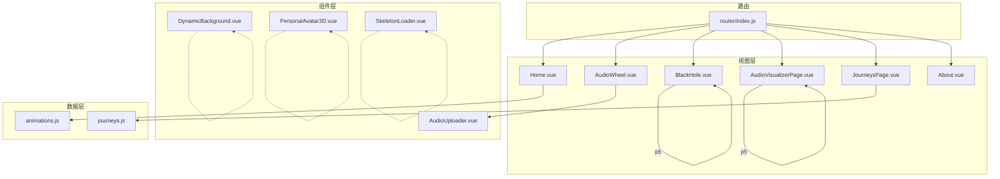
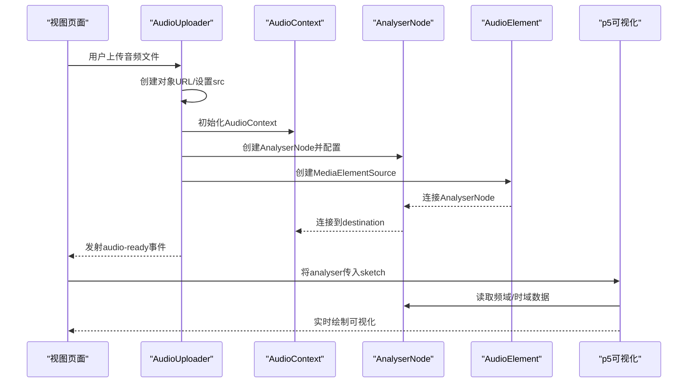
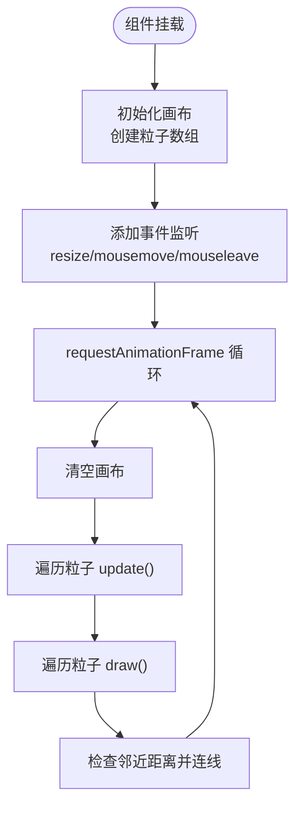
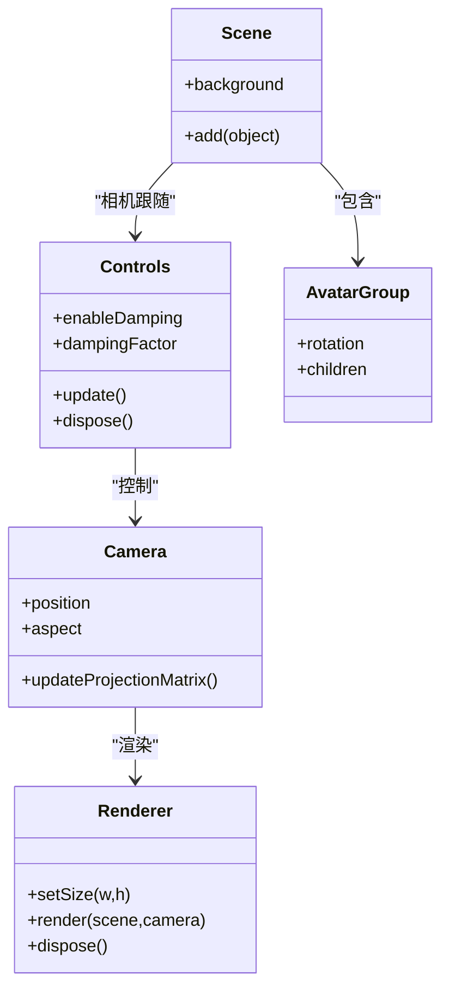
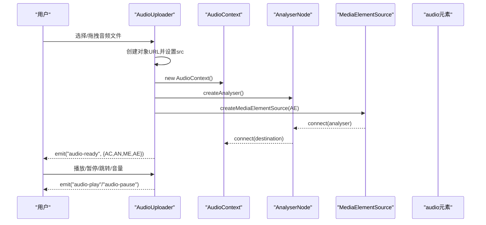
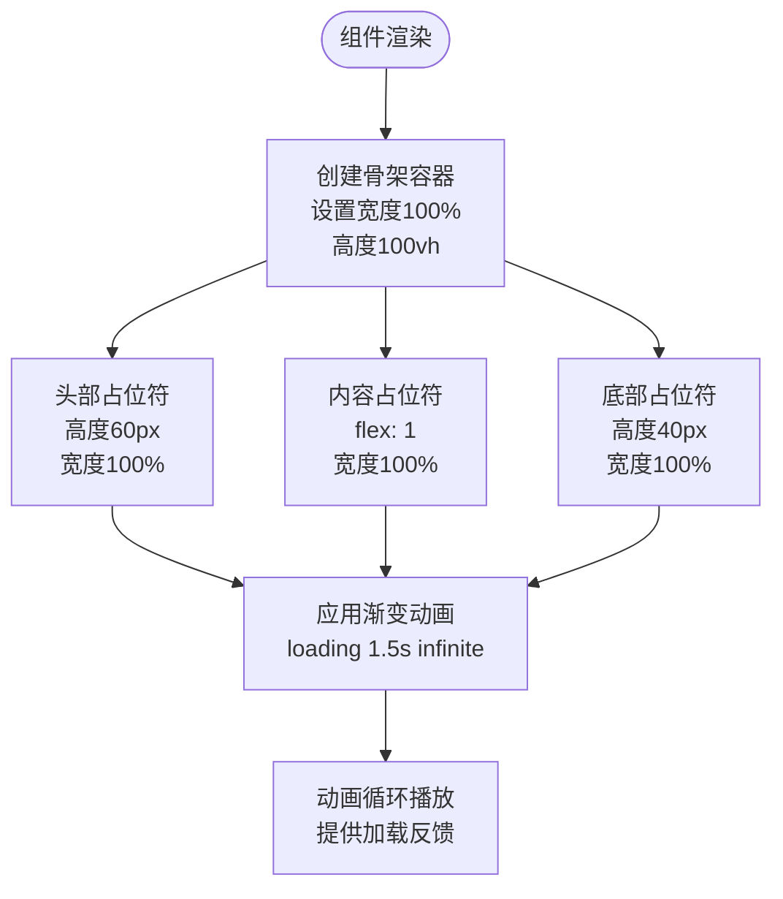
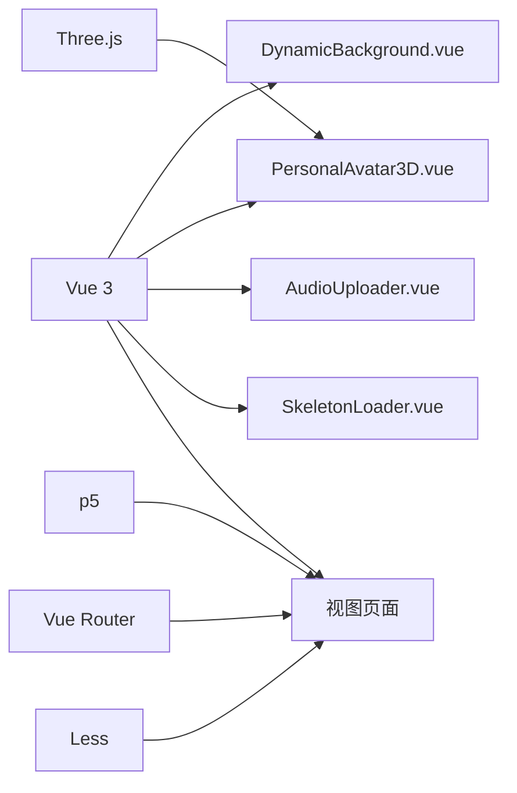

# 核心组件

<cite>
**本文引用的文件**
- [DynamicBackground.vue](file://src/components/DynamicBackground.vue)
- [PersonalAvatar3D.vue](file://src/components/PersonalAvatar3D.vue)
- [AudioUploader.vue](file://src/components/AudioUploader.vue)
- [SkeletonLoader.vue](file://src/components/SkeletonLoader.vue)
- [animations.js](file://src/data/animations.js)
- [Home.vue](file://src/views/Home.vue)
- [AudioWheel.vue](file://src/views/AudioWheel.vue)
- [BlackHole.vue](file://src/views/BlackHole.vue)
- [AudioVisualizerPage.vue](file://src/views/AudioVisualizerPage.vue)
- [router/index.js](file://src/router/index.js)
- [package.json](file://package.json)
</cite>

## 更新摘要
**变更内容**
- 新增SkeletonLoader组件，提供现代化的骨架屏加载动画效果
- 更新了音频上传组件作为核心组件的重要组成部分的架构说明
- 增强了音频上传组件与其他组件的集成关系描述
- 完善了音频可视化场景的数据流和事件通信机制
- 补充了音频上传组件的API接口和使用示例

## 目录
1. [简介](#简介)
2. [项目结构](#项目结构)
3. [核心组件](#核心组件)
4. [架构总览](#架构总览)
5. [详细组件分析](#详细组件分析)
6. [依赖分析](#依赖分析)
7. [性能考量](#性能考量)
8. [故障排查指南](#故障排查指南)
9. [结论](#结论)
10. [附录](#附录)

## 简介
本技术文档聚焦于项目中的四个核心可复用组件：动态背景系统（DynamicBackground.vue）、3D个人头像组件（PersonalAvatar3D.vue）、音频上传组件（AudioUploader.vue）以及新增的骨架屏加载组件（SkeletonLoader.vue）。文档将深入解析它们的实现原理、算法设计、交互逻辑与性能优化策略，并提供组件间协作关系、数据传递机制、API 接口说明、使用示例与自定义配置建议，帮助开发者快速理解与扩展这些组件。

**更新** 新增的SkeletonLoader组件提供现代化的骨架屏加载动画效果，包含渐变动画和响应式设计，用于改善用户体验。音频上传组件作为核心组件的重要组成部分，承担着音频处理、Web Audio API集成和事件通信的关键职责，在多个音频可视化场景中发挥核心作用。

## 项目结构
项目采用 Vue 3 + Vite 的前端工程，组件集中在 src/components 目录，视图页面集中在 src/views 目录，数据常量集中在 src/data 目录。路由通过 Vue Router 在 src/router/index.js 中集中管理，依赖通过 package.json 管理。

**图表来源**
- [Home.vue:1-555](file://src/views/Home.vue#L1-L555)
- [AudioWheel.vue:1-250](file://src/views/AudioWheel.vue#L1-L250)
- [BlackHole.vue:1-310](file://src/views/BlackHole.vue#L1-L310)
- [AudioVisualizerPage.vue:1-346](file://src/views/AudioVisualizerPage.vue#L1-L346)
- [JourneysPage.vue:1-286](file://src/views/JourneysPage.vue#L1-L286)
- [About.vue:1-181](file://src/views/About.vue#L1-L181)
- [DynamicBackground.vue:1-185](file://src/components/DynamicBackground.vue#L1-L185)
- [PersonalAvatar3D.vue:1-344](file://src/components/PersonalAvatar3D.vue#L1-L344)
- [AudioUploader.vue:1-514](file://src/components/AudioUploader.vue#L1-L514)
- [SkeletonLoader.vue:1-50](file://src/components/SkeletonLoader.vue#L1-L50)
- [animations.js:1-400](file://src/data/animations.js#L1-L400)
- [router/index.js:1-244](file://src/router/index.js#L1-L244)

**章节来源**
- [package.json:1-29](file://package.json#L1-L29)
- [router/index.js:1-244](file://src/router/index.js#L1-L244)

## 核心组件
- 动态背景系统（DynamicBackground.vue）
  - Canvas 2D 粒子动画：随机分布、边界反弹、鼠标排斥交互、粒子连线。
  - 性能优化：按分辨率动态计算粒子数量、RAF 循环、仅绘制必要内容。
- 3D个人头像组件（PersonalAvatar3D.vue）
  - Three.js 场景构建：相机、渲染器、控制器、光源。
  - 几何体拼装：基于 BoxGeometry 的"史蒂夫"形象，含头部、头发、面部、躯干、四肢与旋转光环。
  - 鼠标交互：平滑旋转、轨道控制器、响应窗口尺寸变化。
- 音频上传组件（AudioUploader.vue）
  - 文件上传与拖拽：支持多种音频格式（MP3, WAV, OGG, M4A）。
  - Web Audio API：AudioContext、AnalyserNode、MediaElementSource 连接链路。
  - 播放控制：播放/暂停、进度跳转、音量调节、事件发射。
  - 核心职责：音频文件处理、Web Audio API 初始化、音频分析节点输出。
- 骨架屏加载组件（SkeletonLoader.vue）
  - 渐变动画：使用CSS线性渐变和关键帧动画实现流畅的加载效果。
  - 响应式设计：适配不同屏幕尺寸，包含头部、内容区和底部三个区块。
  - 现代化UI：圆角设计、柔和色彩，提供良好的用户体验。

**更新** 新增的SkeletonLoader组件作为用户体验优化的重要组成部分，为页面加载和内容渲染提供视觉反馈，改善用户的感知性能。

**章节来源**
- [DynamicBackground.vue:1-185](file://src/components/DynamicBackground.vue#L1-L185)
- [PersonalAvatar3D.vue:1-344](file://src/components/PersonalAvatar3D.vue#L1-L344)
- [AudioUploader.vue:1-514](file://src/components/AudioUploader.vue#L1-L514)
- [SkeletonLoader.vue:1-50](file://src/components/SkeletonLoader.vue#L1-L50)

## 架构总览
组件间协作与数据传递：
- Home.vue 展示动画列表，通过路由导航进入具体动画页面。
- AudioWheel.vue 引入 AudioUploader.vue，接收音频准备、播放、暂停事件，将音频分析节点传入 p5 可视化场景。
- BlackHole.vue 与 AudioVisualizerPage.vue 使用 p5 进行独立的可视化，不直接依赖上述三个核心组件。
- DynamicBackground.vue 与 PersonalAvatar3D.vue 作为通用可复用组件，可在任意视图中按需引入。
- **更新** AudioUploader.vue 作为核心组件，为所有音频相关的可视化场景提供统一的音频处理和分析能力。
- **更新** SkeletonLoader.vue 作为通用加载组件，可在任意需要加载反馈的场景中使用。

**图表来源**
- [AudioUploader.vue:135-178](file://src/components/AudioUploader.vue#L135-L178)
- [AudioWheel.vue:32-42](file://src/views/AudioWheel.vue#L32-L42)
- [AudioVisualizerPage.vue:62-90](file://src/views/AudioVisualizerPage.vue#L62-L90)

## 详细组件分析

### 动态背景系统（DynamicBackground.vue）

- 系统架构
  - 使用 Canvas 2D API 实现粒子系统，包含粒子类、画布初始化、事件监听、动画循环与粒子连线。
  - 采用 requestAnimationFrame 控制动画帧率，按容器尺寸动态调整画布大小。
  - 鼠标交互通过全局 window 事件监听，确保全屏覆盖下的捕获能力。

- 粒子系统算法
  - 粒子属性：位置、速度、大小、颜色、距离鼠标力。
  - 更新逻辑：边界检测与反弹；鼠标排斥力随距离衰减；连线阈值判断。
  - 绘制逻辑：填充圆形粒子；连线使用透明度随距离衰减。

- 鼠标交互逻辑
  - 全局监听 mousemove 与 mouseleave，mouseleave 将鼠标位置重置至画布中心，避免交互断点。
  - 排斥力方向由鼠标到粒子的方向向量决定，力强度与距离成反比。

- 性能优化策略
  - 粒子数量按画布面积动态计算，避免高分辨率下过多粒子导致卡顿。
  - 仅在需要时清空画布并重绘，减少不必要的绘制开销。
  - 使用 RAF 循环，避免阻塞主线程。

**图表来源**
- [DynamicBackground.vue:58-154](file://src/components/DynamicBackground.vue#L58-L154)

**章节来源**
- [DynamicBackground.vue:1-185](file://src/components/DynamicBackground.vue#L1-L185)

### 3D个人头像组件（PersonalAvatar3D.vue）

- 系统架构
  - Three.js 场景：Scene、PerspectiveCamera、WebGLRenderer、OrbitControls。
  - 几何体拼装：使用 BoxGeometry 搭建"史蒂夫"形象，包含头部、头发、面部、躯干、手臂、裤子、腿部与鞋子。
  - 光照系统：环境光、方向光、点光源组合，营造自然光照。
  - 鼠标交互：基于鼠标位置计算目标旋转角，平滑过渡到目标角度；轨道控制器启用阻尼与禁用缩放。

- 场景构建与模型加载
  - 通过 Group 组织所有几何体，统一进行旋转与变换。
  - 旋转光环使用 TorusGeometry，位于头顶位置，独立旋转增强视觉层次。

- 轨道控制器与光照系统
  - OrbitControls 启用阻尼 dampingFactor，提升操控手感。
  - 环境光 AmbientLight 提供基础照明；DirectionalLight 提供主光源；PointLight 放置在上方，模拟顶光源。

- 鼠标交互与动画循环
  - 鼠标移动事件转换为标准化设备坐标，计算目标旋转角 targetRotationX/Y。
  - 动画循环中 avatarGroup 逐步趋近目标旋转角，光环独立旋转；控制器 update() 与 render() 保证流畅渲染。

**图表来源**
- [PersonalAvatar3D.vue:18-61](file://src/components/PersonalAvatar3D.vue#L18-L61)
- [PersonalAvatar3D.vue:63-237](file://src/components/PersonalAvatar3D.vue#L63-L237)
- [PersonalAvatar3D.vue:239-293](file://src/components/PersonalAvatar3D.vue#L239-L293)

**章节来源**
- [PersonalAvatar3D.vue:1-344](file://src/components/PersonalAvatar3D.vue#L1-L344)

### 音频上传组件（AudioUploader.vue）

- 系统架构
  - 上传区：点击触发文件输入、拖拽进入/离开状态、放下处理。
  - 播放控制条：播放/暂停、进度条、音量滑块、更换音频。
  - Web Audio API：AudioContext、AnalyserNode、MediaElementSource 连接链路。
  - 事件发射：audio-ready、audio-play、audio-pause。

- Web Audio API 集成
  - 初始化：创建 AudioContext 与 AnalyserNode，设置 fftSize 为 2048，smoothingTimeConstant 为 0.8。
  - 连接：MediaElementSource -> AnalyserNode -> destination。
  - 事件：timeupdate、loadedmetadata、ended、play、pause，分别更新时间、时长、播放状态。

- 交互与生命周期
  - 播放/暂停：确保 AudioContext 处于运行状态后再操作 audioElement。
  - 跳转与音量：双向绑定 currentTime 与 volume，实时更新。
  - 清理：组件卸载时断开连接、关闭 AudioContext、撤销对象 URL、移除 DOM。

- 核心职责与数据流
  - 音频文件处理：支持 MP3, WAV, OGG, M4A 格式。
  - 分析节点输出：提供 AnalyserNode 供其他组件使用。
  - 事件通信：向上层组件发射音频状态变化事件。

**图表来源**
- [AudioUploader.vue:135-178](file://src/components/AudioUploader.vue#L135-L178)
- [AudioUploader.vue:180-241](file://src/components/AudioUploader.vue#L180-L241)
- [AudioUploader.vue:294-297](file://src/components/AudioUploader.vue#L294-L297)

**章节来源**
- [AudioUploader.vue:1-514](file://src/components/AudioUploader.vue#L1-L514)

### 骨架屏加载组件（SkeletonLoader.vue）

- 系统架构
  - 结构组成：包含头部占位符、主要内容区和底部占位符三个主要区块。
  - 渐变动画：使用CSS线性渐变背景配合关键帧动画实现流畅的加载效果。
  - 响应式设计：适配不同屏幕尺寸，使用flex布局和gap间距实现良好的视觉层次。

- 渐变动画实现
  - 背景设置：使用linear-gradient创建从浅灰到深灰再到浅灰的渐变效果。
  - 动画效果：通过@keyframes定义loading动画，实现从右到左的移动效果。
  - 性能优化：使用transform属性而非改变位置属性，确保动画流畅性。

- 响应式设计特性
  - 屏幕适配：针对不同断点（768px、480px）提供相应的样式调整。
  - 灵活布局：使用flex-direction: column实现垂直排列，gap统一间距。
  - 视觉层次：头部60px高度、底部40px高度、中间内容区自适应填充。

- 使用场景
  - 页面加载：在数据加载期间提供视觉反馈，改善用户体验。
  - 内容渲染：在异步内容渲染完成前显示占位符，避免界面闪烁。
  - 现代化UI：圆角设计和柔和色彩，符合现代Web设计趋势。

**图表来源**
- [SkeletonLoader.vue:1-50](file://src/components/SkeletonLoader.vue#L1-L50)

**章节来源**
- [SkeletonLoader.vue:1-50](file://src/components/SkeletonLoader.vue#L1-L50)

## 依赖分析
- 运行时依赖
  - Vue 3、Vue Router、Three.js、p5（在视图中使用）、Less（样式预处理）。
- 组件间耦合
  - AudioUploader 与 AudioWheel 之间通过事件通信；AudioWheel 将 analyser 注入 p5 可视化。
  - DynamicBackground 与 PersonalAvatar3D 为独立可复用组件，无直接耦合。
  - Home.vue 与 animations.js 数据强关联，用于展示动画列表。
  - **更新** AudioUploader 作为核心组件，为所有音频相关场景提供统一的音频处理能力。
  - **更新** SkeletonLoader 为通用加载组件，可在任意需要加载反馈的场景中使用。

**图表来源**
- [package.json:11-21](file://package.json#L11-L21)
- [router/index.js:1-244](file://src/router/index.js#L1-L244)

**章节来源**
- [package.json:1-29](file://package.json#L1-L29)
- [router/index.js:1-244](file://src/router/index.js#L1-L244)

## 性能考量
- Canvas 2D 粒子系统
  - 粒子数量与分辨率成正比，避免在超高分辨率下创建过多粒子。
  - 使用 requestAnimationFrame，避免同步阻塞；仅在需要时清空画布。
  - 连线采用阈值判断，减少不必要的绘制调用。
- Three.js 场景
  - 启用抗锯齿与 alpha 通道，合理设置像素比（min(devicePixelRatio, 2)）。
  - OrbitControls 启用阻尼与禁用缩放，降低复杂度。
  - 控制器与渲染器在卸载时正确 dispose，避免内存泄漏。
- Web Audio API
  - 在用户交互（如点击）后恢复 AudioContext，满足浏览器策略。
  - 连接链路一次性建立，避免重复创建节点；卸载时断开并关闭上下文。
- **更新** 骨架屏加载组件
  - 使用CSS动画而非JavaScript动画，确保流畅性。
  - 渐变背景使用硬件加速友好的属性，避免重排重绘。
  - 响应式设计减少不必要的DOM操作，提高渲染效率。

## 故障排查指南
- Canvas 粒子不显示
  - 检查容器尺寸是否为 0；确认 initCanvas 是否执行且已创建 canvas。
  - 确认 RAF 循环未被提前取消。
- 鼠标交互无效
  - 确认事件监听绑定在 window 上且未被移除。
  - 检查mouseleave 回调是否将鼠标位置重置到画布中心。
- Three.js 场景空白
  - 检查容器尺寸与相机宽高比；确认 renderer.setSize 与 camera.aspect 更新。
  - 确认光源与几何体已加入场景。
- 音频无法播放
  - 确认 AudioContext 状态为 running；检查对象 URL 是否有效。
  - 确认 analyser 已连接到 destination；检查事件发射顺序。
  - **更新** 检查 AudioUploader 的事件发射顺序和参数传递。
- 卸载后内存泄漏
  - 确认 cancelAnimationFrame、controls.dispose、renderer.dispose、URL.revokeObjectURL、audioContext.close 是否执行。
  - **更新** 确认 AudioUploader 的 cleanup 方法是否正确执行所有资源清理。
- **更新** 骨架屏加载问题
  - 检查CSS动画是否正常加载，确认@keyframes定义正确。
  - 确认容器尺寸设置为100vh，确保全屏覆盖。
  - 检查渐变背景的background-size属性是否正确设置。

**章节来源**
- [DynamicBackground.vue:162-172](file://src/components/DynamicBackground.vue#L162-L172)
- [PersonalAvatar3D.vue:313-331](file://src/components/PersonalAvatar3D.vue#L313-L331)
- [AudioUploader.vue:252-284](file://src/components/AudioUploader.vue#L252-L284)
- [SkeletonLoader.vue:1-50](file://src/components/SkeletonLoader.vue#L1-L50)

## 结论
本项目的核心组件围绕 Canvas 2D、Three.js、Web Audio API 和现代UI设计四大技术栈构建，具备良好的可复用性与扩展性。DynamicBackground 提供轻量级粒子动画与鼠标交互；PersonalAvatar3D 展示了完整的 3D 场景构建与交互流程；AudioUploader 则完整实现了音频上传与 Web Audio API 集成，作为核心组件为整个音频可视化系统提供基础设施；新增的SkeletonLoader组件通过现代化的骨架屏加载动画，显著改善了用户体验。

**更新** 通过合理的性能优化与生命周期管理，这些组件能够在现代浏览器中稳定运行，并为上层视图提供丰富的多媒体体验。AudioUploader 的核心地位体现在其为多个音频可视化场景提供了统一的音频处理和分析能力，确保了系统的模块化和可维护性。SkeletonLoader组件的加入进一步完善了项目的用户体验体系，为各种异步加载场景提供了专业的解决方案。

## 附录

### 组件 API 与使用示例

- DynamicBackground.vue
  - 用途：全屏动态背景，适合首页或沉浸式页面。
  - 使用：直接在模板中引入组件，无需额外 props。
  - 自定义：可通过修改粒子数量密度、颜色、鼠标排斥力参数进行定制。
  - 注意：组件会接管容器尺寸与事件监听，确保容器为固定定位且层级合理。

- PersonalAvatar3D.vue
  - 用途：展示 3D 个人头像，适合 About 页面或个人介绍页。
  - 使用：在模板中引入组件，组件内部自动创建场景与渲染。
  - 自定义：可调整相机位置、光源强度、几何体颜色与尺寸。
  - 注意：容器高度需显式设置，避免渲染异常；在卸载时会释放资源。

- AudioUploader.vue
  - 用途：提供音频上传、播放控制与 Web Audio API 输出。
  - 使用：在父组件中监听 audio-ready、audio-play、audio-pause 事件，获取 analyser 用于可视化。
  - 自定义：可扩展支持更多音频格式、增加可视化模式或导出功能。
  - 注意：首次播放需用户交互恢复 AudioContext；组件卸载时会清理所有资源。
  - **更新** 核心职责：音频文件处理、Web Audio API 初始化、音频分析节点输出、事件通信。

- **更新** SkeletonLoader.vue
  - 用途：提供现代化的骨架屏加载动画效果，改善用户体验。
  - 使用：在需要加载反馈的场景中引入组件，组件自动渲染渐变动画。
  - 自定义：可通过修改CSS变量调整颜色、尺寸和动画速度。
  - 注意：组件使用100vh高度确保全屏覆盖，适合页面加载和内容渲染场景。

### 音频上传组件详细API

- 事件
  - audio-ready: 音频准备就绪，参数包含 {audioContext, analyser, source, audioElement}
  - audio-play: 音频开始播放
  - audio-pause: 音频暂停播放

- 方法
  - triggerFileInput(): 触发文件选择对话框
  - togglePlay(): 切换播放/暂停状态
  - seek(time): 跳转到指定时间
  - setVolume(volume): 设置音量
  - resetAudio(): 重置音频状态

- 状态
  - hasAudio: 是否已加载音频文件
  - isPlaying: 当前播放状态
  - currentTime: 当前播放时间
  - duration: 音频总时长
  - volume: 当前音量

**章节来源**
- [DynamicBackground.vue:1-185](file://src/components/DynamicBackground.vue#L1-L185)
- [PersonalAvatar3D.vue:1-344](file://src/components/PersonalAvatar3D.vue#L1-L344)
- [AudioUploader.vue:1-514](file://src/components/AudioUploader.vue#L1-L514)
- [SkeletonLoader.vue:1-50](file://src/components/SkeletonLoader.vue#L1-L50)