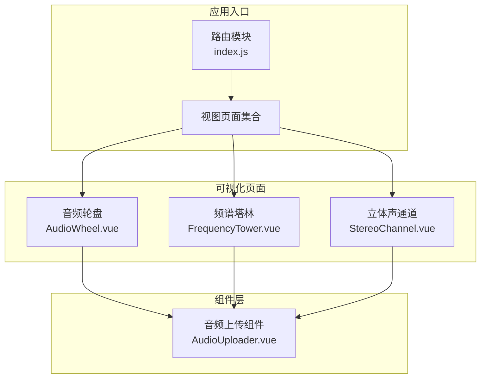
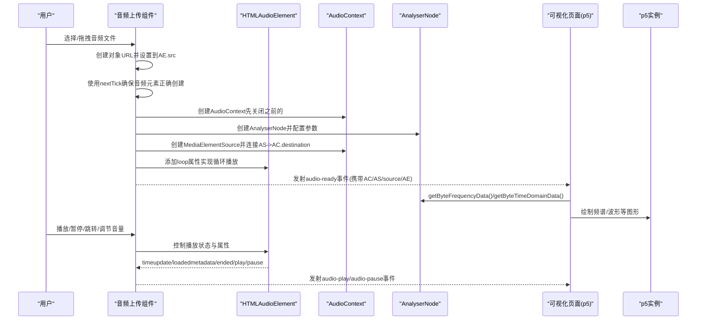
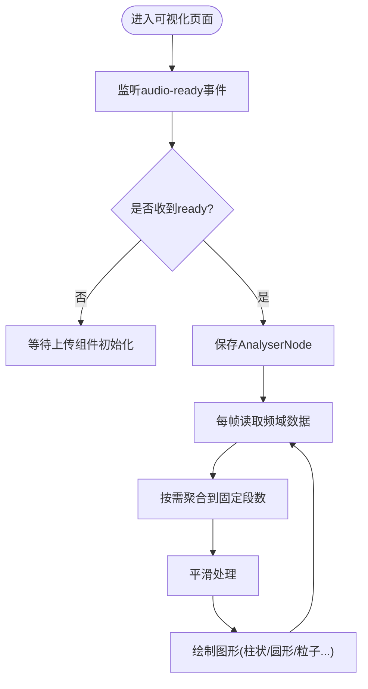
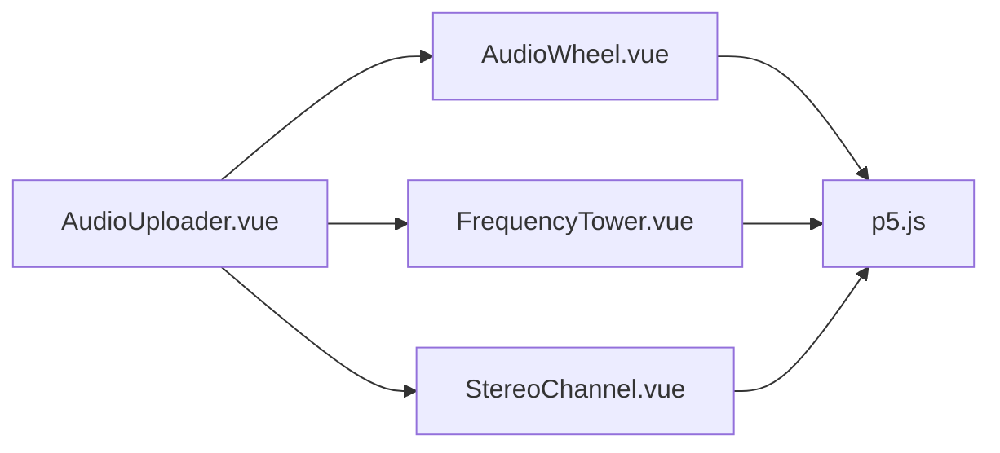

# 音频上传组件

<cite>
**本文引用的文件**
- [AudioUploader.vue](file://src/components/AudioUploader.vue)
- [AudioWheel.vue](file://src/views/AudioWheel.vue)
- [FrequencyTower.vue](file://src/views/FrequencyTower.vue)
- [StereoChannel.vue](file://src/views/StereoChannel.vue)
- [index.js](file://src/router/index.js)
- [package.json](file://package.json)
</cite>

## 更新摘要
**变更内容**
- 优化了 AudioContext 管理机制，改进了音频元素重新创建逻辑
- 增强了异步加载流程，使用 Promise 等待音频完全加载
- 完善了资源清理机制，确保音频上下文和媒体元素正确释放
- 改进了事件监听器的健壮性，提升了播放控制的可靠性

## 目录
1. [简介](#简介)
2. [项目结构](#项目结构)
3. [核心组件](#核心组件)
4. [架构总览](#架构总览)
5. [详细组件分析](#详细组件分析)
6. [依赖关系分析](#依赖关系分析)
7. [性能考量](#性能考量)
8. [故障排查指南](#故障排查指南)
9. [结论](#结论)
10. [附录](#附录)

## 简介
本技术文档围绕音频上传组件展开，重点说明：
- Web Audio API 的集成方案与音频处理流程
- 文件选择、音频解码与频谱分析的实现机制
- 音频可视化数据的生成过程与实时处理算法
- 组件的 API 接口文档（事件回调、错误处理、状态管理）
- 音频格式支持、文件大小限制与浏览器兼容性
- 使用示例、最佳实践与常见问题解决方案
- 与音频可视化页面的数据传递机制

## 项目结构
该仓库采用 Vue 3 + Vite 的单页应用结构，音频上传组件位于组件目录，多个可视化页面通过路由挂载，并复用同一上传组件以共享音频上下文。

**图表来源**
- [index.js:1-239](file://src/router/index.js#L1-L239)
- [AudioUploader.vue:1-571](file://src/components/AudioUploader.vue#L1-L571)
- [AudioWheel.vue:1-250](file://src/views/AudioWheel.vue#L1-L250)
- [FrequencyTower.vue:1-266](file://src/views/FrequencyTower.vue#L1-L266)
- [StereoChannel.vue:1-355](file://src/views/StereoChannel.vue#L1-L355)

**章节来源**
- [index.js:1-239](file://src/router/index.js#L1-L239)

## 核心组件
- 音频上传组件：负责文件选择、拖拽上传、媒体元素播放控制、Web Audio API 初始化与节点连接、事件发射与资源清理。
- 可视化页面：接收上传组件提供的音频上下文与分析器，进行频谱数据采集与图形绘制。

**章节来源**
- [AudioUploader.vue:94-355](file://src/components/AudioUploader.vue#L94-L355)

## 架构总览
音频处理链路自上而下分为三层：
- 用户交互层：文件输入、拖拽、播放控制
- Web Audio 层：AudioContext、AnalyserNode、MediaElementSource、ChannelSplitter（立体声）
- 可视化层：p5.js 场景与绘制逻辑，按需从 AnalyserNode 读取频域/时域数据

**图表来源**
- [AudioUploader.vue:138-177](file://src/components/AudioUploader.vue#L138-L177)
- [AudioWheel.vue:32-42](file://src/views/AudioWheel.vue#L32-L42)
- [FrequencyTower.vue:30-40](file://src/views/FrequencyTower.vue#L30-L40)
- [StereoChannel.vue:65-92](file://src/views/StereoChannel.vue#L65-L92)

## 详细组件分析

### 音频上传组件（AudioUploader.vue）
- 功能职责
  - 文件选择与拖拽上传
  - 媒体元素播放控制（播放/暂停/进度/音量/更换）
  - Web Audio API 初始化与节点连接
  - 事件发射（audio-ready、audio-play、audio-pause）
  - 资源清理（断开连接、关闭上下文、撤销对象URL）

- 关键实现要点
  - 文件选择与拖拽：通过隐藏的 input[type=file] 与 dragover/drop 事件处理；仅接受 audio/* 类型文件。
  - 加载音频：创建对象URL并赋给 audio 元素，使用 `nextTick()` 确保音频元素正确创建，随后初始化 AudioContext 与 AnalyserNode。
  - 节点连接：MediaElementSource -> AnalyserNode -> AudioDestination，确保音频可听且可分析。
  - 播放控制：在用户交互后恢复 AudioContext；通过 audio 元素属性控制播放状态与音量。
  - 事件发射：audio-ready 提供 AC/AS/source/AE；audio-play/pause 通知播放状态变化。
  - 资源清理：在组件卸载或更换音频时断开连接、关闭上下文、撤销对象URL。

- 数据流与状态
  - hasAudio/isPlaying/currentTime/duration/volume 等响应式状态驱动 UI。
  - AudioContext/AnalyserNode/Source/AudioElement 作为外部可视化页面的输入。

- 错误处理与边界
  - AudioContext 初始化异常捕获与日志记录。
  - 播放前确保 AudioContext 处于运行状态（resume）。
  - 清理阶段对断开/关闭操作进行 try/catch 包裹，避免异常中断。

- 性能与复杂度
  - AnalyserNode 参数（fftSize/smoothingTimeConstant）影响数据粒度与平滑度。
  - 进度条与音量滑块为 O(1) 读写，不引入额外计算。

- API 接口文档
  - 事件
    - audio-ready: 携带 { audioContext, analyser, source, audioElement }
    - audio-play: 播放开始
    - audio-pause: 暂停
  - 方法（通过模板引用调用）
    - triggerFileInput(): 触发文件选择
    - resetAudio(): 重置状态并释放资源
  - 状态
    - hasAudio: 是否已加载音频
    - isPlaying: 当前播放状态
    - currentTime/duration/volume: 当前时间、总时长、音量
  - 事件回调
    - timeupdate/loadedmetadata/ended/play/pause: 由 audio 元素触发，组件内部同步状态并发射自定义事件

- 浏览器兼容性
  - 使用标准 AudioContext 或 webkitAudioContext 兼容旧版 Safari/Chrome。
  - audio 元素与 input[type=file] 具备广泛支持。

- 使用示例
  - 在可视化页面中引入组件并通过事件监听接入音频上下文与分析器。
  - 示例路径：[AudioWheel.vue:9-13](file://src/views/AudioWheel.vue#L9-L13)，[FrequencyTower.vue:9-13](file://src/views/FrequencyTower.vue#L9-L13)，[StereoChannel.vue:10-11](file://src/views/StereoChannel.vue#L10-L11)

- 最佳实践
  - 在用户首次交互后初始化 AudioContext，避免浏览器静音策略。
  - 合理设置 AnalyserNode 的 fftSize 与 smoothingTimeConstant，平衡实时性与平滑度。
  - 在组件卸载时执行 cleanup，防止内存泄漏与资源占用。

**章节来源**
- [AudioUploader.vue:94-355](file://src/components/AudioUploader.vue#L94-L355)

### 可视化页面与数据传递
- 音频轮盘（AudioWheel.vue）
  - 接收 audio-ready 事件，保存 AnalyserNode。
  - 在 p5 的 draw 中读取频域数据，聚合到固定段数，进行平滑与历史帧叠加，绘制多层同心圆。
  - 支持鼠标控制旋转中心偏移，增强交互体验。

- 频谱塔林（FrequencyTower.vue）
  - 接收 audio-ready 事件，保存 AnalyserNode。
  - 将 1024 个频域 bin 聚合到 64 个频段，绘制城市天际线风格的频谱塔林，带发光与连线效果。

- 立体声通道（StereoChannel.vue）
  - 接收 audio-ready 事件，断开原 source 连接，使用 ChannelSplitter 分离左右声道。
  - 分别创建左右 AnalyserNode，绘制左右声道的频谱柱与粒子系统，区分颜色（紫色/青色）。

**图表来源**
- [AudioWheel.vue:32-125](file://src/views/AudioWheel.vue#L32-L125)
- [FrequencyTower.vue:71-105](file://src/views/FrequencyTower.vue#L71-L105)
- [StereoChannel.vue:65-150](file://src/views/StereoChannel.vue#L65-L150)

**章节来源**
- [AudioWheel.vue:1-250](file://src/views/AudioWheel.vue#L1-L250)
- [FrequencyTower.vue:1-266](file://src/views/FrequencyTower.vue#L1-L266)
- [StereoChannel.vue:1-355](file://src/views/StereoChannel.vue#L1-L355)

## 依赖关系分析
- 组件间依赖
  - AudioUploader.vue 作为通用组件被多个可视化页面复用。
  - 可视化页面通过事件与上传组件解耦，仅依赖其提供的音频上下文与分析器。
- 外部依赖
  - p5.js：用于可视化绘制。
  - Vue 3 + Vite：构建与运行环境。
- 路由集成
  - 通过路由配置将各可视化页面挂载到独立路径，便于导航与分享。

**图表来源**
- [AudioUploader.vue:1-571](file://src/components/AudioUploader.vue#L1-L571)
- [AudioWheel.vue:1-250](file://src/views/AudioWheel.vue#L1-L250)
- [FrequencyTower.vue:1-266](file://src/views/FrequencyTower.vue#L1-L266)
- [StereoChannel.vue:1-355](file://src/views/StereoChannel.vue#L1-L355)
- [package.json:13-25](file://package.json#L13-L25)

**章节来源**
- [package.json:13-25](file://package.json#L13-L25)
- [index.js:65-173](file://src/router/index.js#L65-L173)

## 性能考量
- AnalyserNode 参数
  - fftSize：决定频域采样分辨率与计算量。数值越大，分辨率越高但 CPU 开销更大。
  - smoothingTimeConstant：控制相邻帧之间的平滑程度，提升视觉流畅度但可能引入延迟。
- 数据聚合与平滑
  - 将高分辨率频域数据聚合到固定段数，减少绘制开销。
  - 使用 lerp 平滑历史数据，降低闪烁感。
- 绘制优化
  - p5 的半透明覆盖实现"拖尾"效果，注意背景清除策略与帧率控制。
  - 限制粒子数量，避免过度绘制导致掉帧。
- 资源管理
  - 组件卸载时及时断开连接与关闭上下文，避免内存泄漏。

## 故障排查指南
- 无法播放音频
  - 确认已在用户交互后恢复 AudioContext。
  - 检查文件类型是否受支持（MP3/WAV/OGG/M4A）。
  - 确认对象URL已正确设置到 audio 元素。
  - 检查 `audioKey` 是否正确递增以触发音频元素重新创建。
- 频谱数据为空
  - 确认已成功创建 AnalyserNode 并连接到 AudioContext。
  - 检查可视化页面是否正确保存 AnalyserNode 并在每帧读取数据。
- 拖拽无效
  - 确认拖拽事件绑定与文件类型判断逻辑正常。
- 资源未释放
  - 确认组件卸载钩子中执行了 cleanup，断开连接并撤销对象URL。

**章节来源**
- [AudioUploader.vue:150-178](file://src/components/AudioUploader.vue#L150-L178)
- [AudioUploader.vue:298-341](file://src/components/AudioUploader.vue#L298-L341)

## 结论
音频上传组件通过 Web Audio API 将媒体元素与分析器解耦，为多个可视化页面提供统一的音频上下文与分析能力。配合 p5.js 的高效绘制，实现了从文件选择、音频解码、频谱分析到实时可视化的完整链路。建议在实际项目中关注浏览器兼容性、性能参数调优与资源清理，以获得稳定流畅的用户体验。

## 附录

### API 接口清单（AudioUploader.vue）
- 事件
  - audio-ready: { audioContext, analyser, source, audioElement }
  - audio-play
  - audio-pause
- 方法（模板引用）
  - triggerFileInput()
  - resetAudio()
- 状态
  - hasAudio, isPlaying, currentTime, duration, volume

**章节来源**
- [AudioUploader.vue:97-97](file://src/components/AudioUploader.vue#L97-L97)
- [AudioUploader.vue:281-296](file://src/components/AudioUploader.vue#L281-L296)
- [AudioUploader.vue:107-114](file://src/components/AudioUploader.vue#L107-L114)

### 音频格式支持与文件大小限制
- 格式支持
  - 上传控件 accept 属性限定：.mp3, .wav, .ogg, .m4a, audio/*
- 文件大小限制
  - 代码中未设置硬性上限；如需限制可在业务侧增加校验。
- 浏览器兼容性
  - 使用标准 AudioContext 或 webkitAudioContext，适配主流浏览器。

**章节来源**
- [AudioUploader.vue:16-16](file://src/components/AudioUploader.vue#L16-L16)

### 与可视化页面的数据传递机制
- 事件驱动
  - 上传组件通过 audio-ready 将音频上下文与分析器传递给可视化页面。
  - 可视化页面保存 AnalyserNode，在 p5 的 draw 循环中读取频域/时域数据并绘制。
- 立体声分离
  - 可视化页面可对 source 进行 ChannelSplitter 分离，分别绘制左右声道。

**章节来源**
- [AudioWheel.vue:32-42](file://src/views/AudioWheel.vue#L32-L42)
- [FrequencyTower.vue:30-40](file://src/views/FrequencyTower.vue#L30-L40)
- [StereoChannel.vue:65-92](file://src/views/StereoChannel.vue#L65-L92)

### 组件功能特性
- **拖拽上传**：支持拖拽音频文件到指定区域，提供视觉反馈效果
- **播放控制**：完整的播放/暂停控制、进度条拖拽、音量调节
- **文件选择**：支持多种音频格式（MP3、WAV、OGG、M4A）
- **状态管理**：实时跟踪音频播放状态、时间进度和音量水平
- **资源管理**：自动清理音频资源，防止内存泄漏
- **自动播放**：新增自动播放功能，支持单轨循环播放
- **异步加载**：改进的异步加载机制，确保音频完全加载后再播放
- **上下文恢复**：自动恢复 Web Audio API 上下文以解决浏览器策略问题
- **音频元素重建**：使用 `audioKey` 和 `nextTick()` 确保音频元素正确重新创建

**章节来源**
- [AudioUploader.vue:1-571](file://src/components/AudioUploader.vue#L1-L571)

### 可视化集成扩展
- **音频轮盘**：支持鼠标交互控制中心偏移，实现动态旋转效果
- **频谱塔林**：模拟城市天际线的立体频谱可视化
- **立体声通道**：分离左右声道，提供双通道可视化效果

**章节来源**
- [AudioWheel.vue:1-250](file://src/views/AudioWheel.vue#L1-L250)
- [FrequencyTower.vue:1-266](file://src/views/FrequencyTower.vue#L1-L266)
- [StereoChannel.vue:1-355](file://src/views/StereoChannel.vue#L1-L355)

### 新增功能详解

#### 优化的 AudioContext 管理
组件现已优化了 AudioContext 管理机制：
- 在每次加载音频时都会先关闭之前的 AudioContext，避免内存泄漏
- 使用 `new (window.AudioContext || window.webkitAudioContext)()` 创建新的上下文实例
- 改进的错误处理机制，确保上下文创建失败时不会中断整个流程

#### 改进的音频元素重新创建机制
新增的音频元素管理机制：
- 使用 `audioKey` 状态变量确保音频元素正确重新创建
- 通过 `nextTick()` 确保 Vue 在设置新音频源之前完成 DOM 更新
- 避免 `createMediaElementSource` 重复连接的问题

#### 增强的异步加载机制
改进的音频加载流程：
- 使用 `new Promise` 等待 `canplay` 事件，确保音频完全加载
- 在播放前自动恢复 AudioContext，解决浏览器自动播放策略问题
- 改进的错误处理机制，提供更好的用户体验

#### 完善的事件监听器增强
新增的事件监听器实现完整的播放控制：
- `onTimeUpdate`: 实时更新播放进度
- `onLoadedMetadata`: 设置音频总时长
- `onEnded`: 处理播放结束事件
- `onPlay/onPause`: 发射播放状态变化事件

#### 改进的资源清理机制
增强的资源清理逻辑：
- 确保音频元素的事件监听器被正确移除
- 完整的断开连接流程，包括 source、analyser、audioContext
- 对撤销对象URL的操作进行安全检查，避免重复撤销

**章节来源**
- [AudioUploader.vue:179-216](file://src/components/AudioUploader.vue#L179-L216)
- [AudioUploader.vue:138-177](file://src/components/AudioUploader.vue#L138-L177)
- [AudioUploader.vue:250-279](file://src/components/AudioUploader.vue#L250-L279)
- [AudioUploader.vue:298-341](file://src/components/AudioUploader.vue#L298-L341)