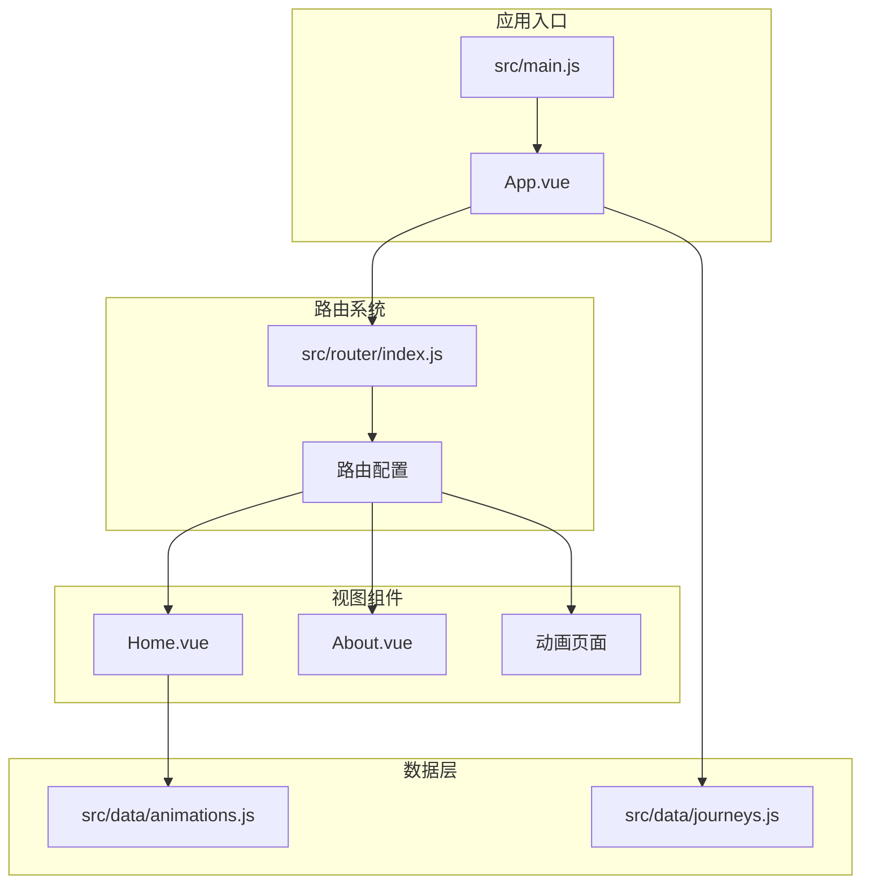
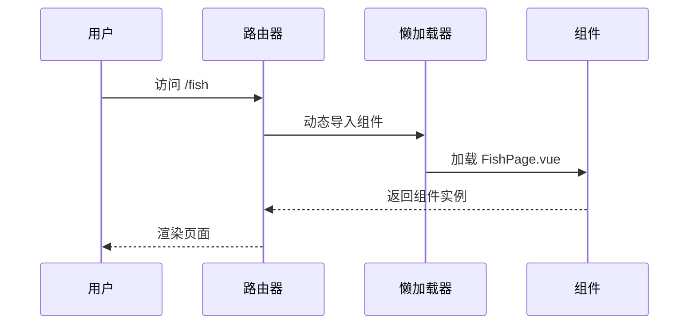
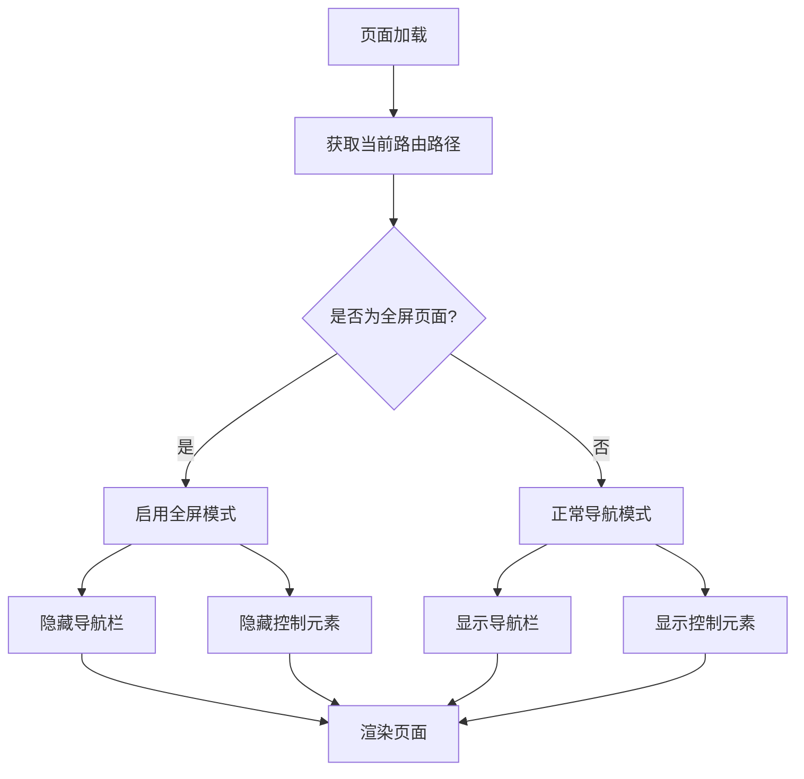
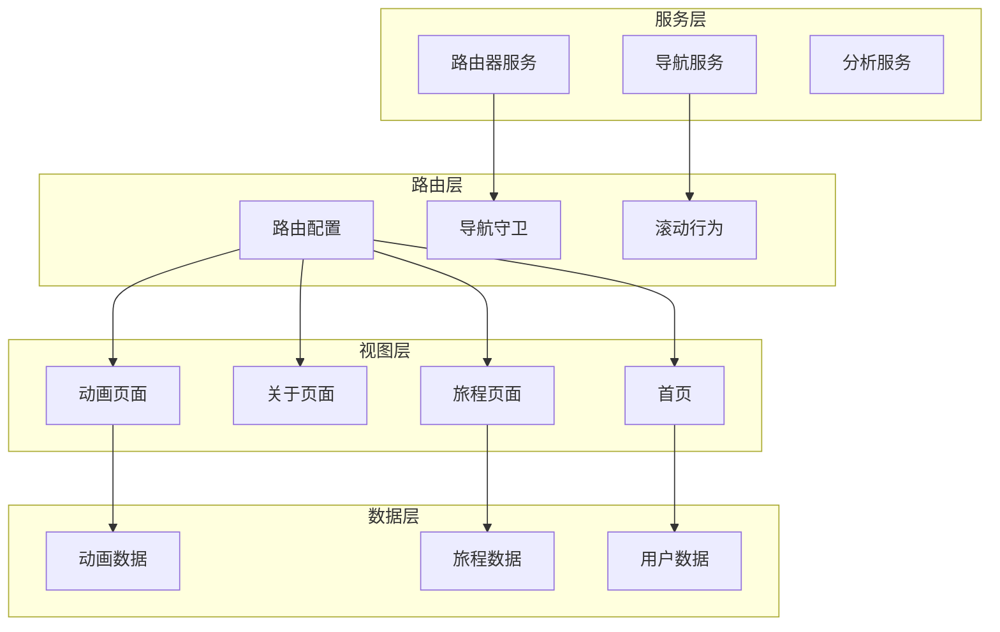
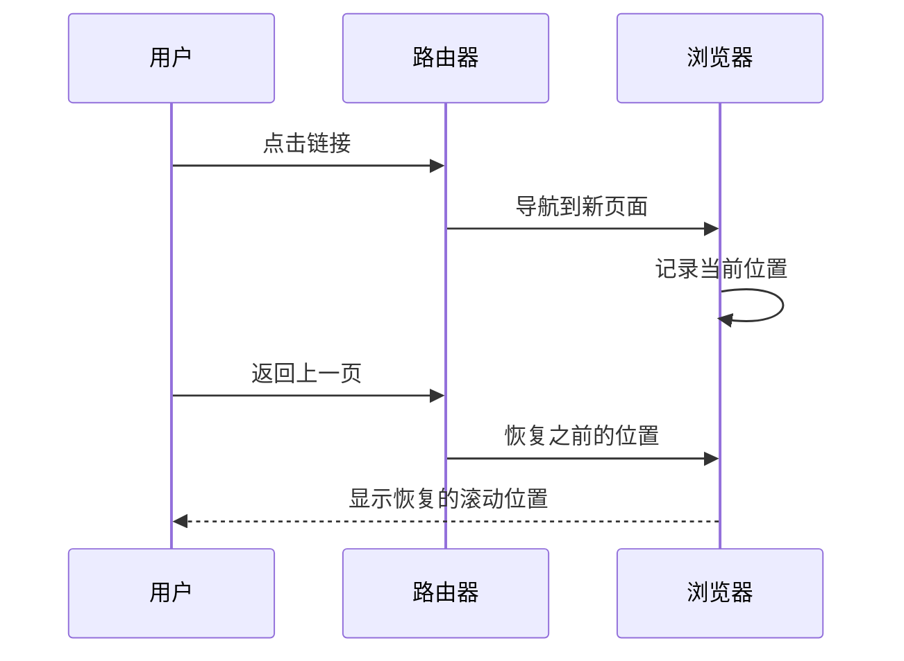
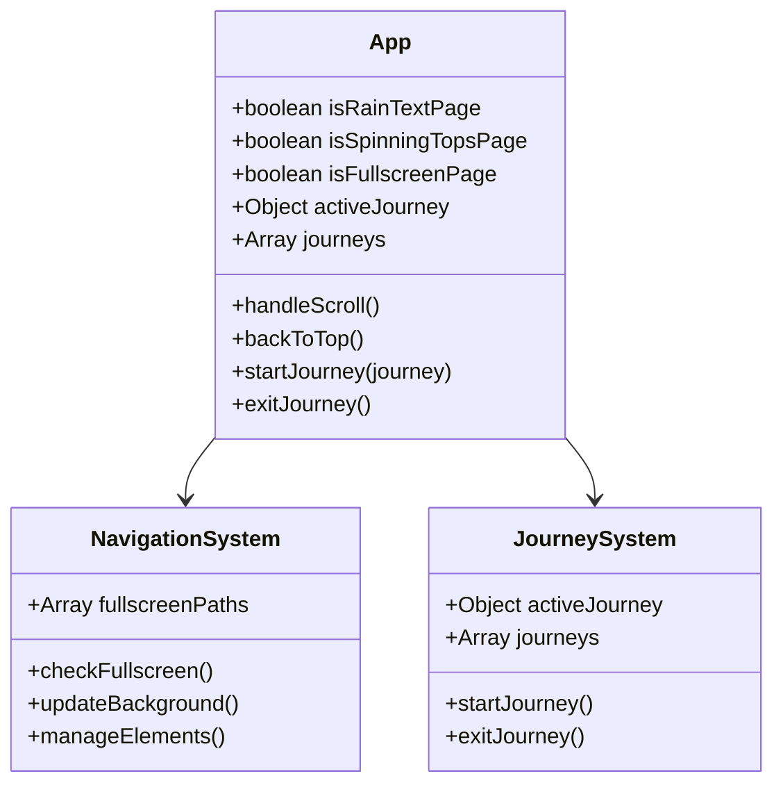
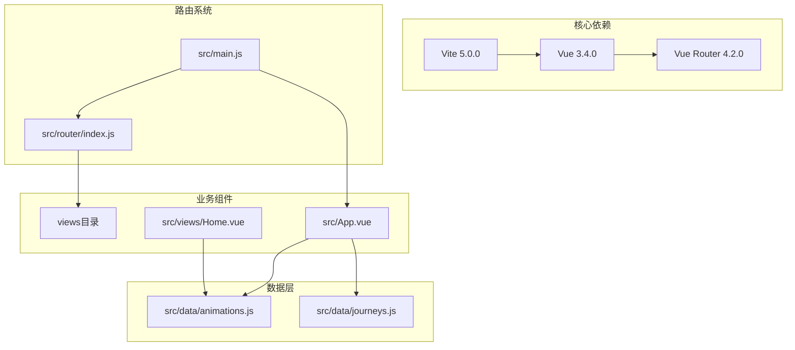

# 路由系统更新

<cite>
**本文档引用的文件**
- [src/router/index.js](file://src/router/index.js)
- [src/main.js](file://src/main.js)
- [src/App.vue](file://src/App.vue)
- [src/views/Home.vue](file://src/views/Home.vue)
- [src/views/About.vue](file://src/views/About.vue)
- [src/data/animations.js](file://src/data/animations.js)
- [src/data/journeys.js](file://src/data/journeys.js)
- [vite.config.js](file://vite.config.js)
- [package.json](file://package.json)
- [README.md](file://README.md)
</cite>

## 目录
1. [简介](#简介)
2. [项目结构](#项目结构)
3. [核心组件](#核心组件)
4. [架构概览](#架构概览)
5. [详细组件分析](#详细组件分析)
6. [依赖关系分析](#依赖关系分析)
7. [性能考虑](#性能考虑)
8. [故障排除指南](#故障排除指南)
9. [结论](#结论)

## 简介

这是一个基于 Vue 3 + Vite 构建的个人博客项目，专注于分享前端开发技术知识。项目采用现代化的前端技术栈，包含丰富的动画可视化效果和交互体验。路由系统作为整个应用的核心基础设施，负责管理页面导航、组件切换和用户体验流程。

本项目特别注重路由系统的灵活性和可扩展性，支持多种导航模式：
- **懒加载路由**：按需加载组件，提升首屏加载速度
- **全屏动画页面**：特殊页面的全屏展示模式
- **旅程导航系统**：主题化的沉浸式体验流程
- **响应式导航**：适应不同设备的导航体验

## 项目结构

项目采用标准的 Vue 3 应用结构，路由系统位于 `src/router/` 目录下，通过 `src/router/index.js` 进行集中管理。



**图表来源**
- [src/main.js:1-12](file://src/main.js#L1-L12)
- [src/router/index.js:1-210](file://src/router/index.js#L1-L210)
- [src/App.vue:1-421](file://src/App.vue#L1-L421)

**章节来源**
- [src/router/index.js:1-210](file://src/router/index.js#L1-L210)
- [src/main.js:1-12](file://src/main.js#L1-L12)
- [package.json:1-30](file://package.json#L1-L30)

## 核心组件

### 路由配置系统

路由系统采用 Vue Router 4 的现代配置方式，支持动态导入和懒加载机制。整个路由表包含 30+ 个精心设计的动画可视化页面，每个页面都针对特定的视觉效果和交互体验进行了优化。

### 懒加载机制

所有路由组件都采用动态导入的方式，确保只有在用户访问相应页面时才加载对应的组件代码：



**图表来源**
- [src/router/index.js:15-18](file://src/router/index.js#L15-L18)
- [src/router/index.js:65-68](file://src/router/index.js#L65-L68)

### 全屏导航系统

应用实现了智能的全屏导航判断机制，能够根据当前路由路径自动切换页面布局模式：



**图表来源**
- [src/App.vue:112-152](file://src/App.vue#L112-L152)

**章节来源**
- [src/router/index.js:3-195](file://src/router/index.js#L3-L195)
- [src/App.vue:86-200](file://src/App.vue#L86-L200)

## 架构概览

路由系统采用模块化设计，将路由配置、组件管理和导航逻辑分离，确保系统的可维护性和可扩展性。



**图表来源**
- [src/router/index.js:197-207](file://src/router/index.js#L197-L207)
- [src/App.vue:186-200](file://src/App.vue#L186-L200)

## 详细组件分析

### 路由配置组件

路由配置采用了现代化的 Vue Router 4 特性，包括：

#### 路由表结构
路由表按照功能分类组织，每个路由对象包含：
- **path**: URL 路径
- **name**: 路由名称
- **component**: 组件导入函数
- **meta**: 元数据信息

#### 滚动行为管理
实现了智能的滚动恢复机制，能够记住用户的浏览位置：



**图表来源**
- [src/router/index.js:200-206](file://src/router/index.js#L200-L206)

**章节来源**
- [src/router/index.js:1-210](file://src/router/index.js#L1-L210)

### 应用级导航组件

App.vue 实现了全局导航逻辑，包括：

#### 动态背景管理
根据当前页面类型动态切换背景效果：



**图表来源**
- [src/App.vue:86-200](file://src/App.vue#L86-L200)

#### 全屏页面识别
通过预定义的路径数组识别需要全屏展示的页面：

**章节来源**
- [src/App.vue:103-152](file://src/App.vue#L103-L152)

### 首页导航系统

Home.vue 实现了智能的动画导航系统：

#### 动画卡片导航
每个动画卡片都通过 `router-link` 组件实现导航：

```mermaid
flowchart LR
HomePage[首页] --> CategoryTabs[分类标签]
HomePage --> AnimationGrid[动画网格]
AnimationGrid --> Card1[动画卡片1]
AnimationGrid --> Card2[动画卡片2]
AnimationGrid --> CardN[动画卡片N]
Card1 --> RouterLink1[router-link to="/fish"]
Card2 --> RouterLink2[router-link to="/leaves"]
CardN --> RouterLinkN[router-link to="/..."]
RouterLink1 --> FishPage[FishPage.vue]
RouterLink2 --> LeavesPage[LeavesPage.vue]
RouterLinkN --> OtherPage[其他页面]
```

**图表来源**
- [src/views/Home.vue:50-80](file://src/views/Home.vue#L50-L80)

#### 分类过滤系统
实现了多维度的动画过滤和排序功能：

**章节来源**
- [src/views/Home.vue:84-159](file://src/views/Home.vue#L84-L159)

### 关于页面

About.vue 提供了个人介绍和联系方式：

#### 3D 头像集成
集成了 PersonalAvatar3D 组件提供动态头像效果：

**章节来源**
- [src/views/About.vue:1-181](file://src/views/About.vue#L1-L181)

## 依赖关系分析

路由系统与其他模块的依赖关系如下：



**图表来源**
- [package.json:11-22](file://package.json#L11-L22)
- [src/main.js:1-9](file://src/main.js#L1-L9)

**章节来源**
- [package.json:1-30](file://package.json#L1-L30)
- [vite.config.js:1-32](file://vite.config.js#L1-L32)

## 性能考虑

### 代码分割策略

项目采用了智能的代码分割策略，通过 Vite 的手动分块功能优化加载性能：

#### 核心依赖分离
将 Vue 和 Vue Router 单独打包，减少重复加载：

#### 第三方库优化
针对不同第三方库实施专门的优化策略：
- highlight.js 独立打包用于代码高亮
- marked 独立打包用于 Markdown 解析
- dompurify 独立打包用于安全处理
- echarts 独立打包用于图表展示

### 懒加载优化

所有路由组件都采用动态导入，确保按需加载：


**图表来源**
- [vite.config.js:13-31](file://vite.config.js#L13-L31)

**章节来源**
- [vite.config.js:13-31](file://vite.config.js#L13-L31)

## 故障排除指南

### 常见问题及解决方案

#### 路由跳转失败
**症状**: 点击导航链接后页面不跳转
**解决方案**: 
1. 检查路由路径是否正确
2. 确认组件是否正确导出
3. 验证路由配置语法

#### 懒加载组件不显示
**症状**: 页面空白或加载指示符持续显示
**解决方案**:
1. 检查组件文件是否存在
2. 验证组件默认导出
3. 确认文件路径正确

#### 全屏模式异常
**症状**: 全屏页面仍然显示导航栏
**解决方案**:
1. 检查路由路径是否在全屏路径数组中
2. 验证计算属性逻辑
3. 确认 CSS 类名正确

#### 滚动位置恢复问题
**症状**: 返回上一页时滚动位置不正确
**解决方案**:
1. 检查 scrollBehavior 配置
2. 验证浏览器兼容性
3. 确认页面内容加载完成

**章节来源**
- [src/router/index.js:200-206](file://src/router/index.js#L200-L206)
- [src/App.vue:168-184](file://src/App.vue#L168-L184)

## 结论

本路由系统展现了现代前端应用的最佳实践，通过合理的架构设计和性能优化，为用户提供了流畅的导航体验。系统的主要优势包括：

### 技术亮点
- **模块化设计**: 清晰的路由配置和组件分离
- **性能优化**: 智能的懒加载和代码分割策略
- **用户体验**: 全屏模式和滚动恢复等人性化功能
- **可扩展性**: 易于添加新页面和功能的架构

### 架构优势
- **松耦合**: 路由系统与业务逻辑分离
- **高内聚**: 相关功能集中在统一的配置文件中
- **可测试性**: 清晰的依赖关系便于单元测试
- **可维护性**: 标准化的代码结构和命名约定

### 发展建议
1. **增加导航守卫**: 实现权限控制和页面访问验证
2. **增强错误处理**: 添加路由级别的错误边界
3. **性能监控**: 集成路由性能指标监控
4. **国际化支持**: 添加多语言路由配置

这个路由系统为整个应用奠定了坚实的技术基础，为后续的功能扩展和性能优化提供了良好的支撑。