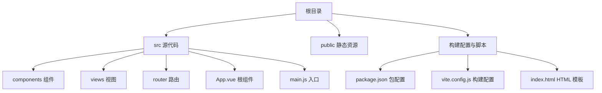
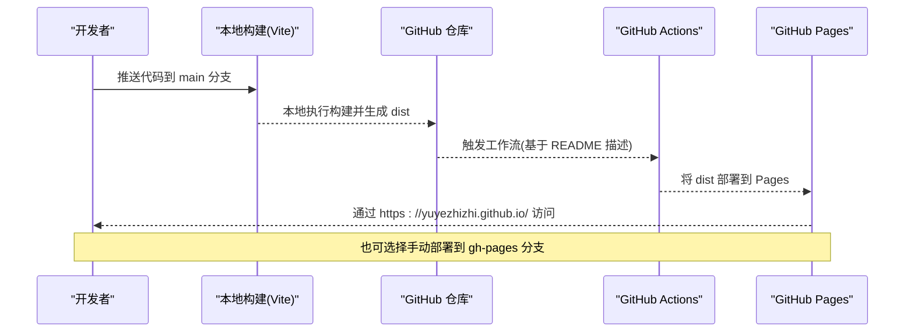
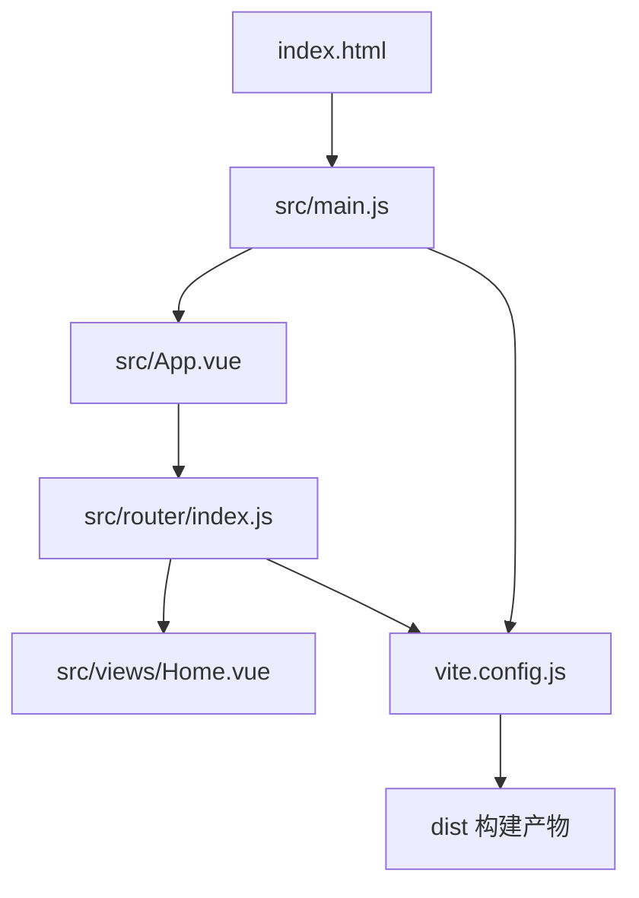

# 部署指南

<cite>
**本文档引用的文件**
- [package.json](file://package.json)
- [vite.config.js](file://vite.config.js)
- [index.html](file://index.html)
- [README.md](file://README.md)
- [src/main.js](file://src/main.js)
- [src/router/index.js](file://src/router/index.js)
- [src/App.vue](file://src/App.vue)
- [src/views/Home.vue](file://src/views/Home.vue)
</cite>

## 目录
1. [简介](#简介)
2. [项目结构](#项目结构)
3. [核心组件](#核心组件)
4. [架构总览](#架构总览)
5. [详细组件分析](#详细组件分析)
6. [依赖关系分析](#依赖关系分析)
7. [性能考虑](#性能考虑)
8. [故障排除指南](#故障排除指南)
9. [结论](#结论)
10. [附录](#附录)

## 简介
本指南面向希望将动画博客项目部署到 GitHub Pages 的用户，提供从本地构建到 GitHub Actions 自动化部署的完整流程说明，并覆盖手动部署、域名绑定、HTTPS、CDN 加速、缓存策略、多环境部署与回滚机制、部署后验证与故障排除等关键环节。项目采用 Vue 3 + Vite 技术栈，构建产物输出至 dist 目录，适合直接部署到 GitHub Pages。

## 项目结构
项目采用典型的 Vue 3 + Vite 前端工程结构，核心目录与文件如下：
- src：源代码目录，包含组件、路由、视图与入口文件
- public：静态资源目录（如 favicon、图标等）
- 根目录：构建配置、包管理与部署说明
- dist：Vite 构建输出目录，用于 GitHub Pages 部署

图表来源
- [package.json](file://package.json)
- [vite.config.js](file://vite.config.js)
- [index.html](file://index.html)
- [src/main.js](file://src/main.js)
- [src/App.vue](file://src/App.vue)

章节来源
- [package.json](file://package.json)
- [vite.config.js](file://vite.config.js)
- [index.html](file://index.html)
- [src/main.js](file://src/main.js)
- [src/App.vue](file://src/App.vue)

## 核心组件
- 构建与打包：通过 Vite 生产环境构建，输出 dist 目录，包含已压缩与按需拆分的资源文件
- 路由与历史模式：使用 Vue Router 的 Web History 模式，路径以 "/" 开头，适配 GitHub Pages 子路径场景
- 入口与全局初始化：在 main.js 中挂载应用并初始化代码高亮等全局能力
- HTML 模板：index.html 提供基础页面结构与外部脚本引入点

章节来源
- [vite.config.js](file://vite.config.js)
- [src/router/index.js](file://src/router/index.js)
- [src/main.js](file://src/main.js)
- [index.html](file://index.html)

## 架构总览
下图展示了从代码提交到 GitHub Pages 可用的端到端流程，包括本地构建与 GitHub Actions 自动化部署两种方式：

图表来源
- [README.md](file://README.md)

## 详细组件分析

### GitHub Actions 工作流配置与自动化部署
- 工作流文件位置：README 指示位于 .github/workflows/deploy.yml
- 触发条件：当向 main 分支推送代码时触发
- 预期行为：自动构建并在 GitHub Pages 上发布
- 注意事项：请确保仓库 Settings → Pages → Build and deployment → Source 选择为 GitHub Actions

章节来源
- [README.md](file://README.md)

### 本地构建与产物结构
- 构建命令：npm run build
- 输出目录：dist
- 产物特征：包含按需拆分的 vendor 与第三方库 chunk，便于缓存复用与按需加载

章节来源
- [package.json](file://package.json)
- [vite.config.js](file://vite.config.js)

### 路由与历史模式适配
- 路由模式：createWebHistory('/')
- 基础路径：Vite 配置中 base: '/'，适配 GitHub Pages 子路径场景
- 影响：所有路由与静态资源路径均以根路径开头，避免相对路径导致的 404

章节来源
- [src/router/index.js](file://src/router/index.js)
- [vite.config.js](file://vite.config.js)

### 入口与全局初始化
- 应用挂载：在 main.js 中创建并挂载 Vue 应用
- 全局能力：初始化代码高亮等全局配置

章节来源
- [src/main.js](file://src/main.js)

### HTML 模板与外部资源
- 模板结构：index.html 提供基础页面结构与模块入口脚本
- 外部脚本：通过 CDN 引入 p5.sound 等外部库，注意网络可用性与 HTTPS

章节来源
- [index.html](file://index.html)

### 根组件与导航
- 根组件：App.vue 提供导航栏、回到顶部按钮与全局样式
- 导航逻辑：通过 router-link 实现页面跳转，适配 GitHub Pages 历史模式

章节来源
- [src/App.vue](file://src/App.vue)

### 首页视图与路由集成
- 首页：Home.vue 展示动画卡片网格，配合路由实现页面跳转
- 数据：通过 src/data/animations.js 提供动画元数据

章节来源
- [src/views/Home.vue](file://src/views/Home.vue)

## 依赖关系分析
下图展示关键文件之间的依赖关系与交互：

图表来源
- [index.html](file://index.html)
- [src/main.js](file://src/main.js)
- [src/App.vue](file://src/App.vue)
- [src/router/index.js](file://src/router/index.js)
- [src/views/Home.vue](file://src/views/Home.vue)
- [vite.config.js](file://vite.config.js)

章节来源
- [index.html](file://index.html)
- [src/main.js](file://src/main.js)
- [src/App.vue](file://src/App.vue)
- [src/router/index.js](file://src/router/index.js)
- [src/views/Home.vue](file://src/views/Home.vue)
- [vite.config.js](file://vite.config.js)

## 性能考虑
- 代码分割与缓存
  - 通过 Vite Rollup 的 manualChunks 将核心依赖与第三方库拆分为独立 chunk，提升浏览器缓存命中率
  - 建议在部署前确认各 chunk 的体积与加载顺序，避免关键路径阻塞
- 资源压缩与合并
  - 生产构建默认启用压缩，建议结合 CDN 使用 gzip/br 压缩以进一步降低传输体积
- 路由与懒加载
  - 路由组件采用动态导入，配合代码分割减少首屏加载体积
- 外部资源
  - p5.sound 等外部库通过 CDN 引入，建议在部署环境中确保网络可达与 HTTPS 支持

章节来源
- [vite.config.js](file://vite.config.js)
- [index.html](file://index.html)

## 故障排除指南
- 访问出现 404（路由）
  - 检查路由模式是否为 history，且基础路径配置正确
  - 确认 GitHub Pages 的子路径设置与项目基础路径一致
- 资源加载失败（CDN）
  - 确保外部 CDN 资源支持 HTTPS；若网络受限，可考虑内嵌或替换为自有托管
- 构建产物不生效
  - 确认构建命令执行成功且 dist 目录存在
  - 若使用手动部署，请确保将 dist 内容部署到正确的 Pages 源分支/目录
- GitHub Actions 失败
  - 检查工作流文件是否存在且语法正确
  - 确认仓库 Settings → Pages → Build and deployment → Source 选择为 GitHub Actions

章节来源
- [README.md](file://README.md)
- [src/router/index.js](file://src/router/index.js)
- [index.html](file://index.html)

## 结论
本指南提供了从本地构建到 GitHub Pages 自动化部署的完整路径，并结合项目的技术栈特点（Vue 3 + Vite + GitHub Actions）给出了针对性的配置与优化建议。按照本指南操作，可稳定地将动画博客项目上线并保持良好的用户体验。

## 附录

### A. 自动化部署（GitHub Actions）
- 步骤概览
  - 在仓库 Settings → Pages 中选择 Source 为 GitHub Actions
  - 确认工作流文件位于 .github/workflows/deploy.yml
  - 推送代码到 main 分支触发构建与部署
- 访问地址
  - 部署完成后可通过 https://yuyezhizhi.github.io/ 访问

章节来源
- [README.md](file://README.md)

### B. 手动部署步骤
- 本地构建
  - 执行构建命令生成 dist 目录
- 选择部署方式
  - 方式一：将 dist 内容上传到 gh-pages 分支的根目录
  - 方式二：将 dist 内容上传到 main 分支的 docs 目录（根据仓库设置调整 Pages 源）
- 验证
  - 等待 GitHub Pages 构建完成，访问对应 URL 校验页面

章节来源
- [README.md](file://README.md)
- [package.json](file://package.json)

### C. 域名绑定与 HTTPS
- 绑定自定义域名
  - 在仓库 Settings → Pages → Custom domain 中填写域名
  - 配置 DNS 记录（A/AAAA/CNAME），确保解析到 GitHub Pages
- HTTPS
  - GitHub Pages 默认提供 HTTPS；若自定义域名未启用，可在 Settings → Pages → Enforce HTTPS 中开启强制 HTTPS

章节来源
- [README.md](file://README.md)

### D. CDN 加速与缓存策略
- CDN
  - 对静态资源（dist 下的 JS/CSS/图片）启用 CDN，提升全球访问速度
- 缓存
  - 对长期不变的静态资源设置较长缓存（如 1 年）
  - 对入口 HTML 设置较短缓存或禁用缓存，确保更新及时生效

章节来源
- [vite.config.js](file://vite.config.js)

### E. 多环境部署与回滚
- 多环境
  - 使用不同分支（如 develop/staging/prod）进行多环境隔离
  - 通过 GitHub Actions 为不同分支配置不同的部署目标
- 回滚
  - 若使用 gh-pages 分支，可通过 Git 历史回退快速回滚
  - 若使用 Pages 目录（如 docs），可切换到上一个有效提交并重新触发构建

章节来源
- [README.md](file://README.md)