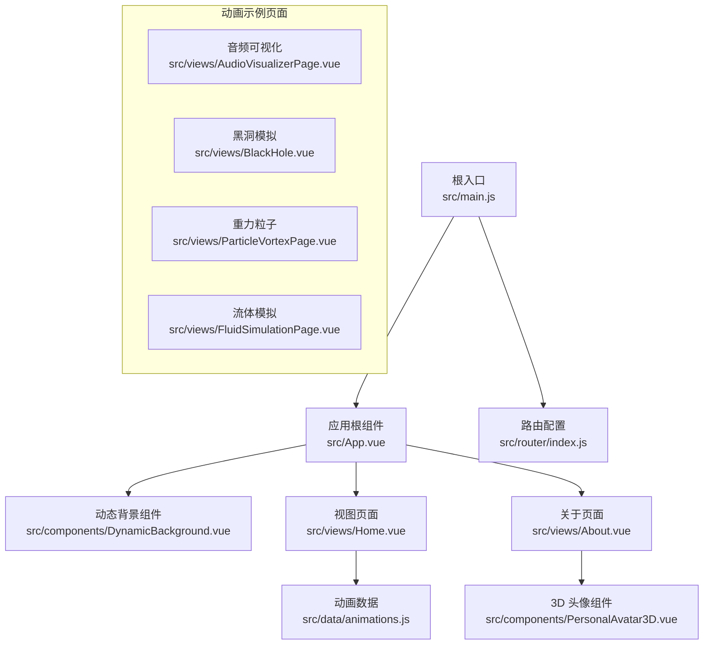
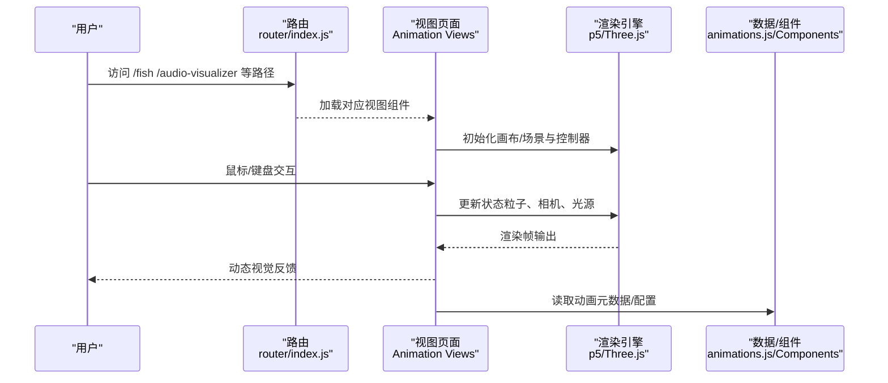
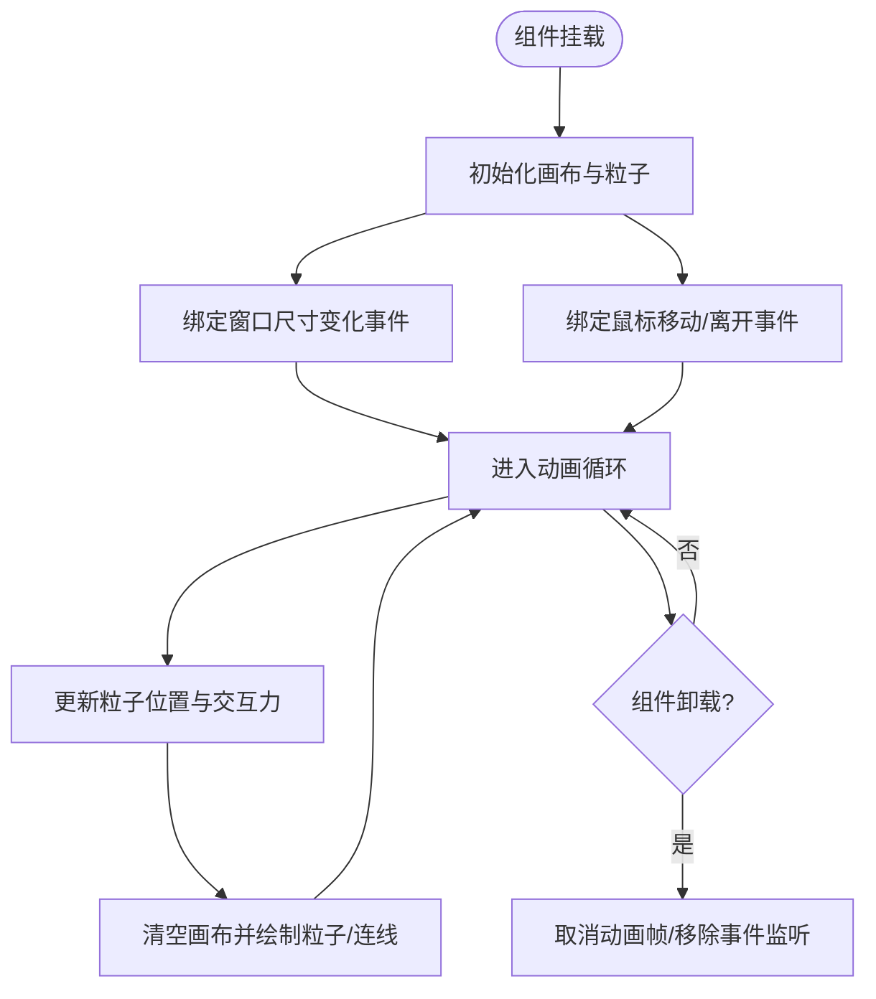
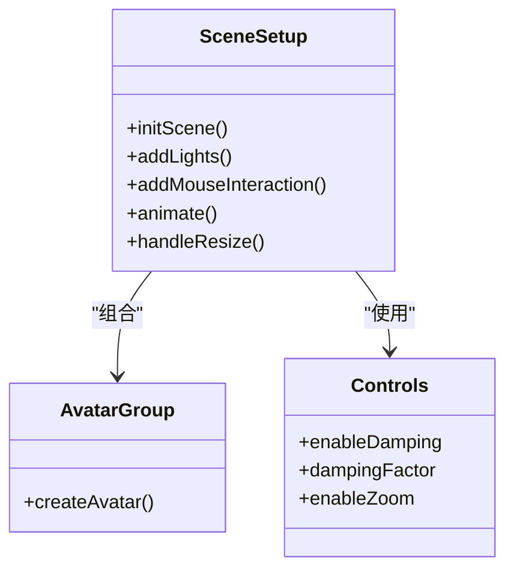
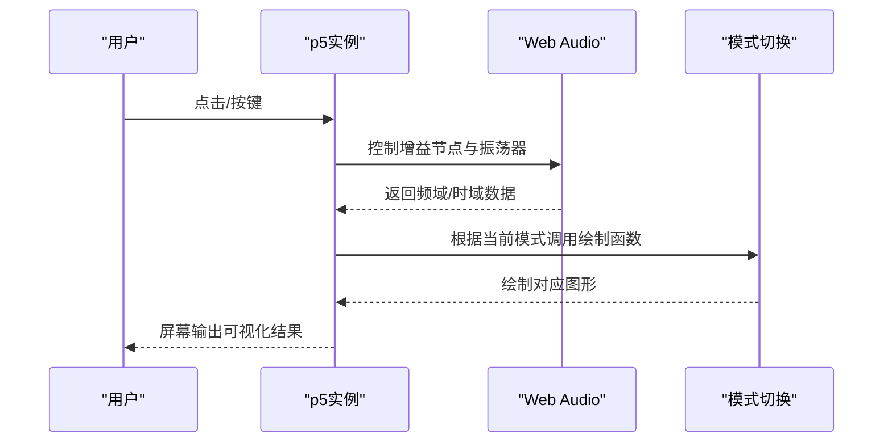
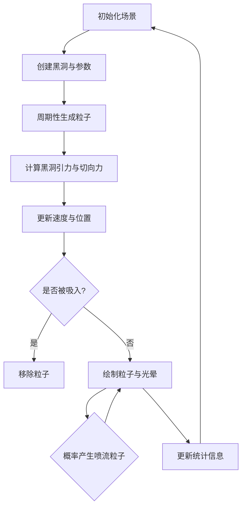
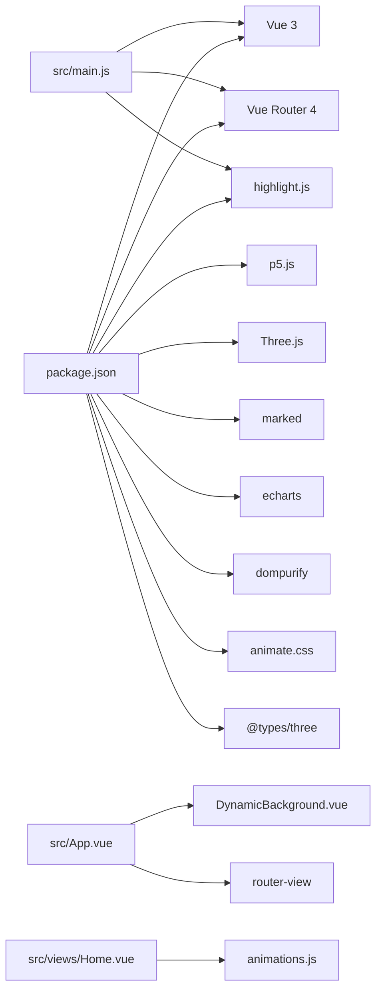

# 项目概述

<cite>
**本文档引用的文件**
- [README.md](file://README.md)
- [package.json](file://package.json)
- [src/main.js](file://src/main.js)
- [src/App.vue](file://src/App.vue)
- [src/router/index.js](file://src/router/index.js)
- [src/components/DynamicBackground.vue](file://src/components/DynamicBackground.vue)
- [src/components/PersonalAvatar3D.vue](file://src/components/PersonalAvatar3D.vue)
- [src/views/Home.vue](file://src/views/Home.vue)
- [src/views/About.vue](file://src/views/About.vue)
- [src/data/animations.js](file://src/data/animations.js)
- [src/views/AudioVisualizerPage.vue](file://src/views/AudioVisualizerPage.vue)
- [src/views/BlackHole.vue](file://src/views/BlackHole.vue)
- [src/views/ParticleVortexPage.vue](file://src/views/ParticleVortexPage.vue)
- [src/views/FluidSimulationPage.vue](file://src/views/FluidSimulationPage.vue)
</cite>

## 目录
1. [简介](#简介)
2. [项目结构](#项目结构)
3. [核心组件](#核心组件)
4. [架构总览](#架构总览)
5. [详细组件分析](#详细组件分析)
6. [依赖关系分析](#依赖关系分析)
7. [性能考虑](#性能考虑)
8. [故障排除指南](#故障排除指南)
9. [结论](#结论)
10. [附录](#附录)

## 简介
本项目是一个基于 Vue 3 + Vite 的创意动画博客，融合了前端技术分享与交互式动画展示，旨在为开发者提供兼具学习价值与视觉享受的知识分享体验。项目通过丰富的动画示例（粒子系统、流体模拟、音频可视化、3D 交互等）呈现创意编程的魅力，同时保留传统博客的阅读与导航能力。

- 在线演示地址：[https://yuyezhizhi.github.io/](https://yuyezhizhi.github.io/)
- 本地开发与部署：项目采用 GitHub Pages + GitHub Actions 自动化部署，支持快速构建与发布。

**章节来源**
- [README.md: 1-115:1-115](file://README.md#L1-L115)

## 项目结构
项目采用典型的 Vue 3 单页应用结构，按功能模块组织文件：
- 根入口与路由：main.js、router/index.js
- 视图页面：views/ 下包含首页、关于页及众多动画示例页面
- 组件：components/ 下包含通用组件（如动态背景、3D 头像）
- 数据：data/ 下集中管理动画元数据与分类
- 构建与依赖：package.json、vite.config.js

**图表来源**
- [src/main.js: 1-12:1-12](file://src/main.js#L1-L12)
- [src/App.vue: 1-334:1-334](file://src/App.vue#L1-L334)
- [src/router/index.js: 1-205:1-205](file://src/router/index.js#L1-L205)
- [src/components/DynamicBackground.vue: 1-185:1-185](file://src/components/DynamicBackground.vue#L1-L185)
- [src/views/Home.vue: 1-349:1-349](file://src/views/Home.vue#L1-L349)
- [src/views/About.vue: 1-181:1-181](file://src/views/About.vue#L1-L181)
- [src/data/animations.js: 1-400:1-400](file://src/data/animations.js#L1-L400)
- [src/components/PersonalAvatar3D.vue: 1-344:1-344](file://src/components/PersonalAvatar3D.vue#L1-L344)
- [src/views/AudioVisualizerPage.vue: 1-346:1-346](file://src/views/AudioVisualizerPage.vue#L1-L346)
- [src/views/BlackHole.vue: 1-310:1-310](file://src/views/BlackHole.vue#L1-L310)
- [src/views/ParticleVortexPage.vue: 1-293:1-293](file://src/views/ParticleVortexPage.vue#L1-L293)
- [src/views/FluidSimulationPage.vue: 1-281:1-281](file://src/views/FluidSimulationPage.vue#L1-L281)

**章节来源**
- [README.md: 69-86:69-86](file://README.md#L69-L86)

## 核心组件
- 应用根组件与导航：App.vue 提供全局动态背景、导航栏、回到顶部按钮与响应式布局。
- 路由系统：router/index.js 定义了所有页面路由，支持懒加载与滚动行为优化。
- 动态背景：DynamicBackground.vue 实现 Canvas 粒子系统与鼠标交互连线。
- 3D 头像：PersonalAvatar3D.vue 基于 Three.js 构建可旋转的 3D 史蒂夫形象，支持鼠标交互与光照。
- 动画主页：Home.vue 展示动画卡片网格，支持分类筛选与难度标识。
- 关于页面：About.vue 展示个人信息与联系方式，内嵌 3D 头像组件。
- 动画数据：animations.js 集中管理所有动画示例的元数据（分类、难度、标签、颜色等）。

**章节来源**
- [src/App.vue: 1-334:1-334](file://src/App.vue#L1-L334)
- [src/router/index.js: 1-205:1-205](file://src/router/index.js#L1-L205)
- [src/components/DynamicBackground.vue: 1-185:1-185](file://src/components/DynamicBackground.vue#L1-L185)
- [src/components/PersonalAvatar3D.vue: 1-344:1-344](file://src/components/PersonalAvatar3D.vue#L1-L344)
- [src/views/Home.vue: 1-349:1-349](file://src/views/Home.vue#L1-L349)
- [src/views/About.vue: 1-181:1-181](file://src/views/About.vue#L1-L181)
- [src/data/animations.js: 1-400:1-400](file://src/data/animations.js#L1-L400)

## 架构总览
项目采用“路由驱动 + 组件化”的前端架构，结合 Canvas 与 WebGL 技术实现高性能动画渲染。核心流程如下：
- 用户通过路由导航到不同动画页面
- 页面根据自身业务逻辑初始化渲染引擎（p5.js 或 Three.js）
- 通过用户交互（鼠标、键盘）驱动动画状态变化
- 全局组件（如动态背景、导航）贯穿页面生命周期

**图表来源**
- [src/router/index.js: 1-205:1-205](file://src/router/index.js#L1-L205)
- [src/views/AudioVisualizerPage.vue: 1-346:1-346](file://src/views/AudioVisualizerPage.vue#L1-L346)
- [src/views/BlackHole.vue: 1-310:1-310](file://src/views/BlackHole.vue#L1-L310)
- [src/views/ParticleVortexPage.vue: 1-293:1-293](file://src/views/ParticleVortexPage.vue#L1-L293)
- [src/views/FluidSimulationPage.vue: 1-281:1-281](file://src/views/FluidSimulationPage.vue#L1-L281)
- [src/data/animations.js: 1-400:1-400](file://src/data/animations.js#L1-L400)

## 详细组件分析

### 动态背景组件（DynamicBackground）
- 功能：Canvas 粒子系统，支持鼠标交互与粒子连线，自适应窗口尺寸。
- 关键点：粒子类封装更新与绘制逻辑；requestAnimationFrame 控制动画循环；事件监听器在组件卸载时清理。
- 性能：按屏幕分辨率动态计算粒子数量，避免过度消耗资源。

**图表来源**
- [src/components/DynamicBackground.vue: 1-185:1-185](file://src/components/DynamicBackground.vue#L1-L185)

**章节来源**
- [src/components/DynamicBackground.vue: 1-185:1-185](file://src/components/DynamicBackground.vue#L1-L185)

### 3D 头像组件（PersonalAvatar3D）
- 功能：基于 Three.js 的可旋转 3D 史蒂夫形象，支持鼠标交互与光照。
- 关键点：场景、相机、渲染器初始化；OrbitControls 实现自由视角；按鼠标位置平滑调整旋转；窗口尺寸变化时自适应。
- 性能：启用抗锯齿与像素比限制，保证在高分屏下的流畅度。

**图表来源**
- [src/components/PersonalAvatar3D.vue: 1-344:1-344](file://src/components/PersonalAvatar3D.vue#L1-L344)

**章节来源**
- [src/components/PersonalAvatar3D.vue: 1-344:1-344](file://src/components/PersonalAvatar3D.vue#L1-L344)

### 音频可视化页面（AudioVisualizerPage）
- 功能：使用 p5.js 实现多种音频可视化模式（波形、频谱柱状、圆形频谱、波形粒子、彩虹频谱），支持播放/暂停与模式切换。
- 关键点：Web Audio API 虚拟音频源与 Analyser 结合；根据模式切换绘制函数；粒子系统随振幅变化。
- 交互：点击页面切换播放状态；按键 1-5 切换模式；窗口大小变化时重绘。

**图表来源**
- [src/views/AudioVisualizerPage.vue: 1-346:1-346](file://src/views/AudioVisualizerPage.vue#L1-L346)

**章节来源**
- [src/views/AudioVisualizerPage.vue: 1-346:1-346](file://src/views/AudioVisualizerPage.vue#L1-L346)

### 黑洞模拟页面（BlackHole）
- 功能：模拟黑洞引力场、吸积盘与喷流，粒子围绕黑洞运动并被吸入。
- 关键点：粒子类包含引力计算、切向力与寿命；喷流粒子独立生命周期；鼠标控制黑洞位置；点击产生引力波脉冲。
- 特色：多层光晕与 HSB 色彩渐变营造宇宙氛围。

**图表来源**
- [src/views/BlackHole.vue: 1-310:1-310](file://src/views/BlackHole.vue#L1-L310)

**章节来源**
- [src/views/BlackHole.vue: 1-310:1-310](file://src/views/BlackHole.vue#L1-L310)

### 重力粒子页面（ParticleVortexPage）
- 功能：交互式重力场粒子系统，支持三种重力模式（中心引力、线性重力、反转重力）。
- 关键点：鼠标拖动生成粒子；点击创建引力井；键盘 + / - 调整引力强度；空气阻力与边界反弹。
- 特色：半透明背景实现拖尾效果，粒子寿命衰减增强真实感。

**章节来源**
- [src/views/ParticleVortexPage.vue: 1-293:1-293](file://src/views/ParticleVortexPage.vue#L1-L293)

### 流体模拟页面（FluidSimulationPage）
- 功能：基于网格流场的流体粒子模拟，Perlin 噪列驱动风场，鼠标拖拽影响局部流场。
- 关键点：网格化流场向量；粒子跟随流场方向；鼠标路径生成粒子；支持颜色切换与重置。
- 特色：多色粒子与半透明背景营造水滴/液体质感。

**章节来源**
- [src/views/FluidSimulationPage.vue: 1-281:1-281](file://src/views/FluidSimulationPage.vue#L1-L281)

### 动画主页与数据
- 动画主页（Home.vue）：网格卡片展示所有动画示例，支持分类筛选与难度标识，使用过渡动画提升交互体验。
- 动画数据（animations.js）：集中管理动画元数据（分类、难度、标签、颜色等），便于统一维护与扩展。

**章节来源**
- [src/views/Home.vue: 1-349:1-349](file://src/views/Home.vue#L1-L349)
- [src/data/animations.js: 1-400:1-400](file://src/data/animations.js#L1-L400)

## 依赖关系分析
- 运行时依赖：Vue 3、Vue Router 4、p5.js、Three.js、animate.css、highlight.js、marked、echarts、dompurify、@types/three
- 开发依赖：@vitejs/plugin-vue、less、vite
- 全局集成：main.js 注册路由与代码高亮，App.vue 作为根组件承载全局背景与导航。

**图表来源**
- [package.json: 1-29:1-29](file://package.json#L1-L29)
- [src/main.js: 1-12:1-12](file://src/main.js#L1-L12)
- [src/App.vue: 1-334:1-334](file://src/App.vue#L1-L334)
- [src/views/Home.vue: 1-349:1-349](file://src/views/Home.vue#L1-L349)
- [src/data/animations.js: 1-400:1-400](file://src/data/animations.js#L1-L400)

**章节来源**
- [package.json: 1-29:1-29](file://package.json#L1-L29)
- [src/main.js: 1-12:1-12](file://src/main.js#L1-L12)

## 性能考虑
- Canvas/Three.js 渲染：使用 requestAnimationFrame 控制帧率，避免阻塞主线程；在组件卸载时及时清理动画与事件监听。
- 画布自适应：窗口尺寸变化时仅重设宽高，避免频繁重建上下文。
- 粒子系统：按屏幕面积动态计算粒子数量上限，限制数组长度，防止内存膨胀。
- 3D 场景：启用抗锯齿与设备像素比限制，减少高分屏下的性能损耗。
- 路由懒加载：路由按需加载视图组件，降低首屏体积。

[本节为通用指导，无需特定文件引用]

## 故障排除指南
- 页面空白或组件未渲染
  - 检查路由配置是否正确导入视图组件
  - 确认 main.js 已注册路由并挂载应用
- 动画不运行或卡顿
  - 确认 p5/Three.js 实例在组件挂载时初始化，在卸载时销毁
  - 检查 requestAnimationFrame 是否被正确取消
- 音频可视化无声音
  - 确认浏览器允许自动播放策略（部分浏览器需要用户交互后才能激活音频上下文）
  - 检查增益节点是否被设置为非零值
- 3D 场景无法交互
  - 确认 OrbitControls 已启用阻尼与禁用缩放
  - 检查鼠标事件绑定容器是否正确
- 部署后路由刷新 404
  - 确认 GitHub Pages 使用 GitHub Actions 自动部署，且基础路径配置正确

**章节来源**
- [src/router/index.js: 1-205:1-205](file://src/router/index.js#L1-L205)
- [src/main.js: 1-12:1-12](file://src/main.js#L1-L12)
- [src/views/AudioVisualizerPage.vue: 1-346:1-346](file://src/views/AudioVisualizerPage.vue#L1-L346)
- [src/components/PersonalAvatar3D.vue: 1-344:1-344](file://src/components/PersonalAvatar3D.vue#L1-L344)

## 结论
本项目以 Vue 3 + Vite 为基础，结合 p5.js 与 Three.js，构建了一个集知识分享与创意动画于一体的前端博客平台。通过模块化的组件设计与清晰的路由结构，项目既满足了开发者的学习与展示需求，又提供了丰富的交互体验。其自动化部署与响应式设计进一步提升了可用性与可维护性。

[本节为总结性内容，无需特定文件引用]

## 附录
- 在线演示：https://yuyezhizhi.github.io/
- 本地开发命令
  - 安装依赖：npm install
  - 启动开发服务器：npm run dev
  - 构建生产包：npm run build
- 添加新动画示例
  - 在 src/data/animations.js 中新增动画条目
  - 在 src/router/index.js 中注册路由
  - 在 src/views/ 下创建对应页面组件

**章节来源**
- [README.md: 21-68:21-68](file://README.md#L21-L68)
- [src/data/animations.js: 1-400:1-400](file://src/data/animations.js#L1-L400)
- [src/router/index.js: 1-205:1-205](file://src/router/index.js#L1-L205)